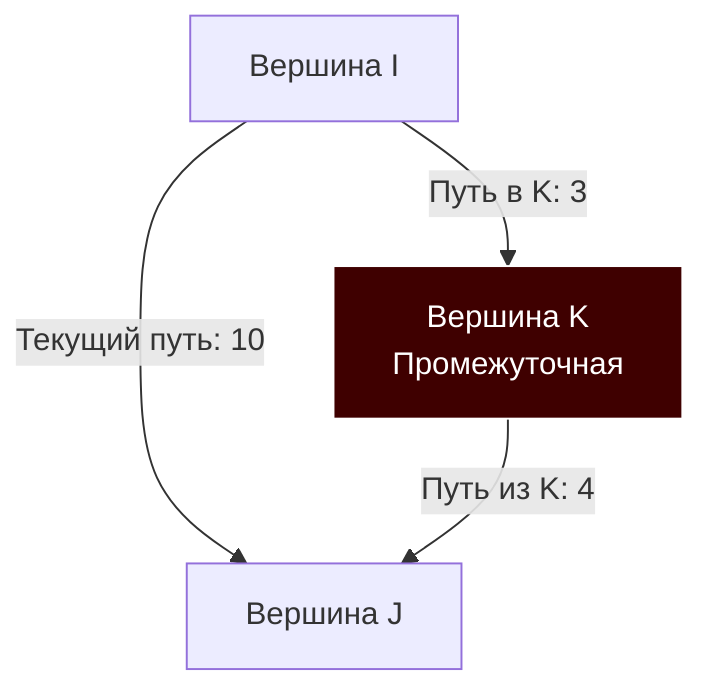

В статьях [[5. Кратчайшие пути. Алгоритм Дейкстры]] и [[6. Алгоритм Беллмана Форда]] мы решали задачу поиска кратчайших путей **от одной стартовой вершины** ко всем остальным (Single-Source Shortest Path). 

Но что если архитектура вашей системы требует знать расстояния **между всеми парами узлов** сразу? Например, вы пишете распределенный сетевой роутер (BGP/OSPF), где каждый маршрутизатор должен иметь полную матрицу задержек (Latency Matrix) до любой точки сети, или систему логистики, где нужно знать цену доставки между любыми двумя складами.

Вычислять это запуском Дейкстры для каждой из $V$ вершин долго, а Беллмана-Форда $V$ раз — непозволительно долго ($O(V^2 E)$). Для таких задач применяется шедевр динамического программирования — **Алгоритм Флойда-Уоршелла (Floyd-Warshall Algorithm)**.

## Механика алгоритма: Сила промежуточной вершины

Алгоритм Флойда-Уоршелла решает задачу поиска кратчайших путей между всеми парами вершин (All-Pairs Shortest Path) за время $O(V^3)$. Он прекрасно работает с отрицательными весами ребер и умеет находить отрицательные циклы.

Идея алгоритма до гениальности проста. Пусть у нас есть вершины $i$ и $j$. Мы задаем себе один вопрос: **«Станет ли путь из $i$ в $j$ короче, если мы пройдем его транзитом через какую-то промежуточную вершину $k$?»**

Если путь $i \to k$ плюс путь $k \to j$ меньше, чем известный нам прямой путь $i \to j$, мы обновляем наше знание.

Формула перехода (релаксации) выглядит так:
`dist[i][j] = min(dist[i][j], dist[i][k] + dist[k][j])`


*На диаграмме прямой путь равен 10. Но путь через транзитный узел K равен 3 + 4 = 7. Мы выбираем транзит.*

> [!warning] Ловушка / Gotcha: Порядок циклов
> Весь алгоритм Флойда-Уоршелла — это буквально три вложенных цикла `for`. Но 90% студентов на собеседованиях пишут их в неправильном порядке (`i`, `j`, `k`). 
> **Внешним циклом всегда должен быть транзитный узел `k`**. 
> Динамическое программирование здесь строится на постепенном расширении множества разрешенных промежуточных вершин. На шаге `k` мы находим кратчайшие пути, используя в качестве транзитных только вершины от $0$ до $k$. Если вы поставите `k` внутрь, вы сломаете саму суть математической индукции алгоритма.

## Mechanical Sympathy: Почему O(V³) работает быстро?

Математика пугает: $O(V^3)$ означает, что для графа из 1000 вершин алгоритм выполнит 1 миллиард итераций. Кажется, что это убьет бэкенд.

Но с точки зрения "железа", Флойд-Уоршелл — один из самых любимых алгоритмов процессора.
1. Он работает на **Матрице смежности** (см. [[1. Представление графов]]).
2. В нем **нет сложных ветвлений** (Branching). Только одна простая проверка или инструкция вычисления минимума. Предсказатель ветвлений (Branch Predictor) не ошибается.
3. В нем **идеальная кэш-локальность (Spatial Locality)**. Внутренний цикл по `j` читает строку матрицы строго последовательно: `dist[i][0]`, `dist[i][1]`, `dist[i][2]`. Аппаратный Prefetcher подтягивает кэш-линии L1/L2 на максимальной скорости.

Один миллиард тактов на современном процессоре с частотой 4 ГГц (где многие итерации конвейеризуются) выполнится за доли секунды.

> [!info] Под капотом: Плоский массив vs [][]int
> Как мы помним, `[][]int` в Go — это слайс указателей на другие слайсы. Чтение `dist[i][k]` требует двойного разыменования (Pointer Chasing), что замедляет работу процессора в 2-3 раза. Для Флойда-Уоршелла **категорически необходимо** расплющивать матрицу в одномерный слайс `[]int` размером $V \times V$ и обращаться по индексу `[i*V + j]`.

## Production-Ready реализация на Go

Реализуем максимально оптимизированную версию алгоритма. 

```go
package main

import (
	"errors"
	"math"
)

var ErrNegativeCycleFW = errors.New("граф содержит отрицательный цикл")

// FloydWarshall принимает список ребер и возвращает плоскую матрицу расстояний
func FloydWarshall(vertices int, edges []struct{ u, v, weight int }) ([]int64, error) {
	if vertices <= 0 {
		return nil, nil
	}

	// 1. Инициализация плоской матрицы V x V
	dist := make([]int64, vertices*vertices)
	
	// Константа бесконечности с запасом от переполнения
	const INF = math.MaxInt64 / 2

	for i := range dist {
		dist[i] = INF
	}

	// Расстояние от узла до самого себя равно 0
	for i := 0; i < vertices; i++ {
		dist[i*vertices+i] = 0
	}

	// Загружаем начальные ребра
	for _, edge := range edges {
		// Если между узлами несколько ребер, берем минимальное
		idx := edge.u*vertices + edge.v
		if int64(edge.weight) < dist[idx] {
			dist[idx] = int64(edge.weight)
		}
	}

	// 2. Основная логика: Три вложенных цикла
	// ВНЕШНИЙ ЦИКЛ — транзитная вершина K
	for k := 0; k < vertices; k++ {
		for i := 0; i < vertices; i++ {
			// Оптимизация: если пути от I до K нет, внутренний цикл не нужен
			ik := dist[i*vertices+k]
			if ik == INF {
				continue
			}
			
			for j := 0; j < vertices; j++ {
				kj := dist[k*vertices+j]
				if kj == INF {
					continue
				}

				ij := i*vertices + j
				newDist := ik + kj

				if newDist < dist[ij] {
					dist[ij] = newDist
				}
			}
		}
	}

	// 3. Проверка на отрицательные циклы
	// Если путь от вершины до нее самой стал меньше 0 — это отрицательный цикл
	for i := 0; i < vertices; i++ {
		if dist[i*vertices+i] < 0 {
			return nil, ErrNegativeCycleFW
		}
	}

	return dist, nil
}
```

## Паттерны задач и собеседований

### 1. Транзитивное замыкание (Алгоритм Уоршелла)
Иногда нам не нужны расстояния, а нужно просто знать, **достижима** ли вершина $J$ из вершины $I$ (Reachability). Это называется Транзитивным замыканием графа.
В этом случае алгоритм упрощается: матрица `dist` становится типа `[]bool`, математическое сложение заменяется на логическое И (`&&`), а минимум — на логическое ИЛИ (`||`).
Формула релаксации: 
`reachable[i][j] = reachable[i][j] || (reachable[i][k] && reachable[k][j])`

### 2. Восстановление пути
Как узнать сам маршрут? Как и в Дейкстре, нам нужен вспомогательный массив `next`. Матрица `next[i][j]` будет хранить **следующую вершину** на оптимальном пути из $i$ в $j$. При успешной релаксации (когда мы находим лучший путь через $k$), мы обновляем: `next[i][j] = next[i][k]`.

> [!tip] Собеседование: Параллельное вычисление
> **Вопрос:** Вы можете запустить Флойда-Уоршелла в нескольких горутинах?
> **Ответ:** Да. Внешний цикл `k` должен выполняться строго последовательно, так как шаг $k$ зависит от результатов шага $k-1$. А вот внутренние циклы по `i` и `j` полностью независимы на текущем шаге `k`. Вы можете разбить матрицу на "чанки" строк и отдать каждую группу строк `i` отдельной горутине, синхронизируя их через `sync.WaitGroup` в конце каждой итерации `k`. Это идеальный паттерн для Data-Parallel вычислений.

## Временная и пространственная сложность

* **Время:** строго $O(V^3)$. Алгоритм всегда выполняет все три вложенных цикла.
* **Память:** $O(V^2)$ для хранения матрицы смежности. Для графов с более чем 10 000 вершинами потребуется свыше $800$ МБ RAM (`10000 * 10000 * 8 байт`), поэтому алгоритм применим только для относительно плотных или небольших графов.

## Итог

1. **Алгоритм Флойда-Уоршелла** — ищет кратчайшие пути между **всеми парами** вершин.
2. Базируется на динамическом программировании и попытке проложить маршрут через каждую возможную транзитную вершину $K$ (внешний цикл!).
3. Обладает идеальной **Mechanical Sympathy** благодаря линейному проходу по памяти и отсутствию ветвлений, что делает его константу под $O(V^3)$ экстремально малой.
4. Умеет находить отрицательные циклы, проверяя главную диагональ матрицы: если расстояние от узла до самого себя стало меньше $0$ — найден отрицательный цикл.

Мы закончили блок алгоритмов, которые ищут пути (в глубину, ширину и кратчайшие). Но графы таят в себе и другие секреты. Что если нам нужно не добраться из точки А в точку Б, а проложить кабель между всеми серверами в дата-центре так, чтобы суммарная длина кабеля была минимальной, и при этом не было колец (циклов)? Эта задача называется построением остова, и мы разберем её в следующей статье: [[8. Минимальное остовное дерево. Алгоритм Крускала]].