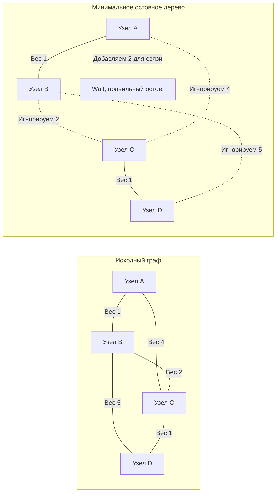

В предыдущих статьях мы искали кратчайшие маршруты от одной точки к другой (например, [[5. Кратчайшие пути. Алгоритм Дейкстры]]). Но в инфраструктурной инженерии часто возникает совершенно иная задача. 

Представьте, что вы строите дата-центр. У вас есть $V$ серверных стоек, и вам нужно соединить их оптоволоконным кабелем в единую сеть так, чтобы любой сервер имел доступ к любому другому. Прокладывать кабель между *всеми* парами (полный граф) — безумно дорого. Вам нужно проложить **минимально необходимое количество кабеля**, суммарная стоимость (длина) которого будет наименьшей. При этом в сети не должно быть петель (циклов), иначе пакеты будут зацикливаться (Broadcast Storm).

Такая структура называется **Минимальным остовным деревом (Minimum Spanning Tree, MST)**.

## Анатомия Минимального остовного дерева

* **Остов (Spanning subgraph):** Это подграф, который включает в себя **все** вершины исходного графа.
* **Дерево (Tree):** Это связный граф без циклов. Любое дерево из $V$ вершин имеет ровно $V - 1$ ребер.
* **Минимальное:** Сумма весов всех ребер этого дерева минимальна из всех возможных вариантов остовов для данного графа.


*(Давайте исправим логику остова на примере ниже)*


*Здесь мы выбрали ребра с весами 1, 2 и 1. Суммарный вес = 4. Все узлы связаны, циклов нет. Это идеальный MST.*

Для поиска MST существует два легендарных алгоритма: Крускала и Прима. Сегодня мы препарируем **Алгоритм Крускала (Kruskal's Algorithm)**.

## Механика алгоритма: Абсолютная жадность

Алгоритм Крускала — это один из самых элегантных "жадных" алгоритмов (Greedy Algorithm) в информатике. Его логика настолько проста, что ее можно описать одним предложением: 
**"Сортируем все ребра по возрастанию веса и берем самые дешевые, пока не свяжем все вершины, игнорируя те ребра, которые создают цикл."**

### Пошаговый план:
1. Выгрузить все ребра графа в единый плоский массив.
2. Отсортировать этот массив по возрастанию веса (от самых дешевых к самым дорогим).
3. Идти по отсортированному массиву. Для каждого ребра $U \leftrightarrow V$:
   * Если узлы $U$ и $V$ уже находятся в одной связной компоненте (путь между ними уже существует), мы **пропускаем** это ребро. Иначе добавление этого ребра создаст цикл.
   * Если узлы лежат в разных компонентах, мы **добавляем** ребро в наш итоговый остов и объединяем эти две компоненты в одну.
4. Алгоритм заканчивается, когда мы успешно добавим ровно $V - 1$ ребер.

## Mechanical Sympathy: Триумф списка ребер и DSU

Вспомним статью [[1. Представление графов]]. Для 99% задач мы выбирали Список смежности (`[][]int`). 
Но Крускал — это второе (и последнее после Беллмана-Форда) исключение в теории графов. Ему не важны соседи конкретной вершины. Ему нужен глобальный **Список ребер (Edge List)**. 

Плоский срез `[]Edge` сортируется процессором молниеносно, так как сортировка (например, `slices.SortFunc`) имеет идеальную пространственную локальность (Spatial Locality) и не вызывает промахов кэша (Cache Misses).

### Главная алгоритмическая проблема: Как дешево искать циклы?
Шаг алгоритма гласит: *"Если $U$ и $V$ в одной компоненте — пропускаем"*. 
Если мы будем запускать DFS или BFS каждый раз для проверки связности $U$ и $V$, сложность алгоритма деградирует до неадекватных $O(E \times (V + E))$. На графе из 1 миллиона ребер сервер просто "повиснет".

Здесь на сцену выходит структура данных **Система непересекающихся множеств (Disjoint Set Union, DSU / Union-Find)** (о ней мы подробно говорим в статьях [[4. Disjoint set union DSU, Union Find]] и [[10. Union Find на графах]]).

DSU строится на двух плоских массивах (`parent` и `rank`) и умеет отвечать на вопрос "Связаны ли узлы?" за амортизированное время **$O(\alpha(V))$**, где $\alpha$ — обратная функция Аккермана. В нашей Вселенной $\alpha(V)$ никогда не превышает числа $4$. То есть проверка на цикл занимает всего $4$ такта процессора!

> [!info] Под капотом: Отсутствие Stack Overflow
> В DSU функция `Find(i)` написана через рекурсию (для сжатия путей). Как архитектор, вы должны задать вопрос: "Не вызовет ли это переполнение стека (`runtime.morestack`) на миллионе вершин?". 
> Ответ: **Нет**. Благодаря эвристике "Объединение по рангу (Union by Rank)", максимальная глубина дерева DSU растет как логарифм. А благодаря "Сжатию путей (Path Compression)" она сплющивается до константы $\le 4$. Стек вызовов никогда не превысит 4 фреймов.

## Production-Ready реализация на Go

Используем современные возможности Go 1.21+ (пакет `slices`).

```go
package main

import (
	"cmp"
	"slices"
)

// Edge представляет неориентированное ребро графа
type Edge struct {
	U      int
	V      int
	Weight int
}

// DSU (Система непересекающихся множеств) оптимизированная для железа
type DSU struct {
	parent []int
	rank   []int // Для оптимизации глубины дерева
}

func NewDSU(n int) *DSU {
	p := make([]int, n)
	r := make([]int, n)
	for i := 0; i < n; i++ {
		p[i] = i // Изначально каждый узел — сам себе корень
		r[i] = 1
	}
	return &DSU{parent: p, rank: r}
}

// Find ищет корень компоненты с оптимизацией сжатия пути (Path Compression)
func (d *DSU) Find(i int) int {
	if d.parent[i] == i {
		return i
	}
	// Рекурсивно перевешиваем узел напрямую к корню
	d.parent[i] = d.Find(d.parent[i])
	return d.parent[i]
}

// Union объединяет две компоненты. Возвращает false, если они УЖЕ объединены.
func (d *DSU) Union(i, j int) bool {
	rootI := d.Find(i)
	rootJ := d.Find(j)

	if rootI == rootJ {
		return false // Узлы уже в одной компоненте (попытка создать цикл)
	}

	// Эвристика Union by Rank: меньшее дерево подвешиваем к большему
	if d.rank[rootI] < d.rank[rootJ] {
		d.parent[rootI] = rootJ
	} else if d.rank[rootI] > d.rank[rootJ] {
		d.parent[rootJ] = rootI
	} else {
		d.parent[rootJ] = rootI
		d.rank[rootI]++
	}
	
	return true
}

// KruskalMST возвращает список ребер, входящих в минимальное остовное дерево, и их общий вес
func KruskalMST(vertices int, edges []Edge) ([]Edge, int) {
	// 1. Сортируем все ребра по возрастанию веса
	// В Go 1.21+ используем slices.SortFunc (In-place, без аллокаций)
	slices.SortFunc(edges, func(a, b Edge) int {
		return cmp.Compare(a.Weight, b.Weight)
	})

	dsu := NewDSU(vertices)
	mst := make([]Edge, 0, vertices-1) // Преаллокация, т.к. в дереве ровно V-1 ребер
	totalWeight := 0

	// 2. Жадный проход по отсортированным ребрам
	for _, edge := range edges {
		// Пытаемся объединить компоненты U и V
		if dsu.Union(edge.U, edge.V) {
			// Если успешно (цикла нет) — берем ребро в остов
			mst = append(mst, edge)
			totalWeight += edge.Weight

			// Ранний выход: если собрали V-1 ребер, остов готов
			if len(mst) == vertices-1 {
				break
			}
		}
	}

	// Защита от несвязных графов (если граф распадается на острова)
	if len(mst) != vertices-1 {
		return nil, 0 // Остовное дерево построить невозможно
	}

	return mst, totalWeight
}
```

> [!warning] Ловушка / Gotcha: Ранний выход (Early Exit)
> Не забывайте условие `if len(mst) == vertices-1 { break }`. В плотных графах (где миллионы ребер и всего пара тысяч вершин) это сэкономит вам гигантское количество тактов CPU. Как только дерево построено, продолжать итерацию по оставшимся, более дорогим ребрам — бессмысленно. 

## Временная и пространственная сложность

* **Время:** $O(E \log E)$ — доминирующей операцией является сортировка слайса ребер. Работа DSU занимает $O(E \alpha(V))$, что на практике превращается в $O(E)$. Поэтому итоговая скорость зависит исключительно от алгоритма сортировки массива.
* **Память:** $O(V)$ — для хранения плоских массивов `parent` и `rank` внутри DSU, а также массива результатов `mst`. Мы не дублируем ребра.

## Интервью-фокус: Когда Крускал проигрывает?

> [!tip] Собеседование на Middle+/Senior
> **Вопрос:** Если Крускал так идеален для железа (плоские массивы, нет промахов кэша), когда бы вы выбрали алгоритм Прима вместо Крускала?
> **Ответ:** Крускал работает за $O(E \log E)$. Если граф **сильно разреженный** (Sparse Graph, $E \approx V$), Крускал непобедим. Но если граф **очень плотный** (Dense Graph), например, каждый сервер напрямую соединен с каждым (полный граф, $E \approx V^2$), сортировка $V^2$ ребер займет $O(V^2 \log(V^2))$ времени. В плотных графах алгоритм Прима (реализованный без кучи, а на плоском массиве $O(V^2)$) математически отработает быстрее, так как ему вообще не нужно сортировать все ребра мира, он растет от одной вершины.

## Итог

1. **Минимальное остовное дерево (MST)** — это способ связать все узлы графа без циклов с минимально возможным суммарным весом.
2. **Алгоритм Крускала** — это жадный алгоритм, который собирает дерево, сортируя все ребра и выбирая самые дешевые.
3. Его эффективность полностью зависит от **DSU (Union-Find)** — структуры данных, позволяющей за $O(1)$ проверять связность узлов и избегать циклов.
4. Крускал — лучший выбор для **разреженных графов** (где мало ребер относительно количества вершин).

Но что делать с теми самыми плотными графами, о которых шла речь выше? Как построить MST, не сканируя и не сортируя миллионы лишних связей глобально, а "выращивая" сеть шаг за шагом от одного стартового сервера? Этот архитектурный подход мы разберем в следующей статье: [[9. Минимальное остовное дерево. Алгоритм Прима]].