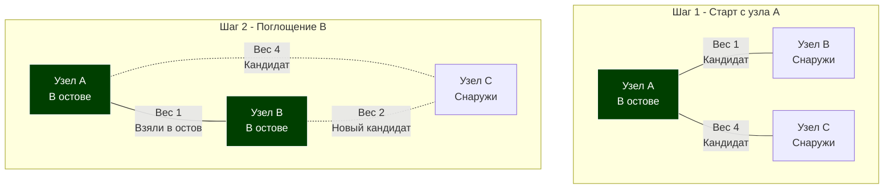

В прошлой статье [[8. Минимальное остовное дерево. Алгоритм Крускала]] мы научились строить Минимальное остовное дерево (MST) с помощью жадной сортировки всех ребер графа. Алгоритм Крускала гениален в своей простоте и работает с невероятной скоростью на разреженных графах благодаря структуре DSU.

Но мы закончили статью важным архитектурным вопросом: что если наш граф **экстремально плотный (Dense Graph)**? Представьте кластер из 10 000 серверов, где каждый физически соединен с каждым. Это $10^8$ (100 миллионов) ребер. Крускал попытается отсортировать этот гигантский массив, что займет $O(E \log E)$ времени и уничтожит кэш процессора при перемещении элементов.

Для таких задач инженеры используют другой подход: вместо того чтобы смотреть на граф глобально, мы "выращиваем" остовное дерево из одного маленького семечка. Этот подход называется **Алгоритмом Прима (Prim's Algorithm)**.

## Механика алгоритма: Расширение империи

Если Крускал собирает дерево по кусочкам из случайных мест графа (объединяя их через DSU), то Прим всегда поддерживает **единое, связное дерево**, которое постепенно поглощает новые узлы.

### Пошаговый план:
1. Выбираем абсолютно любую стартовую вершину (например, 0). Помещаем ее в наше растущее дерево (Остов).
2. Находим все ребра, которые соединяют узлы **внутри** Остова с узлами **снаружи** Остова.
3. Выбираем из этих ребер самое дешевое (жадный шаг).
4. Добавляем это ребро и новый узел, к которому оно ведет, в Остов.
5. Повторяем шаги 2-4, пока все $V$ вершин не окажутся внутри Остова.


*На втором шаге у нас есть выбор: пойти в C из A за 4, или из B за 2. Алгоритм выберет ребро B-C.*

## Mechanical Sympathy: Как быстро искать кандидатов?

Нам нужно постоянно выбирать минимальное ребро из множества доступных. Звучит знакомо? Эта задача требует **Очереди с приоритетом (Min-Heap)**, точно так же, как в алгоритме Дейкстры (см. [[5. Кратчайшие пути. Алгоритм Дейкстры]]).

Мы будем хранить в куче ребра. Когда мы поглощаем новый узел, мы просто закидываем все его исходящие ребра в кучу. На каждой итерации мы делаем `Pop` минимального ребра. Если оно ведет в узел, который уже поглощен (уже в Остове) — мы просто выбрасываем это ребро и берем следующее.

> [!warning] Ловушка / Gotcha: Прим против Дейкстры
> На собеседованиях часто просят объяснить разницу между этими двумя алгоритмами, ведь их код почти идентичен!
> **Разница фундаментальна:**
> * В Дейкстре мы кладем в кучу **накопленное расстояние** от старта до текущего узла (`dist[u] + weight`). Мы ищем кратчайший путь от корня.
> * В Приме мы кладем в кучу **только вес самого ребра** (`weight`). Нам плевать, как далеко узел от старта, нас интересует только стоимость подключения нового узла к ближайшей точке текущего Остова.

## Реализация на Go (Idiomatic Heap Approach)

Используем классический список смежности и `container/heap`.

```go
package main

import (
	"container/heap"
)

// Edge представляет взвешенное ребро
type Edge struct {
	To     int
	Weight int
}

// Graph — список смежности
type Graph struct {
	Adj [][]Edge
}

// PrimItem — элемент для очереди с приоритетом
type PrimItem struct {
	From   int // Откуда исходит ребро (из Остова)
	To     int // Куда ведет ребро (Кандидат)
	Weight int // Вес ребра
}

// MinHeap для ребер (реализация интерфейса heap.Interface)
type MinHeap []PrimItem

func (h MinHeap) Len() int           { return len(h) }
func (h MinHeap) Less(i, j int) bool { return h[i].Weight < h[j].Weight }
func (h MinHeap) Swap(i, j int)      { h[i], h[j] = h[j], h[i] }

func (h *MinHeap) Push(x any) {
	*h = append(*h, x.(PrimItem))
}

func (h *MinHeap) Pop() any {
	old := *h
	n := len(old)
	item := old[n-1]
	*h = old[0 : n-1]
	return item
}

// PrimMST возвращает сумму весов минимального остовного дерева
func PrimMST(g *Graph) int {
	V := len(g.Adj)
	if V == 0 {
		return 0
	}

	inMST := make([]bool, V) // Отслеживаем узлы внутри Остова
	pq := &MinHeap{}
	heap.Init(pq)

	totalWeight := 0
	edgesCount := 0

	// Начинаем с узла 0
	startNode := 0
	inMST[startNode] = true

	// Добавляем все ребра от стартового узла в кучу
	for _, edge := range g.Adj[startNode] {
		heap.Push(pq, PrimItem{From: startNode, To: edge.To, Weight: edge.Weight})
	}

	// Пока Остов не охватит все V узлов (потребуется V-1 ребер)
	for pq.Len() > 0 && edgesCount < V-1 {
		// Берем самое дешевое ребро
		minEdge := heap.Pop(pq).(PrimItem)

		// Если узел To уже в Остове, это ребро создаст цикл. Игнорируем.
		if inMST[minEdge.To] {
			continue
		}

		// Поглощаем новый узел
		inMST[minEdge.To] = true
		totalWeight += minEdge.Weight
		edgesCount++

		// Добавляем новые горизонты (исходящие ребра нового узла) в кучу
		for _, nextEdge := range g.Adj[minEdge.To] {
			if !inMST[nextEdge.To] {
				heap.Push(pq, PrimItem{
					From:   minEdge.To,
					To:     nextEdge.To,
					Weight: nextEdge.Weight,
				})
			}
		}
	}

	// Проверка на связность графа
	if edgesCount != V-1 {
		return -1 // Граф разорван, построить полный MST невозможно
	}

	return totalWeight
}
```

## Хардкор для Архитекторов: Оптимизация для Плотных Графов

Вышеописанная реализация на куче работает за $O(E \log V)$. Но в начале статьи мы заявили, что Прим спасает нас на плотных графах, где $E \approx V^2$. 

Если $E = V^2$, то сложность решения на куче становится $O(V^2 \log V)$. Крускал работает за $O(V^2 \log V^2) = O(V^2 \log V)$. То есть асимптотически они равны! В чем же тогда выигрыш Прима?

> [!info] Под капотом: Плоский алгоритм Прима $O(V^2)$
> Настоящая алгоритмическая магия Прима раскрывается, если мы **откажемся от кучи**. 
> Вместо кучи мы создаем плоский массив `minWeightToNode[V]`. 
> На каждом шаге мы находим минимальное ребро не из кучи, а просто сканируя этот плоский массив линейным поиском за $O(V)$ (см. [[1. Линейный поиск]]).
> Зачем сканировать массив руками? Потому что для $V$ узлов мы сделаем $V$ сканирований длиной $V$. Суммарная сложность составит строго **$O(V^2)$**! Логарифм исчезает! 
> Линейный скан плоского массива `[]int` выполняется процессором без единого промаха кэша. На графе из 10 000 вершин ($10^8$ ребер) массивный Прим отработает на порядок быстрее Крускала и Прима на куче. 
> *Это классический пример того, как глубокое понимание Mechanical Sympathy позволяет инженеру нарушать "учебные" правила ради сырой производительности.*

## Временная и пространственная сложность (Версия на Куче)

* **Время:** $O(E \log V)$ — каждое ребро может быть добавлено в кучу и извлечено из нее один раз. Извлечение стоит $O(\log V)$ (максимальный размер кучи ограничивается количеством вершин).
* **Память:** $O(V + E)$ — для хранения графа и кучи.

## Итог

1. **Алгоритм Прима** "выращивает" Минимальное остовное дерево из одной стартовой вершины, жадно присоединяя ближайшие узлы.
2. Под капотом использует **Очередь с приоритетом (Min-Heap)** для быстрого поиска самых дешевых ребер на границе Остова.
3. Код Прима алгоритмически похож на Дейкстру, но оптимизирует не общую длину пути, а **локальную стоимость подключения**.
4. На **экстремально плотных графах** Прим с использованием плоского массива (вместо кучи) достигает математического предела скорости $O(V^2)$, оставляя Крускала далеко позади.

Мы завершили огромный раздел графов, изучив их вдоль и поперек: от представления в памяти до поиска кратчайших путей и остовов. Но наш арсенал Backend-инженера будет неполным без глубокого понимания данных, которые чаще всего передаются по этим сетям — текста. В следующем разделе мы погрузимся в устройство строк, кодировки и сверхбыстрые алгоритмы поиска: [[1. Поиск подстроки]].