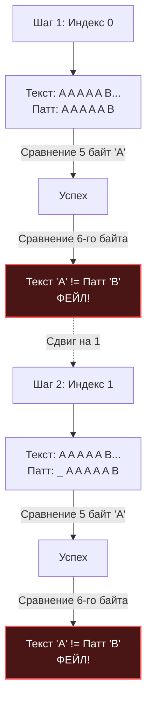

Поиск подстроки — это одна из самых частых операций в бэкенд-разработке. Мы парсим URL-адреса, ищем маркеры в логах, фильтруем пакеты в сетевом стеке и работаем с полнотекстовым поиском. В Go для этого есть стандартные `strings.Index()` и `strings.Contains()`. 

Но как они работают под капотом? Почему на некоторых данных стандартные функции "летают", а на других — заставляют CPU простаивать? Прежде чем мы перейдем к сложным алгоритмам с предвычислением, нам нужно разобрать физику строк и базовый (наивный) алгоритм поиска.

## Строки в Go и свойство UTF-8

Для начала вспомним, что такое строка в рантайме Go (структура `StringHeader` из пакета `reflect`, которая в новых версиях заменена на внутренние типы, но суть осталась прежней):

```go
type StringHeader struct {
	Data uintptr // Указатель на underlying массив байт
	Len  int     // Длина в БАЙТАХ (не в символах!)
}
```

Строка — это неизменяемый (read-only) слайс байт. 
В Go исходный код и строки кодируются в **UTF-8**. Это означает, что один символ (руна) может занимать от 1 до 4 байт. 

> [!tip] Собеседование
> **Вопрос:** Если мы ищем подстроку `"мир"` в строке `"привет мир"`, нужно ли нам конвертировать обе строки в `[]rune`, чтобы не сломать кодировку при поиске?
> **Ответ:** **Нет, это грубая ошибка и лишняя аллокация.** > UTF-8 обладает гениальным математическим свойством: **Самосинхронизация (Self-synchronization)** и **Префиксность**. Последовательность байт любого валидного символа в UTF-8 никогда не может случайно оказаться частью последовательности байт другого символа (или на стыке двух других символов). Поэтому мы можем безопасно и невероятно быстро искать подстроку **побайтово**, полностью игнорируя границы рун.

## Наивный поиск (Brute Force)

Наивный алгоритм (Naive String Matching) предельно прост: мы прикладываем Паттерн к Тексту начиная с нулевого индекса. Если байты совпадают, мы идем дальше по Паттерну. Если встречаем несовпадение — сдвигаем Паттерн в Тексте вправо ровно на **1 позицию** и начинаем проверку Паттерна с самого начала.

### Идиоматичная реализация

```go
package stringsearch

// NaiveSearch ищет первое вхождение паттерна в текст и возвращает индекс.
// Возвращает -1, если подстрока не найдена.
func NaiveSearch(text, pattern string) int {
	n := len(text)
	m := len(pattern)

	// Если паттерн пустой, по конвенции Go - возвращаем 0
	if m == 0 {
		return 0
	}
	
	// Если паттерн длиннее текста, он точно не поместится
	if m > n {
		return -1
	}

	// Идем по тексту. Нам нет смысла идти дальше, чем n - m
	for i := 0; i <= n-m; i++ {
		match := true
		
		// Внутренний цикл проверки совпадения
		for j := 0; j < m; j++ {
			if text[i+j] != pattern[j] {
				match = false
				break // Обнаружено несовпадение, прерываем внутренний цикл
			}
		}
		
		if match {
			return i // Полное совпадение найдено
		}
	}

	return -1
}
```

## Mechanical Sympathy: Худший случай и Branch Prediction

Асимптотическая сложность наивного поиска:
* **Лучший случай:** $O(N)$ (Если мы находим совпадение сразу или паттерн вообще не встречается, и первый же байт не совпадает).
* **Худший случай:** $O(N \cdot M)$.

Давайте посмотрим на Худший случай глазами процессора. Представьте, что вы обрабатываете DNA-последовательности или бинарные данные, где символы часто повторяются.

`Текст = "AAAAAAAAAAAAAAAAAAAAAB"`
`Паттерн = "AAAAAB"`



На каждом шаге процессор делает 5 успешных проверок и ломается на 6-й. 
Что при этом делает **Branch Predictor (Предсказатель ветвлений)** в CPU? 
В строке `if text[i+j] != pattern[j]` он видит, что первые 5 раз условие ложно (совпадение есть). Конвейер процессора загружается инструкциями, предполагая, что и дальше все совпадет. На 6-й раз условие становится истинным (байты не совпали), и процессор получает **Branch Misprediction** — он вынужден сбросить конвейер, потеряв десятки тактов, сдвинуться на 1 байт и начать эту пытку заново.

## Как устроен `strings.Index` в Go?

Если наивный поиск такой плохой в худшем случае, значит ли это, что стандартная функция `strings.Index` в Go использует продвинутые алгоритмы типа Кнута-Морриса-Пратта (KMP)?

**Парадокс: В 90% случаев Go использует именно Наивный поиск!** Но делает это на уровне ассемблера и железа.

> [!info] Под капотом
> Если вы посмотрите исходный код пакета `strings` и `internal/bytealg`, вы увидите, что функция `Index` вызывает платформозависимые ассемблерные функции.
> На современных процессорах x86-64/ARM64 Go использует **SIMD-инструкции (Single Instruction, Multiple Data)**, такие как AVX2.
> Вместо того чтобы сравнивать по 1 байту в цикле `for`, процессор может загрузить сразу **16 или 32 байта** текста в один широкий регистр и за **один такт (1 инструкцию PCMPEQB)** сравнить их с паттерном. 
> Из-за этого "тупой" алгоритм $O(N \cdot M)$ на коротких и средних строках физически отрабатывает в десятки раз быстрее, чем сложные алгоритмы с их предвычислениями, хешами и таблицами сдвигов. Кеш L1 обожает последовательное чтение без прыжков по структурам памяти.

### Переключение на Rabin-Karp

Однако разработчики рантайма Go знают о проблеме худшего случая (атаке через специально подготовленные строки, которая может уронить сервер на $O(N \cdot M)$).

Поэтому внутри `strings.Index` зашит предохранитель. Если длина паттерна больше определенного порога, или если наивный (SIMD) поиск делает слишком много неудачных проверок (переваливает за эвристический лимит откатов), **Go динамически на лету переключается на алгоритм Рабина-Карпа**. 
(О том, как он работает через скользящее хеширование, мы поговорим в [[3. Алгоритм Рабина Карпа]]).

## Итог и переход к умным алгоритмам

Наивный алгоритм (и его векторные SIMD-версии) — это абсолютный чемпион на коротких строках из-за нулевого оверхеда на инициализацию памяти и идеального Cache Locality.

Но как инженеры, мы обязаны знать, как избежать худшего случая алгоритмически, без упования на AVX-инструкции (которых может не быть на дешевом ARM-сервере).

Главная слабость наивного поиска в том, что после обнаружения ошибки он **забывает всё, что узнал о тексте**, сдвигается всего на 1 символ назад и проверяет те же самые символы заново.
Можно ли, найдя несовпадение, сдвинуть паттерн сразу на 5, 10 или 100 символов вперед, чтобы никогда не возвращаться назад? Да, можно. Именно эту задачу решили три великих математика. В следующей статье мы разберем первый линейный алгоритм поиска подстроки: [[2. Алгоритм Кнута Морриса Пратта]].