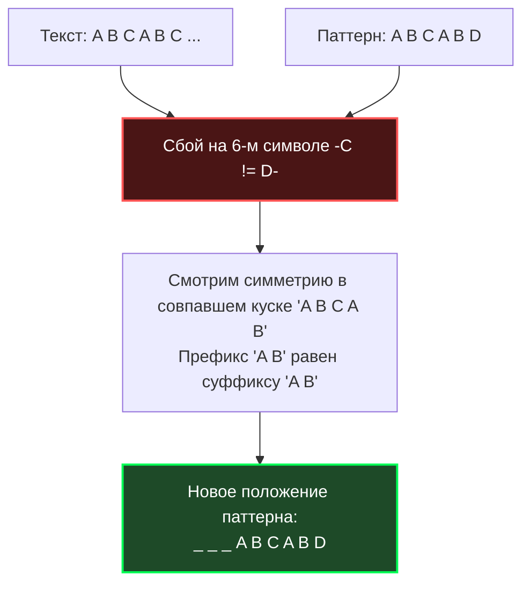

В прошлой статье [[1. Поиск подстроки]] мы разобрали наивный алгоритм поиска. Его главная проблема заключается в **амнезии**: обнаружив несовпадение, алгоритм полностью забывает всё, что только что успешно прочитал, сдвигает паттерн всего на 1 символ вправо и начинает проверку с нуля. Из-за этого в худшем случае (например, при поиске в ДНК-последовательностях) сложность деградирует до $O(N \cdot M)$.

В 1970 году Дональд Кнут, Джеймс Моррис и Воан Пратт независимо друг от друга придумали, как излечить алгоритм от амнезии. Они создали алгоритм, который гарантированно работает за линейное время **$O(N + M)$** в абсолютно любых, даже самых худших условиях.

## Концепция: Использование уже известного

Главная идея алгоритма Кнута-Морриса-Пратта (KMP) звучит так: **когда происходит несовпадение, мы уже знаем, какие символы паттерна совпали до этого момента.** Если мы найдем в совпавшей части паттерна симметрию, мы сможем сдвинуть паттерн сразу на несколько позиций вперед, не боясь пропустить правильный ответ.

### Пример амнезии vs KMP

Представьте, что мы ищем паттерн `ABCABD` в тексте.
Текст: `A B C A B C ...`
Патт:  `A B C A B D`

Мы успешно совпали на `A B C A B`, но на 6-м символе случился сбой (`C != D`).
* **Наивный алгоритм** сдвинет паттерн на 1 шаг вправо и начнет сравнивать `B` с `A`. Он сделает кучу бесполезной работы.
* **KMP** "посмотрит" на уже совпавшую часть `A B C A B`. Он увидит, что эта строка начинается на `A B` и заканчивается на `A B`. Значит, мы можем мгновенно сдвинуть паттерн так, чтобы начальный `A B` паттерна встал на место конечного `A B` текста! Мы сдвигаем паттерн сразу на 3 позиции и продолжаем проверку *без возврата назад по тексту*.



## Магия KMP: Массив LPS ($\pi$-функция)

Чтобы алгоритм мог мгновенно понимать, насколько сдвигать паттерн, ему нужна шпаргалка. Эта шпаргалка вычисляется **заранее**, только на основе самого паттерна (текст для этого не нужен).

Эта шпаргалка называется **Массив LPS** (Longest Proper Prefix which is also Suffix) или **Префикс-функция**.
`LPS[i]` хранит длину самого длинного *собственного* префикса подстроки `pattern[0...i]`, который одновременно является её суффиксом.

> Собственный префикс — это префикс, который не равен самой строке. Для строки `A B A` префиксы — это `A`, `A B`. Суффиксы — `A`, `B A`. Совпадает `A`. Длина = 1.

Давайте построим LPS для паттерна `A B A B A C A`:
* `A` -> 0 (нет собственных префиксов)
* `A B` -> 0
* `A B A` -> 1 (префикс `A`, суффикс `A`)
* `A B A B` -> 2 (префикс `A B`, суффикс `A B`)
* `A B A B A` -> 3 (`A B A`)
* `A B A B A C` -> 0 (сбой на `C`)
* `A B A B A C A` -> 1 (`A`)

Массив LPS: `[0, 0, 1, 2, 3, 0, 1]`. Вычисление этой таблицы занимает строго $O(M)$ времени.

## Идиоматичная реализация на Go

Реализация делится на две части: препроцессинг (сборка LPS) и сам поиск. Мы будем использовать массивы `byte`, так как, как мы помним из прошлой статьи, UTF-8 позволяет безопасно искать строки побайтово.

```go
package stringsearch

// buildLPS предварительно вычисляет массив LPS для паттерна
func buildLPS(pattern string) []int {
	m := len(pattern)
	lps := make([]int, m) // O-M- дополнительной памяти
	
	length := 0 // длина предыдущего самого длинного префикс-суффикса
	i := 1
	
	for i < m {
		if pattern[i] == pattern[length] {
			length++
			lps[i] = length
			i++
		} else {
			if length != 0 {
				// Если нет совпадения, но мы уже совпали частично,
				// мы не сбрасываем length в 0, а откатываемся по таблице LPS
				length = lps[length-1]
			} else {
				// Если совпадений нет вообще
				lps[i] = 0
				i++
			}
		}
	}
	return lps
}

// KMP возвращает все начальные индексы вхождений паттерна в текст
func KMP(text, pattern string) []int {
	var res []int
	n := len(text)
	m := len(pattern)

	if m == 0 {
		return res
	}
	if m > n {
		return res
	}

	// 1. Препроцессинг
	lps := buildLPS(pattern)

	// 2. Фаза поиска
	i := 0 // индекс для текста
	j := 0 // индекс для паттерна

	for i < n {
		if text[i] == pattern[j] {
			i++
			j++
		}

		if j == m {
			// Паттерн найден!
			res = append(res, i-j)
			// Сдвигаем j, опираясь на таблицу, чтобы найти следующие вхождения
			j = lps[j-1]
		} else if i < n && text[i] != pattern[j] {
			// Случился сбой
			if j != 0 {
				// Умный сдвиг паттерна: мы НЕ трогаем индекс i в тексте!
				j = lps[j-1]
			} else {
				// Если сбой на самом первом символе паттерна, просто идем дальше по тексту
				i++
			}
		}
	}

	return res
}
```

## Mechanical Sympathy: Время против Железа

> [!tip] Собеседование
> **Вопрос:** В фазе поиска у нас есть цикл `while` (или `for` без инкремента `i`), внутри которого индекс `j` может уменьшаться несколько раз (строка `j = lps[j-1]`). Почему тогда сложность строго $O(N)$, а не $O(N^2)$?
> **Ответ:** Это доказывается с помощью **Амортизированного анализа**. Индекс `j` может быть уменьшен *только* в том случае, если он был увеличен. Увеличивается он вместе с `i` (`i++; j++`). Поскольку `i` движется строго вперед и никогда не возвращается назад ($N$ шагов), `j` суммарно не может быть уменьшен больше, чем $N$ раз за весь алгоритм. Итого: $2N$ операций в худшем случае, что асимптотически равно $O(N)$.

С математикой всё отлично. Но почему тогда KMP **не используется** в функции `strings.Index()` под капотом Go?

### Налог на KMP в реальном мире
1. **Аллокация памяти:** Наивный поиск работает за $O(1)$ по памяти. KMP требует аллокации среза `lps := make([]int, m)`. Если мы ищем строку в высоконагруженном цикле, мы будем постоянно дергать `malloc` и нагружать Garbage Collector. В Go стараются избегать скрытых аллокаций в базовых функциях.
2. **Промахи кэша:** При сбое в цикле KMP прыгает по массиву: `j = lps[j-1]`. Это непредсказуемый паттерн доступа (Pointer Chasing), который ломает аппаратный предсказатель (Hardware Prefetcher) и вызывает Cache Miss.
3. **SIMD-инструкции:** Современный x86-64 процессор за один такт сравнивает 32 байта текста с паттерном с помощью AVX-инструкций. В KMP мы вынуждены сравнивать символы поштучно из-за сложной логики откатов. В 99% случаев (когда паттерн короткий) тупой векторный `Brute Force` физически рвет KMP в клочья.

## Где KMP абсолютно незаменим в Бэкенде?

KMP блистает там, где у нас **нет возможности откатить индекс `i` назад**.

В наивном алгоритме при сбое мы возвращаемся назад по тексту. Это значит, что весь текст должен находиться в оперативной памяти (слайсе `[]byte`). 
Но что, если текст — это не слайс, а **бесконечный сетевой поток (`io.Reader`)**, TCP-сокет или огромный лог-файл на 50 ГБ? Вы не можете "отмотать" сетевой сокет назад.

KMP идеален для потоковой обработки (Streaming Data). Указатель `i` в KMP **никогда не идет назад**. Он только принимает новые байты. Вы можете читать данные из сети чанками по 1 байту, кормить их в автомат KMP, и он безошибочно найдет маркер окончания сообщения (например, `\r\n\r\n` в HTTP) за $O(1)$ на каждый входящий байт, имея в памяти только крошечный `lps` массив и два `int` указателя.

## Итог

1. **Сложность:** Гарантированное $O(N + M)$ по времени, $O(M)$ по памяти.
2. **Суть:** Предвычисление симметрии в паттерне для умных сдвигов при несовпадении.
3. **Hardware:** Проигрывает векторному наивному поиску на коротких строках из-за аллокаций и отсутствия SIMD-оптимизаций.
4. **Суперсила:** Указатель по тексту никогда не возвращается назад, что делает KMP идеальным алгоритмом для сканирования бесконечных потоков (`io.Reader`).

KMP полагается на глубокий структурный анализ строки. Но что, если мы не хотим анализировать каждый символ? Что, если мы превратим поиск строк в математику чисел, используя парадигму скользящего окна? Этот подход используется для поиска плагиата и дедупликации, и он встроен как "запасной парашют" прямо в стандартную библиотеку Go. Переходим к нему в следующей статье: [[3. Алгоритм Рабина Карпа]].