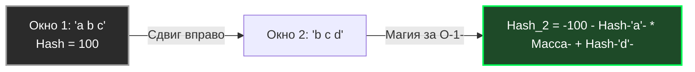

В предыдущих статьях мы рассмотрели две крайности поиска: наивный алгоритм ([[1. Поиск подстроки]]), который сравнивает всё в лоб и страдает от амнезии, и алгоритм Кнута-Морриса-Пратта ([[2. Алгоритм Кнута Морриса Пратта]]), который использует глубокий структурный анализ симметрии паттерна для сложных сдвигов.

Алгоритм Рабина-Карпа, придуманный в 1987 году Ричардом Карпом и Майклом Рабином, предлагает совершенно иной, математический взгляд на проблему.

Что, если мы перестанем смотреть на строку как на массив символов, а превратим её в **одно большое число**? Если мы сможем вычислять это число для любого окна текста за $O(1)$, поиск подстроки сведется к простому сравнению двух чисел (хешей).

Этот подход открыл дорогу для целого класса алгоритмов, называемых **Скользящий хеш (Rolling Hash)**.

## Концепция: Окно, которое катится

Основа алгоритма — хеш-функция. Мы вычисляем хеш от нашего паттерна (например, `"ABC"` -> `123`).

Затем мы берем окно размером с паттерн в самом начале текста и тоже вычисляем его хеш.

Если хеши не совпали — мы сдвигаем окно вправо на 1 символ.

Но вычислять криптографический (или даже обычный вроде FNV) хеш для каждого нового окна с нуля — это долго ($O(M)$). Если мы будем делать так на каждом шаге, сложность останется $O(N \cdot M)$.

**Гениальность Рабина-Карпа заключается в Полиномиальном скользящем хеше.** Когда окно сдвигается на 1 символ вправо, состав окна меняется минимально: один старый символ "выпадает" слева, а один новый "заходит" справа. Все остальные $M-1$ символов остаются на своих местах!

Алгоритм берет хеш старого окна, математически "отнимает" из него влияние ушедшего символа и "прибавляет" влияние нового. Это делается за **2-3 арифметические операции ($O(1)$)**, независимо от длины окна.



## Математика полиномиального хеша

Представим строку как число в системе счисления с основанием $P$ (где $P$ — простое число, обычно большее размера алфавита, например 31, 257 или 16777619).

Хеш для строки $S$ длины $M$:

$H = S[0] \cdot P^{M-1} + S[1] \cdot P^{M-2} + ... + S[M-1] \cdot P^0$

Чтобы получить хеш следующего окна (сдвиг вправо), нам нужно:

1. Умножить старый хеш на $P$ (это сдвинет все разряды влево).
2. Вычесть $S_{old} \cdot P^M$ (убрать влияние самого левого символа, который теперь "выпал" за пределы окна).
3. Прибавить $S_{new}$ (добавить новый символ справа).

Формула пересчета:

$H_{next} = H_{prev} \cdot P - S_{old} \cdot P^M + S_{new}$

## Mechanical Sympathy: Как это оптимизировано в Go

В теории (академической информатике) все эти вычисления должны производиться по модулю большого простого числа $Q$, чтобы избежать переполнения типов данных (Integer Overflow): $H \pmod Q$.

> [!info] Под капотом
> 
> Операция взятия остатка от деления (`%`) — одна из самых тяжелых для ALU процессора.
> 
> Если вы откроете исходники рантайма Go (файл `internal/bytealg/rabinkarp.go`), вы увидите, что там **нет никакого модуля**.
> 
> Go использует тип `uint32`. При переполнении этого типа процессор автоматически, аппаратно и совершенно бесплатно "обрезает" лишние старшие биты. Это математически эквивалентно операции по модулю $2^{32}$. Процессор делает это за **0 дополнительных тактов**.
> 
> В качестве множителя $P$ используется простое число `16777619` (FNV Prime).

## Идиоматичная реализация на Go

Давайте напишем production-ready реализацию алгоритма Рабина-Карпа, в точности повторяющую логику внутренней функции `strings.Index` при фоллбэке.

```go
package stringsearch

const primeRK = 16777619

// RabinKarp возвращает индекс первого вхождения паттерна в текст.
func RabinKarp(text, pattern string) int {
	n := len(text)
	m := len(pattern)

	if m == 0 {
		return 0
	}
	if m > n {
		return -1
	}

	// 1. Вычисляем P^m -множитель для удаления старого символа-
	// В Go это делается через uint32 для бесплатного модульного переполнения
	pow := uint32(1)
	for i := 0; i < m; i++ {
		pow *= primeRK
	}

	// 2. Вычисляем хеш паттерна и хеш первого окна текста
	var hashPat, hashText uint32 = 0, 0
	for i := 0; i < m; i++ {
		hashPat = hashPat*primeRK + uint32(pattern[i])
		hashText = hashText*primeRK + uint32(text[i])
	}

	// 3. Проверяем первое окно
	// ВАЖНО: Равенство хешей не гарантирует равенство строк -Коллизия-!
	if hashPat == hashText && text[:m] == pattern {
		return 0
	}

	// 4. Скользим окном по тексту
	for i := m; i < n; i++ {
		// Сдвигаем хеш:
		// Умножаем на P, добавляем новый символ, вычитаем старый
		hashText = hashText*primeRK + uint32(text[i]) - uint32(text[i-m])*pow

		// Проверяем совпадение
		if hashPat == hashText {
			// Обязательная проверка посимвольно из-за возможных коллизий
			if text[i-m+1:i+1] == pattern {
				return i - m + 1
			}
		}
	}

	return -1
}
```

> [!warning] Ловушка / Gotcha (Парадокс коллизий)
> 
> Поскольку мы работаем в пространстве $2^{32}$ (или даже $2^{64}$), разные строки могут дать одинаковый хеш.
> 
> Если злоумышленник знает, что вы используете Рабина-Карпа с множителем 16777619, он может специально сгенерировать такой текст, где **каждое окно будет давать коллизию** с вашим паттерном.
> 
> В таком случае алгоритму придется каждый раз вызывать медленную посимвольную проверку `text[...] == pattern`, и производительность деградирует до $O(N \cdot M)$.
> 
> Именно поэтому Рабин-Карп относится к рандомизированным алгоритмам типа **Лас-Вегас** (см. [[6. Randomized алгоритмы]]): он всегда дает точный ответ, но его время работы может зависеть от "везения" с коллизиями.

## Где Рабин-Карп абсолютно незаменим в Бэкенде?

Казалось бы, если есть угроза коллизий, зачем использовать этот алгоритм? Почему бы не взять KMP из предыдущей статьи?

Ответ кроется в **поиске множества паттернов одновременно**.

Представьте, что вы пишете антиплагиат или WAF (Web Application Firewall). Вам летит строка лога, и вам нужно проверить, не содержит ли она **одну из 10 000 запрещенных подстрок** (SQL-инъекций).

- Если использовать KMP, вам придется запустить алгоритм 10 000 раз. Сложность $O(10000 \cdot N)$.
- Рабин-Карп решает эту задачу элегантно. Вы считаете хеши для всех 10 000 паттернов и кладете их в хеш-таблицу (или Bloom Filter, см. [[6. Bloom filter - вероятностная структура данных]]).
- Затем вы один раз скользите окном по тексту. На каждом шаге вы за $O(1)$ проверяете, есть ли `hashText` в вашей мапе запрещенных хешей! Сложность поиска множества паттернов становится **практически такой же, как поиск одного паттерна**.

> [!tip] Собеседование
> 
> **Вопрос:** Почему в стандартной библиотеке `strings.Index` Go использует Рабина-Карпа как "запасной" алгоритм для длинных строк, а не KMP?
> 
> **Ответ:** Из-за аллокаций. KMP требует создания массива `lps` размером с паттерн. Для паттерна в 1 МБ потребуется выделить мегабайт памяти в куче. Рабин-Карп использует только две переменные `uint32` для своих математических вычислений, что означает строгие **Zero Allocations**. Для рантайма языка (который должен быть максимально легким и не дергать GC без повода) предсказуемая работа с кэшем CPU без выделения памяти важнее, чем защита от теоретической атаки коллизиями, которая в реальной жизни почти не встречается на длинных строках.

## Итог

1. **Сложность:** $O(N + M)$ в среднем случае, $O(N \cdot M)$ в худшем (при коллизиях).
2. **Суть:** Представление окна текста как полиномиального хеша и его пересчет за $O(1)$ при сдвиге (Rolling Hash).
3. **Mechanical Sympathy:** Использование переполнения `uint32` в Go позволяет избежать дорогих операций по модулю (`%`). Отсутствие аллокаций делает его любимчиком рантайма Go.
4. **Суперсила:** Мультипаттерновый поиск (Plagiarism Detection).

Рабин-Карп показывает, как превратить работу со строками в математику. Но существует еще один алгоритм, который объединяет геометрический подход к префиксам (как в KMP) с невероятной простотой реализации. Он строится на вычислении всего одного массива, который описывает "взгляд вперед". Переходим к нему в следующей статье: [[4. Z алгоритм]].