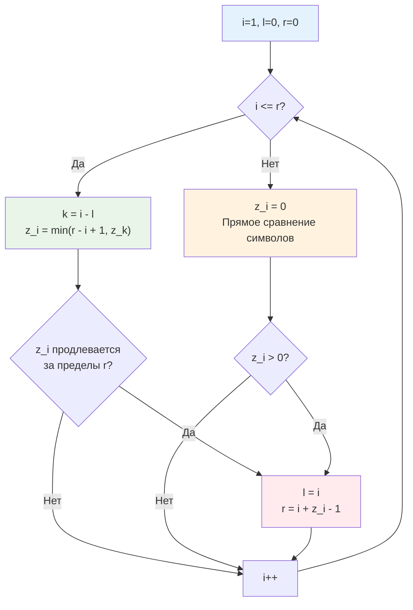

## Введение: Линейный поиск через префиксные интервалы

Z-алгоритм часто остаётся в тени [[2. Алгоритм Кнута Морриса Пратта]] и [[3. Алгоритм Рабина Карпа]], но для бэкенд-разработчика это скрытый козырь. Он решает задачи поиска подстрок, обнаружения периодов, сравнения префиксов и кластеризации текстов за гарантированное `O(n)` время с минимальным оверхедом на память. В отличие от KMP, который требует построения массива префиксных функций (часто запутанного и подверженного off-by-one ошибкам), Z-алгоритм оперирует интуитивно понятными интервалами совпадений с префиксом строки.

В продакшене Z-функция применяется там, где регулярные выражения или наивный поиск становятся bottleneck: парсинг структурированных логов без backtracking, дедупликация сессий, поиск повторяющихся паттернов в телеграфических протоколах, валидация форматов токенов и построение индексов для полнотекстового поиска.

> [!tip] Собеседование
> **Вопрос:** «Зачем использовать Z-алгоритм, если есть `strings.Contains` или регулярные выражения?»
> **Ответ:** `strings.Contains` в Go реализован через оптимизированный наивный поиск с SIMD-инструкциями и работает быстро на коротких строках, но в худшем случае имеет `O(n*m)`. Регулярные выражения с backtracking могут деградировать до экспоненциального времени на специально сконструированных входах (ReDoS-атаки). Z-алгоритм даёт строгий `O(n+m)`, не зависит от паттерна и не требует компиляции грамматики. Это детерминированная альтернатива для high-load парсинга.

## Математическое ядро: Z-функция и L-интервалы

Z-функция для строки `S` длины `n` — это массив `z` той же длины, где `z[i]` равна длине наибольшего общего префикса строки `S` и её суффикса, начинающегося в позиции `i`.
Формально: `z[i] = max{k | S[0...k-1] == S[i...i+k-1]`. `z[0]` обычно полагают равным `0` или `n` в зависимости от задачи.

Ключевая идея алгоритма — поддержание **L-интервала** `[l, r]` — самого правого найденного отрезка, совпадающего с некоторым префиксом `S`. Если текущий индекс `i` попадает внутрь `[l, r]`, мы можем использовать уже вычисленное значение `z[i-l]`, чтобы пропустить часть сравнений.



Благодаря этому трюку каждый символ строки участвует в успешном сравнении максимум один раз (увеличивает `r`), а в неуспешном — один раз (ломает цикл). Это даёт строгую амортизированную сложность `O(n)` без скрытых констант.

## Production-реализация на Go 1.21+

Для бэкенда критически важно избегать лишних аллокаций и работать с байтовыми срезами напрямую. В Go 1.21+ доступна встроенная функция `min`, что упрощает код.

```go
package stringsalgo

// ZFunction вычисляет Z-массив для строки s.
// Требует O n памяти и O n времени. Гарантированно линейный проход.
func ZFunction(s []byte) []int {
	n := len(s)
	if n == 0 {
		return nil
	}
	
	z := make([]int, n)
	l, r := 0, 0
	
	for i := 1; i < n; i++ {
		// Инициализация через L-интервал
		if i <= r {
			z[i] = min(r-i+1, z[i-l])
		}
		// Наивное расширение совпадения
		for i+z[i] < n && s[z[i]] == s[i+z[i]] {
			z[i]++
		}
		// Обновление правого интервала
		if i+z[i]-1 > r {
			l, r = i, i+z[i]-1
		}
	}
	return z
}
```

Для поиска паттерна `P` в тексте `T` классически используют конкатенацию `P + separator + T`. В production-коде на Go лучше избегать аллокации новой строки, если возможно. Ниже безопасная обёртка с контролем collision:

```go
// FindPattern возвращает индексы вхождения pattern в text.
// Требует uniqueSep, который не встречается ни в pattern, ни в text.
func FindPattern(text, pattern []byte, uniqueSep byte) []int {
	if len(pattern) == 0 || len(text) < len(pattern) {
		return nil
	}
	
	// Создаём буфер для Z-функции без лишних аллокаций в цикле
	n := len(pattern) + 1 + len(text)
	combined := make([]byte, 0, n)
	combined = append(combined, pattern...)
	combined = append(combined, uniqueSep)
	combined = append(combined, text...)
	
	z := ZFunction(combined)
	var matches []int
	
	// Сканируем только часть, соответствующую text
	offset := len(pattern) + 1
	for i := offset; i < len(z); i++ {
		if z[i] == len(pattern) {
			matches = append(matches, i-offset)
		}
	}
	return matches
}
```

> [!warning] Ловушка / Gotcha
> **Сепаратор и коллизии**
> Если `uniqueSep` встречается внутри `pattern` или `text`, Z-значения могут превысить длину паттерна, создавая ложные срабатывания. В бинарных данных или UTF-8 текстах гарантировать уникальный байт сложно. Решение: использовать два байта-сепаратора, либо модифицировать проверку `z[i] == len(pattern)` на строгое сравнение с проверкой границы сепаратора, либо работать с `[]rune`, если кодировка позволяет.

## Mechanical Sympathy: кэш, ветвления и рантайм Go

Z-алгоритм — пример структуры, где теоретическая линейность идеально ложится на архитектуру современных CPU.

**Пространственная локальность и кэш-линии**
Массив `z` и срез `s` лежат в непрерывных блоках памяти. Цикл `for i := 1; i < n; i++` читает данные последовательно. Когда CPU загружает `s[i+z[i]]`, в ту же 64-байтовую кэш-линию попадают следующие байты. Аппаратный префетчинг работает на максимум, минимизируя cache miss. В contrast, алгоритмы с хеш-таблицами или деревьями вызывают рандомные скачки по куче.

**Ветвления и предсказатель переходов**
Условие `i <= r` и `s[z[i]] == s[i+z[i]]` имеют предсказуемый паттерн. В большинстве случаев `i` быстро уходит за `r`, и алгоритм переходит к наивному сравнению, которое сразу обрывается. Branch predictor угадывает направление с вероятностью >90%, pipeline stall практически отсутствует.

**Давление на GC и Escape Analysis**
Функция `ZFunction` создаёт один слайс `z` в куче. Компилятор Go видит, что он возвращается, поэтому `Escape Analysis` честно помечает его для кучи. Но это **одна** крупная аллокация размером `8*n` байт. Сборщик мусора сканирует её за счёт векторизованных инструкций, не натыкаясь на указатели (массив `int` не содержит ссылок). Это радикально дешевле, чем тысячи мелких `struct` или `map` элементов.

## Применение в бэкенде и сравнение с альтернативами

| Задача | Z-алгоритм | KMP | Rabin-Karp | Регулярные выражения |
|--------|------------|-----|------------|----------------------|
| Поиск подстроки | O n + m | O n + m | O n + m среднем | O n*m худший |
| Память | O n | O m | O 1 | O m компиляция |
| Коллизии | Нет | Нет | Возможны хеш-конфликты | Нет, но ReDoS |
| Период строки | O n | Сложно | Нет | Нет |
| Несколько паттернов | Нет | Нет | Отлично | Отлично |

**Поиск минимального периода строки**
Z-функция позволяет за `O(n)` найти наименьший период `p`, такой что `S` является конкатенацией `S[0..p-1]`. Если `n % (n - z[n]) == 0` и `z[n] > 0`, то период равен `n - z[n]`. Это используется в детекции повторяющихся транзакций, нормализации логов и сжатии телеметрии.

**Сравнение префиксов и кластеризация**
При обработке тысяч конфигурационных строк можно вычислить Z-массив для каждой и сгруппировать их по длине совпадения с эталонным префиксом. Это даёт `O(N * L)` вместо `O(N² * L)` при попарном сравнении, что критично для сервисов валидации политик безопасности.

> [!info] Под капотом
> **Почему Go не использует Z-алгоритм в strings.Contains?**
> Для коротких строк (до ~100 байт) наивный поиск с SIMD-инструкциями (`SSE4.2`/`AVX2`) работает быстрее из-за нулевого оверхеда на построение массива и лучшей утилизации регистров CPU. Z-алгоритм выигрывает только на длинных текстах или при необходимости многократного поиска по одному паттерну. Рантайм Go автоматически выбирает стратегию на основе длины ввода.

## Ловушки и вопросы с собеседований

> [!tip] Собеседование
> **Вопрос 1:** «Докажите, что внутренний цикл for выполняется суммарно O n раз, несмотря на вложенность.»
> **Ответ:** Переменная `r` монотонно не убывает. Каждая успешная итерация внутреннего цикла увеличивает `r` на 1. Так как `r < n`, успешных сравнений не больше `n`. Неуспешные сравнения (когда символы не равны) происходят максимум один раз для каждого `i`, так как после них цикл обрывается. Итого `O n` операций.
> 
> **Вопрос 2:** «Как найти все вхождения паттерна в текст за O n + m, не используя дополнительный разделитель?»
> **Ответ:** Запустить Z-функцию отдельно на паттерне для получения `z_p`, а на тексте — `z_t`. При проходе по тексту сравнивать символы паттерна и текста, используя `z_p` для пропуска уже известных совпадений. Либо модифицировать Z-функцию так, чтобы она принимала два среза и останавливала сравнение на границе паттерна, эмулируя сепаратор без аллокаций.
> 
> **Вопрос 3:** «Можно ли вычислить Z-функцию за O 1 памяти?»
> **Ответ:** Только в онлайн-режиме, если нужно лишь детектировать паттерн «на лету». Но полный Z-массив требует O n памяти для хранения длин префиксов. Если память критична, используют [[3. Алгоритм Рабина Карпа]] с rolling hash, который даёт O 1 память ценой вероятностных коллизий.
> 
> **Вопрос 4:** «Что будет, если строка состоит из одинаковых символов aaaaaaaaaa?»
> **Ответ:** Z-массив будет `[0, n-1, n-2, ..., 1]`. Алгоритм отработает за O n, потому что условие `i <= r` всегда истинно после первого шага, а `z[i] = min(r-i+1, z[i-l])` сразу устанавливает корректное значение без сравнений символов. Это worst-case для KMP, но тривиальный случай для Z.

## Итог

* **Z-алгоритм** вычисляет массив длин совпадений суффиксов с префиксом строки за строгое `O(n)` время и `O(n)` память.
* Механика **L-интервалов** позволяет пропускать сравнения, используя уже вычисленные значения, что даёт линейную сложность без рекурсии и сложных префиксных функций.
* В Go реализация идеально дружит с кэш-линиями CPU, минимизирует ветвления и создаёт только одну крупную аллокацию, предсказуемо обрабатываемую [[7. Глубокий Go (Внутреннее устройство)|сборщиком мусора]].
* **Ограничения**: требует уникального сепаратора при конкатенации, не масштабируется на поиск множества паттернов без перезапуска.
* **Production-сценарии**: детерминированный поиск без ReDoS, вычисление минимального периода строки, быстрая кластеризация префиксов в конфигурационных движках.

Z-функция закрывает задачи точного сопоставления и анализа периодичности. Но когда требуется префиксный поиск по словарю, маршрутизация по URL-путям, автодополнение или проверка словарных слов в потоке данных, массивные сравнения становятся избыточными. Нам нужна структура, которая разделяет общие префиксы и позволяет находить слова за длину ключа, а не за размер всего словаря. В следующей статье мы детально разберём дерево, спроектированное специально для строковых иерархий и ставшее фундаментом современных поисковых индексов и trie-based роутеров.

[[5. Trie для строк]]