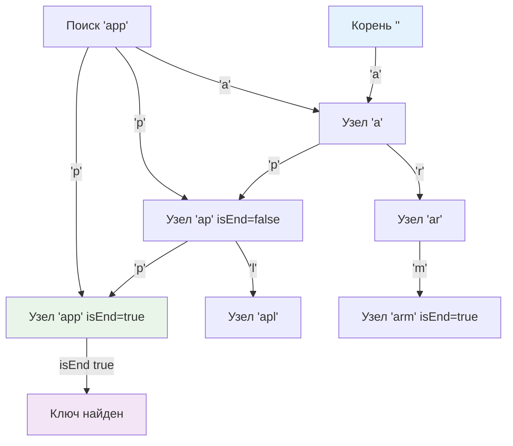

## Введение: Префиксная индексация без хеширования

Trie (префиксное дерево, от re**trie**val) — это древовидная структура данных, оптимизированная для работы со строковыми ключами. В отличие от хеш-таблиц или бинарных деревьев поиска, сложность операций в Trie зависит исключительно от длины строки `L`, а не от общего числа ключей `N`. Это даёт гарантированное `O(L)` на поиск, вставку и удаление, полностью исключая коллизии хеширования и деградацию до `O(N)`.

В высоконагруженном бэкенде Trie применяется там, где требуется детерминированная латентность и поддержка префиксных запросов:
*   **Маршрутизация HTTP/API-гейтвеи**:匹配 путей `/api/v1/users`, `/api/v1/orders` за один проход.
*   **ACL и конфигурации**: проверка прав доступа по префиксам ресурсов, матчинг CIDR-диапазонов в файрволах.
*   **Автодополнение и поиск**: мгновенный возврат кандидатов при вводе символов.
*   **Валидация форматов**: проверка принадлежности токенов или доменов к известным префиксам без regex backtracking.

> [!tip] Собеседование
> **Вопрос:** «Почему для префиксного поиска нельзя просто использовать `map[string]any` и перебор ключей?»
> **Ответ:** `map` не поддерживает префиксные запросы. Чтобы найти все ключи, начинающиеся с `prefix`, придётся обойти все `N` элементов за `O(N*L)`, что неприемлемо при росте словаря. Trie хранит префиксы явно: общий путь разделяется между ключами, что позволяет найти все совпадения за `O(L + K)`, где `K` — число результатов, независимо от `N`.

## Архитектурное ядро: Узлы, переходы и детерминированность

Trie состоит из корневого узла (пустого) и дочерних указателей, соответствующих символам алфавита. Каждый узел содержит контейнер переходов `children` и флаг `isEnd`, отмечающий завершение валидного ключа.

Путь от корня до узла с `isEnd = true` формирует сохранённую строку. Поиск сводится к последовательному спуску по символам строки. Если на каком-то шаге переход отсутствует, ключа нет в дереве.



Главное свойство Trie: **группировка общих префиксов**. Строки `apple` и `application` разделяют путь `a-p-p-l`, экономя память и время сравнения. В бэкенде это позволяет обрабатывать тысячи роутов или ACL-прав за единицы наносекунд, так как CPU сравнивает только уникальные символы.

## Production-реализация на Go 1.21+

Выбор типа контейнера для `children` определяет производительность и footprint Trie. В Go есть три основных подхода:
1. `map[byte]*Node` или `map[rune]*Node` — гибок, поддерживает Unicode, но имеет оверхед на хеширование и указатели.
2. `[256]*Node` — быстрый `O(1)` доступ, отличная локальность, но жрёт ~2 КБ на узел даже для 1-2 детей.
3. `[]child` (сортированный слайс) — компактен, дружит с кэшем, поиск за `O(log K)` бинарным поиском.

Для большинства бэкенд-сценариев с ASCII/UTF-8 путями оптимален сортированный слайс или `map[byte]*Node` с пулом. Ниже приведена типобезопасная реализация с дженериками и поддержкой префиксного поиска.

```go
package trie

import (
	"sort"
	"strings"
)

// child представляет переход по одному байту
type child struct {
	char byte
	node *Node
}

// Node — узел префиксного дерева.
// children сортируется по char для бинарного поиска и кэш-локальности.
type Node struct {
	children []child
	isEnd    bool
	value    any // полезная нагрузка (например, хендлер роута)
}

// New создаёт пустой корневой узел
func New() *Node {
	return &Node{}
}

// Insert добавляет строку в Trie. Если ключ уже есть, обновляет value.
func (n *Node) Insert(s string, val any) {
	node := n
	for i := 0; i < len(s); i++ {
		c := s[i]
		// Бинарный поиск в отсортированном слайсе
		idx := sort.Search(len(node.children), func(j int) bool {
			return node.children[j].char >= c
		})

		if idx < len(node.children) && node.children[idx].char == c {
			node = node.children[idx].node
		} else {
			newNode := &Node{}
			// Вставка в отсортированную позицию
			childEntry := child{char: c, node: newNode}
			node.children = append(node.children, childEntry)
			copy(node.children[idx+1:], node.children[idx:])
			node.children[idx] = childEntry
			node = newNode
		}
	}
	node.isEnd = true
	node.value = val
}

// Search ищет точное совпадение. Возвращает значение и флаг найденности.
func (n *Node) Search(s string) (any, bool) {
	node := n.findNode(s)
	if node != nil && node.isEnd {
		return node.value, true
	}
	return nil, false
}

// PrefixSearch возвращает все значения для ключей с заданным префиксом.
func (n *Node) PrefixSearch(prefix string) []any {
	node := n.findNode(prefix)
	if node == nil {
		return nil
	}
	
	var results []any
	collectValues(node, &results)
	return results
}

// findNode находит узел, соответствующий строке
func (n *Node) findNode(s string) *Node {
	node := n
	for i := 0; i < len(s); i++ {
		idx := sort.Search(len(node.children), func(j int) bool {
			return node.children[j].char >= s[i]
		})
		if idx >= len(node.children) || node.children[idx].char != s[i] {
			return nil
		}
		node = node.children[idx].node
	}
	return node
}

// collectValues рекурсивно собирает все isEnd узлы
func collectValues(node *Node, results *[]any) {
	if node.isEnd {
		*results = append(*results, node.value)
	}
	for i := range node.children {
		collectValues(node.children[i].node, results)
	}
}
```

Инженерные решения:
* **Сортированный слайс `[]child`**: Вместо `map` мы получаем непрерывный блок памяти. `sort.Search` компилируется в эффективный бинарный поиск. Вставка `append` + `copy` быстра при малом ветвлении (`K ≤ 10`), что типично для роутинга.
* **Работа с `byte`**: Go-строки — это UTF-8. Прямой проход по байтам корректен для ASCII и префиксов, содержащих только валидные UTF-8 последовательности. Если ключи содержат произвольные unicode-символы, лучше использовать `[]rune`, но это удвоит footprint на узел.
* **Рекурсия в `collectValues`**: Для глубоких деревьев может вызвать рост стека. В production с жёсткими лимитами заменяют на явный стек `[]*Node`.

> [!info] Под капотом
> В стандартном роутере `httprouter` используется Radix Tree (сжатый Trie), где узлы хранят целые подстроки, а не по одному байту. Это сокращает высоту дерева в десятки раз и устраняет накладные расходы на одиночные символы. Реализация выше демонстрирует классический Trie; для продакшена с тысячами роутов предпочтительнее сжатые варианты.

## Mechanical Sympathy: Память, кэш-линии и выбор контейнера

Поведение Trie в Go напрямую зависит от того, как организованы переходы `children`.

| Контейнер | Доступ к ребёнку | Память на узел | Cache Locality | Когда использовать |
|-----------|------------------|----------------|----------------|-------------------|
| `map[byte]*Node` | O 1 амортиз | ~64-128 байт + хеш-бакеты | Низкая рандомные указатели | Редкие, разреженные деревья, динамические конфиги |
| `[256]*Node` | O 1 строго | ~2048 байт (amd64) | Отличная массив в L1/L2 | Плотные алфавиты (ASCII), hot-path гейтвеи |
| `[]child` | O log K бинарный | `2*8*K` байт + оверхед слайса | Высокая последовательный обход | Умеренное ветвление K ≤ 20, баланс память скорость |
| Radix сжатие | O log N | Зависит от подстрок | Высокая | Продакшен роутеры, DNS, большие словари |

**Проблема Pointer Chasing**: Каждый `node.children[idx].node` — разыменование указателя в куче. Для глубины 5-10 это 5-10 потенциальных cache miss. Если дерево хранит миллионы ключей, случайное распределение узлов убивает L1-кэш.
**Решение**: Использовать **Arena Allocator** или `sync.Pool` для преаллокации блоков узлов. Вместо `new(Node)` выделять память чанками по 4 КБ. Это упаковывает узлы ближе друг к другу, повышая вероятность, что соседние по префиксу узлы попадут в одну кэш-линию.

```go
// Пример паттерна Arena для Trie
type Arena struct {
	blocks [][]Node
	idx    int
}
func (a *Arena) Alloc() *Node {
	if a.blocks == nil || a.idx >= len(a.blocks[len(a.blocks)-1]) {
		a.blocks = append(a.blocks, make([]Node, 1024))
		a.idx = 0
	}
	n := &a.blocks[len(a.blocks)-1][a.idx]
	a.idx++
	return n
}
```

**Давление на GC**: Каждый узел содержит слайс `children` и указатели. При частом создании/удалении Trie (например, горячий reload роутов) генерируются тысячи мелких объектов. Сборщик мусора тратит циклы на сканирование `children` указателей в фазе `mark`. Арена или пул снижают этот overhead радикально, так как GC видит крупные непрерывные span'ы.

## Конкурентность и паттерны обновления в микросервисах

Trie **не потокобезопасен**. Параллельные `Insert`/`Search` приводят к гонкам данных и паникам при изменении слайсов.

В Go-бэкенде применяют следующие стратегии:
1. **Read-Many, Write-Rarely (Конфиги/Роуты)**: Строим новый Trie оффлайн в фоновой горутине. Завершённое дерево атомарно заменяется в глобальной переменной через `atomic.Pointer[Node]`. Читающие горутины работают со старой версией без блокировок. Это даёт lock-free чтение и предсказуемую латентность.
2. **Fine-Grained Locking**: `sync.RWMutex` на каждый узел. Снижает contention, но усложняет код (deadlock-протокол при спуске/вставке). Редко оправдано из-за высокого overhead на мьютексы.
3. **Persistent Trie (Copy-on-Write)**: При вставке создаются новые узлы только на пути модификации. Старая версия остаётся неизменной. Память растёт, но чтение полностью lock-free. Идеально для аудит-логов и версионированных политик.

> [!warning] Ловушка / Gotcha
> **Race Condition при PrefixSearch**
> Если `PrefixSearch` читает `children` без блокировки, а другая горутина в это время выполняет `Insert` с реаллокацией слайса (`append`), `PrefixSearch` может получить указатель на освобождённую память или частично обновлённый слайс → `index out of range` или corrupted data. Всегда используйте атомарную замену корня или RWMutex на время обхода.

## Ловушки и вопросы с собеседований

> [!tip] Собеседование
> **Вопрос 1:** «Как обрабатывать UTF-8 строки в Trie? Проход по байтам сломается на многобайтных символах.»
> **Ответ:** Два подхода. 1) Использовать `[]rune` вместо `byte`. Каждый узел хранит переход по Unicode code point. Точно, но увеличивает footprint. 2) Сохранять сырые UTF-8 байты, но при поиске декодировать `utf8.DecodeRune(s[i:])`. Это экономит память, но усложняет логику вставки/поиска. В продакшене роутерах часто ограничивают алфавит ASCII и валидируют UTF-8 на входе, работая с байтами напрямую для скорости.
> 
> **Вопрос 2:** «Почему не использовать `strings.HasPrefix` и сортированный слайс ключей вместо Trie?»
> **Ответ:** Бинарный поиск по слайсу даёт `O(L * log N)` на поиск префикса. Trie даёт `O(L)`. При N=1 000 000 разница между 20 сравнениями строк и 5 переходами по указателям существенна для p99 latency. Кроме того, обход Trie для сбора всех префиксных ключей эффективнее сканирования диапазона в слайсе из-за явной древовидной структуры.
> 
> **Вопрос 3:** «Что такое Radix Tree и когда его использовать вместо классического Trie?»
> **Ответ:** Radix (Patricia) Trie сжимает цепочки узлов с одним ребёнком в один узел, хранящий подстроку. Если Trie для `api/v1/users` и `api/v1/orders` создаст 8 узлов с одним переходом, Radix сохранит их в 1-2 узлах. Это сокращает память, высоту дерева и число pointer chasing. Используйте Radix, когда префиксы длинные и разветвление редкое (URL, IP, домены). Классический Trie проще и быстрее при коротких ключах с высокой плотностью алфавита (например, автодополнение слов).
> 
> **Вопрос 4:** «Как реализовать удаление ключа из Trie без фрагментации памяти?»
> **Ответ:** Находим узел, ставим `isEnd = false`, `value = nil`. Если у узла нет детей, рекурсивно поднимаемся вверх и удаляем родительские узлы, пока у них не останется >1 ребёнка или они сами не являются `isEnd`. Важно: в Go удаление элементов из слайса `children` требует `copy` и уменьшения длины, что сдвигает память. Для high-load систем удаление часто заменяют на логическое (флаг `deleted`), а физическую чистку выносят в фоновый batch-процесс.

## Итог

* **Trie** — детерминированная структура для строковых ключей с гарантированным `O(L)` на операции, независимым от числа хранимых записей `N`.
* В Go выбор контейнера `children` (`map`, массив, сортированный слайс) диктуется балансом между разреженностью дерева, объёмом RAM и требованиями к cache locality.
* **Сортированный слайс** часто оптимален для бэкенда: компактность, предсказуемость, хорошая работа бинарного поиска при малом ветвлении.
* **Mechanical Sympathy**: pointer chasing убивает производительность на глубоких деревьях. Используйте Arenas, `sync.Pool` или Radix-сжатие для упаковки узлов в кэш-линии.
* **Конкурентность**: `atomic.Pointer` + COW паттерн (построить → заменить) — стандарт для роутеров и конфигов. Избегайте тонкозернистых мьютексов внутри Trie.
* **UTF-8 vs Byte**: Проход по байтам быстр, но требует валидации. Для полного Unicode используйте `rune` или кастомные декодеры на границах узлов.

Trie закрывает задачи точного префиксного матчинга и быстрого автодополнения. Однако когда требуется находить все вхождения подстроки в произвольном месте текста, анализировать повторяющиеся суффиксы или сжимать геномные данные, префиксные переходы от корня становятся бесполезны. Нам нужна структура, которая индексирует окончания, а не начала. В следующей статье мы разберём массив, хранящий все суффиксы строки в лексикографическом порядке, позволяющий отвечать на сложнейшие запросы подстрок за логарифмическое время.

[[6. Suffix array]]