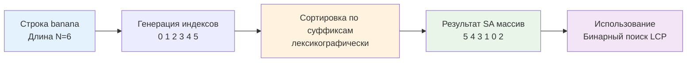

## Введение: Пространство против Времени

В предыдущей статье мы разобрали [[5. Trie для строк]] — структуру, идеальную для префиксных запросов. Но Trie требует хранения узлов с указателями, что при работе с большими текстами или бинарными данными приводит к колоссальному оверхеду памяти. Суффиксное дерево (Suffix Tree) решает проблему произвольного поиска подстрок за линейное время, но его реализация сложна, а потребление памяти в 10-20 раз превышает размер исходной строки.

Suffix Array (Массив Суффиксов) — это элегантная альтернатива. Это просто **отсортированный массив индексов**, указывающих на начала всех суффиксов строки. Вместо указательной паутины мы получаем компактный слайс `[]int`, который легко сериализуется, дружит с кэш-линиями CPU и позволяет решать сложнейшие строковые задачи: поиск подстроки, нахождение最长шего повторяющегося фрагмента, вычисление LCP (Longest Common Prefix) и сжатие данных (BWT).

> [!tip] Собеседование
> **Вопрос:** «Зачем использовать Suffix Array, если есть `strings.Index` или `regexp`?»
> **Ответ:** `strings.Index` работает за `O(N*M)` в худшем случае и ищет одно вхождение. `regexp` может деградировать при backtracking. Suffix Array строится за `O(N log N)` один раз, но затем позволяет находить **любое** количество паттернов за `O(M log N)` с помощью бинарного поиска. Для систем, где строка статична, а запросов много (поисковые движки, анализ генома, лог-агрегаторы), Suffix Array даёт предсказуемую производительность без аллокаций на каждый поиск.

## Математическое определение и инвариант

Для строки `S` длины `n` массив суффиксов `SA` — это перестановка чисел от `0` до `n-1`, такая что суффиксы `S[SA[0]..n-1]`, `S[SA[1]..n-1]`, ..., `S[SA[n-1]..n-1]` отсортированы в лексикографическом порядке.

Пример для `banana$` (`$` — терминальный символ, меньше любого другого):
Суффиксы: `a$`, `ana$`, `anana$`, `banana$`, `na$`, `nana$`
Отсортированные индексы `SA`: `[6, 5, 3, 1, 4, 2]` (индексы начал: `$`, `a$`, `ana$`, `banana$`, `na$`, `nana$`).



Ключевой инвариант: `SA` содержит только целые числа. Нет указателей, нет структур. Это массив плотных данных, который идеально ложится на архитектуру современных процессоров.

## Построение: От наивного к O(N log N)

Наивный подход: создать слайс всех суффиксов, отсортировать его. 
Сложность: создание `n` строк занимает `O(N²)` памяти (даже с учётом sharing, Go создаёт заголовки строк). Сравнение двух строк может занять `O(N)`. Итог: `O(N² log N)`. Неприемлемо для `N > 10⁴`.

### Алгоритм удвоения Doubling Algorithm
Идея: сортируем суффиксы по префиксам длины 1, 2, 4, 8, ..., пока длина не превысит `n`.
На шаге `k` у нас уже есть ранги всех подстрок длины `2^k`. Чтобы отсортировать по длине `2^{k+1}`, каждая подстрока представляется как пара `(rank[i], rank[i + 2^k])`. Сортируем эти пары. Поскольку ранги лежат в диапазоне `[0, n]`, сортировку можно выполнить за `O(N)` (radix sort) или `O(N log N)` (стандартная сортировка).

Общая сложность: `O(N log² N)` при использовании `sort.Slice`, или `O(N log N)` с radix sort. Для продакшена в Go часто выбирают `O(N log² N)` за счёт простоты и отсутствия ручного управления памятью, так как константы компилятора Go малы.

## Production-реализация на Go 1.21+

Реализуем построение Suffix Array и вычисление LCP-массива (Longest Common Prefix). LCP необходим для большинства прикладных задач.

```go
package suffix

import (
	"sort"
)

// SuffixArray строит массив суффиксов для строки s.
// Сложность O N log^2 N, Память O N.
// Использует терминальный символ, меньший любого байта в s.
func SuffixArray(s string) []int {
	n := len(s)
	if n == 0 {
		return nil
	}
	
	// rank хранит ранг подстроки, начинающейся в i, длиной 2^k
	// tmp используется для сортировки пар
	sa := make([]int, n)
	rank := make([]int, n)
	tmp := make([]int, n)
	
	for i := 0; i < n; i++ {
		sa[i] = i
		rank[i] = int(s[i])
	}
	
	for k := 1; k < n; k <<= 1 {
		// Сортируем по парам (rank[i], rank[i+k])
		// Вместо создания структур используем сравнение на лету
		sort.Slice(sa, func(i, j int) bool {
			r1, r2 := rank[sa[i]], rank[sa[j]]
			if r1 != r2 {
				return r1 < r2
			}
			r1 = -1
			if sa[i]+k < n {
				r1 = rank[sa[i]+k]
			}
			r2 = -1
			if sa[j]+k < n {
				r2 = rank[sa[j]+k]
			}
			return r1 < r2
		})
		
		// Пересчитываем ранги
		tmp[sa[0]] = 0
		for i := 1; i < n; i++ {
			// Сравниваем пары текущих элементов sa
			same := rank[sa[i]] == rank[sa[i-1]]
			if same {
				r1 := -1
				if sa[i]+k < n { r1 = rank[sa[i]+k] }
				r2 := -1
				if sa[i-1]+k < n { r2 = rank[sa[i-1]+k] }
				same = r1 == r2
			}
			if same {
				tmp[sa[i]] = tmp[sa[i-1]]
			} else {
				tmp[sa[i]] = tmp[sa[i-1]] + 1
			}
		}
		copy(rank, tmp)
		if rank[sa[n-1]] >= n-1 {
			break // Все ранги уникальны
		}
	}
	
	return sa
}

// LCPArray вычисляет массив наибольших общих префиксов за O N.
// Использует алгоритм Касая. Требует инвертированный массив SA для O 1 доступа.
func LCPArray(s string, sa []int) []int {
	n := len(s)
	if n == 0 {
		return nil
	}
	
	lcp := make([]int, n)
	rank := make([]int, n)
	for i := 0; i < n; i++ {
		rank[sa[i]] = i
	}
	
	k := 0
	for i := 0; i < n; i++ {
		if rank[i] > 0 {
			j := sa[rank[i]-1] // Предыдущий суффикс в отсортированном порядке
			for i+k < n && j+k < n && s[i+k] == s[j+k] {
				k++
			}
			lcp[rank[i]] = k
			if k > 0 {
				k--
			}
		}
	}
	return lcp
}
```

Инженерные решения:
* **Алгоритм Касая**: Позволяет вычислить LCP за `O(N)`, используя свойство, что `LCP(rank[i]) ≥ LCP(rank[i-1]) - 1`. Это убирает необходимость повторного сравнения символов с начала.
* **Память**: Создаём 3-4 массива `int` размером `N`. Для `N=10⁶` это ~16 МБ RAM. Никаких указателей, никаких аллокаций внутри циклов. Идеально для GC.
* **Сравнение пар**: Вместо упаковки в `struct` использу замыкание в `sort.Slice`. Компилятор Go инлайнит это эффективно, избегая аллокаций замыкания на каждой итерации.

## Mechanical Sympathy: Кэш-линии, TLB и GC

Suffix Array — это пример структуры, которая **уважает железо**.

**Плотность и Cache Locality**
`sa` и `rank` — это непрерывные массивы `int`. При бинарном поиске паттерна в `SA` мы читаем индексы `sa[mid]`, затем `s[sa[mid]...]`. Поскольку `sa` компактен, он помещается в L2/L3 кэш. Даже если `s` велик, последовательное сравнение символов `s[sa[mid]+k]` выигрывает от аппаратного префетчинга: CPU загружает 64-байтовые линии подряд, пока не найдёт mismatch.

**Давление на GC и аллокации**
В наивной реализации `sort.Slice` мог бы создавать строки `s[i:]`, что генерирует `N` заголовков `StringHeader` в куче. В нашей реализации мы работаем только с индексами `int`. Компилятор видит, что `s` не меняется, и срез `s[i+k]` в цикле сравнения происходит на лету без выделения памяти. Сборщик мусора не видит новых объектов. Паузы `STW` нулевые.

**TLB命中率**
Массив `sa` занимает мало страниц памяти. Переходы по индексам `sa[i]` и `rank[i]` локализованы. В отличие от Trie, где указатели разбросаны по всей куче, Suffix Array минимизирует page faults и TLB miss, что критично для large-page систем и контейнеров с жёсткими memory limits.

> [!info] Под капотом
> В Go 1.21+ компилятор применяет **Escape Analysis** агрессивно. Если вы передаёте `s` по значению в функцию, которая не модифицирует его, слайсы внутри функции не аллоцируют. Однако `sort.Slice` принимает `any` интерфейс до Go 1.21, что могло вызвать боксинг. В современных версиях используйте generics или явные функции сравнения, чтобы избежать `interface{}` overhead, хотя `sort.Slice` уже оптимизирован под это.

## Поиск подстроки и применение в бэкенде

Построив `SA` и `LCP`, мы получаем мощные инструменты:
1. **Поиск паттерна P**: Бинарный поиск по `SA`. Сравниваем `P` с суффиксом `S[SA[mid]...]`. Сложность `O(|P| * log N)`.
2. **Поиск всех вхождений**: После нахождения одного вхождения бинарным поиском, расширяем диапазон влево/вправо, где `LCP >= |P|`.
3. **Longest Repeated Substring**: Максимальное значение в массиве `LCP`.
4. **Counting Distinct Substrings**: `Σ (N - SA[i] - LCP[i])`.

```go
// FindOccurrences возвращает индексы всех вхождений pattern в s.
// Требует предвычисленный sa и lcp.
func FindOccurrences(s string, sa, lcp []int, pattern string) []int {
	n := len(s)
	m := len(pattern)
	if m == 0 || n == 0 {
		return nil
	}
	
	// Бинарный поиск левой границы
	l, r := 0, n
	for l < r {
		mid := l + (r-l)/2
		idx := sa[mid]
		// Сравнение паттерна с суффиксом
		cmp := 0
		for i := 0; i < m && idx+i < n; i++ {
			if pattern[i] < s[idx+i] { cmp = -1; break }
			if pattern[i] > s[idx+i] { cmp = 1; break }
		}
		if cmp < 0 || (cmp == 0 && m > n-idx) {
			l = mid + 1
		} else {
			r = mid
		}
	}
	start := l
	
	// Бинарный поиск правой границы
	l, r = start, n
	for l < r {
		mid := l + (r-l)/2
		idx := sa[mid]
		cmp := 0
		for i := 0; i < m && idx+i < n; i++ {
			if pattern[i] < s[idx+i] { cmp = -1; break }
			if pattern[i] > s[idx+i] { cmp = 1; break }
		}
		if cmp > 0 || (cmp == 0 && m > n-idx) {
			r = mid
		} else {
			l = mid + 1
		}
	}
	end := l
	
	if start >= end {
		return nil
	}
	
	res := make([]int, 0, end-start)
	for i := start; i < end; i++ {
		res = append(res, sa[i])
	}
	return res
}
```

> [!warning] Ловушка / Gotcha
> **Границы сравнения и паника index out of range**
> В цикле сравнения `pattern[i] < s[idx+i]` всегда проверяйте `idx+i < n`. Если паттерн длиннее суффикса, но совпадает с ним полностью, суффикс считается меньше паттерна. Ошибка здесь приводит к чтению за пределами строки или бесконечному циклу бинарного поиска. В production используйте вспомогательную функцию `compareSubstring` с явным возвратом `-1, 0, 1`.
>
> **Терминальный символ**
> Если в строке возможны все байты `0x00..0xFF`, алгоритм удвоения может вести себя некорректно без явного разделителя, который гарантированно меньше всех символов. Для бинарных данных используйте `uint8` с кастомным сравнением или добавьте виртуальный `0xFF` в конец, обрабатывая его как больший элемент.

## Интервью и хардкор-вопросы

> [!tip] Собеседование
> **Вопрос 1:** «Как ускорить построение Suffix Array до O N?»
> **Ответ:** Использовать алгоритмы SA-IS или DC3. Они работают за линейное время, но крайне сложны в реализации и отладке. В продакшене обычно выбирают O N log N или O N log^2 N из-за баланса сложности и производительности. Разница в 2-3x компенсируется простотой кода и меньшим количеством багов.
> 
> **Вопрос 2:** «Почему LCP считается за O N, а не за O N log N или O N^2?»
> **Ответ:** Алгоритм Касая использует инвариант: `LCP(rank[i]) ≥ LCP(rank[i-1]) - 1`. Мы не начинаем сравнение с нуля, а продолжаем с `k-1`. Каждый символ строки сравнивается успешно не более `N` раз суммарно, а неуспешно — ровно 1 раз на шаг внешнего цикла. Итого `2N` операций сравнения.
> 
> **Вопрос 3:** «Можно ли использовать Suffix Array для поиска паттерна с wildcards или приближённого поиска?»
> **Ответ:** Нет, бинарный поиск требует точного лексикографического сравнения. Для wildcards или edit distance нужны специализированные структуры (FM-index, Burrows-Wheeler Transform) или алгоритмы динамического программирования. Suffix Array — инструмент для точного матчинга.
> 
> **Вопрос 4:** «Сравните память Suffix Array и Suffix Tree для строки 100 МБ.»
> **Ответ:** SA: массив `[]int32` займёт ~400 МБ. Suffix Tree: каждый узел имеет указатели, метки рёбер, метаданные. Оверхед ~10-20x, то есть 2-4 ГБ, плюс фрагментация кучи. SA выигрывает в 5-10 раз по памяти и проще сериализуется на диск.

## Итог

* **Suffix Array** — компактная альтернатива Suffix Tree, представляющая собой отсортированный массив индексов суффиксов.
* Построение за **O N log^2 N** через алгоритм удвоения практично и реализуемо. **Алгоритм Касая** вычисляет LCP за строго **O N**.
* В Go реализация работает с **непрерывными массивами int**, минимизируя аллокации, давление на GC и улучшая cache locality. Срез строк `s[i:]` не копирует байты, что экономит память.
* **Применение**: точный поиск паттернов за `O M log N`, подсчёт уникальных подстрок, нахождение longest repeat. Не подходит для fuzzy search.
* **Интервью фокус**: знание Kasai's algorithm, инвариантов удвоения, сравнение памяти с Trie/Tree.
* **Production паттерн**: преаллокация `[]int`, явные проверки границ в бинарном поиске, использование терминальных символов для корректной сортировки.

Suffix Array покрывает задачи точного поиска и анализа повторяющихся фрагментов с минимальным расходом памяти. Однако когда требуется навигация по структуре подстрок, вставка/удаление символов или более сложные операции над суффиксами, массив индексов становится слишком статичным. В таких случаях инженеры возвращаются к указательным структурам, но уже оптимизированным для сжатия. В следующей статье мы детально разберём структуру, которая объединяет мощь Trie и эффективность массива, устраняя цепочки узлов с одним потомком и становясь стандартом для маршрутизаторов и поисковых движков.

[[7. Suffix tree]]