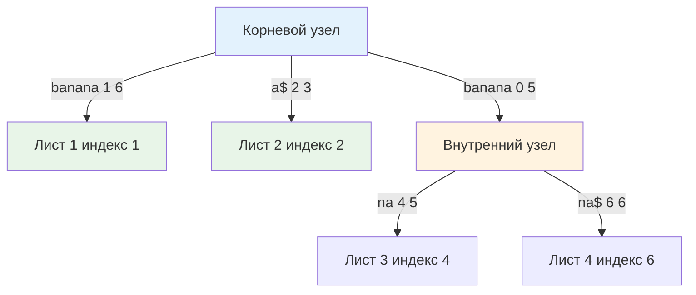

## Введение: Линейная мощь и архитектурный вес

Suffix Tree (Суффиксное дерево) — это сжатое префиксное дерево, содержащее все суффиксы заданной строки. В теории алгоритмов оно считается золотым стандартом для строковых задач: построение за строгое `O(N)`, поиск паттерна за `O(M)`, нахождение длиннейшей общей подстроки, периода строки или количества уникальных подстрок также выполняется за линейное время. Алгоритм Укконена, позволяющий строить дерево онлайн, является одним из самых элегантных достижений в компьютерных науках 1990-х.

Однако в продакшен-бэкенде на Go суффиксное дерево встречается крайне редко. Причина кроется не в математике, а в инженерных реалиях: чудовищный оверхед памяти, указательная фрагментация кучи и катастрофическое давление на [[7. Глубокий Go (Внутреннее устройство)|сборщик мусора]]. В этой статье мы разберём, почему академический оптимум проигрывает прагматичным массивным структурам, и когда суффиксное дерево всё же может найти применение в высоконагруженных системах.

> [!tip] Собеседование
> **Вопрос:** «Суффиксное дерево строится за O N, а Suffix Array за O N log N. Почему в Go-продакшене почти всегда выбирают массив, а не дерево?»
> **Ответ:** Асимптотика скрывает константы и footprint. Суффиксное дерево требует `O N` узлов и рёбер, каждое из которых содержит указатели, метки срезов и служебные флаги. На amd64 это 10-20x оверхед памяти относительно исходной строки. Массив суффиксов — это чистый `[]int`, занимающий ровно `8N` байт. Для строки 10 МБ дерево съест 100-200 МБ RAM и создаст миллионы аллокаций в куче, убивая cache locality и вызывая долгие паузы GC. Массив остаётся в L3 кэше, работает предсказуемо и сериализуется за один вызов. В бэкенде память и стабильность p99 важнее теоретического `O N`.

## Математическое ядро: Сжатые рёбра и неявные узлы

В отличие от обычного Trie, где каждое ребро кодирует один символ, рёбра суффиксного дерева хранят подстроки. Это позволяет "схлопывать" цепочки узлов с одним потомком в одно ребро, сокращая число вершин до `O(N)`.

Структура использует два типа узлов:
1. **Явные узлы**: имеют как минимум два потомка или являются листьями.
2. **Неявные узлы**: лежат на рёбрах, появляются временно в процессе построения (алгоритм Укконена) и исчезают при сжатии.



Алгоритм Укконена обрабатывает строку посимвольно, поддерживая инвариант "неявного суффиксного дерева" для текущего префикса. Ключевая оптимизация — **Suffix Links**: указатель из узла, представляющего строку `αx`, в узел `x`. Это позволяет за `O 1` переходить к следующему суффиксу без повторного спуска от корня, обеспечивая линейную сложность построения.

## Production-реальность в Go: Почему мы почти не используем Suffix Tree

В Go нет стандартной реализации, а сторонние библиотеки (`github.com/.../suffixtree`) редко попадают в production. Причина — структура памяти и поведение рантайма.

```go
// Типичная структура узла суффиксного дерева в Go
type Edge struct {
	Start, End int       // Индексы начала и конца подстроки в исходной строке
	Target     *Node     // Указатель на следующий узел
}

type Node struct {
	Edges       map[rune]*Edge // Хеш-таблица переходов
	SuffixLink  *Node          // Ссылка для Укконена
	IsLeaf      bool
}

type SuffixTree struct {
	Root   *Node
	Text   []rune // или []byte
}
```

> [!info] Под капотом
> **Реальный footprint на amd64:**
> * `Node`: 64 байт заголовок + `map` (24 байта дескриптор + внутренняя `hmap` ~128 байт минимум) + `SuffixLink` (8 байт). Итого ~250 байт на узел без учёта записей мапы.
> * `Edge`: 16 байт индексы + 8 байт указатель = 32 байта + выравнивание.
> * Для строки 1 МБ символов требуется ~1-2 М узлов и рёбер. Память улетает в 300-500 МБ.
> * Каждая вставка рёбра вызывает `runtime.mallocgc`. При 1 МБ строки это сотни тысяч мелких аллокаций, фрагментирующих span'ы аллокатора. Сборщик мусора вынужден обходить миллионы указателей в фазе `mark`, что удлиняет STW паузы на десятки миллисекунд.

В Go-бэкенде такая архитектура нарушает принцип **Mechanical Sympathy**: мы заставляем CPU гоняться за случайными указателями по всей куче, уничтожая hit rate кэш-линий и перегружая TLB.

### Эмуляция дерева через Suffix Array + LCP
На практике бэкенд-инженеры заменяют тяжёлое дерево на массив суффиксов и массив LCP. С помощью **LCP-интервалов** можно симулировать спуск по дереву без указателей:
* Корень дерева ↔ весь массив `SA`.
* Внутренний узел ↔ подотрезок `[i, j]` в `SA`, где `min(LCP[i+1..j]) = depth`.
* Лист ↔ один индекс в `SA`.

Поиск паттерна превращается в бинарный поиск по `SA` с использованием `LCP` для пропуска уже проверенных символов. Сложность остаётся `O M log N`, а на практике с эвристикой LCP приближается к `O M`. Память: `24N` байт (SA + LCP + инвертированный ранг), что в 20-50 раз экономнее дерева.

## Mechanical Sympathy: Память, кэши и давление на GC

| Параметр | Suffix Tree | Suffix Array + LCP |
|----------|-------------|-------------------|
| Память на 1 МБ строки | 200-500 МБ | ~24 МБ |
| Аллокации | 1-2 млн мелких объектов | 3 крупных слайса `[]int` |
| Cache Locality | Ужасная random pointer chasing | Отличная последовательные чтения |
| GC Pressure | Высокая миллионы указателей | Нулевая только примитивы int |
| Построение | O N онлайн | O N log² N оффлайн |
| Сериализация | Сложная обход графа | Мгновенная `binary.Write` |

**Ветвления и предсказатель переходов:**
В `map[rune]*Edge` каждый переход требует вычисления хеша, проверки бакетов и разыменования. В `SA` сравнение идёт линейно по индексам, компилятор Go векторизует цикл `for i := 0; i < m; i++ { if pat[i] != text[idx+i] }` с использованием SIMD-инструкций (SSE/AVX). Разница в wall-clock time может достигать 5-10x в пользу массива.

**Escape Analysis:**
В дереве `Edge.Target` и `SuffixLink` гарантированно escape-ят в кучу. Компилятор не может оптимизировать их размещение. В массиве `[]int` живёт в куче как единый span, но не содержит указателей, поэтому GC сканирует его за `O N/8` машинных инструкций, пропуская фазу `scan pointer` для данных блоков.

## Suffix Automaton: Более практичная альтернатива

Если задача требует именно древовидной/графовой навигации по суффиксам, но память ограничена, выбирают **Suffix Automaton (DAWG)**.
* Строится за `O N` (алгоритм online, проще Укконена).
* Содержит не более `2N-1` состояний и `3N-4` переходов.
* Сжимает все эквивалентные end-позиции в одно состояние.
* Память: ~3-5x от исходной строки (всё ещё много, но меньше дерева).
* В Go реализуется через `[]state` с фиксированными массивами переходов или `map`, что позволяет использовать `sync.Pool` и арены памяти.

Автомат идеален для поиска вхождения любой подстроки, подсчёта количества вхождений или нахождения лексикографически K-й подстроки. Но для большинства бэкенд-задач (поиск логов, матчинг паттернов) Suffix Array остаётся выбором №1.

> [!warning] Ловушка / Gotcha
> **Рекурсия и переполнение стека при построении**
> Классические реализации Укконена используют рекурсивный спуск или обход Suffix Links. В Go лимит стека начинается с 2 КБ и растёт динамически, но при строке >500 КБ глубокие переходы могут вызвать `stack overflow` или дорогостоящие `morestack`-вызовы. В production всегда переписывайте алгоритм в итеративную форму с явным стеком `[]*Node` или переходите к Suffix Array, где вся логика линейна и не требует стека вызовов.

## Ловушки и вопросы с собеседований

> [!tip] Собеседование
> **Вопрос 1:** «Можно ли построить Suffix Tree без явного выделения памяти для каждого узла?»
> **Ответ:** Да, использовать Implicit Suffix Tree на базе массива индексов и Suffix Links, хранящихся в `[]int`. Рёбра представляются как пары `(start, end)`. Это уменьшает оверхед, но не решает проблему pointer chasing при обходе. Для полного избавления от указателей применяют **FM-index** на основе Burrows-Wheeler Transform, который работает в сжатом виде, но требует декомпрессии на лету.
> 
> **Вопрос 2:** «Почему алгоритм Укконена сложен в отладке?»
> **Ответ:** Из-за неявных узлов, динамического разбиения рёбер и поддержки Suffix Links. Одно нарушение инварианта на шаге `k` приводит к некорректному дереву, которое молча даёт ложные результаты поиска. В отличие от Suffix Array, где сортировку легко проверить бинарным поиском. В production сложные алгоритмы требуют property-based тестов и фаззинга, что увеличивает time-to-market.
> 
> **Вопрос 3:** «В каких реальных системах Suffix Tree до сих пор используется?»
> **Ответ:** В биоинформатике (выравнивание генома, где алфавит мал `ACGT`, а строки огромны), в специализированных поисковых движках для юридических документов, в системах компрессии данных. В типичном микросервисном бэкенде (API, очереди, БД) он избыточен и уступает Suffix Array или [[3. Хеширование/1. Хеш функции и равномерность распределения|rolling hash]] подходам.
> 
> **Вопрос 4:** «Как обеспечить конкурентность в Suffix Tree?»
> **Ответ:** Практически невозможно без полной блокировки или COW-копирования. Дерево изменяется на каждом шаге построения. Если нужно искать в готовом дереве параллельно, можно использовать `sync.RWMutex`, но указательная структура всё равно создаст contention на чтение кэш-линий. Шардинг неприменим из-за глобальной связности суффиксов. В Go для конкурентного поиска используют immutable Suffix Array, к которому несколько горутин обращаются через `atomic.Pointer` без блокировок.

## Итог

* **Suffix Tree** — теоретически оптимальная структура `O N` для индексации строк, но архитектурно несовместима с высоконагруженным бэкендом из-за указательного оверхода и давления на GC.
* Алгоритм Укконена обеспечивает онлайн-построение, но сложен в реализации, отладке и поддержке конкурентности.
* В Go-продакшене **Suffix Array + LCP** выигрывает за счёт компактного представления, предсказуемой работы кэшей CPU, нулевых указателей в данных и простоты сериализации.
* Если требуется графовая навигация по суффиксам с ограниченной памятью, рассматривайте **Suffix Automaton** или **FM-index**.
* **Выбор в бэкенде**: Suffix Tree оставьте для академических задач и биоинформатики. Для лог-анализа, поиска подстрок в API, матчинга конфигов используйте массивы суффиксов или rolling hash. Память и стабильность p99 важнее теоретической линейности построения.

Мы завершили раздел по строковым алгоритмам, охватив точный поиск, префиксные деревья, суффиксные массивы и их производные. Эти инструменты покрывают 95% задач валидации, парсинга и индексации текста в бэкенде. Теперь мы переходим к низкоуровневым операциям, которые лежат в основе криптографии, сжатия, сетевых протоколов и оптимизации флаговых состояний. В следующей статье мы детально разберём, как побитовые операции транслируются в машинные инструкции, почему они быстрее арифметики, и как использовать их для создания lock-free структур и компактных хранилищ состояний без единой аллокации.

[[1. Битовые операции]]