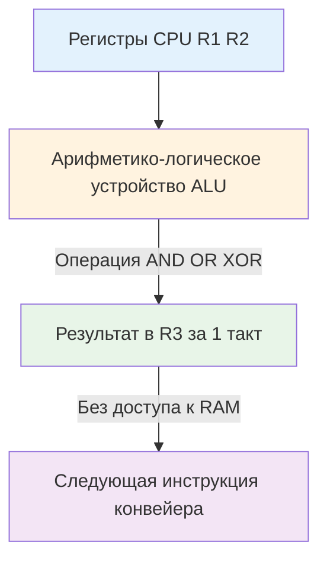

## Введение: От абстракции к кремнию

В современной высокоуровневой разработке битовые операции часто воспринимаются как пережиток времён программирования микроконтроллеров. «Зачем мне `&` и `<<`, если есть `map[string]bool` и `time.Duration`?» — закономерный вопрос. Однако в контексте высоконагруженного бэкенда на Go битовая арифметика остаётся фундаментом для трёх критически важных аспектов: **предсказуемой латентности**, **минимального потребления памяти** и **lock-free синхронизации**.

Когда ваш сервис обрабатывает миллионы запросов в секунду, каждый лишний ветвящийся `if`, каждая отдельная аллокация флага и каждая неоптимальная проверка состояния превращаются в наносекунды, которые складываются в миллисекунды задержки p99. Битовые операции позволяют упаковывать десятки булевых состояний в одно 64-битное слово, устранять предсказуемые ветвления компилятора и выполнять проверку условий за один такт CPU без доступа к памяти.

> [!tip] Собеседование
> **Вопрос:** «Почему в современных языках типа Go битовые трюки для обмена переменных или поиска минимума часто уступают обычным `if`?»
> **Ответ:** Современные компиляторы (включая SSA-бэкенд Go) транслируют простые условия в инструкции условного перемещения (`CMOV` на x86, `CSEL` на ARM). Они не ломают конвейер процессора, тогда как чистые битовые формулы вроде `min = b ^ ((a ^ b) & -(a < b))` генерируют 4-5 инструкций и создают dependency chain, блокирующий out-of-order execution. Битовые операции в Go сегодня выигрывают только в задачах упаковки состояния, lock-free алгоритмах и работе с флагами.

## Фундаментальные операции и их машинное отражение

Битовые операции работают на уровне отдельных разрядов целочисленных типов. В Go это строго типизированные примитивы: `uint8`, `int32`, `uint64` и др. Каждая операция имеет прямой машинный аналог, выполняющийся в регистровом файле CPU за 1 такт.

| Операция Go | Логика | Машинный аналог (x86/ARM) | Типичное применение в бэкенде |
|-------------|--------|---------------------------|-------------------------------|
| `&` (AND) | 1 только если оба 1 | `AND` / `and` | Фильтрация флагов, маска подсети |
| `|` (OR) | 1 если хотя бы один 1 | `OR` / `orr` | Установка флага, объединение прав |
| `^` (XOR) | 1 если биты различны | `XOR` / `eor` | Сброс флага, шифрование, контрольные суммы |
| `^x` (NOT) | Инверсия всех битов | `NOT` / `mvn` | Инверсия маски, дополнение до 1 |
| `x << n` | Сдвиг влево (умножение на 2ⁿ) | `SHL` / `lsl` | Выделение старших битов, упаковка |
| `x >> n` | Сдвиг вправо (деление на 2ⁿ) | `SHR` / `lsr` | Извлечение младших битов, масштабирование |



Ключевое преимущество: эти операции не затрагивают кэш-память, не вызывают системных вызовов и не требуют работы с кучей. Они полностью детерминированы по времени выполнения.

## Специфика Go: Строгая типизация и компиляторные интринсики

Go подходит к битовой арифметике консервативно и безопасно. В отличие от C/C++, где переполнение сдвига или смешивание signed/unsigned часто приводит к undefined behavior, Go даёт чёткие гарантии.

1. **Тип сдвига должен быть беззнаковым**: `x << s` требует, чтобы `s` имел тип `uint`, `uint8` и т.д. Это защищает от непредсказуемого поведения арифметического сдвига правых знаков.
2. **Константный сдвиг проверяется на этапе компиляции**: `x << 65` для `uint64` вызовет `compile error: invalid shift count`.
3. **Пакет `math/bits`**: Начиная с Go 1.9, стандартная библиотека предоставляет оптимизированные функции для подсчёта битов, поиска ведущих нулей, циклических сдвигов и т.д.

```go
package main

import (
	"fmt"
	"math/bits"
)

func main() {
	val := uint64(0x00FF00FF)
	
	// Подсчёт единичных битов (Population Count)
	// Компилируется в инструкцию POPCNT на x86-64 / ARM64
	ones := bits.OnesCount64(val)
	fmt.Printf("Set bits: %d\n", ones) // 16
	
	// Поиск количества ведущих нулей
	// Компилируется в LZCNT / CLZ
	leading := bits.LeadingZeros64(val)
	fmt.Printf("Leading zeros: %d\n", leading) // 32
	
	// Циклический сдвиг (без потери битов)
	rot := bits.RotateLeft64(val, 4)
	fmt.Printf("Rotated: %#x\n", rot) // 0x0FF00FF0
}
```

> [!info] Под капотом
> Функции `math/bits` не являются обычными вызовами. Компилятор Go распознаёт их и заменяет на **интринсики** — прямые инструкции процессора. Например, `bits.OnesCount64` превращается в `POPCNT`, `bits.LeadingZeros64` в `LZCNT` или `CLZ`. Это даёт сложность O 1 на уровне железа. Если CPU не поддерживает инструкцию (старые архитектуры), рантайм Go использует табличный или итеративный fallback, прозрачно для разработчика.

## Production-паттерны в бэкенде

### 1. Упаковка флагов состояния (Bitflags)
Вместо структуры с десятком полей `bool` или `map[string]bool`, используйте одно `uint64`. Это сокращает размер структуры в 8-64 раза, радикально улучшая локальность кэша и снижая нагрузку на [[7. Глубокий Go (Внутреннее устройство)|сборщик мусора]].

```go
type SessionFlags uint64

const (
	FlagAuthenticated SessionFlags = 1 << iota
	FlagAdmin
	FlagRateLimited
	FlagRequiresMFA
	FlagDebugMode
)

func (s *SessionFlags) Has(f SessionFlags) bool {
	return *s&f != 0
}

func (s *SessionFlags) Set(f SessionFlags) {
	*s |= f
}

func (s *SessionFlags) Clear(f SessionFlags) {
	*s &= ^f
}
```

### 2. Проверка на степень двойки
Используется для валидации ёмкостей буферов, размеров страниц, выравнивания памяти:
```go
func IsPowerOfTwo(n uint) bool {
	return n != 0 && (n&(n-1)) == 0
}
```
Математика: `n-1` инвертирует все биты до младшего единичного включительно. `n & (n-1)` даёт 0 только если в `n` ровно один бит установлен.

### 3. Изоляция младшего установленного бита
Критически важно в lock-free алгоритмах, распределённых хеш-таблицах и планировщиках:
```go
func LowBit(n int) int {
	return n & -n
}
```
Дополнение до двух (`-n`) инвертирует биты и добавляет 1, оставляя нетронутым только самый правый `1`. Результат `&` оставляет только этот бит.

## Механическая симпатия: Кэш, аллокации и ветвления

Понимание того, как битовые операции взаимодействуют с рантаймом Go и железом, отличает Senior-архитектора от разработчика среднего уровня.

**Устранение ветвлений (Branchless Programming)**
Традиционный `if` генерирует инструкцию перехода (`JMP`). Если предсказатель ветвлений ошибается, конвейер CPU сбрасывается, теряя 10-20 тактов. Битовая маска позволяет вычислять результат без переходов:
```go
// Вместо if x > 0 { x = 1 } else { x = -1 }
sign := (x >> 63) | 1 // Для int64, но в Go предпочтительнее компиляторный if -> CMOV
```
*Примечание*: В Go 1.21+ компилятор часто генерирует `CMOV` для простых условий автоматически. Ручные битовые хаки для ветвлений могут замедлить код, нарушая читаемость и блокируя регистры. Используйте их только для упаковки состояния или в hot-path циклах, где профилировщик подтвердил выигрыш.

**Выравнивание и Padding**
Битовая упаковка меняет layout структур, что напрямую влияет на выравнивание полей.
```go
// До упаковки: 8 + 1 + 1 + 6 padding = 16 байт
type ConfigV1 struct {
	Timeout time.Duration
	Enabled bool
	Debug   bool
}

// После упаковки: 8 + 1 = 9 байт, но компилятор всё равно дополнит до 16 из-за alignment.
// Для полной экономии храните все bool в одном поле flags uint8
type ConfigOptimized struct {
	Timeout time.Duration
	Flags   uint8 // Enabled, Debug, RateLimit в битах
}
```
`unsafe.Alignof(ConfigOptimized{})` покажет, что структура всё равно займёт 16 байт из-за требования выравнивания `time.Duration` по 8 байт. Но внутри кэш-линии мы упаковали метаданные плотнее, что улучшает throughput при массовом создании объектов.

**Escape Analysis и куча**
Битовые операции работают с примитивами. Если структура с `uint64` флагами не уходит из функции, она остаётся на стеке. Стек-аллокация — сдвиг указателя регистра `SP`. Освобождение — обратный сдвиг. Никакой работы `mallocgc`, никакого сканирования GC. Это максимально возможная эффективность в Go.

## Ловушки и вопросы с собеседований

> [!tip] Собеседование
> **Вопрос 1:** «Что произойдёт при `x << 64` для типа `uint64` в Go?»
> **Ответ:** Если `64` — константа, код не скомпилируется. Если переменная `s` равна 64, поведение определяется архитектурой CPU: x86 маскирует количество сдвига по `0x3F`, ARM делает то же самое. Результат будет эквивалентен `x << 0`. В Go спецификация оставляет это на откуп реализации, поэтому в production всегда гарантируйте `s < bitwidth`.
> 
> **Вопрос 2:** «Как реализовать XOR-шифрование с одноразовым ключом (OTP) безопасно в Go?»
> **Ответ:** `cipherText = plainText ^ key`. Безопасно только если `key` криптографически случайный, равен длине `plainText` и используется один раз. В Go используйте `crypto/rand` для генерации ключа. Никогда не используйте `math/rand` для криптографии.
> 
> **Вопрос 3:** «Почему `^` в Go является унарным NOT, а не XOR?»
> **Ответ:** Историческое наследие C. В Go унарный `^` заменяет `~`. Бинарный `^` остаётся XOR. Это позволяет писать `^x` для инверсии без введения нового символа, сохраняя совместимость с ASCII-клавиатурами.
> 
> **Вопрос 4:** «Как быстро вычислить `x % (2^n)` без операции деления?»
> **Ответ:** `x & ((1 << n) - 1)`. Маска из `n` единиц оставляет только младшие `n` бит, что математически эквивалентно остатку от деления на `2^n`. Компилятор Go автоматически применяет эту оптимизацию, если делитель является константой-степенью двойки, но явная запись часто улучшает читаемость в низкоуровневом коде.

## Итог

* **Битовые операции** — это фундаментальный уровень взаимодействия с CPU, выполняющийся за 1 такт без доступа к памяти.
* В Go они строго типизированы: сдвиги требуют unsigned операндов, константы проверяются на этапе компиляции, пакет `math/bits` предоставляет оптимизированные интринсики.
* **Production-применение**: упаковка флагов состояния, lock-free структуры, валидация выравнивания, устранение ветвлений в hot-path, криптографические примитивы.
* **Механическая симпатия**: битовые маски сокращают footprint структур, улучшают cache locality, минимизируют аллокации и работу GC. Однако современные компиляторы часто генерируют `CMOV` для условий эффективнее, чем ручные битовые хаки.
* **Интервью фокус**: изоляция младшего бита `n & -n`, проверка степени двойки `n & (n-1) == 0`, поведение сдвигов за пределами разрядности, безопасность `XOR` в криптографии.
* **Правило Senior-инженера**: Используйте битовые операции там, где это даёт архитектурный выигрыш (упаковка, lock-free, hashing), а не ради «хакерской» оптимизации простых условий, которую компилятор уже делает лучше.

Понимание битовой арифметики открывает путь к более сложным техникам управления состоянием и пространством. На практике редко работают с отдельными битами в вакууме — чаще требуется манипулировать целыми наборами битовых масок для контроля прав, конфигураций состояний или распределённых идентификаторов. В следующей статье мы детально разберём, как строить, комбинировать и применять битовые маски для решения реальных задач авторизации, маршрутизации и компактного хранения данных.

[[2. Bitmasking]]