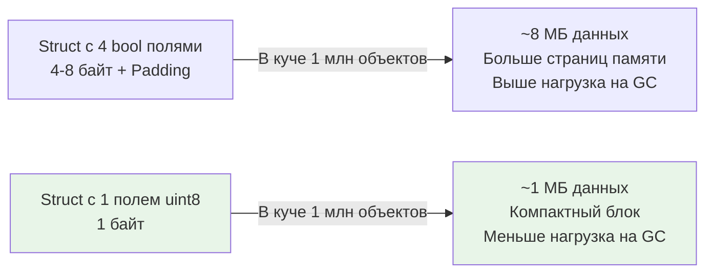

## Введение: Набор свойств как одно целое

В предыдущей статье мы изучили примитивные битовые операции. Теперь мы объединим их в архитектурный паттерн — **Bitmasking** (Битовые маски). Если одиночный бит — это атом, то маска — это молекула, описывающая состояние целой системы. 

В бэкенде маски используются повсеместно, хотя разработчики не всегда осознают это: это права доступа (POSIX-разрешения `rwx`), флаги TCP-пакетов, состояния мьютексов, векторы прерываний процессора и конфигурационные биты в базах данных. Основная идея маскирования — хранить набор булевых значений (свойств, пермиссий, опций) в одном целочисленном регистре, обрабатывая их пакетно, а не по отдельности.

Этот подход радикально упрощает логику сравнения наборов, уменьшает размер структур данных и открывает путь к созданию высокопроизводительных lock-free алгоритмов.

> [!tip] Собеседование
> **Вопрос:** «Как эффективно проверить, обладает ли пользователь одновременно правами A и B, но НЕ имеет права C, используя один вызов процессора?»
> 
> **Ответ:** Используя битовую маску. Если права A, B и C соответствуют битам 0, 1 и 2:
> `if (userMask & 0b011) == 0b011 && (userMask & 0b100) == 0`.
> Это одна инструкция AND, одна проверка на равенство, без переходов и вызовов функций.

## Маска как структура данных для множеств

Битовая маска длины `N` может представлять любое подмножество множества из `N` элементов. Если `i`-й бит установлен в `1`, значит, `i`-й элемент присутствует в множестве; если `0` — отсутствует.

В Go мы оперируем масками с помощью беззнаковых целых: `uint8`, `uint32` или `uint64`.
* `uint8` — до 8 свойств.
* `uint32` — до 32 свойств (стандарт для прав доступа).
* `uint64` — до 64 свойств (покрывает 99% задач конфигурирования сервисов).

### Базовые операции

В Go идиоматично использовать `const` с `iota` и сдвигом для определения масок, а не хардкодить числа. Это делает код самодокументируемым.

```go
package main

import "fmt"

type Permissions uint8

const (
	Read  Permissions = 1 << iota // 0000 0001
	Write                         // 0000 0010
	Delete                        // 0000 0100
	Admin                         // 0000 1000
)

// Set: добавление права (OR)
func (p *Permissions) Add(right Permissions) {
	*p |= right
}

// Clear: удаление права (AND с инверсией)
func (p *Permissions) Remove(right Permissions) {
	*p &^= right // Оператор AND NOT
}

// Check: проверка наличия (AND)
func (p Permissions) Has(right Permissions) bool {
	return p&right != 0
}

func main() {
	var perms Permissions = Read
	perms.Add(Write) // Read | Write
	
	fmt.Printf("Has Write: %v\n", perms.Has(Write)) // true
	fmt.Printf("Has Delete: %v\n", perms.Has(Delete)) // false
}
```

Оператор `&^` (AND NOT) специфичен для Go и крайне удобен для очистки битов без необходимости явно писать `^right`.

## Mechanical Sympathy: Lock-free атомики и кэш

Маскирование — это "серебряная пуля" для оптимизации конкурентности в Go. Когда вам нужно обновить несколько флагов состояния атомарно, вы не можете сделать это безопасно с помощью отдельных полей `bool` без блокировки. Но одно целое число можно обновить одной атомарной инструкцией.

### Атомарное изменение состояния
Представьте сервис, который должен атомарно переключать флаги `IsRunning`, `IsPaused` и `Draining`. Использование мьютекса создаёт contention. Использование `sync/atomic` на маске решает проблему.

```go
import "sync/atomic"

type ServerState uint32

const (
	StateRunning uint32 = 1 << iota
	StateDraining
	StatePaused
)

type Server struct {
    // State хранит все флаги в одном поле
    state atomic.Uint32 
}

func (s *Server) EnterDraining() bool {
    // CAS: Compare And Swap
    // Пытаемся заменить текущее состояние на (current | Draining)
    // Если кто-то изменил состояние между Load и Swap, мы повторим попытку
    for {
        current := s.state.Load()
        // Если уже в режиме паузы или уже draining — отказываем
        if current&(StateDraining|StatePaused) != 0 {
            return false
        }
        // Пытаемся установить бит Draining
        if s.state.CompareAndSwap(current, current|StateDraining) {
            return true
        }
    }
}
```

Здесь маска позволяет модифицировать *один* бит, сохраняя значения остальных, и делать это **lock-free**. Горутины не блокируются, а крутятся в спин-цикле (несколько тактов CPU), что на порядки быстрее системного вызова `futex` при высокой конкуренции.

### Влияние на память и сборщик мусора
Использование маски вместо полей `bool` уменьшает размер структуры.
* `struct { A, B, C, D bool }` — занимает минимум 4 байта, но из-за выравнивания (если рядом есть `int64` или указатели) компилятор может дополнить его до 8 байт.
* `struct { Flags uint8 }` — занимает 1 байт (или столько, сколько нужно для выравнивания всей структуры).

В высоконагруженных сервисах, где создаются миллионы объектов (например, `RequestContext`), экономия 3-7 байт на объект означает сохранение сотен мегабайт RAM. Меньше RAM → меньше работы для [[7. Глубокий Go (Внутреннее устройство)|сборщика мусора]] → меньше пауз STW.



## Production-паттерны: RBAC и Подмножества

### 1. Маски прав доступа (ACL/RBAC)
Вместо хранения `map[string]bool` для ролей, используйте битовые маски. Это позволяет проверять сложные условия за O(1).
Например, проверка: "Есть ли право на запись, ИЛИ (на чтение И администрирование)":
```go
if mask.Has(Write) || (mask.Has(Read) && mask.Has(Admin)) { ... }
// Или битовая магия: (mask & Write) != 0 || (mask & (Read | Admin)) == (Read | Admin)
```
Это работает мгновенно и не требует аллокаций.

### 2. Итерация по подмножествам (Subsets)
В задачах, связанных с перебором комбинаций (например, поиск оптимального набора конфигураций или коммивояжёр в small-N), битовые маски позволяют итерировать все подмножества множества.

Алгоритм `i = (i - 1) & mask` позволяет переходить к следующему подмножеству в лексикографическом порядке убывания без рекурсии.

```go
// Перебор всех подмножеств mask
// Например, mask = 0b101 (5), подмножества: 101, 100, 001, 000
mask := uint(5)
for i := mask; i > 0; i = (i - 1) & mask {
    fmt.Printf("%b\n", i)
}
fmt.Println("0") // Пустое множество
```
В бэкенде это встречается редко, но полезно для задач оптимизации расписаний или выбора набора нод для репликации.

## Ловушки и вопросы с собеседований

> [!tip] Собеседование
> **Вопрос 1:** «Как посчитать количество установленных битов в маске за O(1)?»
> **Ответ:** Использовать функцию `bits.OnesCount64()` из стандартной библиотеки `math/bits`. Она компилируется в процессорную инструкцию `POPCNT` (Population Count) на x86/ARM. Ручная реализация через цикл будет работать за O(k), где k — число бит, что медленнее.
>
> **Вопрос 2:** «Что такое Little Endian и Big Endian в контексте битовых масок при сетевом взаимодействии?»
> **Ответ:** Порядок байт важен при сериализации маски в `[]byte` для отправки по сети. Go использует порядок байт архитектуры (обычно Little Endian на amd64). Если вы отправляете `uint32` маску в сеть, её нужно конвертировать в Network Byte Order (Big Endian) через `binary.BigEndian.PutUint32`, иначе клиент на другой архитектуре прочитает биты в неверном порядке (бит 0 станет битом 24 и т.д.).
>
> **Вопрос 3:** «Можно ли использовать маски для дробных чисел?»
> **Ответ:** Нет, маски применимы только к целочисленным типам. Для плавающей точки битовые паттерны представляют экспоненту и мантиссу (IEEE 754), и манипулирование ими как маской приведёт к некорректным числам, а не к набору булевых свойств.

> [!warning] Ловушка / Gotcha
> **Выход за границы диапазона**
> При использовании `iota` с сдвигом убедитесь, что тип выдержит количество элементов.
> `type Flags uint8; const ( A = 1 << iota; ... Z )`
> Если элементов больше 8, произойдёт переполнение типа, и старшие биты исчезнут. Компилятор Go может этого не заметить, если константы не используются напрямую в выражениях, требующих точности.
>
> **Приоритет операторов**
> Операторы сравнения (`==`, `!=`, `<`) имеют более высокий приоритет, чем битовые.
> `mask & 1 == 0` — это **ошибка**! Сначала вычислится `1 == 0` (false), потом `mask & false` (ошибка типов).
> Всегда пишите `(mask & 1) == 0`.

## Итог

* **Bitmasking** — паттерн хранения набора булевых свойств в одном целом числе.
* Операции `|`, `&`, `^`, `&^` позволяют управлять состоянием атомарно и эффективно.
* В Go маски идеальны для создания **lock-free** структур через `sync/atomic` (CAS операции).
* Они экономят память (плотная упаковка) и улучшают кэш-локальность, снижая нагрузку на GC.
* **Машинные инструкции**: `math/bits` функции транслируются в `POPCNT`, `LZCNT` и другие, давая O(1) производительность.
* **Сетевой обмен**: помните о Big/Little Endian при сериализации масок в байты.

Битовые маски позволяют нам компактно хранить состояния, но как эффективно вычислять состояния, зависящие от степеней? Как быстро возвести число в огромную степень, не переполняя память и не теряя время? В следующей статье мы разберём алгоритм быстрого возведения в степень (Binary Exponentiation), который является основой криптографии (RSA, Diffie-Hellman) и хеширования.

[[3. Быстрое возведение в степень]]