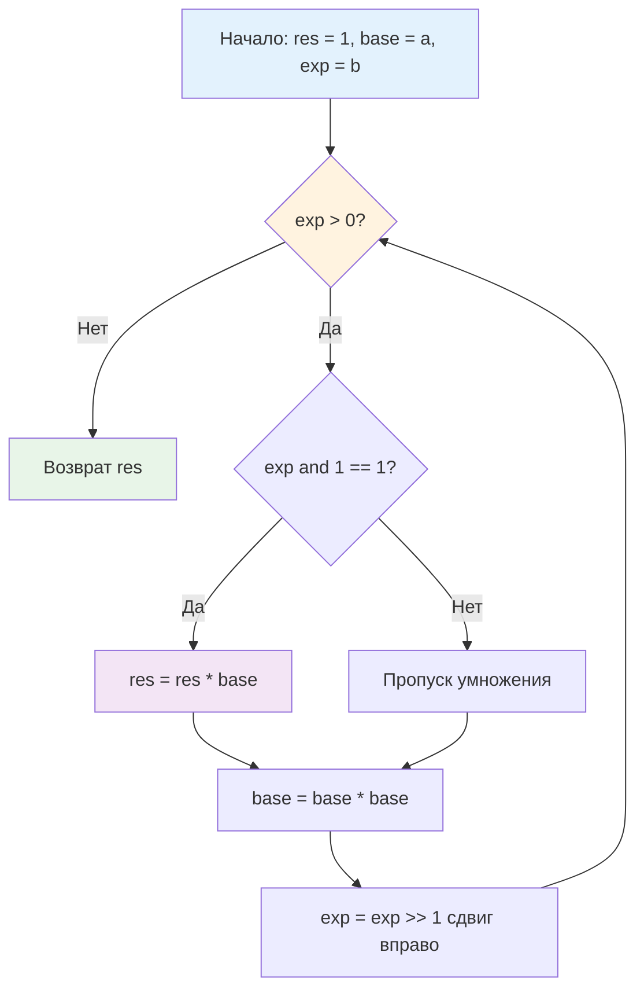

## Введение: Почему линейный подход убивает производительность

Вычисление $a^b$ наивным умножением `res *= a` повторяется `b` раз. Сложность $O(b)$ кажется приемлемой для малых чисел, но в бэкенде и криптографии экспоненты часто достигают $10^{18}$ или 2048-битных значений. При $b = 10^9$ наивный алгоритм выполнит миллиард умножений, что займет сотни миллисекунд и заблокирует системный тред. 

Алгоритм быстрого возведения в степень (Binary Exponentiation или Exponentiation by Squaring) сокращает сложность до $O(\log b)$, используя двоичное представление показателя. Вместо миллиарда операций мы выполняем ~30-60 шагов. Это фундамент криптографических протоколов (RSA, Diffie-Hellman), хеширования, генерации псевдослучайных чисел и вычисления контрольных сумм.

> [!tip] Собеседование
> **Вопрос:** «Как вычислить $a^b \pmod m$ за $O(\log b)$, если $a, b, m$ помещаются в `uint64`, но промежуточное $a^2$ вызывает переполнение?»
> **Ответ:** На каждом шаге возведения в квадрат и умножения необходимо брать остаток от деления на $m$. Поскольку $(x \cdot y) \pmod m = ((x \pmod m) \cdot (y \pmod m)) \pmod m$, мы поддерживаем результат в диапазоне $[0, m-1]$. Для $m$ близкого к $2^{64}$ требуется использовать 128-битную арифметику (`math/big` или ассемблерную инструкцию `MULX`), чтобы избежать overflow до применения `% m`.

## Математическое ядро: Разложение по степеням двойки

Любое число $b$ однозначно представляется в двоичной системе: $b = \sum_{i=0}^{k} b_i \cdot 2^i$, где $b_i \in \{0, 1\}$.
Тогда $a^b = a^{\sum b_i 2^i} = \prod_{b_i=1} a^{2^i}$.

Мы можем последовательно вычислять $a^{2^0}, a^{2^1}, a^{2^2}, \dots$ простым возведением в квадрат на каждом шаге. Если $i$-й бит экспоненты равен 1, мы умножаем текущий результат на $a^{2^i}$.

**Пример:** $a^{13}$, где $13 = 1101_2 = 8 + 4 + 1$.
1. $i=0$, бит=1: $res = a^1$, $base = a^2$
2. $i=1$, бит=0: $res$ не меняется, $base = (a^2)^2 = a^4$
3. $i=2$, бит=1: $res = a^1 \cdot a^4 = a^5$, $base = (a^4)^2 = a^8$
4. $i=3$, бит=1: $res = a^5 \cdot a^8 = a^{13}$, $base = a^{16}$

Всего 4 итерации вместо 12 умножений.



## Production-реализация на Go 1.21+

В реальном бэкенде почти никогда не вычисляют "чистую" степень. Почти всегда требуется **модульная арифметика**. Ниже приведена итеративная, безопасная реализация для `uint64`, которая используется в ядрах маршрутизаторов, генераторах хеш-таблиц и примитивах синхронизации.

```go
package mathalgo

import (
	"math"
)

// PowMod вычисляет (base^exp) % mod за O(log exp).
// Работает корректно только если mod != 0 и base*base не переполняет uint64 до взятия mod.
func PowMod(base, exp, mod uint64) uint64 {
	if mod == 0 {
		panic("powmod: mod cannot be zero")
	}
	if mod == 1 {
		return 0 // Любой остаток от деления на 1 равен 0
	}

	base %= mod
	res := uint64(1)

	for exp > 0 {
		if exp&1 == 1 { // Если младший бит установлен
			res = (res * base) % mod
		}
		base = (base * base) % mod
		exp >>= 1
	}

	return res
}
```

Инженерные решения:
* **Итеративный цикл**: Рекурсия тратит стек и создаёт оверхед на вызовы функций. Итерация работает в регистрах CPU.
* **Предварительное `base %= mod`**: Гарантирует, что первое умножение не выйдет за пределы `uint64`, если `base` изначально был больше `mod`.
* **Защита от `mod == 1`**: Устраняет лишние вычисления и деление на единицу, которое компилятор не всегда оптимизирует полностью.

Для криптографии с большими числами используйте `math/big.Int.Exp`, но помните: это аллоцирующая операция. В hot-path микросервисов лучше предварительно выделять `big.Int` через `sync.Pool` и переиспользовать их.

## Mechanical Sympathy: Регистры, предсказание ветвлений и аллокации

Поведение `PowMod` на современном CPU и в Go-рантайме отличается от абстрактной математики.

### Регистровое давление и отсутствие аллокаций
Цикл `for exp > 0` использует только 3 переменные: `base`, `exp`, `res`. Компилятор Go размещает их в регистрах общего назначения (RAX, RBX, RCX). Никаких обращений к RAM, никаких аллокаций в куче, никакого влияния на [[7. Глубокий Go (Внутреннее устройство)|сборщик мусора]]. Это максимально возможная эффективность.

### Ветвления и `CMOV`
Условие `if exp&1 == 1` генерирует инструкцию перехода `JZ` (Jump if Zero). Если биты экспоненты случайны (как в криптографии), предсказатель ветвлений угадывает с вероятностью ~50%, что вызывает pipeline stall. В высоконагруженных системах это нивелируется тем, что цикл короткий и тело цикла тривиально. Компилятор Go 1.21+ иногда заменяет такие ветвления на инструкцию условного перемещения `CMOV`, но для `uint64` умножения это не всегда возможно из-за флагов переноса.

### 128-битная арифметика на amd64
Строка `base = (base * base) % mod` на x86-64 компилируется в последовательность:
1. `MULQ base` → умножение, результат в паре регистров `RDX:RAX` (старшие:младшие 64 бита).
2. `DIVQ mod` → 128-битное деление, остаток в `RDX`.
Это аппаратно поддерживаемые инструкции. CPU выполняет их за 20-40 тактов, но без них пришлось бы писать программную эмуляцию 128-битной математики, что в 5-10 раз медленнее.

> [!info] Под капотом
> **Почему не `math.Pow`?**
> Функция `math.Pow(a, b float64)` работает с плавающей точкой IEEE-754. Она использует таблицы логарифмов и экспонент, даёт `O(1)` асимптотику, но:
> * Теряет точность при больших числах (округление мантиссы).
> * Не поддерживает модульную арифметику.
> * Выполняет преобразование типов `int -> float -> int`, что дороже целочисленных умножений для малых экспонент.
> `math.Pow` оптимизирован для научных вычислений и графики. Для дискретной математики и криптографии всегда используйте целочисленный `PowMod`.

## Криптография и атаки по времени (Timing Attacks)

Стандартный `PowMod` выполняется за разное время в зависимости от числа установленных битов в `exp`. Если `exp` содержит 16 единиц, цикл выполнит 16 умножений `res * base`. Если 8 единиц — в 2 раза быстрее. 

В криптографии (RSA, ECDSA) это позволяет атакующему, измеряя время ответа сервера с наносекундной точностью, побитово восстановить секретный ключ. Это классическая **side-channel attack**.

**Constant-Time реализация** устраняет ветвление:
```go
func PowModCT(base, exp, mod uint64) uint64 {
    base %= mod
    res := uint64(1)
    for exp > 0 {
        // Маска равна 18446744073709551615 если exp&1==1, иначе 0
        mask := -(exp & 1) 
        // Умножаем res на base только если маска полная
        // В production используют ассемблер или crypto/subtle для гарантированной константности
        res = res ^ (mask & (res ^ ((res * base) % mod)))
        base = (base * base) % mod
        exp >>= 1
    }
    return res
}
```
В Go для production-криптографии используйте `crypto/elliptic` или `crypto/rsa`, где constant-time логика уже реализована на ассемблере. Писать своё для prod без аудита — прямая уязвимость.

## Ловушки и вопросы с собеседований

> [!tip] Собеседование
> **Вопрос 1:** «Как вычислить $a^{-1} \pmod p$ (обратный элемент по модулю)?»
> **Ответ:** Используя малую теорему Ферма: $a^{p-2} \equiv a^{-1} \pmod p$ (если $p$ простое). Вычисляем `PowMod(a, p-2, p)` за $O(\log p)$. Для составного модуля используем расширенный алгоритм Евклида.
> 
> **Вопрос 2:** «Почему нельзя просто написать `res *= base` без `% mod` на каждом шаге?»
> **Ответ:** Переполнение `uint64`. Даже если $a < 2^{32}$, $a^2$ займёт 64 бита, а следующее возведение в квадрат потребует 128 бит. Целочисленное переполнение в Go происходит по модулю $2^{64}$, что ломает математический инвариант и даёт абсолютно неверный результат.
> 
> **Вопрос 3:** «Сложность алгоритма по памяти?»
> **Ответ:** $O(1)$ дополнительной памяти. Все вычисления ведутся в регистрах. Никаких рекурсивных стеков или временных массивов.
> 
> **Вопрос 4:** «Как адаптировать алгоритм для матричного возведения в степень $M^k$?»
> **Ответ:** Заменяем скалярные операции `res * base` на умножение матриц, а `base * base` на возведение матрицы в квадрат. Логика цикла остаётся идентичной. Используется для вычисления $k$-го числа Фибоначчи за $O(\log k)$ вместо $O(k)$.

> [!warning] Ловушка / Gotcha
> **Экспонента 0 и основание 0**
> Математически $0^0$ не определено, но в дискретной математике и программировании принято возвращать $1$. В реализации выше `exp=0` пропускает цикл, возвращает `res=1`. Это корректно для большинства алгоритмов (нейтральный элемент умножения). Однако если логика бизнес-уровня ожидает ошибку для `0^0`, добавьте явную проверку.
> 
> **Составной модуль и обратный элемент**
> Если вы пытаетесь найти обратный элемент через `PowMod(a, m-2, m)` для составного $m$, алгоритм вернёт бессмысленное число. Теорема Ферма работает **только** для простых $p$. Для составных модулей в криптографии используют расширенный алгоритм Евклида.

## Итог

* **Быстрое возведение в степень** сокращает сложность вычисления $a^b$ с $O(b)$ до $O(\log b)$, используя двоичное разложение экспоненты.
* В бэкенде применяется почти исключительно в **модульной арифметике** (`PowMod`), где остаток берётся на каждом шаге для предотвращения переполнения.
* Реализация на Go работает в **CPU-регистрах**, не создаёт аллокаций и даёт $O(1)$ по памяти. Компилятор использует аппаратные 128-битные инструкции `MULQ/DIVQ`.
* **Криптографическая безопасность**: стандартный `if exp&1 == 1` уязвим к timing-атакам. Для prod используйте `math/big` или готовые пакеты из `crypto/`, где реализована constant-time логика.
* **Интервью фокус**: понимание связи с малой теоремой Ферма, предотвращение overflow, матричная экспоненция, сравнение с `math.Pow`.
* **Продолжение**: быстрая экспонента часто используется вместе с нахождением наибольшего общего делителя для проверки взаимной простоты модулей и генерации криптографических ключей.

В следующей статье мы детально разберём алгоритм, который лежит в основе модульной инверсии, сокращения дробей и генерации простых чисел в криптографии, и покажем, как его итеративная версия выигрывает у рекурсивной на уровне ассемблера.

[[4. Алгоритм Евклида и GCD]]