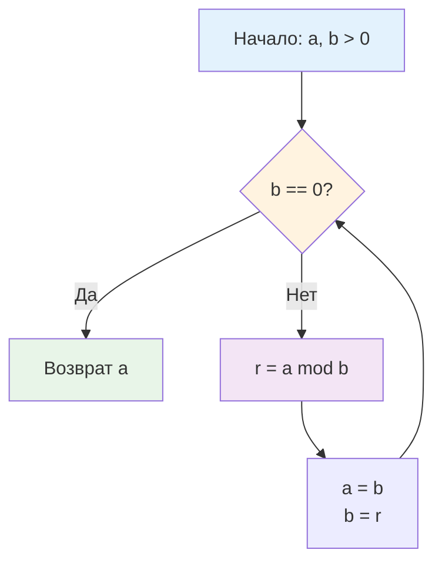

## Введение: От античной математики к криптографии и системному дизайну

Наибольший общий делитель (GCD, Greatest Common Divisor) — это не абстрактное понятие из школьной алгебры. В высоконагруженном бэкенде GCD является фундаментом для криптографических примитивов, планировщиков периодических задач, алгоритмов хеширования и даже систем управления памятью. Каждый раз, когда вы генерируете RSA-ключи, вычисляете наименьшее общее кратное (LCM) для синхронизации cron-задачей или выравниваете размер аллокации под кэш-линию CPU, под капотом работает алгоритм Евклида.

Наивный перебор делителей работает за `O(min(a, b))`, что абсолютно неприемлемо для 64-битных чисел в продакшене. Алгоритм Евклида сокращает сложность до `O(log min(a, b))`, превращая задачу из потенциального bottleneck в детерминированную операцию на несколько десятков тактов. Понимание его внутренней механики, влияния на конвейер процессора и способов защиты от side-channel атак отличает Senior-инженера от разработчика, полагающегося на стандартные библиотеки вслепую.

> [!tip] Собеседование
> **Вопрос:** «Какой худший случай для алгоритма Евклида и почему он важен для тестирования криптографических библиотек?»
> **Ответ:** Худший случай наступает, когда входные числа являются последовательными числами Фибоначчи: `gcd(F_n, F_{n-1})`. В этом случае остаток от деления уменьшается минимально, и алгоритм выполняет максимальное число шагов. Теорема Ламе доказывает, что количество шагов не превышает `5 * log10(min(a, b))`. В криптографии это гарантирует, что генерация ключей или вычисление модульной инверсии всегда укладывается в предсказуемое время, предотвращая DoS через алгоритмическую сложность.

## 1. Математическое ядро и инвариант сокращения

Алгоритм основан на строгом математическом инварианте:
`gcd(a, b) = gcd(b, a % b)` для `b ≠ 0`.
Доказательство опирается на свойство линейных комбинаций: любой общий делитель `a` и `b` также является делителем `a - k*b`. Поскольку `a % b = a - floor(a/b)*b`, множества общих делителей пар `(a, b)` и `(b, a % b)` идентичны.

Процесс продолжается итеративно, пока второй аргумент не станет нулём. В этот момент первый аргумент содержит GCD.



Сложность `O(log min(a, b))` обеспечивается тем, что на каждых двух шагах хотя бы один из аргументов уменьшается минимум вдвое. Это даёт гарантированную логарифмическую сходимость.

## 2. Production-реализация на Go: Итерация против рекурсии

В Go рекурсивная реализация алгоритма считается антипаттерном для численных библиотек, даже если она математически элегантна. Каждый рекурсивный вызов создаёт новый фрейм стека, что при глубокой вложенности (например, для больших `big.Int`) приводит к `morestack`-вызовам, росту памяти и блокировке инлайна.

Итеративная версия работает в регистрах, компилятор Go полностью инлайнит её, а предсказатель ветвлений эффективно обрабатывает цикл.

```go
package mathalgo

import "math"

// GCD вычисляет наибольший общий делитель для неотрицательных чисел.
// Использует итеративный алгоритм Евклида. O log min a b
// Возвращает 0, если оба аргумента равны 0.
func GCD(a, b uint64) uint64 {
	for b != 0 {
		a, b = b, a%b
	}
	return a
}

// LCM вычисляет наименьшее общее кратное через GCD.
// Избегает переполнения путём деления перед умножением.
func LCM(a, b uint64) (uint64, error) {
	if a == 0 || b == 0 {
		return 0, nil
	}
	// Проверка на потенциальное переполнение: a * (b / gcd) > maxUint64
	g := GCD(a, b)
	div := b / g
	if a > math.MaxUint64/div {
		return 0, fmt.Errorf("lcm: overflow for %d and %d", a, b)
	}
	return a * div, nil
}
```

Инженерные решения:
* **Итеративный цикл**: Исключает рекурсивный overhead, позволяет компилятору применить register allocation и избежать `stack growth`.
* **Безопасный LCM**: Вычисление как `a * b / GCD` сразу переполняет `uint64`. Формула `a * (b / GCD)` делит первым, сохраняя точность, но требует проверки на overflow перед умножением.
* **Обработка нулей**: `GCD(0, 0)` возвращает `0`, `GCD(x, 0) = x`. Это согласуется с математическими соглашениями и поведением `math/big`.

## 3. Расширенный алгоритм Евклида: Поиск модульной инверсии

Для криптографии и хеширования часто требуется найти обратный элемент по модулю `m`: `a * x ≡ 1 (mod m)`. Такое `x` существует только если `gcd(a, m) == 1`. Расширенный алгоритм Евклида находит коэффициенты Безу `x` и `y`, удовлетворяющие уравнению `a*x + b*y = gcd(a, b)`.

```go
// ExtendedGCD возвращает (g, x, y) такие, что a*x + b*y = g = gcd(a, b).
// Работает с int64 для корректной обработки отрицательных коэффициентов.
func ExtendedGCD(a, b int64) (int64, int64, int64) {
	if a == 0 {
		return b, 0, 1
	}
	g, x1, y1 := ExtendedGCD(b%a, a)
	x := y1 - (b/a)*x1
	y := x1
	return g, x, y
}
```

В production-коде рекурсия допустима только если гарантирован малый диапазон входа. Для произвольных `uint64` лучше использовать итеративную версию, чтобы избежать `stack overflow` при глубоких вычислениях в `math/big` контекстах.

## 4. Mechanical Sympathy: Стоимость деления, регистры и CPU

Алгоритм Евклида на первый взгляд выглядит просто, но его реальная производительность диктуется архитектурой процессора.

### Дороговизна инструкции `DIV`
Операция взятия остатка `%` в Go компилируется в машинную инструкцию деления. На современных x86-64 CPU:
* `DIV` (64-битное деление) занимает **20-80 тактов** в зависимости от микроархитектуры.
* В отличие от `ADD`, `MUL`, `AND`, деление не конвейеризируется эффективно. CPU вынужден ждать завершения деления перед следующей итерацией цикла.
* Это делает GCD относительно «тяжёлой» операцией по сравнению с побитовыми сдвигами, но всё ещё на порядки быстрее наивных подходов.

### Регистровое давление и инлайнинг
Итеративная реализация использует ровно 2-3 регистра общего назначения (`RAX`, `RBX`, `RDX` для остатка). Компилятор Go 1.21+ полностью инлайнит `GCD` в caller, устраняя вызов функции. Все вычисления проходят в L1-кэше процессора, не касаясь RAM. Escape Analysis помечает переменные как `scalar`, не выделяя память в куче. Давление на [[7. Глубокий Go (Внутреннее устройство)|сборщик мусора]] равно нулю.

### Сравнение с другими языками
| Язык | Реализация | Особенности |
|------|------------|-------------|
| Go | Ручная итерация или `math/big.GCD` | Явный контроль, инлайнинг, строгая типизация, нет скрытых аллокаций |
| C++ `std::gcd` | Рекурсия/итерация, `constexpr` | Оптимизирована под шаблоны, часто использует бинарный GCD для избежания `DIV` |
| Python `math.gcd` | C-реализация, arbitrary precision | Поддержка больших чисел из коробки, но overhead на динамическую типизацию |
| PHP `gmp_gcd` | Библиотека GMP | Только для расширений, нативного `gcd` нет, медленная конвертация типов |

> [!info] Под капотом
> **Бинарный алгоритм (Stein's algorithm) vs Евклид**
> Бинарный GCD заменяет дорогое деление на сдвиги и вычитание: `if a,b even: 2*gcd(a/2,b/2)`, `if a even: gcd(a/2,b)`, `else gcd((a-b)/2, b)`. На CPU без аппаратного деления (микроконтроллеры) он быстрее. На современных серверных CPU с быстрым `DIV` и глубоким конвейером классический Евклид часто выигрывает из-за предсказуемого ветвления и лучшего использования `DIV`-юнитов. Go выбирает классический подход для `uint64`, но `math/big` переключается на бинарный для больших чисел.

## 5. Криптографическая безопасность и Constant-Time

Стандартный `GCD` уязвим к **timing-атакам**. Количество итераций зависит от значений `a` и `b`. Атакующий, измеряя время ответа TLS-сервера при проверке сертификатов или генерации сессионных ключей, может восстановить секретные параметры.

Для криптографии в Go используйте `crypto/rsa` или `math/big.Int.GCD`, где часть логики может быть дополнена маскированием, но полная constant-time гарантия требует ручного контроля через `crypto/subtle`. В высоконагруженных API-гейтвеях, где вычисляются HMAC или проверяются JWT-подписи, использование стандартного `GCD` для не-секретных данных безопасно. Для секретных ключей — только проверенные крипто-примитивы.

```go
// Пример безопасного получения модульной инверсии для не-секретных задач
func ModInverse(a, m int64) (int64, error) {
	g, x, _ := ExtendedGCD(a, m)
	if g != 1 {
		return 0, fmt.Errorf("mod inverse does not exist, gcd %d != 1", g)
	}
	// Приводим к положительному диапазону [0, m-1]
	return (x%m + m) % m, nil
}
```

## 6. Ловушки и вопросы с собеседований

> [!tip] Собеседование
> **Вопрос 1:** «Что вернёт `GCD(0, 0)` и почему это важно для аллокаторов?»
> **Ответ:** Вернёт `0`. В аллокаторах памяти GCD используется для вычисления выравнивания пулов. Если `gcd(pageSize, objectSize) == 0`, деление на ноль вызовет panic. Всегда валидируйте вход или используйте safe-wrapper.
> 
> **Вопрос 2:** «Почему в формуле LCM вы делите перед умножением, а не после?»
> **Ответ:** `a * b` для 64-битных чисел почти всегда переполняет `uint64` (max ~1.8e19). Деление `b / gcd(a,b)` сначала уменьшает множитель, сохраняя математическую корректность. Но требует проверки `a > MaxUint64 / (b/gcd)` перед финальным умножением.
> 
> **Вопрос 3:** «Можно ли вычислить GCD без оператора `%`?»
> **Ответ:** Да, алгоритм Штейна (бинарный GCD) использует только сдвиги, вычитания и проверку чётности (`x & 1`). Он избегает дорогих `DIV`, но на современных CPU с быстрым аппаратным делением часто проигрывает из-за большего числа ветвлений и итераций.
> 
> **Вопрос 4:** «Как GCD влияет на производительность распределённых хеш-таблиц?»
> **Ответ:** При построении consistent hashing или выборе размера bucket array используется степень двойки или простое число. Если выбрать размер, имеющий общий делитель с хеш-шагом, возникнет кластеризация и неравномерное распределение. Проверка `gcd(step, size) == 1` гарантирует равномерное покрытие.

> [!warning] Ловушка / Gotcha
> **Отрицательные числа и `%` в Go**
> В Go оператор `%` возвращает остаток с тем же знаком, что и делимое: `-7 % 3 = -1`. Это ломает инварианты GCD для отрицательных входов. Всегда используйте `uint64` или берите абсолютное значение перед вычислениями. В криптографии модульная арифметика работает только с положительными полями, отрицательные результаты приводятся через `+ m`.
>
> **Рекурсия и stack overflow**
> Хотя GCD сходится логарифмически, для `math/big` с тысячами бит рекурсивный Extended GCD может вызвать stack overflow на системах с малым лимитом стека горутин. В Go 1.21+ стек растёт динамически, но частые `morestack`-переходы убивают производительность. Итеративная версия предпочтительна.

## Итог

* **Алгоритм Евклида** даёт `O(log min(a, b))` для нахождения GCD, что делает его детерминированным и быстрым для 64-битных чисел.
* В Go предпочтительна **итеративная реализация**: она работает в регистрах, полностью инлайнится, не создаёт аллокаций и избегает overhead на рекурсивные вызовы.
* **Механическая симпатия**: операция `%` компилируется в `DIV`, которая относительно дорога (20-80 тактов), но на серверных CPU эффективнее бинарных альтернатив из-за конвейеризации и предсказуемости.
* **Extended GCD** необходим для поиска модульной инверсии в криптографии и хешировании, но требует аккуратной обработки отрицательных коэффициентов и переполнений.
* **Безопасность**: Стандартный GCD не constant-time. Для секретных ключей используйте готовые крипто-примитивы из `crypto/`, чтобы избежать timing-атак.
* **Production-паттерн**: LCM через `(a / GCD) * b` с проверкой overflow, использование GCD для валидации размеров буферов и шагов хеширования.

Алгоритм Евклида закрывает задачи работы с делителями, кратными и модульной инверсией. Однако многие криптографические протоколы, хеш-функции и алгоритмы сжатия опираются на фундаментальное свойство чисел: их делимость только на единицу и на самих себя. В следующей статье мы детально разберём, как эффективно генерировать и проверять такие числа, почему наивный перебор делителей уступает решётам, и как эти алгоритмы применяются в современных системах защиты данных и распределённых идентификаторах.

[[5. Простые числа и решето Эратосфена]]