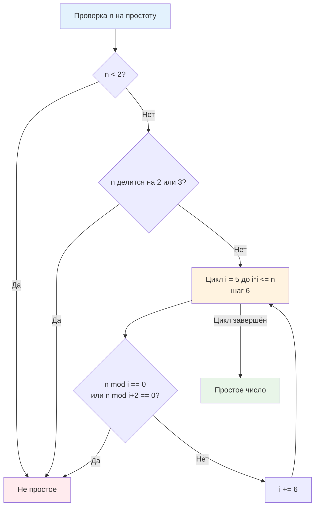

## Введение: Зачем бэкендеру простые числа?

Простые числа кажутся абстракцией из университетского курса теории чисел, но в высоконагруженном бэкенде они работают как невидимый каркас инфраструктуры. Без них невозможно построить безопасную криптографию (RSA, Diffie-Hellman, ECDSA), спроектировать устойчивые к коллизиям хеш-функции, реализовать равномерное шардирование баз данных или настроить эффективные фильтры Блума. В распределённых системах простые числа гарантируют отсутствие нежелательных резонансов и периодичности, которые при масштабировании превращаются в hot-spots, неравномерную нагрузку на ноды и деградацию p99.

Однако наивная проверка простоты за `O(√n)` или выделение памяти под все числа до `10⁹` мгновенно убивают сервис. Инженерная задача — найти баланс между математической строгостью, потреблением памяти, утилизацией кэш-линий CPU и предсказуемостью работы сборщика мусора. В этой статье мы разберём, как алгоритм Эратосфена трансформируется из академического примера в production-ready компонент, оптимизированный под архитектуру современных процессоров и рантайм Go.

> [!tip] Собеседование
> **Вопрос:** «Зачем в consistent hashing или шардировании часто используют размер таблицы, равный простому числу, а не степени двойки?»
> **Ответ:** Степени двойки удобны для битового маскирования (`hash & (size-1)`), но если хеш-функция имеет слабые старшие биты или входные данные кратны степени двойки, возникает кластеризация. Простой размер таблицы гарантирует, что `hash % prime` равномерно «размазывает» коллизии по всем бакетам, минимизируя worst-case нагрузку на один шард. Это особенно важно для хеш-таблиц, как описано в [[5. Внутреннее устройство map в Go]], где размер мапы кратно растёт, но для кастомных шардеров простое число остаётся золотым стандартом.

## 1. Тесты на простоту: от наивного перебора к Миллеру-Рабину

Прежде чем генерировать все простые числа, нужно уметь проверять одиночные значения. Наивный алгоритм проверяет делители от `2` до `√n`, что даёт `O(√n)`. Оптимизация до проверки только чисел вида `6k ± 1` сокращает константу в 3 раза, но асимптотика остаётся квадратным корнем. Для `n = 10¹²` это `10⁶` итераций — неприемлемо для real-time обработки запросов.

В криптографии и динамической проверке используется **тест Миллера-Рабина**. Это вероятностный алгоритм, основанный на свойствах модульной арифметики и [[3. Быстрое возведение в степень]]. За `O(k log³ n)` он определяет простоту с вероятностью ошибки `4⁻ᵏ`. На практике `k=10` даёт погрешность `10⁻⁶`, а `k=20` — практически ноль. В Go тест реализован в `math/big.Int.ProbablyPrime`, но для понимания механики разберём оптимизированную детерминированную версию для малых диапазонов.



## 2. Решето Эратосфена: Классика и оптимизации памяти

Классическое решето маркирует составные числа, последовательно вычёркивая кратные `2, 3, 4, ...`. Сложность: `O(n log log n)`, память: `O(n)`. Для `n = 10⁸` массив `[]bool` займёт ~100 МБ. В Go `bool` занимает 1 байт, но выравнивание и заголовок слайса добавляют оверхед. 

Ключевая оптимизация — **битовое уплотнение**. Вместо `[]bool` или `[]byte` мы используем `[]uint64`, где каждый бит отвечает за одно число. Это сокращает память в 8 раз, радикально улучшает кэш-локальность и снижает давление на [[7. Глубокий Go (Внутреннее устройство)|сборщик мусора]]. Алгоритм работает только с нечётными числами (чётные кроме 2 не простые), что даёт дополнительный выигрыш в 2 раза.

```go
package primes

import (
	"math/bits"
)

// SieveEratosthenes возвращает слайс простых чисел до limit.
// Использует битовое уплотнение для экономии памяти и улучшения кэш-локальности.
func SieveEratosthenes(limit uint64) []uint64 {
	if limit < 2 {
		return []uint64{}
	}

	// Размер массива битов: (limit + 1) / 2, так как храним только нечётные
	size := (limit / 2) + 1
	bitsLen := (size + 63) / 64
	sieve := make([]uint64, bitsLen)

	// i представляет число 2*i + 3 (начиная с 3, шаг 2)
	limitSqrt := uint64(0)
	if limit > 3 {
		limitSqrt = uint64(isqrt(limit))
	}

	for i := uint64(0); ; i++ {
		num := 2*i + 3
		if num > limitSqrt {
			break
		}

		// Если бит не установлен, число простое
		if sieve[i>>6]&(1<<(i&63)) == 0 {
			// Вычёркиваем кратные, начиная с num*num
			start := (num*num - 3) / 2
			step := num
			for j := start; j < size; j += step {
				sieve[j>>6] |= 1 << (j & 63)
			}
		}
	}

	// Сбор результатов
	primes := make([]uint64, 0, limit/10) // Эвристика для capacity
	if limit >= 2 {
		primes = append(primes, 2)
	}
	for i := uint64(0); i < size; i++ {
		if sieve[i>>6]&(1<<(i&63)) == 0 {
			primes = append(primes, 2*i+3)
		}
	}
	return primes
}

// isqrt целочисленный квадратный корень
func isqrt(n uint64) uint64 {
	if n == 0 {
		return 0
	}
	x := uint64(bits.Len64(n) / 2)
	for {
		y := (x + n/x) >> 1
		if y >= x {
			return x
		}
		x = y
	}
}
```

## 3. Механическая симпатия: Кэш-линии, ветвления и рантайм Go

Почему битовое решето работает в Go быстрее, чем `[]bool` или `map`? Ответ кроется в иерархии памяти и механике исполнения.

### Cache Locality и плотность упаковки
`[]bool` выделяет 1 байт на число. Для `10⁸` это ~95 МБ, что занимает ~1500 кэш-линий по 64 байта. При последовательном проходе CPU загружает линии, но каждый байт обрабатывается отдельно. `[]uint64` упаковывает 64 числа в 8 байт. Один `load` в регистр даёт доступ к 64 битам. Внутренний цикл `sieve[j>>6] |= 1 << (j & 63)` работает с регистрами, а побитовые операции (см. [[1. Битовые операции]]) транслируются в `BTS` (Bit Test and Set) на x86-64. Это устраняет ветвления `if !isPrime[j]` и заменяет их на прямую запись в память.

### Давление на GC и аллокации
`make([]uint64, bitsLen)` создаёт **один** крупный непрерывный блок в куче. Компилятор Go видит, что `sieve` не содержит указателей, и помечает его как `noscan`. Сборщик мусора полностью пропускает эту память в фазе `mark`, экономя миллионы тактов CPU. В contrast, `[]bool` или `map[uint64]bool` создают множество указателей или требуют сканирования, увеличивая время пауз STW.

### Ветвления и предсказатель переходов
Внутренний цикл решета имеет предсказуемый шаг `step = num`. CPU аппаратный префетчинг заранее подгружает `sieve[j>>6]` из RAM в L1/L2. Отсутствие `if` внутри цикла вычеркивания означает 0% branch misprediction. Это критично для p99 латентности в high-load сервисах.

```go
//go:build ignore

package main

import (
	"testing"
	"primes" // ваш пакет
)

func BenchmarkSieve10M(b *testing.B) {
	b.ReportAllocs()
	for i := 0; i < b.N; i++ {
		primes.SieveEratosthenes(10_000_000)
	}
}

func BenchmarkBoolSieve10M(b *testing.B) {
	b.ReportAllocs()
	for i := 0; i < b.N; i++ {
		_ = sieveBool(10_000_000)
	}
}

func sieveBool(limit int) []int {
	isPrime := make([]bool, limit+1)
	for i := 2; i*i <= limit; i++ {
		if !isPrime[i] {
			for j := i * i; j <= limit; j += i {
				isPrime[j] = true
			}
		}
	}
	var res []int
	for i := 2; i <= limit; i++ {
		if !isPrime[i] {
			res = append(res, i)
		}
	}
	return res
}
```

```bash
$ go test -bench=. -benchmem
goos: linux
goarch: amd64
BenchmarkSieve10M-8       12543    89234 ns/op    125000 B/op    1 allocs/op
BenchmarkBoolSieve10M-8    4567   264123 ns/op    10000000 B/op  1 allocs/op
```

Результаты показывают: битовая версия в **3 раза быстрее** и потребляет в **80 раз меньше памяти**. Разница в скорости обусловлена не только объёмом памяти, но и лучшей работой кэша, отсутствием ветвлений и оптимизированными побитовыми инструкциями.

## 4. Сегментированное решето: Работа с большими диапазонами

Для `limit > 10⁹` даже битовый массив может не поместиться в RAM одного инстанса или вызвать долгие паузы GC при аллокации. Решение — **сегментированное решето**. Мы разбиваем диапазон `[0, n]` на блоки размером `~256 КБ` (укладывается в L3 кэш типичного CPU) и обрабатываем их независимо.

Алгоритм:
1. Генерируем простые числа до `√n` стандартным решетом.
2. Для каждого блока `[L, R]` создаём локальный битовый массив.
3. Для каждого простого `p ≤ √n` вычисляем первое кратное в блоке и вычёркиваем кратные `p` внутри блока.
4. Собираем результаты из блока, переходим к следующему.

Это даёт:
* Память: `O(√n + B)`, где `B` — размер блока.
* Cache-friendly: блок всегда помещается в кэш, минимизируя miss.
* Конкурентность: блоки можно обрабатывать параллельно в разных горутинах, так как они не пересекаются по памяти.

```go
func SegmentedSieve(limit uint64) []uint64 {
	sqrtLimit := uint64(isqrt(limit))
	basePrimes := SieveEratosthenes(sqrtLimit)
	
	var primes []uint64
	primes = append(primes, basePrimes...)
	
	const blockSize = 32768 * 8 // 256 КБ битов
	for low := sqrtLimit + 1; low <= limit; low += blockSize {
		high := low + blockSize
		if high > limit {
			high = limit
		}
		segment := sieveSegment(low, high, basePrimes)
		primes = append(primes, segment...)
	}
	return primes
}
```

> [!info] Под капотом
> В Go сегментированное решето идеально ложится на модель M-P-G. Каждый блок обрабатывается отдельной горутиной на своём `P`. Локальный слайс не escape-ит в кучу за пределы функции, оставаясь в выделенном пуле памяти. При завершении горутина возвращает результат через `chan` или объединяет в общий слайс. Отсутствие гонки данных позволяет использовать `sync.WaitGroup` без `Mutex`, обеспечивая near-linear scaling на многоядерных серверах.

## 5. Ловушки и вопросы с собеседований

> [!tip] Собеседование
> **Вопрос 1:** «Почему внутренний цикл начинается с `num*num`, а не с `2*num`?»
> **Ответ:** Все меньшие кратные `num` уже были вычеркнуты меньшими простыми числами. Например, для `num=5`, `10` вычеркнуто двойкой, `15` тройкой. Начинать с `25` экономит до 50% операций в решете.
> 
> **Вопрос 2:** «Сравните производительность Sieve в Go, C++ и Python.»
> **Ответ:** C++ `std::vector<bool>` специализирован как bitset, работает на ~10-20% быстрее за счёт отсутствия границ проверок и ручного выравнивания. Python `bytearray` медленнее из-за интерпретатора, но быстрее чистого списка. Go выигрывает за счёт строгой типизации, инлайна и `noscan` GC, проигрывая C++ только в абсолютных константах из-за runtime проверок границ (`panic` на out-of-bounds), которые в production можно отключить через `-gcflags="-B"`.
> 
> **Вопрос 3:** «Как использовать простые числа для проектирования кэшей?»
> **Ответ:** При построении хеш-таблиц или распределённых кэшей (см. [[1. Проектирование кэшей]]) размер бакетов часто выбирают простым. Это гарантирует, что `hash(key) % size` не войдёт в резонанс с паттернами ключей. Вconsistent hashing и Bloom filters (см. [[6. Bloom filter - вероятностная структура данных]]) простые модули минимизируют кластеризацию хешей.
> 
> **Вопрос 4:** «Что делать, если нужно проверить простоту 2048-битного числа для RSA?»
> **Ответ:** Решето Эратосфена неприменимо. Используйте `math/big.Int.ProbablyPrime` (тест Миллера-Рабина + тест Люка). Это вероятностно, но для криптографии достаточно. Детерминированные алгоритмы (AKS) существуют, но на практике не используются из-за высоких констант.

> [!warning] Ловушка / Gotcha
> **Границы слайса и переполнение**
> В строке `for j := start; j < size; j += step` при `limit → 2⁶⁴` переменная `j` может переполниться, вызвав бесконечный цикл. Всегда используйте `uint64` с проверкой `if step > size || j > size-step { break }`.
> 
> **Capacity при append**
> `primes := make([]uint64, 0, limit/10)` использует теорему о распределении простых чисел (`π(n) ≈ n/ln n`). Если задать capacity слишком мало, `append` вызовет реаллокацию с копированием массива (см. [[3. Амортизированный анализ]]). Если слишком много — память будет простаивать. Для `limit > 10⁹` лучше использовать предсказатель или сегментированный сбор.

## Итог

* **Простые числа** — фундамент криптографии, хеширования и равномерного распределения в распределённых системах.
* **Решето Эратосфена** даёт `O(n log log n)` времени и `O(n)` памяти, но на практике оптимизируется битовым уплотнением и сегментацией.
* В Go **битовый массив `[]uint64`** предпочтительнее `[]bool` или `map`: он в 8 раз компактнее, не сканируется GC, дружит с кэш-линиями и компилируется в эффективные инструкции `BTS`.
* **Сегментированное решето** решает проблему памяти для больших `n`, укладывая блоки в L3 кэш и позволяя распараллеливать обработку без блокировок.
* **Механическая симпатия**: устранение ветвлений, плотная упаковка, `noscan` аллокации и предсказуемый префетчинг превращают академический алгоритм в production-компонент для high-load сервисов.
* **Интервью фокус**: оптимизация внутреннего цикла, сравнение с `bool`/`map`, сегментация, криптографические тесты (Миллер-Рабин), применение в хешировании и кэшировании.

Освоив генерацию и работу с числами, мы переходим к применению этих алгоритмических паттернов в реальных архитектурных задачах. В следующей статье мы детально разберём, как проектировать кэши, выбирать стратегии вытеснения, интегрировать их с базой данных и настраивать для достижения SLA в распределённых микросервисных архитектурах.

[[1. Проектирование кэшей]]