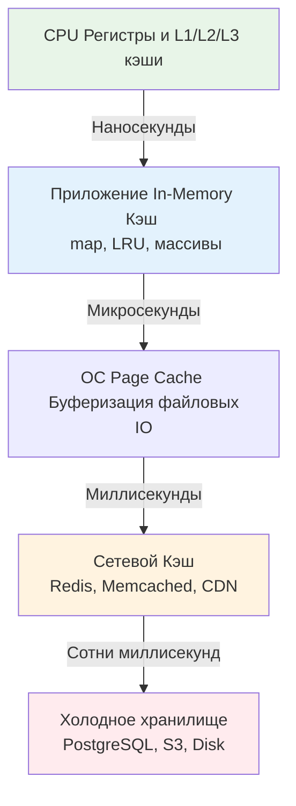
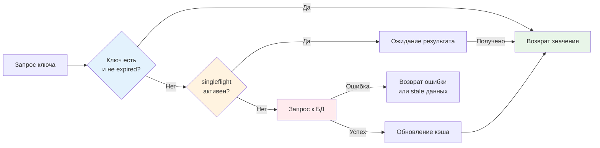

## Введение: Кэш как архитектурный компромисс

В проектировании высоконагруженного бэкенда кэш — это не просто быстрая `map` в памяти. Это сложный инженерный компромисс между согласованностью данных, потреблением RAM, задержками IO и стабильностью кластера при отказе. Ошибка в выборе стратегии инвалидации или игнорирование паттернов конкурентного доступа превращают кэш из ускорителя в источник `cache avalanche` и деградации p99.

Эта статья агрегирует практические паттерны проектирования кэширующих систем в Go. Мы разберём, как сочетать структуры данных из [[7. LRU кэш]], [[8. LFU кэш]] и [[6. Bloom filter - вероятностная структура данных]] с примитивами синхронизации рантайма, чтобы строить отказоустойчивые, масштабируемые и предсказуемые по памяти решения.

> [!tip] Собеседование
> **Вопрос:** «Почему 90% микросервисов используют паттерн Cache-Aside, а не Read-Through или Write-Through?»
> **Ответ:** Cache-Aside (Lazy Loading) даёт разработчику полный контроль над жизненным циклом данных. Сервис сам решает, когда кэшировать, когда инвалидировать и как обрабатывать ошибки БД. Read/Write-Through требует сложной абстракции провайдера кэша, который становится единой точкой отказа. В микросервисной архитектуре, где данные распределены и схемы чтения/записи различаются, явное управление в коде надёжнее скрытой логики фреймворка.

## 1. Паттерны взаимодействия с источником данных

Выбор паттерна определяет, кто ответственен за согласованность и как система реагирует на изменения.

| Паттерн | Механика | Гарантии согласованности | Сложность реализации в Go |
|---------|----------|--------------------------|---------------------------|
| **Cache-Aside** | Приложение читает кэш → при промахе читает БД → пишет в кэш | Eventual, риск stale данных до TTL или ручной инвалидации | Низкая |
| **Read-Through** | Кэш сам запрашивает БД при промахе | Зависит от реализации callback провайдера | Средняя |
| **Write-Through** | Запись идёт в кэш и синхронно в БД | Сильная, но задержка равна sum(kэш + БД) | Высокая |
| **Write-Behind** | Запись в кэш, асинхронный батчинг в БД | Высокий риск потери данных при crash | Очень высокая |

В Go Cache-Aside реализуется максимально идиоматично. Кэш остаётся простой структурой данных, а бизнес-логика контролирует потоки.

```go
func GetUser(ctx context.Context, id string) (*User, error) {
    if u, ok := localCache.Get(id); ok {
        return u, nil
    }
    
    u, err := db.FetchUser(ctx, id)
    if err != nil {
        return nil, err
    }
    
    localCache.Set(id, u, time.Minute*5)
    return u, nil
}
```

> [!warning] Ловушка / Gotcha
> **Гонка инвалидации в Cache-Aside**
> При параллельном обновлении и чтении возможен сценарий: Горутина A читает БД (v1) → Горутина B пишет БД (v2) и инвалидирует кэш → Горутина A сохраняет v1 в кэш. Кэш теперь содержит устаревшую версию v2. Решение: использовать versioning в значении, atomic compare-and-swap при `Set`, либо короткие TTL с фоновым обновлением.

## 2. Иерархия локальности и границы ответственности

Эффективный кэш в Go строится поверх понимания аппаратной и сетевой иерархии. Данные движутся от быстрых, но маленьких хранилищ к медленным, но ёмким.



**Архитектурный принцип:** Кэш должен находиться максимально близко к потребителю, но не дублировать функции нижних уровней.
* Если данные читаются чаще, чем обновляются, и помещаются в RAM инстанса — используйте **локальный in-memory кэш**. Сетевой RTT в Redis (0.5-2 мс) в 10-50 раз дороже локального вызова (10-100 нс).
* Если данные должны быть консистентны между подками, или объём превышает RAM одного узла — используйте **распределённый кэш**.
* Комбинированный паттерн (L1 Local + L2 Remote) даёт максимум производительности: сначала проверям локальную `map`, при промахе идём в Redis, заполняем оба уровня.

## 3. Конкурентность в Go-кэшах

Одиночный `sync.RWMutex` масштабируется до ~10-20 тысяч RPS. Дальше начинается contention: горутины уходят в `futex`-парковку, планировщик переключает треды ОС, p99 растёт экспоненциально. Для production-кэшей применяют **шардирование**.

Алгоритм шардирования кэша:
1.  Разделяем хранилище на `N` независимых сегментов (обычно `N = 16, 32, 64` или `nextPow2(runtime.NumCPU() * 2)`).
2.  Каждый сегмент имеет свой `sync.RWMutex` и локальную мапу/LRU.
3.  Запрос маршрутизируется по `hash(key) % N`.

Это снижает contention в `N` раз. Потеря глобального порядка или точного учёта memory limit незначительна по сравнению с выигрышем в пропускной способности.

```go
type ShardedCache[K comparable, V any] struct {
    shards []*shard[K, V]
    mask   uint32 // N-1 для быстрого hash % N через AND
    hash   func(K) uint32
}

func (c *ShardedCache[K, V]) Get(key K) (V, bool) {
    idx := c.hash(key) & c.mask
    return c.shards[idx].Get(key)
}
```

Для обработки **Cache Stampede** (одновременный запрос тысяч горутин за одним отсутствующим ключом) используйте пакет `golang.org/x/sync/singleflight`. Он гарантирует, что тяжелый запрос к БД выполнится только один раз, а остальные горутины дождутся результата.

> [!info] Под капотом
> Внутренности `singleflight`: пакет использует `sync.Map` для отслеживания активных вызовов по ключу и `sync.Cond` для ожидания. Когда первый вызов завершается, он вызывает `cond.Broadcast()`, разблокируя всех ожидающих. Это эффективнее `chan`, так как не требует создания канала на каждый ключ и работает с пулом структур ожидания.

## 4. Механическая симпатия и управление памятью

Проектирование кэша без учёта [[7. Глубокий Go (Внутреннее устройство)|сборщика мусора]] и архитектуры CPU ведёт к скрытым проблемам производительности.

### Давление на GC и аллокации
Каждый `cache.Set` создаёт объект значения. Если кэш активно обновляется (высокий churn rate), GC тратит циклы на маркировку и удаление старых элементов. 
**Оптимизация:** Используйте `[[16. Профилирование, отладка и производительность|sync.Pool]]` для переиспользования буферов и структур кэша. При `Evict` или `Expire` не просто удаляйте из `map`, а возвращайте объекты в пул: `cache.pool.Put(item)`. Это радикально снижает `mallocgc` и делает паузы STW предсказуемыми.

### False Sharing в шардированных кэшах
Если массив шардов лежит компактно, а разные ядра CPU одновременно обращаются к разным шардам, лежащим в одной кэш-линии (64 байта), возникает **False Sharing**. Протокол когерентности кэшей (MESI) будет постоянно инвалидировать линию, хотя данные не пересекаются. 
**Решение:** Выравнивать структуры шардов до 64 байт (`_ [56]byte` padding между полями) или распределять шарды по разным страницам памяти через арену. На Go 1.21+ это часто нивелируется размером `sync.Mutex`, но для lock-free структур padding остаётся обязательным.

### Escape Analysis и упаковка значений
Хранение `any` (interface{}) в кэше создаёт 16-байтовый дескриптор и аллокацию самого значения в кучу. Для примитивных или компактных типов используйте дженерики `Cache[K comparable, V any]`. Если `V` — маленький `struct`, компилятор разместит его inline в куче, уменьшая косвенность доступа и улучшая cache locality.

## 5. Защита от каскадных отказов

Кэш должен защищать БД, а не усугублять её нагрузку при деградации.

1.  **Circuit Breaker**: При серии ошибок подключения к кэшу или БД, временно отключаем кэширование, чтобы не тратить ресурсы на failed-запросы.
2.  **Probabilistic Early Expiration**: Вместо жёсткого TTL (все ключи истекают одновременно), добавляем случайный джиттер: `TTL + rand(-10%, +10%)`. Это распределяет нагрузку по обновлению ключей во времени, предотвращая `cache avalanche`.
3.  **Background Refresh**: При TTL 80% запускаем фоновую горутину для предзагрузки ключа. Клиент получает старые данные, пока новые грузятся асинхронно. Гарантирует нулевую латентность, но допускает eventual consistency.



## 6. Ловушки production и хардкор-собеседования

> [!tip] Собеседование
> **Вопрос 1:** «Как решить проблему Cache Penetration, когда злоумышленник запрашивает несуществующие ключи?»
> **Ответ:** Кэш всегда будет miss, запросы пойдут в БД. Решения: 1. Валидация ввода на уровне API. 2. Кэширование `null` для отсутствующих ключей с очень коротким TTL. 3. Использование [[6. Bloom filter - вероятностная структура данных]] перед проверкой кэша. Bloom filter за O 1 определит, что ключа точно нет в БД, и отсечёт запрос без IO.
> 
> **Вопрос 2:** «Что произойдёт, если Redis упадёт, а приложение продолжит писать в кэш?»
> **Ответ:** Если не настроен fallback или circuit breaker, горутины будут получать ошибки записи, тратить ресурсы на retries и блокироваться. Приложение начнёт деградировать. Правильная архитектура: при недоступности кэша переключаться в режим «только чтение из БД» или использовать локальный fallback-кэш с меньшим TTL.
> 
> **Вопрос 3:** «Почему не стоит использовать `sync.Map` для реализации LRU-кэша?»
> **Ответ:** `sync.Map` оптимизирован под сценарии «много чтений, редкие записи» или «только добавление». Для кэша с частым удалением (eviction) и обновлением приоритетов он будет постоянно создавать `dirty` массив, что приведёт к O n аллокациям и падению производительности. Для кэшей всегда используйте шардированные `sync.RWMutex` или lock-free очереди.
> 
> **Вопрос 4:** «Как обеспечить сильную согласованность между кэшем и транзакционной БД?»
> **Ответ:** Строго говоря, это невозможно без распределённых транзакций. На практике используют: 1. Outbox Pattern: пишем событие обновления в БД в той же транзакции, фоновый процесс шлёт его в кэш. 2. CDC: слушаем binlog/postgres logical replication и инвалидируем кэш. 3. Короткие TTL + Cache-Aside как fallback для остаточных рассинхронизаций.

> [!warning] Ловушка / Gotcha
> **Сериализация и десериализация**
> Если вы сохраняете в кэше `[]byte` (например, JSON), убедитесь, что не делаете `json.Unmarshal` при каждом чтении. Парсинг JSON в Go дорогой. Лучше кэшировать уже распарсенную Go-структуру или использовать бинарные протоколы (MsgPack, FlatBuffers, Protobuf). Для локального кэша сериализация избыточна и только добавляет аллокации.
> 
> **Утечка памяти через замыкания**
> Если коллбек `onEvict` или фоновая задача захватывает ссылки на большие структуры, GC не соберёт их, даже после удаления из мапы. Всегда передавайте в коллбеки примитивы или копии данных, либо используйте `weak references` паттерны через финализаторы (но в Go это сложно и не рекомендуется для hot-path).

## Итог

* **Проектирование кэша** — это баланс между согласованностью, задержкой, потреблением памяти и устойчивостью к отказам.
* В Go **Cache-Aside + singleflight** покрывает 80% сценариев. Шардирование (`hash(key) & (N-1)`) устраняет contention мьютексов.
* **Механическая симпатия**: используйте `sync.Pool` для переиспользования объектов, избегайте `any` для компактных структур, контролируйте False Sharing и учитывайте давление на [[7. Глубокий Go (Внутреннее устройство)|GC].
* **Защита от отказов**: джиттер TTL, Circuit Breaker, Bloom Filter для pen-тестирования ключей, асинхронный background refresh для zero-latency fallback.
* **Сильная согласованность** достигается через CDC или Outbox Pattern, но обычно достаточно eventual consistency с коротким TTL и грамотной инвалидацией по ключам.
* **Интервью фокус**: thundering herd, cache avalanche vs penetration, trade-offs локального vs распределённого кэша, реализация eviction под нагрузкой.

Понимание паттернов кэширования позволяет проектировать устойчивые к высокой нагрузке сервисы. Однако кэш и очередь — это лишь часть системы управления потоком данных. Когда трафик превышает пропускную способность, нам нужны алгоритмы, которые детерминированно ограничивают запросы, защищая инфраструктуру от перегрузки. В следующей статье мы детально разберём Token Bucket, Leaky Bucket, Sliding Window и их реализацию на атомиках и кольцевых буферах.

[[2. Rate limiting алгоритмы]]