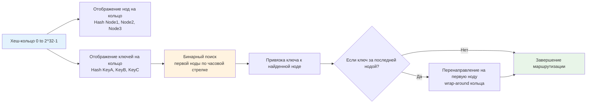
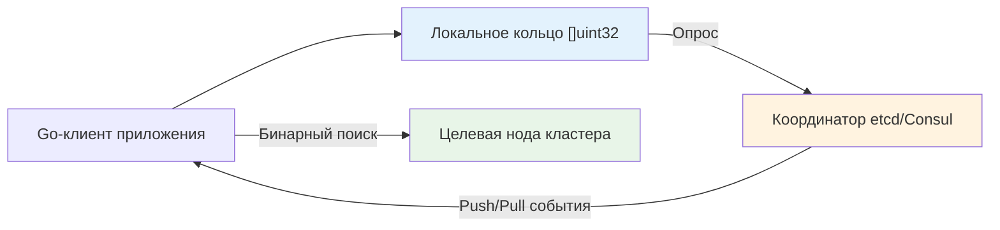

## Введение: Проблема стандартного хеширования и необходимость кольца

В распределённых системах, кэширующих кластерах и шардированных базах данных маршрутизация запросов часто строится на формуле `hash(key) % N`, где `N` — число нод. Этот подход прост, но архитектурно опасен. При добавлении или удалении даже одной ноды значение `N` меняется, и практически все ключи пересчитываются заново. В результате возникает **cache avalanche**: 80-90% запросов внезапно попадают мимо кэша, база данных получает кратный всплеск нагрузки, latency взлетает, а система может войти в cascade failure.

Consistent Hashing решает эту проблему математически. При изменении количества нод перераспределяется только `K / N` ключей, где `K` — общее число ключей. Это свойство сделало алгоритм стандартом для DynamoDB, Cassandra, Redis Cluster, CDN-провайдеров и внутренних балансировщиков микросервисов. В Go он применяется не только в сетевых пакетах, но и в распределённых rate-limiter, сессионных сторах и шардированных очередях.

> [!tip] Собеседование
> **Вопрос:** «Почему при масштабировании Redis-кластера с 3 до 4 нод при использовании `hash % N` происходит массовый сбой, а consistent hashing спасает ситуацию?»
> **Ответ:** При `hash % N` меняется модуль, поэтому остаток для большинства ключей изменяется непредсказуемо. Клиенты начинают стучаться в другие ноды, получают промахи и идут в БД. Consistent hashing отображает ноды и ключи на общее пространство `[0, 2^32-1]`. При удалении ноды ключи переходят только к следующей ноде по часовой стрелке, сохраняя локальность остальных. Перемаппинг затрагивает лишь `1/N` данных, что делает добавление и удаление нод предсказуемым и безопасным.

## 1. Математическое ядро: Хеш-кольцо и бинарный поиск

Алгоритм строит абстрактное кольцо значений от `0` до `MaxUint32`. Каждая нода кластера хешируется (например, по IP или ID) и занимает позицию на этом кольце. Ключи хешируются тем же алгоритмом. Ключ привязывается к первой ноде, которая встречается при движении по кольцу **по часовой стрелке**.

Для поиска этой ноды в коде используется отсортированный массив позиций виртуальных нод и **бинарный поиск**. Это даёт `O(log M)`, где `M` — общее число виртуальных позиций.



Ключевой инвариант: кольцо статично, меняется только набор точек на нём. Добавление ноды забирает ключи только у соседа по часовой стрелке. Удаление ноды передаёт её ключи следующему соседу. Ни одна другая пара нода-ключ не затрагивается.

## 2. Production-реализация на Go

В Go consistent hashing реализуется через отсортированный `[]uint32` и мапу для быстрого обратного поиска. Используем `sync.RWMutex` для безопасности, так как изменение топологии происходит редко, а чтение — постоянно.

```go
package consistenthash

import (
	"sort"
	"sync"

	"github.com/cespare/xxhash/v2"
)

const defaultVirtualNodes = 150

// Ring представляет consistent hash кольцо
type Ring struct {
	mu          sync.RWMutex
	nodes       []uint32        // Отсортированные позиции виртуальных нод
	positions   map[uint32]*Node // Мапа позиция -> нода
	vnodes      int             // Число виртуальных нод на физическую
}

// Node описывает физическую ноду кластера
type Node struct {
	ID   string
	Data any // Полезная нагрузка, например *redis.Client
}

// New создаёт пустое кольцо с заданным числом виртуальных нод
func New(vnodes int) *Ring {
	if vnodes <= 0 {
		vnodes = defaultVirtualNodes
	}
	return &Ring{
		nodes:     make([]uint32, 0, vnodes*16),
		positions: make(map[uint32]*Node, vnodes*16),
		vnodes:    vnodes,
	}
}

// AddNode добавляет ноду в кольцо
func (r *Ring) AddNode(node *Node) {
	r.mu.Lock()
	defer r.mu.Unlock()

	for i := 0; i < r.vnodes; i++ {
		// Генерируем уникальную позицию для каждой виртуальной ноды
		pos := xxhash.Sum64String(node.ID + "-" + itoa(i))
		r.nodes = append(r.nodes, uint32(pos))
		r.positions[uint32(pos)] = node
	}
	sort.Slice(r.nodes, func(i, j int) bool {
		return r.nodes[i] < r.nodes[j]
	})
}

// RemoveNode удаляет ноду и её виртуальные копии
func (r *Ring) RemoveNode(nodeID string) {
	r.mu.Lock()
	defer r.mu.Unlock()

	for i := 0; i < r.vnodes; i++ {
		pos := xxhash.Sum64String(nodeID + "-" + itoa(i))
		delete(r.positions, uint32(pos))
	}
	// Пересобираем массив nodes без удалённых позиций
	filtered := make([]uint32, 0, len(r.nodes)-r.vnodes)
	for _, pos := range r.nodes {
		if _, exists := r.positions[pos]; exists {
			filtered = append(filtered, pos)
		}
	}
	r.nodes = filtered
}

// GetNode возвращает ноду для заданного ключа
func (r *Ring) GetNode(key string) *Node {
	if len(r.nodes) == 0 {
		return nil
	}

	hash := uint32(xxhash.Sum64String(key))

	r.mu.RLock()
	defer r.mu.RUnlock()

	// Бинарный поиск первой позиции >= hash
	idx := sort.Search(len(r.nodes), func(i int) bool {
		return r.nodes[i] >= hash
	})

	// Если ключ попал за последнюю ноду, wrap-around на начало
	if idx == len(r.nodes) {
		idx = 0
	}

	return r.positions[r.nodes[idx]]
}
```

Инженерные решения:
* **`xxhash` вместо `crypto`**: Криптографические хеш-функции (`SHA256`, `MD5`) избыточно медленны для маршрутизации. `xxhash` или `MurmurHash3` дают отличную равномерность распределения за константное время и минимизируют коллизии.
* **`sort.Search`**: Компилятор Go оптимизирует бинарный поиск в отсортированном `[]uint32` в tight-loop без аллокаций. Сложность `O(log M)` гарантирует микросекундный отклик даже при тысячах виртуальных нод.
* **Отдельная мапа `positions`**: Позволяет за `O(1)` получать ссылку на `Node` после нахождения индекса в `[]uint32`. Двойная структура данных (`массив + мапа`) — классический trade-off consistent hashing.

## 3. Виртуальные ноды: Балансировка нагрузки и trade-offs

Без виртуальных нод физическая неравномерность хеш-функции приводит к **skew**: одна нода получает 60% ключей, другая — 5%. Виртуальные ноды разбивают каждую физическую ноду на `V` точек на кольце. При `V=100..200` распределение становится статистически равномерным (коэффициент вариации `σ/μ < 0.1`).

| Число виртуальных нод (V) | Равномерность нагрузки | Память на ноду | Скорость GetNode |
|---------------------------|------------------------|----------------|------------------|
| 1-10                      | Низкая, высокий skew   | Минимальная    | Очень высокая    |
| 100-200                   | Оптимальная            | ~3-5 КБ        | Высокая          |
| 1000+                     | Идеальная              | ~30-50 КБ      | Снижается из-за log M |

Для Go-бэкенда `V=150` является золотым стандартом. Память для 10 нод составит ~1500 записей, что полностью помещается в L2 кэш и не создаёт давления на [[7. Глубокий Go (Внутреннее устройство)|сборщик мусора]].

> [!warning] Ловушка / Gotcha
> **Удаление ноды и пересборка массива**
> В реализации выше `RemoveNode` фильтрует `[]uint32`, создавая новый слайс. Это `O(M)` операция. При частом масштабировании (например, autoscaling K8s каждую минуту) это может стать bottleneck. Решение: использовать `lazy deletion` с флагом `active` в мапе, либо переключиться на сбалансированное дерево, но в 99% сценариев массивная пересборка раз в час/день абсолютно допустима.

## 4. Mechanical Sympathy: Кэш, CPU и рантайм

Поведение consistent hashing в Go идеально ложится на архитектуру современных CPU.

**Пространственная локальность и бинарный поиск**
Массив `r.nodes []uint32` лежит в непрерывном блоке RAM. При `sort.Search` CPU последовательно читает элементы, предсказывая направление перехода. Благодаря плотной упаковке, 64-байтовая кэш-линия содержит 16 позиций. Для 2000 виртуальных нод бинарный поиск выполнит ~11 сравнений, загружая всего 1-2 кэш-линии. Это радикально быстрее, чем обход `map` с рандомным хешированием.

**Давление на GC и аллокации**
Структура `Ring` создаётся один раз и живёт в течение жизненного цикла сервиса. `AddNode` вызывает `append` и пересортировку, но это редкие операции. `GetNode` выполняется **только для чтения**: `RLock`, бинарный поиск, чтение указателя из мапы. Никаких аллокаций в hot-path. [[7. Глубокий Go (Внутреннее устройство)|Escape Analysis]] помечает `key` и локальные переменные на стек, а `Ring` остаётся в куче, но не сканируется GC на каждый запрос, так как содержит примитивы и указатели.

**Сравнение с rendezvous hashing (Highest Random Weight)**
Альтернатива — rendezvous hashing, где ключ выбирает ноду с максимальным весом `hash(key + nodeID)`. Оно не требует сортировки и массивов, работает за `O(N)` или `O(log N)` с деревом. Но при добавлении ноды перемещается больше ключей, а виртуальные ноды реализовать сложнее. Consistent hashing выигрывает за счёт предсказуемости, простоты масштабирования и лучшей кэш-локальности в Go.

## 5. Распределённый консенсус vs Локальное кольцо

Важно понимать: consistent hashing — это **алгоритм маршрутизации**, а не протокол согласованности. Он говорит, *куда* должен пойти запрос, но не гарантирует, что нода *знает* о добавлении или удалении соседей одновременно.

Архитектурные варианты в production:
1. **Централизованный координатор**: Отдельный сервис (etcd, ZooKeeper, Consul) хранит топологию. Все клиенты подписываются на изменения и обновляют локальное кольцо через `AddNode`/`RemoveNode`. Просто, но координатор — single point of failure.
2. **Gossip-протокол**: Ноды обмениваются информацией о составе кластера peer-to-peer. Клиент собирает метаданные из gossip. Устойчиво к отказам, но требует времени на convergence (10-30 сек), что может вызвать временную несогласованность маршрутизации.
3. **Статическая конфигурация**: Список нод зашивается в конфигурацию или ConfigMap Kubernetes. Перекат конфигурации перезапускает поды. Надёжно для stateless-прокси, но не для динамических кластеров.



> [!tip] Собеседование
> **Вопрос 1:** «Что произойдёт, если хеш-функция даст много коллизий для разных нод?»
> **Ответ:** Несколько виртуальных нод окажутся в одной позиции кольца. Это приведёт к тому, что часть физических нод не получит трафика, а другие будут перегружены. Решение: использовать высококачественные non-cryptographic хеш-функции с хорошим avalanche-эффектом (xxhash, farmhash, murmur3) и добавлять уникальный суффикс к ID ноды.
> 
> **Вопрос 2:** «Почему в Redis Cluster используется хеш-слоты 16384, а не чистое consistent hashing?»
> **Ответ:** Redis Cluster использует фиксированное число слотов, назначенных нодам. Это упрощает миграцию данных и согласованность, так как слот — это единица перемещения, а не отдельный ключ. Pure consistent hashing требует перемещения отдельных ключей, что сложнее координировать без блокировок. Выбор Redis — trade-off между гибкостью и простотой администрирования.
> 
> **Вопрос 3:** «Как обеспечить zero-downtime обновление кольца при масштабировании?»
> **Ответ:** 1. Добавить новые ноды в координатор. 2. Клиенты получают обновление и начинают маршрутизировать часть трафика на новые ноды. 3. Фоновый процесс мигрирует данные со старых нод на новые. 4. Когда данные переехали, старые ноды выводятся из кольца. Ключевое: клиенты должны уметь обслуживать оба состояния или координатор должен синхронизировать переход атомарно.
> 
> **Вопрос 4:** «Сравните consistent hashing и шардирование по диапазону key range.»
> **Ответ:** Диапазонное шардирование эффективно для range-запросов, но страдает от hotspot-проблемы (все пишут в последний диапазон) и сложного ребалансинга. Consistent hashing равномерно распределяет hot-ключи, но не поддерживает range-сканы без обращения ко всем нодам. Выбор зависит от паттерна доступа: точечные/рандомные запросы -> consistent hashing; аналитика/диапазоны -> range sharding.

## 6. Ловушки production-разработки

* **Неправильный хеш-алгоритм**: `hash(key) = len(key)` или `hash(key) % 1000` уничтожают равномерность. Всегда используйте битово-перемешивающие функции.
* **Игнорирование wrap-around**: Если бинарный поиск возвращает `idx == len(nodes)`, а вы не обрабатываете это как `0`, последние 30% ключей будут теряться. Всегда проверяйте границу массива.
* **Конкурентная гонка при обновлении**: Чтение и запись в `r.nodes` должны быть защищены `RWMutex`. Попытка использовать `atomic.Pointer` для слайса приведёт к data race, так как `append` создаёт новый массив, а читатели могут получить частично обновлённый указатель.
* **Утечка памяти при удалении нод**: Если мапа `positions` не очищается при `RemoveNode`, она будет расти. В Go мапы не сжимают память автоматически после `delete`. Для долгоживущих систем используйте пул колец или периодическую пересборку структуры с нуля.

## Итог

* **Consistent Hashing** решает проблему массовой инвалидации кэша при масштабировании, минимизируя перераспределение ключей до `1/N` от общего объёма.
* В Go реализуется через **отсортированный `[]uint32` + `map[uint32]*Node`** с бинарным поиском `sort.Search`. Это даёт `O(log M)` на маршрутизацию и отличную кэш-локальность.
* **Виртуальные ноды** обязательны для устранения skew. Оптимальное значение `100-200` балансирует между равномерностью нагрузки и потреблением памяти.
* **Механическая симпатия**: плотный массив позиций минимизирует cache miss, `RLock` позволяет обслуживать сотни тысяч RPS без contention, escape analysis предотвращает аллокации в hot-path.
* **Распределённая согласованность** требует отдельного слоя (etcd, gossip, Kubernetes ConfigMap). Алгоритм отвечает только за локальную маршрутизацию.
* **Интервью фокус**: trade-offs с range sharding и rendezvous hashing, влияние хеш-функции на балансировку, обработка wrap-around, стратегии обновления кольца без downtime.

Consistent hashing закрывает задачи маршрутизации в распределённых системах. Однако когда требуется анализировать не равномерное распределение, а выявлять наиболее частые, «тяжёлые» события в потоке данных (например, топ-запросов, спамеров или популярных товаров), нам нужны структуры, оптимизированные под частотный анализ в условиях ограниченной памяти. В следующей статье мы детально разберём алгоритмы поиска Top-K heavy hitters, включая Space-Saving, Count-Min Sketch и их гибридные реализации для Go-бэкенда.

[[4. Top K heavy hitters]]