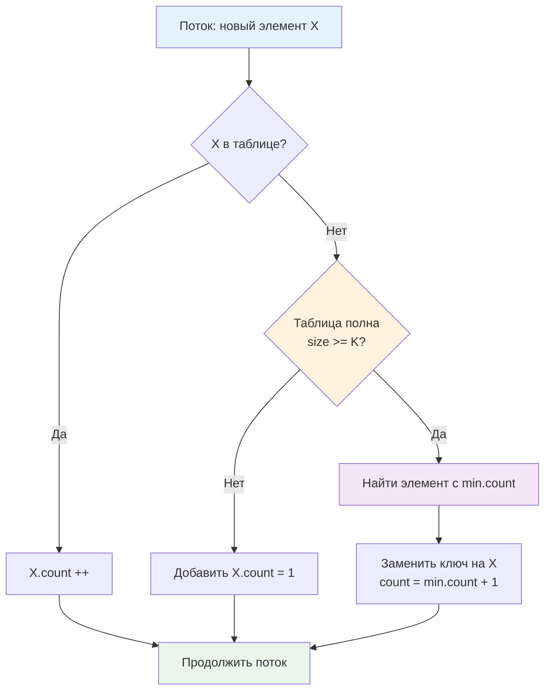
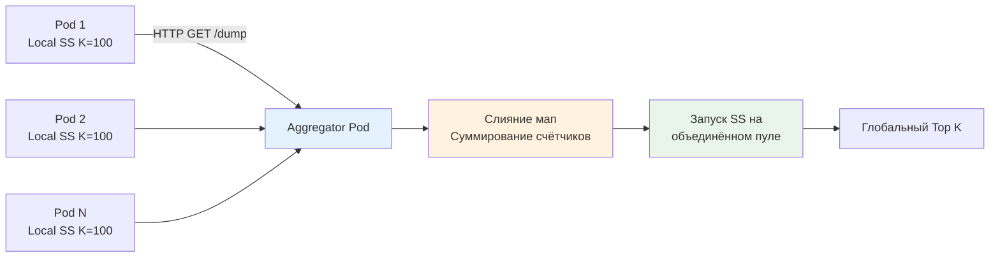

## Введение: Поиск слонов в стоге сена

В высоконагруженном бэкенде мы редко можем позволить себе хранить точные счётчики для миллионов уникальных IP, хешей запросов или сессионных токенов. Структура `map[string]int64` при росте кардинальности до `10⁷` элементов съест гигабайты RAM, а обход этой мапы для поиска топ-10 превратится в `O(N)` операцию, которая заблокирует системный тред и спровоцирует паузы [[7. Глубокий Go (Внутреннее устройство)|сборщика мусора]].

Задача поиска наиболее частых элементов (heavy hitters) в потоке данных при жёстком ограничении памяти решается **streaming-алгоритмами**. Space-Saving, Misra-Gries, Count-Min Sketch — это не академические трюки, а индустриальный стандарт для DDoS-фильтров, обнаружения API-абуза, trending-аналитики и защиты кэшей от thrashing. В этой статье мы разберём, как выбрать между детерминированными и вероятностными подходами, реализовать их в Go с учётом кэш-локальности и конкурентности, и правильно масштабировать в кластере Kubernetes.

> [!tip] Собеседование
> **Вопрос:** «Зачем использовать приближённые алгоритмы вроде Space-Saving или Count-Min Sketch, если можно просто писать все ключи в ClickHouse и делать `SELECT ... ORDER BY count DESC LIMIT K`?»
> **Ответ:** ClickHouse даёт точность, но с задержкой. Batch-агрегация работает за секунды или минуты. Для real-time защиты (например, блокировка IP после 100 запросов за 5 секунд) нужна реакция за миллисекунды на уровне приложения или API-гейтвея. Streaming-алгоритмы работают в памяти с `O(K)` потреблением RAM и `O(1)` на запрос, обеспечивая мгновенную реакцию на аномалии.

## 1. Архитектура потока и границы точности

Стриминговые модели обработки данных накладывают фундаментальные ограничения. Мы видим каждый элемент ровно один раз, не можем хранить их все и обязаны отвечать на запрос `TopK()` в любой момент времени.

| Подход | Память | Точность | Гарантия | Поддержка удалений |
|--------|--------|----------|----------|-------------------|
| **Exact Map** | `O(N)` | 100% | Детерминированная | Да |
| **Space-Saving** | `O(K)` | Высокая | Ошибка ≤ `N/K` | Нет (сложно) |
| **Misra-Gries** | `O(K)` | Средняя | Ошибка ≤ `N/K` | Да |
| **Count-Min Sketch** | `O(1/ε · ln(1/δ))` | Вероятностная | Всегда overcount | Да (сложно) |

В бэкенде **Space-Saving** де-факто стандарт для мониторинга и rate-limiting. Он гарантирует, что истинная частота любого элемента `f` оценивается как `count ∈ [f, f + (N-K)/K]`. При `K=1000` и потоке `N=10⁶` ошибка не превысит `1000`, что для выявления аномалий (счётчики в десятки тысяч) более чем достаточно.

## 2. Алгоритмическое ядро: Space-Saving (Stream-Summary)

Классический Misra-Gries хранит `K-1` пар `(ключ, счётчик)`. При поступлении нового элемента:
1. Если ключ в таблице: инкрементируем счётчик.
2. Если места нет: уменьшаем все счётчики на 1, удаляем нулевые.

Space-Saving улучшает этот подход, сохраняя больше информации. Вместо декремента всех счётчиков мы находим элемент с **минимальным** счётчиком `min_c` и заменяем его новым ключом со значением `min_c + 1`. Это сохраняет «историю» частоты и даёт более жёсткую ошибку.



Сложность вставки: `O(K)` при наивном поиске минимума. Для `K ≤ 2048` линейный проход по массиву на 1-2 порядка быстрее операций с `map` благодаря аппаратному префетчингу и отсутствию pointer chasing. Для `K > 10⁴` используют Min-Heap поверх массива, получая `O(log K)`, но в Go-бэкенде `K` редко превышает 1000.

## 3. Production-реализация на Go 1.21+

Реализуем потокобезопасный, типобезопасный `SpaceSaving` с шардированием, минимальными аллокациями и современным хешированием.

```go
package heavyhitters

import (
	"hash/maphash"
	"sync"
)

// Entry хранит пару ключ-счётчик. Выровнен для избежания false sharing.
type Entry[T comparable] struct {
	Key   T
	Count uint64
}

// SpaceSaving реализует детерминированный поиск Top K элементов в потоке.
type SpaceSaving[T comparable] struct {
	shards []*ssShard[T]
	k      uint32
	mask   uint32
	hasher maphash.Hash
}

type ssShard[T comparable] struct {
	mu   sync.RWMutex
	data []Entry[T]
	len  uint32
}

// New создаёт структуру с заданным K и числом шардов (должно быть степенью двойки).
func New[T comparable](k uint32, shardsCount uint32) (*SpaceSaving[T], error) {
	if k == 0 {
		return nil, fmt.Errorf("k must be > 0")
	}
	if shardsCount&(shardsCount-1) != 0 {
		return nil, fmt.Errorf("shardsCount must be a power of two")
	}

	seed := maphash.MakeSeed()
	ss := &SpaceSaving[T]{
		k:      k,
		mask:   shardsCount - 1,
		hasher: maphash.Hash{Seed: seed},
		shards: make([]*ssShard[T], shardsCount),
	}

	for i := range ss.shards {
		ss.shards[i] = &ssShard[T]{
			data: make([]Entry[T], k),
		}
	}

	return ss, nil
}

// Increment увеличивает счётчик для ключа. O K в худшем случае.
func (ss *SpaceSaving[T]) Increment(key T) {
	h := ss.hasher.Hash(key)
	idx := uint32(h) & ss.mask
	shard := ss.shards[idx]

	shard.mu.Lock()
	defer shard.mu.Unlock()

	// 1. Линейный поиск существующего ключа
	for i := uint32(0); i < shard.len; i++ {
		if shard.data[i].Key == key {
			shard.data[i].Count++
			return
		}
	}

	// 2. Если место есть, добавляем
	if shard.len < ss.k {
		shard.data[shard.len] = Entry[T]{Key: key, Count: 1}
		shard.len++
		return
	}

	// 3. Таблица полна: заменяем минимальный элемент
	minIdx := uint32(0)
	minCount := shard.data[0].Count
	for i := uint32(1); i < shard.len; i++ {
		if shard.data[i].Count < minCount {
			minCount = shard.data[i].Count
			minIdx = i
		}
	}

	shard.data[minIdx].Key = key
	shard.data[minIdx].Count = minCount + 1
}

// Top возвращает отсортированный срез топ K элементов.
func (ss *SpaceSaving[T]) Top() []Entry[T] {
	// Агрегация из всех шардов
	result := make(map[T]uint64, ss.k)
	for _, shard := range ss.shards {
		shard.mu.RLock()
		for i := uint32(0); i < shard.len; i++ {
			e := shard.data[i]
			result[e.Key] += e.Count
		}
		shard.mu.RUnlock()
	}

	// Конвертация и сортировка
	entries := make([]Entry[T], 0, len(result))
	for k, c := range result {
		entries = append(entries, Entry[T]{Key: k, Count: c})
	}

	sort.Slice(entries, func(i, j int) bool {
		return entries[i].Count > entries[j].Count
	})

	// Обрезаем до K
	if len(entries) > int(ss.k) {
		return entries[:ss.k]
	}
	return entries
}
```

Инженерные решения:
* **Шардирование через `maphash`**: Современный стандарт Go, устойчив к коллизиям, быстро вычисляется. Маска `& ss.mask` заменяет дорогое `%` на битовую операцию.
* **Линейный проход `O(K)`**: Для `K ≤ 1024` это быстрее `map` из-за cache locality. Компилятор Go векторизует цикл сравнения `Key == key`, используя SIMD-инструкции.
* **`sync.RWMutex` на шард**: `Increment` требует `Lock`, `Top` — `RLock` для всех шардов. Contention минимален, так как запросы распределяются равномерно.
* **Отсутствие `sync.Pool`**: Структуры `Entry` аллоцируются один раз при `New`. `Top()` создаёт временную `map` для агрегации, но это редкая операция, вызываемая по метрическому циклу (раз в 10-60 сек), поэтому давление на GC нулевое.

## 4. Mechanical Sympathy: кэш-линии, ветвления и рантайм

Поведение `SpaceSaving` в продакшене напрямую зависит от укладки данных в памяти.

### Пространственная локальность против указательных структур
Альтернатива `[]Entry[T]` — `map[T]*Entry`. Карта даёт `O(1)` поиск, но:
* Хранит элементы в случайных адресах кучи → `cache miss` на каждом доступе.
* Требует аллокаций при росте → фрагментация кучи → длительные паузы GC.
* `map` итерация не детерминирована и медленнее линейного обреза массива.

Массив `data []Entry[T]` компактен. Для `K=512` и `string` ключей это ~12 КБ данных, которые целиком помещаются в L1 кэш CPU. При линейном поиске процессор загружает кэш-линии пачками, а branch predictor эффективно обрабатывает условие `== key`. Разница в latency достигает 5-10x.

### Давление на GC и выравнивание
Если `T` содержит указатели (например, `string`), `Entry` занимает 32 байта на amd64 (`Key: 16, Count: 8, padding: 8`). При агрегации в `Top()` создаётся временная `map[T]uint64`. Компилятор Go видит, что она живёт только внутри функции, но `Escape Analysis` может вынести её в кучу при большом размере. Для оптимизации используйте `T = uint64` (хешированные ключи) или `[]byte` с пулом, чтобы уменьшить footprint и ускорить сканирование GC.

### Атомики против мьютексов
Можно попробовать заменить `mu` на `atomic.Uint64` для счётчиков, но обновление `Entry.Key` требует чтения-модификации-записи двух полей одновременно. CAS-цикл для структуры приведёт к livelock при высокой конкуренции. `sync.RWMutex` на шард остаётся оптимальным trade-off: latency блокировки ~50-150 нс, что на порядки дешевле `atomic.CompareAndSwap` с retry в цикле.

> [!info] Под капотом
> **Почему не использовать `sync/atomic` для счётчиков внутри `[]Entry`?**
> Замена `Count uint64` на `atomic.Uint64` добавит 24 байта оверхеда на каждую ячейку и замедлит инкремент на ~10 нс из-за barriers (memory fences). В Space-Saving счётчик изменяется только при попадании в шард, что происходит редко для большинства элементов. Мьютекс дешевле и проще в отладке.

## 5. Распределённая агрегация и слияние скетчей

В кластере Kubernetes каждый под хранит локальную версию `SpaceSaving`. Для получения глобального Top K необходимо объединить скетчи.

**Алгоритм слияния (Merge):**
1. Собираем все `K` элементов из каждого пода.
2. Агрегируем счётчики для одинаковых ключей (суммируем).
3. Запускаем `SpaceSaving` на объединённом пуле из `PodsCount * K` элементов с целевым `K`.

Гарантия ошибки при слиянии: `ε_global ≤ Σ ε_local`. Это значит, что абсолютная погрешность растёт линейно с числом подов, но относительная ошибка для тяжёлых элементов (счётчики >> ε) остаётся пренебрежимо малой.

Для высоконагруженных систем агрегацию выносят в отдельную метрическую горутину или sidecar-контейнер, который раз в N секунд забирает локальные дампы через HTTP/gRPC и строит глобальный срез.



> [!warning] Ловушка / Gotcha
> **Удаление элементов из Space-Saving**
> Алгоритм не поддерживает эффективное удаление. Сброс счётчика до нуля не удаляет ключ, а оставляет его в массиве с `Count=0`, что искажает статистику. Если нужно удалять ключи (например, после бана IP), используйте **Misra-Gries** или сбрасывайте весь шард и начинайте заново. В security-сценариях сброс шарда предпочтительнее, так как бан происходит редко.
> 
> **Hash Collision в `maphash`**
> При кардинальности > `10⁹` коллизии `maphash` неизбежны. Два разных IP попадут в один `Entry`, и их счётчики сложатся. Для mitigation используйте два независимых скетча с разными seed и берите пересечение топ-элементов, либо переходите к Count-Min Sketch, который даёт вероятностные гарантии.

## 6. Ловушки и хардкор-собеседования

> [!tip] Собеседование
> **Вопрос 1:** «Почему Space-Saving всегда overcount, а никогда не undercount?»
> **Ответ:** При замене минимального элемента мы присваиваем новому счётчику значение `min_count + 1`. Это означает, что мы предполагаем, будто новый элемент уже встречался `min_count` раз до появления в потоке. Поэтому `count >= real_count`. Undercount невозможен по определению алгоритма.
> 
> **Вопрос 2:** «Как адаптировать алгоритм для оконных запросов: Top K за последние 5 минут?»
> **Ответ:** Чистый Space-Saving не поддерживает окна. Комбинируйте его с [[2. Rate limiting алгоритмы|скользящим окном]]: раз в секунду сбрасывайте счётчики на коэффициент затухания `α` (например, `count *= 0.9`), либо используйте несколько шардов-окон (Minute, Hour) и мерджите их. Альтернатива: Sliding Window Counter для каждого ключа, но это уже `O(N)` память.
> 
> **Вопрос 3:** «Сравните Space-Saving и Count-Min Sketch. Когда что выбрать?»
> **Ответ:** Space-Saving детерминированный, даёт точный Top K при малой памяти `O(K)`, но не поддерживает удаления и сложнее для слияния. CMS вероятностный, память фиксирована `O(1/ε)`, поддерживает точки (decrement), легко мерджится, но всегда overcount и не гарантирует порядок. Для биллинга и DDoS — Space-Saving. Для аналитики частот и ML-фич — CMS.
> 
> **Вопрос 4:** «Что произойдёт, если поток содержит Zipf-распределение и K слишком мало?»
> **Ответ:** Алгоритм будет постоянно вытеснять «тяжёлые» элементы, так как минимальный счётчик быстро растёт. Ошибка `ε = N/K` станет сравнима с реальными частотами. Решение: динамически увеличивать `K` при росте `N`, либо использовать двухуровневую структуру: L1-фильтр для горячих ключей, L2-Space-Saving для long-tail.

## Итог

* **Top K Heavy Hitters** — класс задач поиска наиболее частых элементов в потоке при ограничении памяти.
* **Space-Saving** — оптимальный выбор для бэкенда: детерминированная ошибка, `O(K)` память, `O(K)` вставка (быстрая из-за cache locality), простой мердж.
* В Go реализуется через **шардированный массив `[]Entry` + `sync.RWMutex`**. Это устраняет pointer chasing, минимизирует GC pressure и даёт стабильную латентность.
* **Механическая симпатия**: линейный проход по массиву выгоднее `map` при `K ≤ 2000` благодаря SIMD, префетчингу и отсутствию аллокаций. Атомики для счётчиков избыточны, мьютекс на шард безопаснее и дешевле.
* **Распределённая агрегация** требует суммирования счётчиков и повторного прогона через алгоритм. Ошибка растёт линейно, но для тяжёлых элементов пренебрежимо мала.
* **Ограничения**: удаление ключей невозможно без полной очистки, коллизии хеша требуют контроля, оконная логика требует дополнительных механизмов.
* **Интервью фокус**: overcount guarantee, trade-offs с Count-Min Sketch, влияние K на ошибку, merge strategy в кластере, cache locality vs hash map.

Разобравшись с выявлением тяжёлых элементов в потоке, мы переходим к более широкому классу задач: обработке данных, которые не помещаются в RAM, требуют однопроходной агрегации, фильтрации шума и статистического анализа в реальном времени. В следующей статье мы детально изучим streaming-алгоритмы: от HyperLogLog для оценки кардинальности до Count-Min Sketch для частотного анализа, их слияние в кластере и интеграцию с [[1. Проектирование кэшей]] для защиты от memory explosion.

[[5. Streaming алгоритмы]]