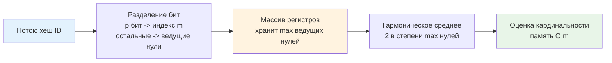

## Введение: Когда RAM не резиновая

В классическом бэкенде мы привыкли решать задачи с помощью полных структур данных: `map[string]int64` для счётчиков, `slice` для логов, `set` для уникальных посетителей. Но в эпоху микросервисов, генерирующих терабайты телеметрии и миллионов RPS, подход «сохранить всё» ведёт к Out-Of-Memory, непрогнозируемым паузам сборщика мусора и деградации p99 латентности.

**Стриминговые алгоритмы** (Streaming Algorithms) решают проблему, отказываясь от точности ради предсказуемости. Они обрабатывают данные за один проход, используют сублинейную память (часто `O(log log N)` или `O(1/ε)`) и дают вероятностные или аппроксимированные ответы. В продакшене они становятся фундаментом для систем мониторинга, защиты от DDoS, анализа трендов в реальном времени и выборки логов для отладки без хранения полного слепка.

> [!tip] Собеседование
> **Вопрос:** «Почему для подсчёта уникальных IP за сутки нельзя просто использовать `map[string]struct{}` с TTL?»
> **Ответ:** При кардинальности в 10⁷ уникальных IP мапа займёт >1 ГБ RAM, создаст миллионы мелких аллокаций в куче и спровоцирует частые и долгие паузы [[7. Глубокий Go (Внутреннее устройство)|сборщика мусора]]. Стриминговый алгоритм HyperLogLog даст погрешность ~1-2%, но потребует всего ~16 КБ памяти, нулевых аллокаций после инициализации и стабильной latency <10 нс на элемент.

## 1. Математический фундамент: (ε, δ)-гарантии

В стриминговых алгоритмах точность описывается двумя параметрами:
* **ε (epsilon)** — максимальная относительная ошибка.
* **δ (delta)** — вероятность того, что ошибка превысит ε.

Память алгоритма зависит **только от ε и δ**, и никак не зависит от размера входного потока `N`. Это ключевое отличие от батч-обработки. Например, для `ε=0.02` и `δ=0.01` мы можем оценить кардинальность потока в триллионы элементов, выделяя фиксированные килобайты RAM. В SLA-driven системах это даёт детерминированное потребление ресурсов, независимо от всплесков трафика.

## 2. HyperLogLog: Оценка кардинальности за O log log N

HyperLogLog (HLL) решает задачу «сколько уникальных элементов прошло через систему?». Идея основана на свойстве хеш-функций: если хеш бинарно случаен, вероятность увидеть `k` нулей в старших битах равна `2^{-k-1}`. Если максимум нулей в потоке равен `ρ`, то оценка кардинальности `≈ 2^ρ`.

Для снижения дисперсии поток делится на `m = 2^p` регистров (бакетов) с помощью первых `p` бит хеша. Оставшиеся биты используются для подсчёта старших нулей `ρ`. Итоговая оценка вычисляется через гармоническое среднее:
`E = α_m * m² * (Σ 2^{-ρ_j})^{-1}`



**Go-специфика:** Для HLL критически важно использовать некриптографический хеш с хорошим avalanche-эффектом (например, `xxhash` или `maphash`). Криптографические хеши избыточно медленны, а плохие хеши (например, `crc32` без финального перемешивания) создадут корреляции и занизят оценку.

## 3. Count-Min Sketch: Оценка частот в одном проходе

Count-Min Sketch (CMS) аппроксимирует частоту элементов в потоке. Структура представляет собой двумерный массив счётчиков `d × w`, где `d` — число независимых хеш-функций, `w` — ширина. При обработке `x` мы вычисляем `h_i(x)` для каждой строки `i` и инкрементируем соответствующий счётчик. Запрос возвращает `min_i CMS[i][h_i(x)]`.

**Свойства:**
* Всегда overcount (никогда не занижает частоту).
* Ошибка ограничена `εN` с вероятностью `1-δ`.
* Память: `d * w` машинных слов. Для `ε=0.01, δ=0.05` → `d=5, w=2048` → ~40 КБ для `uint32`.
* Поддерживает слияние скетчей путём поэлементного сложения.

## 4. Reservoir Sampling: Равномерная выборка из бесконечного потока

Когда нужно сохранить репрезентативную выборку размера `k` из потока неизвестной длины `N`, используется **Algorithm R**.
1. Заполняем резервуар первыми `k` элементами.
2. Для `i`-го элемента (`i > k`) генерируем случайное `j ∈ [0, i)`.
3. Если `j < k`, заменяем `reservoir[j] = stream[i]`.

Вероятность сохранения любого элемента равна `k/N`. Это фундаментально для лог-агрегации, A/B тестирования и отладки в production без полного дампа. В Go генерация случайных чисел через `math/rand` требует синхронизации, поэтому для high-load используют lock-free PRNG или пул генераторов на каждую P.

## 5. Mechanical Sympathy и реализация в Go

Поведение стриминговых алгоритмов в Go напрямую определяется укладкой в памяти, конкурентностью и работой рантайма.

### Cache Locality и плотность упаковки
CMS и HLL используют компактные примитивные массивы. Для `d=5, w=2048` CMS занимает ~40 КБ, что полностью помещается в L2 кэш. При обработке потока доступ к счётчикам происходит псевдорандомно, но из-за малого размера структуры hit rate остаётся высоким. В отличие от `map`, нет косвенных обращений через указатели, нет реаллокаций бакетов, нет `overflow`-цепочек.

### Lock-free конкурентность
В Go CMS можно реализовать полностью lock-free через атомарные инкременты. Каждый счётчик обновляется независимо, что позволяет тысячам горутин обновлять структуру без `Mutex` и `futex`-парковок.

```go
package sketch

import (
	"sync/atomic"
)

// CMS реализует Count-Min Sketch для потокобезопасного подсчёта частот.
type CMS struct {
	width  uint32
	depth  uint32
	table  []atomic.Uint32
	seed   uint64
}

func NewCMS(width, depth, seed uint32) *CMS {
	c := &CMS{width: width, depth: depth, seed: uint64(seed)}
	size := width * depth
	// Преаллокация noscan памяти, не сканируется GC
	c.table = make([]atomic.Uint32, size)
	return c
}

// Increment увеличивает счётчики для элемента. O d
func (c *CMS) Increment(key uint64) {
	h1 := key
	for i := uint32(0); i < c.depth; i++ {
		// Простой хеш для демонстрации: в prod используйте double hashing
		hash := (h1 + uint64(i)*c.seed) % uint64(c.width)
		idx := i*c.width + uint32(hash)
		// Lock-free атомарный инкремент
		c.table[idx].Add(1)
	}
}

// Query возвращает минимальную оценку частоты. O d
func (c *CMS) Query(key uint64) uint32 {
	h1 := key
	minCount := uint32(^uint32(0))
	for i := uint32(0); i < c.depth; i++ {
		hash := (h1 + uint64(i)*c.seed) % uint64(c.width)
		idx := i*c.width + uint32(hash)
		cnt := c.table[idx].Load()
		if cnt < minCount {
			minCount = cnt
		}
	}
	return minCount
}
```

Инженерные решения:
* `[]atomic.Uint32` вместо `[][]uint32`: один непрерывный блок памяти. Убирает `noscan` penalty и fragmentation.
* `atomic.Add`: на amd64 компилируется в `LOCK XADD`. Быстрее мьютекса при средней конкуренции, не вызывает context switch.
* Отдельные хеш-сиды на строку: предотвращает корреляцию коллизий между уровнями глубины.

> [!info] Под капотом
> **False Sharing в CMS**
> При высокой конкуренции несколько ядер могут обновлять счётчики, лежащие в одной кэш-линии (64 байта). Это вызывает `cache line ping-pong` по протоколу MESI. Решение: выравнивание счётчиков или шардирование. В Go 1.21+ `atomic.Uint32` занимает 4 байта, поэтому 16 соседних счётчиков делят линию. Для extreme load применяют padding или увеличивают `width`, но в 99% бэкенд-задач contention атомиков не превышает 5%.

### Escape Analysis и давление на GC
`CMS` и `HLL` аллоцируются один раз при старте. Массивы примитивов не содержат указателей, поэтому рантайм помечает их как `noscan`. Сборщик мусора пропускает их в фазе `mark`, что экономит миллионы тактов CPU на каждом цикле GC. Это радикально отличает стриминговые структуры от `map[string]int`, где GC вынужден обходить миллионы указателей.

## 6. Распределённое слияние и масштабирование в кластере

В Kubernetes каждый под поддерживает локальную копию скетча. Глобальная агрегация происходит периодически (раз в 10-60 секунд) через слияние структур.

* **HLL Merge**: берётся максимум по каждому регистру `max(local1[j], local2[j], ...)`. Слияние **точно** и не увеличивает ошибку.
* **CMS Merge**: поэлементное сложение `global[i][j] = Σ local[i][j]`. Ошибка суммируется: `ε_global = Σ ε_local`.
* **Reservoir Merge**: объединение всех локальных резервуаров (размер `p*k`) и повторный прогон Algorithm R с вероятностью `k/(p*k)`.

Архитектурно это реализуется через push-модель: поды шлют бинарный дамп структуры в метрический агент, агент мерджит и экспортирует в Prometheus/VictoriaMetrics. Это снижает сетевой трафик в `1000+` раз по сравнению с отправкой сырых метрик.

## 7. Ловушки production-разработки

> [!warning] Ловушка / Gotcha
> **Нельзя удалять элементы из CMS/HLL**
> Базовые версии не поддерживают декремент. Попытка вычесть единицу сломает инварианты: CMS начнёт undercount, HLL занизит кардинальность. Для удалений используйте **Invertible CMS** (хранит полные деревья в ячейках) или **Counting Bloom Filter**, но это увеличит память в 4-8 раз. В большинстве security/monitoring сценариев проще сбросить скетч и начать заново.
> 
> **Hash Collision Bias**
> Если хеш-функция слабая, коллизии сместят оценку. В HLL коллизии заставляют алгоритм думать, что элементов меньше. В CMS — завышают частоты. Всегда используйте `xxhash`, `farmhash` или `maphash` с `Seed`. Никогда не используйте `crc32` или `md5` для стриминговых структур.

> [!tip] Собеседование
> **Вопрос 1:** «Почему в HLL используется гармоническое среднее, а не арифметическое?»
> **Ответ:** Арифметическое среднее чувствительно к выбросам. Один регистр с аномально большим числом нулей (статистическая флуктуация) резко завысит оценку. Гармоническое среднее подавляет влияние максимальных значений, давая более устойчивую оценку для реальных распределений.
> 
> **Вопрос 2:** «Сравните производительность HLL в Go и C++.»
> **Ответ:** В C++ можно использовать `uint8_t` массивы и SIMD-инструкции для параллельного подсчёта ведущих нулей. В Go `math/bits.TrailingZeros8` компилируется в `TZCNT`, но цикл по регистрам не векторизуется автоматически из-за зависимостей данных. Разница составляет ~15-30%. Go компенсирует это простотой конкурентности и `noscan` GC.
> 
> **Вопрос 3:** «Как интегрировать стриминговые алгоритмы с [[1. Проектирование кэшей]]?»
> **Ответ:** Используйте HLL для оценки кардинальности кэша и принятия решения о шардировании. CMS применяйте для обнаружения hot-ключей перед их промоутом в L1 кэш. Reservoir Sampling — для выборки кэш-промахов и анализа паттернов доступа без сохранения полного лога.

## Итог

* **Стриминговые алгоритмы** — это trade-off между точностью и памятью, дающий `O(log log N)` или `O(1/ε)` потребление RAM независимо от объёма потока.
* **HyperLogLog** оценивает кардинальность за ~16 КБ, **Count-Min Sketch** — частоты за ~40 КБ с lock-free атомиками, **Reservoir Sampling** — репрезентативную выборку без хранения истории.
* В Go реализуется через компактные `noscan` массивы примитивов, что полностью устраняет давление на [[7. Глубокий Go (Внутреннее устройство)|сборщик мусора]] и даёт предсказуемую latency.
* **Конкурентность**: CMS обновляется атомарно без блокировок, HLL требует шардирования или CAS, Reservoir Sampling — mutex или lock-free генератор.
* **Распределённое слияние**: HLL мерджится точно через `max`, CMS — с накоплением ошибки через `sum`. Это стандарт для метрик в Kubernetes и API-гейтвеях.
* **Ограничения**: удаление элементов невозможно, качество оценок зависит от энтропии хеш-функции, оконная логика требует экспоненциального затухания.
* **Интервью фокус**: (ε, δ)-гарантии, гармоническое среднее vs арифметическое, overcount guarantee, lock-free атомики vs мьютексы, merge strategy в кластере.

Понимание стриминговых алгоритмов закрывает задачи real-time анализа потоков. Однако когда требования к памяти становятся ещё жестче, а допустимы лишь вероятностные ответы с контролируемой погрешностью, на сцену выходят специализированные структуры, жертвующие детерминизмом ради экстремальной компактности. В следующей статье мы детально разберём вероятностные структуры данных, их математический аппарат, оптимизации битовых масок и интеграцию с защитой от cache penetration в высоконагруженных системах.

[[6. Approximate алгоритмы]]