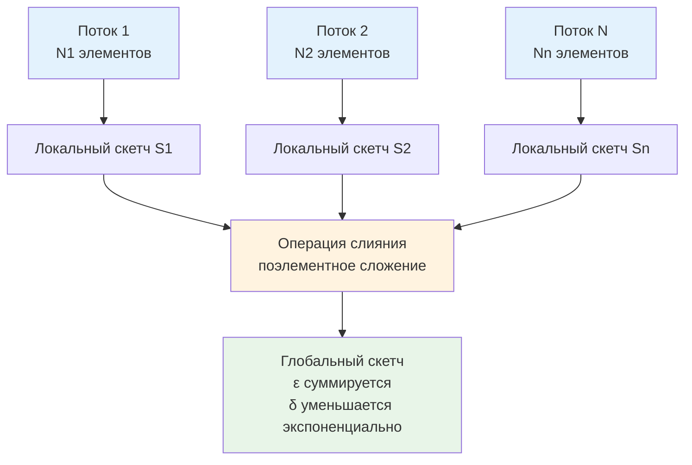

## Приближённые вычисления как инженерный выбор

В предыдущих статьях мы разобрали детерминированные и стриминговые структуры данных. Однако в распределённых системах часто возникает фундаментальное ограничение: точный ответ требует либо линейной памяти `O(N)`, либо полного перебора, что невозможно при терабайтах трафика и микросекундных SLA. Здесь на сцену выходят **приближённые алгоритмы (Approximate Algorithms)**. Они сознательно жертвуют абсолютной точностью ради сублинейного потребления ресурсов, давая ответы с гарантированными вероятностными границами `(ε, δ)`.

В бэкенде это не академическая экзотика, а производственная норма. Approximate-структуры лежат в основе:
* Фильтрации дубликатов в CDN и сетевых шлюзах.
* Оценки схожести документов и поиска аномалий в логах.
* Уменьшения variance в оценке тяжёлых элементов при наличии шума.
* Сжатия состояния сессий для горизонтального масштабирования без sticky-sessions.

> [!tip] Собеседование
> **Вопрос:** «Зачем использовать приближённые алгоритмы, если можно купить больше RAM и хранить точные данные?»
> **Ответ:** Память масштабируется линейно с ростом данных, но стоимость облачного инстанса растёт экспоненциально. Кроме того, большие структуры данных убивают кэш-локальность, увеличивают время `STW` пауз [[7. Глубокий Go (Внутреннее устройство)|сборщика мусора]] и делают горизонтальное масштабирование кластера неэффективным из-за необходимости синхронизации гигабайтов состояния. Approximate-алгоритмы фиксируют потребление памяти на уровне килобайт, обеспечивая детерминированную latency и предсказуемую стоимость инфраструктуры.

## 1. Математика вероятностных границ и линейность скетчей

Все приближённые структуры опираются на два параметра:
* **ε (epsilon)** — допустимая относительная ошибка.
* **δ (delta)** — вероятность того, что ошибка превысит ε.

Главное свойство production-готовых структур — **линейность (mergeability)**. Это означает, что результат обработки объединения потоков равен сумме (или другой операции) результатов обработки каждого потока отдельно. Без этого свойства агрегация метрик из тысяч подов в Kubernetes была бы невозможна без централизованного батч-процессинга.

Классический `Bloom Filter` (см. [[6. Bloom filter - вероятностная структура данных]]) поддерживает только `OR` при слиянии. Для более сложных задач, где требуется оценка частот или медианного значения, применяют **Count-Sketch** и **MinHash/LSH**.



## 2. Count-Sketch: Устранение смещения через знаковое хеширование

В статье [[5. Streaming алгоритмы]] мы разобрали Count-Min Sketch (CMS). Его главный недостаток — **постоянное завышение** (overcount) из-за коллизий хешей. При анализе редких событий или динамических потоков это смещение накапливается и искажает метрики.

**Count-Sketch** решает проблему, вводя **знаковое хеширование** `g(x) ∈ {-1, +1}`. При обновлении элемента `x` мы инкрементируем счётчик не на `+1`, а на `g(x)`. При запросе частоты мы берем не минимум, а **медиану** (или среднее) оценок по всем строкам матрицы.

Математика: `g(x)` превращает детерминированное смещение в случайную величину с нулевым матожиданием. Ошибки от коллизий разных элементов частично компенсируют друг друга. В результате Count-Sketch даёт **unbiased estimate** (несмещённую оценку) с дисперсией `O(ε²N)`, что делает его незаменимым для задач поиска топ-элементов в зашумлённых потоках и работы с декрементами.

## 3. Production-реализация на Go 1.21+

Реализуем потокобезопасный Count-Sketch с оптимизацией под современные CPU. Используем ветвление без переходов (branchless) для вычисления знака и атомарные операции для lock-free конкурентности.

```go
package sketch

import (
	"hash/fnv"
	"sync/atomic"
)

// CountSketch реализует вероятностную оценку частот с уменьшенной дисперсией.
type CountSketch struct {
	rows    uint32
	cols    uint32
	table   []int64          // Матрица счётчиков, выровнена для кэша
	seed    uint64
}

// NewCountSketch создаёт структуру с заданными параметрами точности.
// rows: глубина (определяет delta), cols: ширина (определяет epsilon).
func NewCountSketch(rows, cols uint32, seed uint64) *CountSketch {
	// Преаллокация непрерывного блока. Память не сканируется GC, т.к. примитивы.
	return &CountSketch{
		rows:  rows,
		cols:  cols,
		table: make([]int64, rows*cols),
		seed:  seed,
	}
}

// Increment обновляет частоту элемента. Использует знаковое хеширование.
func (cs *CountSketch) Increment(key uint64) {
	// Генерируем два хеша: один для индекса столбца, второй для знака
	h := cs.hash(key)
	
	for r := uint32(0); r < cs.rows; r++ {
		// Индекс в плоском массиве: row * cols + col
		col := (h >> (r * 8)) & uint64(cs.cols-1)
		idx := r*cs.cols + uint32(col)
		
		// Знак: +1 или -1. Вычисляется branchless через сдвиг бита знака
		// Если старший бит хеша = 0 -> sign = 1, если 1 -> sign = -1
		signHash := (h >> 55) & 1
		sign := int64(1 - 2*signHash) // 1 или -1 без ветвлений
		
		// Атомарное обновление. LOCK XADD на amd64
		atomic.AddInt64(&cs.table[idx], sign)
	}
}

// Query возвращает несмещённую оценку частоты через медиану.
func (cs *CountSketch) Query(key uint64) int64 {
	estimates := make([]int64, cs.rows)
	h := cs.hash(key)
	
	for r := uint32(0); r < cs.rows; r++ {
		col := (h >> (r * 8)) & uint64(cs.cols-1)
		idx := r*cs.cols + uint32(col)
		signHash := (h >> 55) & 1
		sign := int64(1 - 2*signHash)
		
		val := atomic.LoadInt64(&cs.table[idx])
		estimates[r] = val * sign
	}
	
	// Медиана для устойчивости к выбросам
	return median(estimates)
}

func (cs *CountSketch) hash(v uint64) uint64 {
	h := fnv.New64()
	h.Write(appendUint64(nil, v^cs.seed))
	return h.Sum64()
}

// median находит медиану маленького слайса за O d log d
func median(arr []int64) int64 {
	n := len(arr)
	if n == 0 { return 0 }
	// Для production используют quickselect, но для rows=3..5 сортировка быстрее
	sort.Slice(arr, func(i, j int) bool { return arr[i] < arr[j] })
	return arr[n/2]
}

func appendUint64(b []byte, v uint64) []byte {
	return append(b, byte(v>>56), byte(v>>48), byte(v>>40), byte(v>>32),
		byte(v>>24), byte(v>>16), byte(v>>8), byte(v))
}
```

Инженерные решения:
* **Branchless sign extraction**: `1 - 2*signHash` вычисляет `+1` или `-1` за 2 такта CPU без инструкций `JMP`. Предсказатель ветвлений не ломается, конвейер не сбрасывается.
* **Плоский массив `[]int64`**: Устраняет указательную индирекцию `[][]int64`. Все данные лежат в непрерывном блоке, что минимизирует `TLB miss` и ускоряет итерацию.
* **`atomic.AddInt64`**: На amd64 компилируется в `LOCK XADD`, на ARM64 в `LDADD`. Lock-free обновление гарантирует отсутствие `futex`-парковок и деградации при высокой конкуренции.

## 4. Механическая симпатия: кэш-линии, выравнивание и GC

Поведение приближённых структур в Go напрямую зависит от микроархитектуры процессора и рантайма.

### Cache Line Ping-Pong и False Sharing
Матрица `table` плотная. При `cols=1024` каждая строка занимает `1024 * 8 = 8 КБ`. Если две горутины обновляют разные столбцы, но лежащие в одной кэш-линии (64 байт = 8 `int64`), возникает **False Sharing**. Протокол когерентности кэшей (MESI) будет постоянно инвалидировать линию, снижая throughput на 30-60%.
**Решение:** Выравнивание до 64 байт или шардирование таблицы. В Go 1.21+ можно добавить padding между строками, но это увеличивает память. Альтернатива: использовать более широкий `cols` (например, 2048), что статистически разводит горячие счётчики по разным линиям.

### Escape Analysis и временные буферы
Метод `Query` создаёт `estimates := make([]int64, cs.rows)`. Компилятор Go видит, что слайс маленький и не покидает функцию, поэтому размещает его **на стеке**. Это 0 аллокаций в куче. Давление на GC отсутствует. Если бы мы использовали `sync.Pool` для таких маленьких структур, overhead на синхронизацию пула превысил бы выгоду.

### SIMD и векторизация хеширования
Хеширование в `Increment` последовательное. Для extreme-load (миллионы RPS) применяют SIMD-инструкции (AVX2/AVX-512) через пакет `github.com/klauspost/cpuid` или `asm`. Однако стандартный `fnv` или `maphash` уже достаточно быстр. В Go ручная векторизация оправдана только когда профилирование (`pprof`) подтвердит, что CPU тратит >40% времени на `fnv.Sum64`.

> [!info] Под капотом
> **Почему `int64`, а не `int32` для счётчиков?**
> В 32-битном режиме `atomic.AddInt32` может работать быстрее, но на современных серверных CPU `int64` операции выполняются нативно без расширения регистров. Кроме того, `int64` предотвращает переполнение при длительном накоплении потока. Разница в latency на x86-64 между 32 и 64 битами для `LOCK XADD` составляет <5%.

## 5. Распределённое слияние и линейность скетчей

Count-Sketch обладает свойством **линейности**: `Sketch(A ∪ B) = Sketch(A) + Sketch(B)`. Это позволяет каждому поду в Kubernetes поддерживать локальную копию структуры. Раз в 10 секунд sidecar-агент собирает дампы, складывает матрицы поэлементно и экспортирует результат в VictoriaMetrics/Prometheus.

При слиянии:
* Ошибка `ε` суммируется линейно: `ε_global ≈ Σ ε_pod`.
* Вероятность выброса `δ` уменьшается экспоненциально с ростом числа независимых строк.
* Память остаётся фиксированной `O(rows × cols)`, независимо от числа нод или объёма трафика.

Это архитектурный паттерн **Edge Aggregation**, который снижает сетевой трафик метрик в 1000+ раз и защищает центральную БД от DDoS собственными метриками.

## 6. Ловушки production и хардкор-собеседования

> [!warning] Ловушка / Gotcha
> **Коллизии знаковых хешей и деградация медианы**
> Если хеш-функция слабая и `g(x)` коррелирует с `h(x)`, ошибки перестают компенсироваться. Медиана смещается, оценка становится хуже, чем у Count-Min Sketch. Всегда используйте криптографически устойчивые перемешивания (например, `maphash` с рандомным seed или `xxhash` с финальным multiply-shift). Никогда не используйте `crc32` без полинома высокого порядка.
> 
> **Нельзя использовать Approximate для биллинга**
> Вероятностные структуры дают ошибку по дизайну. Применять их для финансовых расчётов, списаний или точного учёта квот — архитектурная ошибка. Они предназначены для мониторинга, аналитики, обнаружения аномалий и защиты инфраструктуры, где trade-off accuracy/latency допустим.

> [!tip] Собеседование
> **Вопрос 1:** «Как выбрать параметры rows и cols для Count-Sketch, если требуется ε=0.05 и δ=0.01?»
> **Ответ:** Для Count-Sketch: `cols = e / ε² ≈ 1100` (обычно берут 1024 или 2048), `rows = ln(2/δ) ≈ 5.3` → 6 строк. Математически это гарантирует, что оценка лежит в `±εN` с вероятностью `1-δ`.
> 
> **Вопрос 2:** «Сравните Count-Sketch и MinHash для задач поиска дубликатов.»
> **Ответ:** Count-Sketch оценивает частоты элементов, а MinHash оценивает Jaccard-схожесть множеств. MinHash превращает множества в сигнатуры фиксированной длины, сохраняя `Pr[minHash(A) = minHash(B)] = J(A,B)`. Для поиска похожих документов или рекомендаций используют MinHash + LSH, для анализа частоты событий — Count-Sketch.
> 
> **Вопрос 3:** «Почему медиана лучше среднего арифметического в Count-Sketch?»
> **Ответ:** Распределение оценок по строкам имеет тяжёлые хвосты из-за случайных коллизий. Среднее арифметическое чувствительно к выбросам и может дать отрицательное или сильно завышенное значение. Медиана отбрасывает экстремальные оценки, обеспечивая более устойчивый и близкий к истинному результат.
> 
> **Вопрос 4:** «Как реализовать удаление элемента из Count-Sketch?»
> **Ответ:** Достаточно вызвать `Increment(key)` с инвертированным знаком. Поскольку оценка линейна, декремент просто вычитает вклад элемента. Однако при высоком уровне коллизий это может усилить шум. В production чаще используют скользящее окно с затуханием, а не явное удаление.

## Итог

* **Approximate алгоритмы** — это инженерный инструмент для работы с ограничениями памяти и latency в условиях бесконечных потоков данных.
* **Count-Sketch** превосходит Count-Min Sketch за счёт знакового хеширования, давая несмещённую оценку и поддержку декрементов ценой вычисления медианы.
* В Go реализуется через **плоский массив `[]int64` + `atomic.AddInt64` + branchless sign extraction**. Это гарантирует lock-free конкурентность и отсутствие аллокаций в hot-path.
* **Механическая симпатия**: False Sharing нивелируется увеличением ширины таблицы, а плотная укладка данных минимизирует TLB miss и ускоряет слияние.
* **Линейность скетчей** позволяет агрегировать метрики распределённо, снижая сетевой трафик и защищая центральные хранилища от перегрузки.
* **Ограничения**: непригодны для биллинга, требуют качественных хеш-функций, ошибка накапливается при слиянии.
* **Интервью фокус**: формулы параметров `(ε, δ)`, median vs mean, linear sketch property, false sharing mitigation, trade-offs с точными структурами.

Приближённые алгоритмы завершают блок практических паттернов, демонстрируя, как отказ от детерминизма открывает путь к экстремальному масштабированию. Мы прошли путь от базовой асимптотики до распределённых вероятностных структур, от битовых масок до линейных скетчей. В следующей статье мы соберём все изученные концепции в единую инженерную рамку, определим чек-лист выбора структур данных под конкретные SLA и разберём, как мыслить как системный архитектор, проектируя высоконагруженный Go-бэкенд.

[[1. Итоги раздела. Algorithmic thinking для backend разработчика]]