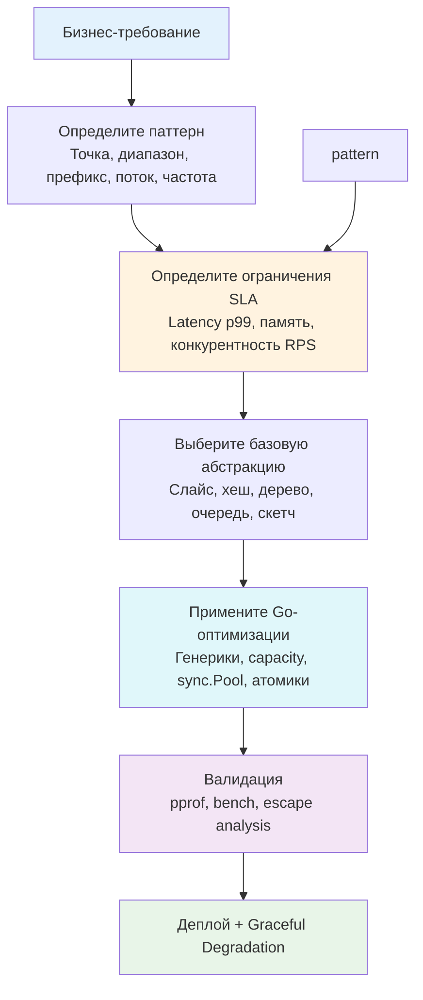

## От теории к продакшену: что такое алгоритмическое мышление

Прохождение этого раздела не должно сводиться к заучиванию реализации `QuickSort` или запоминанию формул хеш-функций. Настоящее **алгоритмическое мышление** для бэкенд-разработчика уровня Senior/Lead — это способность мгновенно переводить бизнес-требования и SLA на язык структур данных, предвидеть их поведение под нагрузкой и осознанно идти на инженерные компромиссы.

Учебники по алгоритмам учат нас искать «правильный» ответ. В продакшене правильных ответов не существует. Существуют лишь оптимальные решения для конкретного контекста: объёма данных, паттерна доступа, лимитов памяти, требований к согласованности и архитектуры рантайма. В этой статье мы соберём всё изученное в единую операционную систему принятия решений.

### 1. Пять столпов инженерного выбора

Каждое решение о выборе структуры данных в высоконагруженном Go-сервисе должно проходить проверку по пяти осям:

1. **Паттерн доступа важнее асимптотики**  
   Линейный обход `slice` часто быстрее `map` для `N < 1000` благодаря предсказуемому префетчингу кэш-линий. Бинарный поиск по отсортированному массиву выигрывает у `tree` из-за отсутствия pointer chasing. Всегда спрашивайте: «Как данные читаются и пишутся?» до того, как спросите «Какова сложность?».

2. **Иерархия памяти диктует латентность**  
   `O(1)` в мапе ≠ `O(1)` в регистрах. Разыменование указателя в случайном месте кучи стоит ~100-300 нс (ожидание RAM). Чтение из L1-кэша — 3-4 такта. Плотные массивы, `noscan` аллокации и отказ от лишних указателей дают выигрыш в 10-50x реального времени, даже если Big O остаётся одинаковым. Подробнее см. [[4. Пространственная сложность и cache locality]].

3. **Конкурентность ломает детерминизм**  
   Глобальный `sync.Mutex` убивает p99 при >20k RPS. Шардирование, `sync/atomic`, lock-free очереди и backpressure через `chan` или `cond` превращают теоретические структуры в production-компоненты. Конкурентность требует жертв: либо точность глобального порядка, либо консистентность, либо сложность реализации.

4. **Приближённое часто лучше точного**  
   Когда кардинальность данных растёт быстрее, чем бюджет на RAM, `map[string]int` становится врагом. HyperLogLog, Count-Sketch, Bloom Filter и Space-Saving дают контролируемую погрешность `ε`, фиксируя память на уровне килобайт. Это не «костыль», а архитектурный паттерн для масштабируемой аналитики и защиты инфраструктуры. См. [[6. Approximate алгоритмы]].

5. **Рантайм Go — не абстрактная машина Тьюринга**  
   Сборщик мусора, Escape Analysis, реаллокация слайсов, мапы с бакетами, таймеры в `netpoll` — всё это влияет на производительность. Код, идеальный в C++, может проиграть в Go из-за скрытых аллокаций интерфейсов или давления на GC. Код, идеальный в Python, может проиграть из-за отсутствия инлайна и GIL. Писать на Go идиоматично — значит дружить с его рантаймом, а не бороться с ним.

### 2. Чеклист проектирования структур данных

При получении новой задачи проходите через этот алгоритм. Он покрывает 95% реальных сценариев.

**Шаг 1: Классификация доступа**
*   **Точечный поиск/вставка по ключу:** `map` (если `N` мало/средне) → Sharded map или Concurrent map (если `N` велико и запись частая) → Bloom Filter + Cache (если память ограничена).
*   **Диапазонные запросы / сортировка:** Отсортированный `slice` + `sort.Search` → Fenwick/Segment Tree (если данные меняются) → B-Tree/B+Tree (если данные на диске/в БД).
*   **Приоритетная обработка / Top-K:** `container/heap` или кастомная куча → Space-Saving / Count-Min Sketch (если `K` неизвестно или память ограничена).
*   **Поток / FIFO / Backpressure:** `chan` → Кольцевой буфер → Linked List (только если вставки в середину критичны).
*   **Префиксы / маршрутизация / автодополнение:** Trie / Radix Tree → Consistent Hash Ring (если распределённая маршрутизация).

**Шаг 2: Проверка на механическую симпатию**
*   Можно ли хранить данные в contiguous memory? (Да → slice, Нет → структура с указателями)
*   Вызывает ли структура частые мелкие аллокации? (Да → sync.Pool, арена, или prealloc)
*   Будет ли сканирование GC замедлять систему? (Да → убрать указатели, использовать `[]int64`/`[]uint8`, применить `noscan` паттерны)
*   Где bottleneck: CPU, RAM, I/O, или блокировки? (Определите через `pprof` до написания кода)

**Шаг 3: Выбор стратегии конкурентности**
*   Read-heavy → `sync.RWMutex` или lock-free чтение через `atomic.Pointer`.
*   Write-heavy → Шардирование + локальные мьютексы.
*   Producer-Consumer → Буферизованные каналы или lock-free очереди (MPSC).
*   Глобальное состояние → Избегать. Использовать eventual consistency, gossip или централизованный кэш.

### 3. Реальность Go: где учебники врут

| Учебная концепция | Реальность Go-бэкенда | Почему |
|-------------------|------------------------|--------|
| «Map всегда O 1» | O 1 амортизированно, но с константой 5-10x из-за хеширования, бакетов и коллизий. При росте вызывает реаллокацию и паузы GC. | Внутренняя `hmap`, overflow-бакеты, `sync.Mutex` внутри рантайма для map growth. |
| «LinkedList O 1 вставка» | На практике в 5-10x медленнее slice из-за cache miss, указательного chasing и фрагментации кучи. Использовать только для LRU/LFU или специфичных паттернов. | `container/list` аллоцирует узлы отдельно. CPU ждёт RAM. |
| «Рекурсия чище итерации» | В Go рекурсия растит стек, мешает инлайну, создаёт `morestack`-переходы. Итерация всегда предпочтительна в hot-path. | Динамический стек Go начинается с 2 КБ. Глубокая рекурсия = аллокации + переключение контекста. |
| «Интерфейсы дают гибкость» | `any`/`interface{}` создаёт 16-байтовый дескриптор и аллокацию значения в кучу. Дженерики `T` устраняют этот overhead. | Escape Analysis не может оптимизировать boxing. `container/heap` vs generic heap. |
| «Точность всегда важна» | Для метрик, rate-limiting, поиска аномалий и защиты от DDoS приближённые алгоритмы стабильнее, дешевле и масштабируемее. | Линейность скетчей, фиксированная память, независимость от N. |

> [!tip] Собеседование
> **Вопрос:** «Как бы вы спроектировали систему кэширования сессий для 10 млн активных пользователей с TTL 30 минут и гарантией O 1 доступа?»
> 
> **Слабый ответ:** «Возьму Redis и буду хранить map[SessionID]User».
> 
> **Сильный ответ:** «Архитектурно: L1 local cache на поде + L2 distributed cache (Redis Cluster). В L1 использую sharded LRU/LFU кэш с `sync.Pool` для структур сессий, чтобы снизить GC pressure. В L2 — Redis с hash-маппингом и pipeline-запросами. Для защиты от cache stampede применю `singleflight`, для предотвращения avalanche добавлю jitter в TTL. Если требуется строгая консистентность — использую Outbox pattern или CDC. Память ограничу через `GOMEMLIMIT` и eviction callback'и. Профилирование через pprof и метрики hit/miss rate будут встроены в Observability стек».

### 4. Интервью vs Продакшен: разрыв шаблонов

На собеседованиях оценивают **способность рассуждать**. В продакшене оценивают **способность не ломать систему**.

| Критерий | Собеседование | Продакшен |
|----------|---------------|-----------|
| Фокус | Корректность, сложность, edge cases | SLA, p99 latency, memory footprint, graceful degradation |
| Ошибки | Штраф за неправильную Big O | Штраф за отсутствие fallback, circuit breaker, логов |
| Выбор структуры | «Самая быстрая по теории» | «Самая предсказуемая по метрикам и простая в поддержке» |
| Конкурентность | «Оберну в Mutex» | «Шардирование, атомики, lock-free, backpressure, graceful shutdown» |
| Оптимизация | Ручные битовые хаки | Профилирование → инлайн → аллокатор → кэш → архитектура |

Главный навык Senior/Lead инженера — **умение сказать «нет» переоптимизации**. Если `slice` + `sort` решает задачу за 2 мс при нагрузке 100 RPS, писать кастомную lock-free radix tree — архитектурный debt. Оптимизировать нужно только то, что подтверждено профилировщиком. Но быть готовым заменить примитив на сложную структуру, когда профилировщик покажет bottleneck — это обязательная компетенция.

### 5. Итог: Ваш путь к Senior/Lead

Этот раздел дал вам не набор готовых рецептов, а **инструментарий принятия решений**. Вы научились:
*   Связывать Big O с тактами CPU, кэш-линиями и паузами [[7. Глубокий Go (Внутреннее устройство)|сборщика мусора]].
*   Выбирать между точностью и памятью, используя стриминговые и вероятностные структуры.
*   Писать конкурентный код, который масштабируется, а не блокируется.
*   Проектировать структуры, которые дружат с планировщиком Go, `netpoll` и аппаратным префетчингом.
*   Отличать академическую задачу от production-требования и аргументировать trade-offs.

Алгоритмическое мышление — это не финальная точка, а фундамент. На нём строятся:
*   **Проектирование БД**: индексы B-Tree/LSM, партиционирование, шардирование, планировщики запросов. [[12. Базы данных]]
*   **Системная архитектура**: распределённые очереди, консенсус, балансировка, отказоустойчивость. [[11. Архитектура и System Design]]
*   **Надёжность**: rate limiting, кэширование, graceful shutdown, observability. [[1. Проектирование кэшей]], [[2. Rate limiting алгоритмы]], [[16. Профилирование, отладка и производительность]]

Когда вы смотрите на код и видите не просто «функции», а потоки данных, аллокации, переходы между кэшами и состояние мьютексов — вы перешли на следующий уровень. Теперь каждый ваш коммит будет нести в себе инженерную глубину, а не просто синтаксическую корректность.

База знаний по DSA завершена. Вы готовы применять эти принципы к реальным системам, проектировать высоконагруженные сервисы и проходить хардкорные технические интервью без страха и догадок.