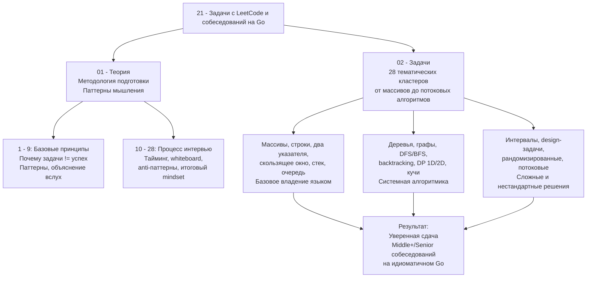

Добро пожаловать в раздел, который завершает фундамент вашей подготовки к карьере Senior/Lead Go-инженера, — алгоритмические собеседования. Если предыдущие разделы давали понимание «как работает Go под капотом», «как строить распределённые системы» и «как обеспечивать наблюдаемость», то этот раздел учит главному: **как пройти фильтр найма в топовые технологические компании**, оставаясь при этом идиоматичным Go-разработчиком.

Многие относятся к LeetCode как к неизбежному злу — заучивают решения, механически таскают задачи и выгорают. Мы пойдём иначе. Этот раздел — не свалка разборов, а **система формирования алгоритмического мышления**, спроектированная специально для тех, кто пишет на Go и целится на позиции уровня Middle+/Senior.

## Почему алгоритмические собеседования всё ещё актуальны для Go-разработчика

Go — прагматичный язык. Его создатели намеренно отказались от дженериков на 10 лет, оставили слайсы и мапы как единственные «сложные» структуры в стандартной библиотеке и не стали встраивать функциональное программирование. Поэтому может показаться, что алгоритмические задачи не нужны: есть горутины, каналы и gRPC, иди пиши бизнес-логику. Но реальность жёстче.

- **Фундаментальные ограничения никуда не делись.** Планировщик горутин не превращает O(N²) в O(N log N). Топовые проекты (Kubernetes, Docker, CockroachDB) содержат внутри реализацию красно-чёрных деревьев, консистентного хэширования и Raft — всё это основано на глубоком понимании DSA.
- **Собеседования в FAANG и компании их уровня не делают скидок.** Если вы проходите в Google на позицию Senior Software Engineer (Go), вам предстоит решать те же задачи, что и Java/C++/Python-кандидатам. Только вы обязаны показать не просто работающий код, а **идиоматичный Go-код**, учитывающий escape analysis, минимизацию аллокаций и корректное использование стандартной библиотеки.
- **Сеньорство — это умение выбрать правильную структуру данных под нагрузкой.** Когда ваш микросервис начинает обрабатывать 100 000 запросов в секунду, разница между `[]int` и `map[int]struct{}`, между `sort.Search` и ручным бинарным поиском, между копией строки и `unsafe.String` становится критичной. И именно способность видеть эти различия и принимать аргументированные решения отличает Senior от Middle.

## Что внутри этого раздела

Раздел структурно разделён на две большие части: **Теория** (где вы сейчас находитесь) и **Задачи**, организованные по тематическим кластерам.



**Теоретический блок** — это не «прочитай и забудь». Это тренировка софт-скиллов, критически важных на реальном интервью: как думать вслух, как распознавать паттерн, как не завалить задачу из-за волнения, даже когда решение очевидно. Без этой базы ваши 400 решённых задач могут не конвертироваться в оффер.

**Практический блок** — 28 кластеров, каждый из которых содержит статью с теорией по структуре данных или алгоритму и набор тщательно отобранных задач с LeetCode. Мы не дублируем документацию: теория подаётся через призму Go-специфики, механической симпатии и частых ошибок на собеседованиях.

> [!NOTE]
> Все задачи в этом разделе разбираются с полным циклом:
> формулировка → наивное решение → анализ узких мест → оптимизация → идиоматичный Go-код → анализ сложности. Вы увидите, как один и тот же алгоритм может быть написан по-разному и как выбор структуры влияет на аллокации и производительность.

## Почему Go — особый случай на алгоритмическом собеседовании

Большинство кандидатов выбирают Python за лаконичность или Java/C++ за богатство стандартной библиотеки. Go занимает промежуточную нишу, и это накладывает отпечаток на стратегию решения.

**Преимущества Go на интервью:**

- **Минималистичный синтаксис.** Нет классов, наследования, исключений. Код получается плоским, линейным и очень прозрачным. Интервьюер быстрее понимает вашу логику.
- **Слайсы как универсальный инструмент.** Большинство задач на массивы, стеки, очереди и даже деревья (через срезы указателей) решаются с помощью `[]T`. Вам не нужно помнить пять разных коллекций — только одну.
- **Единый тулинг.** `go fmt`, `go vet`, встроенное тестирование. Ваш код на доске (или в веб-редакторе) будет выглядеть аккуратно уже на этапе набора.
- **Быстрая компиляция и выполнение.** В задачах, где O(N) с маленькой константой решает, Go почти всегда проходит по времени без микрооптимизаций.

**Подводные камни и ограничения:**

- **Отсутствие встроенных структур данных.** В Go нет TreeSet, PriorityQueue и Deque «из коробки». Для кучи есть `container/heap`, но интерфейс требует ручной реализации `Len`, `Less`, `Swap`, `Push`, `Pop`. На интервью это съедает драгоценные минуты. Мы научим вас писать обёртки, которые занимают 10–15 строк и не вызывают вопросов.
- **Нет дженериков для алгоритмов (до Go 1.18).** Даже сейчас многие платформы поддерживают Go не старше 1.17. Мы будем показывать как дженерик-решения, так и решения с пустыми интерфейсами, чтобы вы были готовы к любому окружению.
- **Строки иммутабельны, а слайсы — ссылочный тип.** Это приводит к тонким ошибкам: вы хотели скопировать строку, а получили ссылку на исходные данные; вы модифицировали подслайс, и изменился основной массив. Мы разберём каждую такую ситуацию в соответствующих задачах.

> [!warning] Ловушка / Gotcha
> **Срезы и утечки памяти**
> ```go
> func getFirstBytes(data []byte, n int) []byte {
>     return data[:n]
> }
> ```
> Если `data` — это большой буфер, возвращённый срез продолжает удерживать в памяти весь исходный массив, даже когда вам нужны только первые `n` байт. На собеседовании вас могут спросить: «Как эта функция взаимодействует с GC?». Ответ: утечка памяти, если `data` больше не используется, но GC не освободит его, потому что есть ссылка на его часть. Решение: явное копирование.
> В разделе мы часто будем обсуждать подобные нюансы, потому что Senior обязан видеть влияние кода на рантайм.

## Mechanical Sympathy: Почему важно думать о памяти даже в LeetCode

Алгоритмические задачи, особенно на платформах вроде LeetCode, оцениваются по времени выполнения. Память — вторична, пока не выходит за жёсткий лимит. Но вы идёте на позицию Go-разработчика, а не просто «решателя задач». Ваш код будут читать Senior Go-инженеры, для которых каждая лишняя аллокация — красный флаг.

- **Escape Analysis.** Компилятор Go решает, выделять переменную в куче или на стеке. Если вы создаёте срез внутри функции и возвращаете его — он уходит в кучу. Если вы используете `var buf [64]byte` и оперируете внутри функции — остаётесь на стеке. В задачах, где допустимо использование массивов фиксированного размера, мы будем показывать zero-allocation подходы.
- **Рост слайса.** `append` удваивает вместимость при нехватке места и копирует данные. В циклических задачах это может дать O(N²) скрытых операций. Мы научимся предварительно выделять память через `make([]int, 0, expectedSize)`.
- **Строки и `[]byte`.** Конвертация строки в `[]byte` и обратно всегда аллоцирует копию. В задачах на парсинг это может стать узким местом. Где уместно, будем использовать `unsafe.String` (допустимо в LeetCode-решениях, но всегда с пояснением, почему это безопасно в данном контексте) или `bytes.Buffer`.

> [!tip] Собеседование
> **Вопрос с реального интервью (Senior Go, Cloud Infrastructure):**
> «Вы написали функцию, которая принимает слайс слайсов `[][]int` и возвращает транспонированную матрицу. Какие оптимизации по памяти вы можете предложить?»
> Ответ должен включать:
> 1. Снижение аллокаций через предварительное выделение памяти.
> 2. Использование `copy` вместо поэлементного присваивания в цикле (если применимо).
> 3. Обсуждение возможности in-place транспонирования для симметричных матриц.
> 4. Упоминание, что `make([][]int, n)` создаёт слайс заголовков, а не непрерывный кусок памяти, и как это влияет на cache locality.

Именно этим мы и займёмся во всём разделе — не поверхностным «вот решение», а глубоким погружением в инженерную суть каждого алгоритма на Go.

## Как построить подготовку с помощью этого раздела

Не пытайтесь пройти все задачи подряд. Раздел спроектирован для трёх фаз:

1. **Освоение методологии (01. Теория).** Прочитайте все статьи этого блока, даже если кажется, что «я и так умею думать». Особое внимание уделите:
   - Как распознавать паттерн в задаче ([[4. Как распознавать паттерн в задаче]]).
   - Как объяснять решение вслух ([[6. Как объяснять решение вслух]]).
   - Антипаттерны, которые губят даже сильных кандидатов ([[26. Антипаттерны. Как проваливают алгоритмические интервью]]).

2. **Кластерное прохождение задач (02. Задачи).** Начинайте с самых базовых кластеров («Массивы и строки», «Хеш таблицы»), даже если ваш уровень высок. Это позволит набить руку на идиоматичных конструкциях Go в условиях ограниченного времени. Затем переходите к деревьям, графам, динамическому программированию. Каждый кластер начинайте с чтения статьи `1. Теория. <Название темы>` — там мы объясняем, как именно Go-разработчику подходить к этому классу задач.

3. **Имитация реального интервью.** Возьмите задачи из «Сложных задач» и решите их на время с объяснением вслух (можно записывать себя на видео). Используйте чек-листы из статьи [[22. Mock интервью]].

> [!info] Совет по навигации
> В каждой статье практического блока вы будете встречать ссылки на теоретические концепции из [[01. Архитектура компьютера]] и [[07. Глубокий Go (Внутреннее устройство)]]. Это не случайные вставки, а явные мосты между алгоритмическим мышлением и системным пониманием. Не игнорируйте их: именно на стыке DSA и внутреннего устройства Go рождается Senior-инженерия.

## Заключение: от решения задач к инженерному мышлению

Цель этого раздела не в том, чтобы вы набрали 500 задач в статистике LeetCode. Цель — перестроить ваше мышление так, чтобы на собеседовании вы не вспоминали «какую задачку я уже решал», а уверенно разворачивали незнакомую проблему в знакомый паттерн и писали production-grade Go-код, который не стыдно показать команде.

В следующей статье мы начнём с самого важного — разберём, почему умение решать задачи на платформе само по себе не гарантирует успеха на реальном интервью, и что именно проверяют компании на самом деле. [[2. Почему решение задач не равно успеху на интервью]]