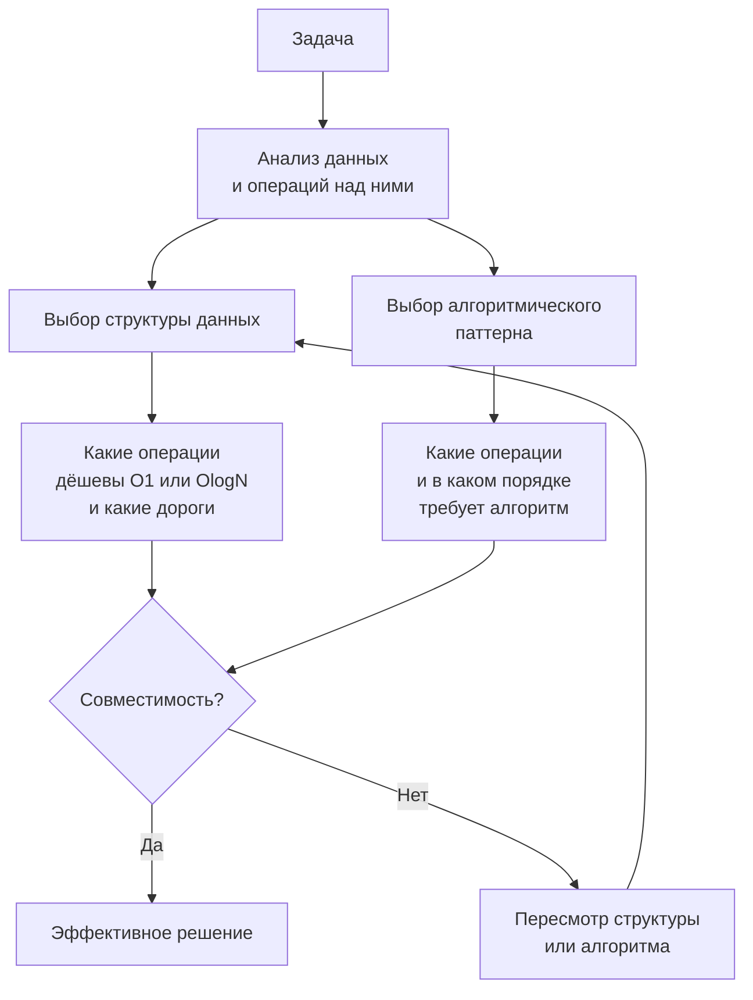

## Связь структур данных и алгоритмов

В 1975 году Никлаус Вирт сформулировал афоризм, ставший названием его эпохальной книги: «Алгоритмы + структуры данных = программы». Спустя почти полвека, в эпоху Go, Kubernetes и микросервисов, эта формула не потеряла актуальности — она стала острее. Если вы выбираете структуру данных без оглядки на то, как она ляжет на рантайм Go, вы рискуете превратить линейный алгоритм в квадратичный кошмар с фоновыми остановками GC. Если вы проектируете алгоритм, игнорируя структуру входных данных, вы можете написать гениальный код, который упадёт на первом же прогоне с реальными объёмами.

На собеседовании, особенно на позицию Senior/Lead Go Engineer, от вас ждут именно такого, двустороннего видения. Вы должны не просто знать, что `map` обеспечивает O(1) доступ, а связный список — O(n), но и понимать, почему иногда O(n) в массиве может быть быстрее O(1) в map, и уметь это аргументировать, апеллируя к кэш-линиям процессора и аллокациям в куче.

Эта статья — о глубинной, неразрывной связи между данными и операциями над ними, пропущенной через специфику Go и призму алгоритмического собеседования.

### Двойная спираль: алгоритм формирует данные, данные формируют алгоритм

Связь не односторонняя. Она напоминает двойную спираль ДНК: выбор структуры данных диктует, какие алгоритмы можно применить эффективно, а выбранный алгоритм, в свою очередь, предъявляет требования к организации данных.



Рассмотрим базовый пример: нам нужно часто проверять наличие элемента в коллекции.

- Если мы выберем **слайс** (`[]int`), проверка наличия займёт O(n) — линейный поиск.
- Если **map** (`map[int]struct{}`), проверка за O(1) в среднем.
- Если мы заранее знаем, что коллекция **отсортирована**, можно использовать бинарный поиск на слайсе за O(log n).

Но решение не сводится к выбору структуры с лучшей асимптотикой. Если коллекция содержит всего 10 элементов, линейный поиск по слайсу благодаря кэш-локальности CPU может оказаться быстрее, чем хеширование и поиск в бакетах map. Если же коллекция из 10 миллионов элементов, map выиграет с огромным отрывом. Senior-инженер тем и отличается, что не применяет догму «map всегда быстрее» или «слайс всегда проще», а анализирует конкретные числа и ограничения.

### Структуры данных как интерфейс к алгоритму

В Go, с его минималистичной стандартной библиотекой, у нас нет богатого зоопарка коллекций, как в Java или C#. Вместо `SortedSet`, `LinkedHashMap`, `Deque` у нас есть универсальные примитивы: слайс, map, массив и канал. Это не ограничение, а философия: сложное поведение строится из простых блоков.

Каждый алгоритмический паттерн неявно требует определённого интерфейса от структуры данных:

- **Стек (LIFO):** `push`, `pop`. Реализуется слайсом (операции с концом — amortized O(1)).
- **Очередь (FIFO):** `enqueue`, `dequeue`. Слайс (но `dequeue` с начала — O(n) из-за сдвига, если не использовать кольцевой буфер).
- **Дек (Deque):** двусторонняя очередь. Слайс с «окном» (кольцевой буфер) или `container/list` (плохо для производительности).
- **Множество (Set):** `insert`, `contains`, `delete`. `map[T]struct{}`.
- **Словарь (Map):** доступ по ключу. `map[K]V`.
- **Приоритетная очередь:** `insert`, `extractMin`. `container/heap` поверх слайса.

Зная эти отображения, вы на собеседовании мгновенно переводите потребности алгоритма в конкретные Go-типы. И, что не менее важно, можете предсказать узкие места.

> [!info] Под капотом
> Стек на слайсе идиоматичен: `stack = append(stack, val)` для push и `stack = stack[:len(stack)-1]` для pop. Обе операции — это манипуляции с заголовком слайса и запись в нижележащий массив. Никаких аллокаций, если cap достаточно. Но если вы используете слайс как очередь (`queue = queue[1:]`), вы не освобождаете память, а просто сдвигаете начало в массиве, что со временем приводит к тому, что в памяти висит огромный массив, из которого используется только хвост. На собеседовании Senior скажет: «Для продакшена я бы использовал кольцевой буфер, но здесь для простоты и N <= 10^5 — слайс».

### Go-специфика: как внутреннее устройство влияет на выбор

Понимание того, как Go реализует свои структуры данных, превращает алгоритмическое решение из формально корректного в высокопроизводительное. Краткий обзор ключевых моментов (углублённо см. [[07. Глубокий Go (Внутреннее устройство)]]).

**Слайс** — это трёхсловная структура: указатель на нижележащий массив, длина, вместимость. Массив лежит непрерывным блоком в куче (если escape analysis не оставил его на стеке). Это идеально для cache prefetcher: когда вы итерируете по слайсу, процессор загружает следующие элементы в кэш L1/L2, предвидя последовательный доступ. Любой паттерн, основанный на линейном обходе (скользящее окно, два указателя, Kadane), на слайсе получает максимальную скорость.

**Map** — это структура `hmap` с бакетами, каждый из которых хранит до 8 записей. Доступ включает: вычисление хеша, нахождение бакета, пробег по цепочке переполнения. Это pointer chasing, который разрушает кэш-локальность. Кроме того, map растёт, вызывая эвакуацию данных — stop-the-world паузу (хоть и короткую). Поэтому, если ключи — небольшой диапазон целых чисел или символов, массив фиксированного размера может дать 10-кратный выигрыш.

**Строки** иммутабельны. Конвертация `string` ↔ `[]byte` аллоцирует копию. В задачах на строках это критично: если вы часто перегоняете туда-сюда, вы создаёте мусор. Иногда лучше работать с `[]byte` изначально или использовать `unsafe.String` (с осторожностью и пояснением).

**Интерфейсы** (`interface{}`/`any`) хранят пару `(type, pointer)`. Слайс из интерфейсов (`[]interface{}`) — это массив таких пар, каждая указывает на кучу. Сравните со слайсом структур `[]MyStruct{...}`, где данные лежат непосредственно в массиве — никаких дополнительных указателей, одна аллокация на весь слайс.

### Таблица связи: структура данных → паттерны → Go-реализация

| Структура данных | Алгоритмические паттерны | Идиоматичная Go-реализация | Механическая симпатия |
|---|---|---|---|
| **Массив фикс. размера** | Скользящее окно (ASCII), хеш-таблица с прямой адресацией, бинарный поиск | `var arr [26]int` | Стековая аллокация, нулевые накладные расходы, сравнение `==` |
| **Слайс** | Два указателя, скользящее окно, стек, очередь, сортировка, бинарный поиск | `s := make([]int, 0, n)` | Предвыделение capacity исключает копирование при append; непрерывная память дружественна кэшу |
| **map[K]V** | Частотный анализ, мемоизация (DP), быстрый поиск | `m := make(map[int]struct{}, n)` | Каждая запись — аллокация в бакете; pointer chasing; эвакуации при росте. Использовать только когда ключи разрежены или нецелочисленны |
| **container/heap** | Top K, медиана потока, задачи с приоритетом | `type IntHeap []int` + методы интерфейса | Heap работает на слайсе; sift-up/down — операции с индексами массива, эффективны по кэшу |
| **container/list** | LRU Cache (порядок вставки), но почти всегда заменяется на кастомный двусвязный список на структурах | `list.New()` или лучше `type Node struct { prev, next *Node; key, val int }` | `container/list` даёт аллокацию на каждый элемент и возвращает `interface{}`. Кастомный список на `*Node` эффективнее |
| **Каналы (chan)** | В алгоритмических задачах почти не используются; для конкурентной композиции паттернов (pipeline) | `ch := make(chan int, 100)` | Буферизированный канал — это массив под капотом; блокировки горутин переключают M и P |
| **Строки (string)** | Два указателя на ASCII, скользящее окно | `for i := 0; i < len(s); i++` по байтам | Избегать `[]rune(s)` если не нужен Unicode — это аллокация |

> [!warning] Ловушка / Gotcha
> `container/heap` требует реализации методов `Len`, `Less`, `Swap`, `Push`, `Pop`. Метод `Push` должен использовать указатель на слайс: `func (h *IntHeap) Push(x any) { *h = append(*h, x.(int)) }`. Если забыть разыменование, выйдет баг или паника. На собеседовании это проверяют: «Напишите кучу для задачи Kth Largest Element». Будьте готовы написать 15 строк без IDE.

### Пример: как неправильная структура убивает производительность

Задача: найти первый неповторяющийся символ в строке (LeetCode 387).

**Наивное неоптимальное решение:**
Мы можем для каждого символа пробегать строку и считать количество, затем найти первый с count == 1. Сложность O(n²).

**Улучшение:**
Мы можем заполнить `map[rune]int` частотами, затем пройти по строке ещё раз. O(n) времени, O(n) памяти.

**Go-оптимизация для ASCII:**
Если строка гарантированно ASCII, мы можем использовать `[128]int` (или даже `[26]int` для `a-z`), получив O(n) времени и O(1) памяти с нулевыми аллокациями.

```go
func firstUniqChar(s string) int {
    var count [26]int // для 'a'-'z'
    for i := 0; i < len(s); i++ {
        count[s[i]-'a']++
    }
    for i := 0; i < len(s); i++ {
        if count[s[i]-'a'] == 1 {
            return i
        }
    }
    return -1
}
```

Здесь массив `[26]int` лежит на стеке (не убегает). Доступ по индексу — одна инструкция LEA на x86. Никакого pointer chasing. Для 10 миллионов символов это решение отработает в разы быстрее, чем с map, и не создаст мусора.

Но: если вход Unicode и алфавит большой, массив не подходит. Тогда `map[rune]int` или `map[byte]int` (если работаем с UTF-8 байтами) — правильный выбор. Senior-инженер скажет: «Я предполагаю ASCII, поэтому массив. Если интервьюер ожидает Unicode, я переключусь на map с предвыделением capacity».

### Композиция структур: когда одной недостаточно

Многие задачи Hard требуют комбинации структур данных. Самый хрестоматийный пример — **LRU Cache** (LeetCode 146). Здесь требуется:

- Быстрый доступ по ключу → **map** (O(1)).
- Поддержание порядка использования (вытеснение самого старого) → **двусвязный список** (O(1) на перемещение в голову/удаление хвоста).
- Каждый узел списка содержит ключ и значение.

Идиоматичный Go-код для LRU Cache использует map и кастомные структуры с указателями:

```go
type LRUCache struct {
    capacity int
    cache    map[int]*list.Element
    lruList  *list.List
}
```

Но поскольку `container/list` возвращает `*Element` с `Value interface{}`, вам придётся делать type assertion при каждом доступе, что добавляет накладные расходы и выглядит некрасиво. Более идиоматично — написать свой двусвязный список:

```go
type node struct {
    key, value int
    prev, next *node
}
type LRUCache struct {
    capacity int
    cache    map[int]*node
    head     *node // фиктивный
    tail     *node // фиктивный
}
```

Здесь мы избавляемся от `interface{}` и получаем прямой доступ к полям. Аллокации — только на создание узлов. При удалении узла удаляем из map и перелинковываем указатели. Это production-стиль, который от вас ждут на Senior-собеседовании.

> [!tip] Собеседование
> Вопрос: «Почему в LRU Cache вы реализовали свой двусвязный список, а не использовали `container/list`?»
> Ответ: «`container/list` хранит `interface{}`, что требует type assertion и boxing/unboxing на каждый узел. Это добавляет аллокации для значений-интерфейсов и накладные расходы на проверку типов. Кастомный список со строго типизированными `*node` эффективнее и не создаёт лишнего мусора для GC. В production-коде я бы написал бенчмарк, но здесь разница очевидна».

### Влияние структур данных на конкурентность

Хотя алгоритмические задачи обычно синхронны, на собеседованиях Senior-уровня могут спросить о потокобезопасности выбранных структур:

- **Слайсы и map’ы** не потокобезопасны. Чтение и запись из разных горутин без синхронизации вызывает data race.
- **`sync.Map`** подходит для случаев «много чтений, редкие записи», но для общего назначения работает хуже, чем обычный map с мьютексом.
- **Каналы** можно использовать как примитив синхронизации для потокобезопасных очередей.

Если в задаче вдруг окажется, что функция должна вызываться конкурентно, вы должны сразу уточнить и при необходимости защитить доступ (`sync.RWMutex` для map) или использовать каналы. Упоминание этого аспекта показывает, что вы думаете о production-окружении, даже решая алгоритмическую задачу.

### Как тренировать связное мышление: практические шаги

1. **Разбор задачи через структуры.** При анализе новой задачи сначала перечислите все требуемые операции над данными, затем подберите структуру. Не наоборот.
2. **Переписывание с разными структурами.** Возьмите задачу, решённую с map, и перепишите с использованием слайса + сортировки + бинарного поиска. Сравните сложность и код. Почувствуйте trade-off.
3. **Чтение исходников.** Откройте `runtime/map.go`, `runtime/slice.go`. Увидев внутренности `hmap` и `slice`, вы начнёте интуитивно чувствовать, когда map — оправданный выбор, а когда — оверкилл.
4. **Профилирование.** Если можете, запускайте бенчмарки (`go test -bench`) для разных реализаций. Цифры убеждают лучше слов.

### Заключение

Связь структур данных и алгоритмов — это не академическая концепция, а ежедневный инструмент Senior Go-разработчика. Выбор между слайсом и map, между рекурсией и итеративным стеком, между `container/heap` и собственной кучей на основе массива — это инженерные решения, основанные на понимании рантайма, ограничений железа и требований к производительности.

Следующая статья продолжит тему принятия решений и расскажет, как выбирать между двумя великими стратегиями решения задач оптимизации: жадными алгоритмами и динамическим программированием. [[11. Когда выбирать greedy, а когда dynamic programming]]