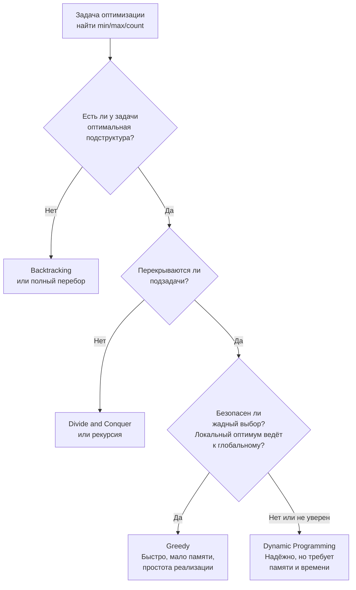
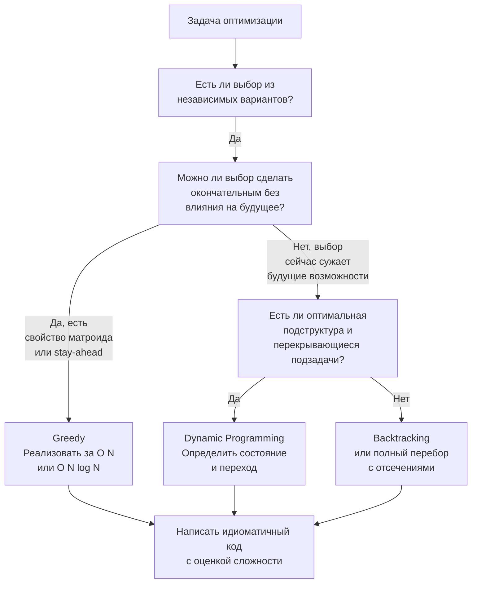

## Когда выбирать greedy, а когда dynamic programming

Среди всех алгоритмических развилок, с которыми сталкивается кандидат, выбор между жадным алгоритмом и динамическим программированием — одна из самых драматичных. Внешне задачи похожи: и там, и там нужно найти оптимум (максимум, минимум, количество способов). Но ошибка в выборе подхода почти всегда фатальна: жадный алгоритм, применённый там, где нужно DP, даст неверный ответ, а DP в жадной задаче — перерасход памяти и времени, который может не пройти по лимитам. Senior-разработчик обязан не просто знать оба инструмента, но мгновенно определять, какой из них применим, и доказывать это интервьюеру за считанные минуты.

В этой статье мы построим чёткий ментальный фреймворк для такого выбора, основанный на свойствах задачи, а не на запоминании «эта задача — DP, а эта — greedy». Мы свяжем этот выбор с Go-спецификой: как структура данных и работа с памятью влияют на реализацию каждого подхода и как демонстрация этого понимания на собеседовании поднимает вас до уровня Senior.

### Что такое greedy и DP: суть различия

**Жадный алгоритм (Greedy)** принимает последовательность **локально оптимальных** решений, надеясь, что они приведут к глобальному оптимуму. Он не оглядывается назад и не планирует будущее. Каждый шаг окончателен. Жадный алгоритм либо работает (и тогда он обычно быстрее и проще DP), либо нет — промежуточных вариантов не бывает.

**Динамическое программирование (DP)** разбивает задачу на **перекрывающиеся подзадачи**, решает каждую один раз и сохраняет результат (мемоизация или табуляция). Глобальный оптимум строится из оптимальных решений подзадач. DP работает для широкого класса задач, но платит за это памятью и временем.

Ключевой вопрос, который нужно задать себе на собеседовании: **может ли локально оптимальный выбор когда-нибудь испортить глобальный результат?** Если да — greedy неприменим, нужно DP (или backtracking). Если нет — greedy предпочтительнее.



### Как доказать применимость greedy: свойство безопасного жадного выбора

Greedy не применяется по наитию. Его применимость нужно доказывать — хотя бы на уровне рассуждения, которое удовлетворит интервьюера. Существует два основных способа:

**1. Матроидная структура.** Если множество решений образует матроид, жадный алгоритм даёт оптимальное решение. Классический пример — задача о расписании с дедлайнами, алгоритм Краскала для минимального остовного дерева. На собеседовании редко просят знание матроидов, но упоминание этого слова показывает математическую подготовку.

**2. Stay-ahead / Exchange argument.** Более практичный метод для интервью. Вы предполагаете, что существует оптимальное решение, которое на первом шаге делает не такой выбор, как ваш жадный алгоритм. Затем показываете, что можно «обменять» этот выбор на жадный, не ухудшив решение. Так доказывается, что жадный выбор всегда можно привести к оптимуму.

**Пример:** задача о максимальном количестве непересекающихся интервалов. Жадный выбор: всегда брать интервал, который заканчивается раньше всех. Доказательство через exchange argument: если оптимальное решение на первом шаге взяло интервал `A`, а жадный — интервал `B` (заканчивающийся не позже `A`), то мы можем заменить `A` на `B`, потому что `B` оставляет не меньше свободного пространства справа, чем `A`, и количество интервалов не уменьшится.

На собеседовании вы не обязаны строить формальное доказательство как в теории алгоритмов, но вы должны озвучить **обоснование**, почему локально оптимальный выбор не навредит будущему.

### Как распознать необходимость DP: свойства перекрывающихся подзадач и оптимальной подструктуры

DP применимо, когда выполнены два условия:

1. **Оптимальная подструктура:** оптимальное решение задачи содержит оптимальные решения её подзадач. Например, кратчайший путь из A в C через B содержит кратчайший путь из A в B.
2. **Перекрывающиеся подзадачи:** одни и те же подзадачи решаются многократно при наивной рекурсии. Например, в числах Фибоначчи `F(5)` вызывает `F(4)` и `F(3)`, а `F(4)` снова вызывает `F(3)` — подзадача `F(3)` решается дважды.

Если подзадачи не перекрываются (например, в Merge Sort), мы имеем Divide and Conquer, а не DP. Если нет оптимальной подструктуры, DP не работает — тогда backtracking или полный перебор.

**Решающий тест на жадность:** представьте, что вы принимаете решение на первом шаге. Есть несколько вариантов. Если вы выбираете тот, который выглядит лучшим «здесь и сейчас», может ли это закрыть путь к глобально оптимальному решению? Если ответ «да, может», greedy не подходит.

> [!tip] Собеседование
> **Классический каверзный вопрос:** «Почему для задачи о рюкзаке 0/1 нельзя применить жадный алгоритм, а для дробного рюкзака можно?»
> **Ожидаемый ответ:** В дробном рюкзаке мы можем делить предметы, поэтому взятие предмета с максимальной удельной ценностью всегда безопасно: если мы взяли его «слишком много», мы можем отрезать лишнее. В рюкзаке 0/1 предмет либо берётся целиком, либо нет. Жадный выбор самого дорогого предмета может занять весь доступный вес, оставив более ценную комбинацию из менее дорогих предметов за бортом. Поэтому 0/1 рюкзак требует DP.

### Алгоритм выбора на интервью: пошаговый анализ

При получении задачи оптимизации следуйте такому сценарию (см. также [[5. Алгоритм решения задачи на интервью]]):

1. **Сформулируйте целевую функцию:** что именно мы оптимизируем? Максимизируем сумму? Минимизируем количество операций? Количество способов?
2. **Проверьте, есть ли ограничения, делающие перебор невозможным.** Если N велико (10⁵+), backtracking отпадает, остаются greedy или DP.
3. **Проверьте greedy-гипотезу:** «Могу ли я отсортировать данные и всегда брать лучший по какому-то критерию элемент, не задумываясь о последствиях?» Если да, попытайтесь построить обоснование (stay-ahead, exchange argument). Если обоснование не строится за минуту — скорее всего, greedy неверен.
4. **Ищите признаки DP:**
   - Слова «количество способов», «максимальная/минимальная стоимость с выбором», «можно ли разбить», «проверить возможность».
   - Наличие последовательных решений, где выбор на шаге `i` зависит от предыдущих шагов.
   - Возможность определить состояние `dp[i]` (или `dp[i][j]`) и переходы между состояниями.
5. **Оцените размер DP-таблицы.** Если она одномерная и N ≤ 10⁵ — ок. Если двумерная и N ≤ 2000 — ок. Если N ≤ 20 — возможно, backtracking, а не DP.
6. **Озвучьте вывод интервьюеру:** «На greedy не похоже, потому что выбор сейчас влияет на доступность будущих вариантов. Похоже на DP с состоянием `dp[i]` — максимальная сумма до индекса `i`. Я начну с одномерного DP, если ограничения позволят.»

### Сравнительный анализ на живых задачах

Разберём три пары задач, чтобы закрепить навык различения.

#### Пара 1: Jump Game vs Jump Game II

- **Jump Game (LeetCode 55):** проверить, можно ли достичь последнего индекса. Greedy работает: мы поддерживаем `maxReach` и на каждом шаге обновляем его. Локальный выбор (прыгнуть как можно дальше) не закрывает будущие возможности, потому что мы просто увеличиваем «зону досягаемости». O(N), O(1).
- **Jump Game II (LeetCode 45):** найти минимальное количество прыжков. Greedy тоже работает (BFS-подобный greedy, прыгаем до конца текущего охвата, увеличивая счётчик), но требует аккуратности. Однако если спросить «количество способов», то тут уже DP. Jump Game II — пример, где greedy применим, но DP тоже сработает, хоть и медленнее.

#### Пара 2: Coin Change (количество монет) vs Coin Change 2 (количество способов)

- **Coin Change (LeetCode 322):** минимальное количество монет для суммы. Жадный алгоритм (брать самую крупную монету) не работает для произвольных номиналов: например, монеты [1, 3, 4], сумма 6. Greedy возьмёт 4+1+1 = 3 монеты, а оптимум — 3+3 = 2 монеты. Нужно DP.
- **Coin Change 2 (LeetCode 518):** количество способов набрать сумму. Это классическое DP, никакого greedy.

#### Пара 3: Interval Scheduling vs Weighted Interval Scheduling

- **Interval Scheduling (максимальное количество непересекающихся интервалов):** жадный по времени окончания работает. Доказывается exchange argument.
- **Weighted Interval Scheduling (интервалы имеют веса, максимизировать сумму):** жадный по удельной величине (вес/длина) не работает. Нужно DP: `dp[i]` = max(`dp[i-1]`, `value[i] + dp[p[i]]`), где `p[i]` — последний совместимый интервал.

Заметьте: малейшее усложнение условия (добавление весов) рушит greedy и требует DP. Senior должен чувствовать эту грань.

### Механическая симпатия: как Go влияет на реализацию greedy и DP

Выбор между greedy и DP диктует, сколько памяти мы будем потреблять и как мы будем взаимодействовать с GC. Go-специфика здесь играет важную роль.

**Greedy в Go:**
- Обычно O(1) или O(N) памяти с минимальными аллокациями.
- Часто требует сортировки: `sort.Slice` работает in-place, быстро. Если нужно сохранить исходный порядок, создаём слайс индексов или структур — дополнительная аллокация, но всё ещё O(N).
- Никаких рекурсий, простая итерация → предсказуемый стек горутины, отсутствие давления на GC.

**DP в Go:**
- Классический bottom-up DP использует слайсы `dp []int` или `dp [][]int`. Если размер массива известен, предвыделение через `make([]int, n)` даёт одну аллокацию (или несколько для двумерного случая).
- Частая ошибка — использовать `map` для мемоизации в top-down DP. Каждый вызов `dpMap[key]` — это хеширование и pointer chasing. Массив `[]int` по индексу даёт прямой доступ за такты.
- Для двумерного DP можно использовать плоский слайс `[]int` размером `n*m` с индексной арифметикой `i*m + j` вместо `[][]int`. Это экономит аллокации для заголовков строк и улучшает cache locality. На собеседовании можно упомянуть, но для читаемости часто допустим `[][]int`.
- Рекурсивный top-down DP с мемоизацией может привести к переполнению стека горутины, если глубина рекурсии велика (хоть стек Go и растёт, для глубины 10⁵ это дорого). Предпочитайте bottom-up.

> [!info] Под капотом
> Стек горутины — это сегментированный стек, который начинается с 2 КБ и динамически растёт. Рекурсивный DP с глубиной 10 000 вызовет несколько расширений стека (stack copying) — это не страшно, но создаёт накладные расходы. Bottom-up DP с одним слайсом этих накладных расходов не имеет и полностью дружественен prefetcher-у процессора.

**Пример: Coin Change (LeetCode 322) bottom-up в Go**

```go
func coinChange(coins []int, amount int) int {
    // dp[i] — минимальное количество монет для суммы i
    dp := make([]int, amount+1)
    for i := 1; i <= amount; i++ {
        dp[i] = math.MaxInt
        for _, c := range coins {
            if c <= i && dp[i-c] != math.MaxInt {
                if dp[i-c]+1 < dp[i] {
                    dp[i] = dp[i-c] + 1
                }
            }
        }
    }
    if dp[amount] == math.MaxInt {
        return -1
    }
    return dp[amount]
}
```

Комментарий по Go-памяти: `dp` — это один непрерывный кусок в куче. Доступ `dp[i]` — O(1) без промахов мимо кэша. Аллокация — ровно одна. GC будет спокоен.

> [!warning] Ловушка / Gotcha
> Если вы используете top-down DP с map: `memo := make(map[int]int)`, каждая запись в map — это аллокация в бакете. Для amount=10000 и ветвистой рекурсии количество аллокаций может взорваться, GC начнёт тормозить процесс. На собеседовании Senior скажет: «Я выбираю bottom-up, потому что он избегает pointer chasing и минимизирует работу GC». Для небольших ограничений это не критично, но упоминание — плюс.

### Распространённые ошибки и как их избежать

**1. Применение greedy без доказательства.**
Кандидат говорит: «Очевидно, нужно брать самую дешёвую монету». Интервьюер приводит контрпример. Доверие потеряно. Всегда проверяйте на 2–3 мысленных контрпримерах перед тем, как объявлять greedy.

**2. Выбор DP, когда greedy работает быстрее.**
Задача «Jump Game» решается DP за O(N²) наивно или O(N) с оптимизацией. Но greedy даёт O(N) с O(1) памяти и тривиальным кодом. Если вы начали городить DP там, где можно было за линию пройти одним указателем, это показывает неумение видеть простые решения.

**3. Неоптимальная реализация DP.**
Использование map для мемоизации там, где индексы — целые числа, и можно использовать слайс. Или создание двумерного слайса `[][]int` с выделением каждой строки отдельно вместо плоского массива (хотя в большинстве задач это приемлемо, нужно уметь обосновать).

**4. Забывают о том, что greedy иногда работает для частного случая.**
Например, если монеты канонические (евро, доллары), greedy сработает. На собеседовании спросите: «Является ли система монет канонической?» Это демонстрирует глубокое понимание.

**5. Смешивают понятия «жадный» и «итеративный с backtracking».**
Жадный не делает backtracking. Если алгоритм пробует вариант, а потом откатывается — это backtracking, не greedy. Различайте.

### Процесс выбора в виде чек-листа для интервью



### Заключение

Выбор между жадным алгоритмом и динамическим программированием — это не гадание, а инженерный анализ свойств задачи. Жадность требует доказательства безопасности выбора, DP — выявления оптимальной подструктуры и перекрывающихся подзадач. Go-разработчик уровня Senior добавляет к этому анализу понимание того, как выбранный подход ляжет на память и GC: жадные алгоритмы чаще всего легковесны и стек-дружественны, DP выигрывает от плоских массивов и bottom-up реализации.

В следующей статье мы пойдём ещё дальше: научимся комбинировать алгоритмические паттерны, когда задача не укладывается в один-единственный каркас, и строить составные решения, которые так часто встречаются в Hard-задачах LeetCode. [[12. Как комбинировать алгоритмические паттерны]]