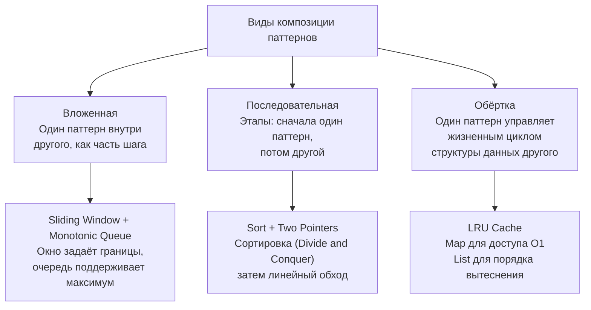

## Как комбинировать алгоритмические паттерны

В предыдущих статьях мы освоили отдельные алгоритмические паттерны — скользящее окно, два указателя, BFS, DP — и научились распознавать их в задачах. Но реальность собеседований (и production-кода) такова, что большинство задач уровня Medium/Hard не решаются одним «чистым» паттерном. Они требуют **композиции**: два, а иногда и три паттерна должны работать согласованно, как шестерёнки в часовом механизме. Именно умение собирать такие составные решения и аргументировать их корректность отделяет Senior-кандидата от Middle.

В этой статье мы разберём, как комбинировать алгоритмические паттерны системно: какие виды композиции существуют, как сохранять инварианты при наложении паттернов, как Go-специфика (слайсы, map, указатели) помогает или мешает таким комбинациям, и как демонстрировать это мастерство на собеседовании.

### Почему одиночные паттерны не всегда достаточны

Паттерн, как мы определили в [[8. Что такое алгоритмический паттерн]], — это каркас решения класса задач. Но многие задачи принадлежат не одному классу, а находятся на пересечении двух или трёх. Например:

- Нужно найти подмассив, удовлетворяющий условию, и при этом быстро вычислять какую-то агрегатную функцию на этом подмассиве (скользящее окно + монотонная очередь или дерево отрезков).
- Нужно обойти граф, но при этом на каждом шаге выбирать оптимальную вершину по приоритету (BFS/DFS + куча).
- Нужно перебрать комбинации, но с мемоизацией, чтобы не считать повторно (backtracking + DP).

В таких случаях паттерны не просто сосуществуют, а взаимодействуют: один управляет ритмом итерации, другой — поддерживает структуру данных, третий — хранит результаты подзадач. Задача Senior-инженера — увидеть, что задача разложима на известные кирпичики, и правильно их состыковать.

### Три типа композиции паттернов

Анализируя множество задач, можно выделить три устойчивых способа комбинации.



#### 1. Вложенная композиция (Inline)

Один паттерн встроен в шаг другого. Классика — **Sliding Window Maximum**: скользящее окно управляет границами, а монотонная очередь, обновляемая на каждом расширении и сжатии, поддерживает максимум. Очередь не существует сама по себе — она «живёт» внутри окна.

Другой пример — **Minimum Window Substring**: скользящее окно + частотная хеш-таблица (или массив). Здесь таблица — не отдельный паттерн, а структура данных, обеспечивающая O(1) проверку на валидность окна.

#### 2. Последовательная композиция (Sequential)

Задача разбивается на два независимых этапа, каждый обслуживается своим паттерном. Например:

- **3Sum:** сначала сортируем массив (Divide and Conquer или просто `sort.Ints`), затем фиксируем один элемент и ищем пару двумя указателями.
- **Merge Intervals:** сортировка интервалов по началу, затем линейный обход со слиянием.
- **Top K Frequent Elements:** сначала частотный анализ через map, затем извлечение K наиболее частых через кучу (или bucket sort).

Здесь паттерны разделены во времени и не мешают друг другу. Основная задача — выбрать правильные структуры данных для каждого этапа.

#### 3. Обёртка (Wrapper)

Один паттерн управляет жизненным циклом структур данных, реализующих другой паттерн. Самый яркий пример — **LRU Cache**. Мы комбинируем:

- **Хеш-таблицу** (`map[int]*Node`) для O(1) доступа по ключу.
- **Двусвязный список** (собственный, на указателях) для поддержки порядка «от нового к старому» — это по сути паттерн «очередь с приоритетом по времени доступа».

Шаблон «обёртка» характерен для задач на проектирование структур данных (Design problems). В Go он требует аккуратной работы с указателями и избегания `interface{}` там, где можно обойтись конкретными типами.

### Пошаговая методика комбинирования на собеседовании

Когда вы получаете сложную задачу, следуйте алгоритму (расширение [[5. Алгоритм решения задачи на интервью]]):

1. **Определите доминирующий паттерн.** Что основное: обход, перебор, окно?
2. **Выявите, какая операция внутри доминирующего шага является узким местом.** Например, при скользящем окне — получение максимума/минимума/частоты в текущем окне.
3. **Подберите вспомогательный паттерн/структуру данных, которая решает эту операцию эффективно.** Это может быть монотонная очередь, куча, хеш-таблица, префиксные суммы.
4. **Проверьте совместимость инвариантов.** Не нарушает ли вспомогательный паттерн инвариант основного, и наоборот?
5. **Реализуйте сначала основной каркас, затем встройте вспомогательный.** Кодируйте итерациями: сначала работающий наивный вариант, потом оптимизация.
6. **Оцените совокупную сложность по времени и памяти**, учитывая взаимодействие структур.

### Разбор примеров на Go

#### Пример 1: Sliding Window Maximum (LeetCode 239)

**Композиция:** Скользящее окно + Монотонная очередь.

```go
func maxSlidingWindow(nums []int, k int) []int {
    if len(nums) == 0 {
        return nil
    }
    result := make([]int, 0, len(nums)-k+1)
    deque := make([]int, 0, k) // хранит индексы, значения убывают

    for i, v := range nums {
        // Удаляем индексы за левой границей окна
        if len(deque) > 0 && deque[0] < i-k+1 {
            deque = deque[1:]
        }
        // Монотонность: удаляем с конца меньшие/равные элементы
        for len(deque) > 0 && nums[deque[len(deque)-1]] <= v {
            deque = deque[:len(deque)-1]
        }
        deque = append(deque, i)

        // Когда окно полностью сформировано, добавляем максимум
        if i >= k-1 {
            result = append(result, nums[deque[0]])
        }
    }
    return result
}
```

**Что происходит:**
- Скользящее окно задаёт границы `[i-k+1, i]`.
- Монотонная очередь на слайсе `deque` поддерживает индексы таким образом, что `nums[deque[0]]` всегда максимум окна.
- Инвариант очереди: значения строго убывают.
- Оба паттерна работают с одним слайсом `nums`. Дополнительная память — только `deque` размером до k.

**Механическая симпатия:** `deque` — это слайс индексов, которые помещаются в непрерывный массив. Операции `deque[1:]` и `deque[:len(deque)-1]` — только сдвиги заголовка, без копирования данных.

#### Пример 2: Minimum Window Substring (LeetCode 76)

**Композиция:** Скользящее окно + Частотный массив/хэш-таблица.

```go
func minWindow(s string, t string) string {
    if len(s) < len(t) {
        return ""
    }
    need := [128]int{} // предполагаем ASCII
    for i := 0; i < len(t); i++ {
        need[t[i]]++
    }
    have := [128]int{}
    left, right := 0, 0
    matched := 0
    start, length := 0, math.MaxInt

    for right < len(s) {
        ch := s[right]
        have[ch]++
        if have[ch] == need[ch] {
            matched++
        }
        right++

        for matched == len(need) {
            if right-left < length {
                start = left
                length = right - left
            }
            chLeft := s[left]
            have[chLeft]--
            if have[chLeft] < need[chLeft] {
                matched--
            }
            left++
        }
    }
    if length == math.MaxInt {
        return ""
    }
    return s[start : start+length]
}
```

Здесь частотный массив `need` и `have` — не самостоятельный паттерн, а реализация «проверки валидности окна» за O(1). Основной паттерн — скользящее окно. Композиция на уровне структур данных: массив фиксированного размера (128 для ASCII) даёт прямую адресацию без map.

#### Пример 3: LRU Cache (LeetCode 146)

**Композиция:** Хеш-таблица (map) + Двусвязный список (кастомный).

```go
type Node struct {
    key, value int
    prev, next *Node
}

type LRUCache struct {
    capacity int
    cache    map[int]*Node
    head     *Node // фиктивный, newer
    tail     *Node // фиктивный, older
}

func Constructor(capacity int) LRUCache {
    head := &Node{}
    tail := &Node{}
    head.next = tail
    tail.prev = head
    return LRUCache{
        capacity: capacity,
        cache:    make(map[int]*Node),
        head:     head,
        tail:     tail,
    }
}

func (lru *LRUCache) Get(key int) int {
    if node, ok := lru.cache[key]; ok {
        lru.moveToFront(node)
        return node.value
    }
    return -1
}

func (lru *LRUCache) Put(key int, value int) {
    if node, ok := lru.cache[key]; ok {
        node.value = value
        lru.moveToFront(node)
        return
    }
    newNode := &Node{key: key, value: value}
    lru.cache[key] = newNode
    lru.addToFront(newNode)
    if len(lru.cache) > lru.capacity {
        tail := lru.removeTail()
        delete(lru.cache, tail.key)
    }
}

func (lru *LRUCache) addToFront(node *Node) {
    node.next = lru.head.next
    node.prev = lru.head
    lru.head.next.prev = node
    lru.head.next = node
}

func (lru *LRUCache) removeNode(node *Node) {
    node.prev.next = node.next
    node.next.prev = node.prev
}

func (lru *LRUCache) moveToFront(node *Node) {
    lru.removeNode(node)
    lru.addToFront(node)
}

func (lru *LRUCache) removeTail() *Node {
    node := lru.tail.prev
    lru.removeNode(node)
    return node
}
```

**Анализ композиции:**
- Map обеспечивает O(1) поиск узла.
- Двусвязный список хранит порядок. Указатели `prev`/`next` — типизированные, без `interface{}`, что исключает boxing.
- Инвариант: после каждой операции фиктивный `head` указывает на самый новый узел, `tail` на самый старый; все ключи в map ссылаются на узлы в списке.

> [!info] Под капотом
> Каждый новый узел — аллокация в куче. Если бы мы использовали `container/list`, каждый элемент был бы `*list.Element` с полем `Value interface{}`, что требовало бы дополнительного аллоцирования для хранения значения типа `int` (boxing). Кастомный `Node` хранит `int` прямо в структуре — эффективнее и предсказуемее для GC.

#### Пример 4: Course Schedule (LeetCode 207)

**Композиция:** Граф (представление через слайсы) + DFS с состояниями для поиска цикла.

```go
func canFinish(numCourses int, prereqs [][]int) bool {
    graph := make([][]int, numCourses)
    for _, p := range prereqs {
        graph[p[1]] = append(graph[p[1]], p[0])
    }
    // 0 - unvisited, 1 - visiting, 2 - visited
    state := make([]int, numCourses)
    
    var dfs func(course int) bool
    dfs = func(course int) bool {
        if state[course] == 1 { // back edge => cycle
            return false
        }
        if state[course] == 2 {
            return true
        }
        state[course] = 1
        for _, next := range graph[course] {
            if !dfs(next) {
                return false
            }
        }
        state[course] = 2
        return true
    }
    
    for i := 0; i < numCourses; i++ {
        if !dfs(i) {
            return false
        }
    }
    return true
}
```

Здесь комбинируются:
- **Представление графа:** слайс слайсов (adjacency list) — последовательная память для каждой вершины.
- **DFS с раскраской:** паттерн обхода в глубину с тремя состояниями для детекта цикла.
- Оба паттерна работают на общих массивах `state` и `graph`, не мешая друг другу.

### Принципы безопасного комбинирования

1. **Инварианты должны быть согласованы.** Каждый паттерн приносит свой инвариант. Например, в Sliding Window Maximum: инвариант окна — содержит актуальные индексы; инвариант очереди — монотонность. Сдвиг левой границы окна (`deque[0] < i-k+1`) не должен нарушать монотонность очереди (удаляем голову — свойство сохраняется). Проверяйте, что операции одного паттерна не ломают другой.

2. **Структуры данных — общие или изолированные?** Иногда выгодно использовать общую структуру (один слайс хранит и состояния, и очередь), иногда — разделить, чтобы избежать конфликтов. В LRU Cache map и список разделены, но ссылаются на одни и те же узлы — это нормально, если изменения согласованы.

3. **Не переусложняйте.** Если задача решается одним паттерном с простой оптимизацией, не городите композицию. Признак того, что нужна композиция — когда наивная операция внутри основного цикла занимает O(n) или O(k), а есть способ снизить до O(log n) или O(1) через вспомогательную структуру.

4. **Помните о памяти.** Каждый дополнительный паттерн/структура добавляет аллокации. В примере Sliding Window Maximum мы используем `deque` ёмкостью до k, что приемлемо. Если бы мы использовали кучу для поддержания максимума, нам пришлось бы хранить все элементы в куче и удалять произвольный элемент при выходе из окна — память O(n), чего можно избежать с монотонной очередью. Senior выбирает решение с минимальной памятью.

### Композиция и Go-специфика: на что обратить внимание

- **Слайсы — идеальный клей.** Большинство комбинаций завязаны на слайсы: они могут быть и очередью, и стеком, и кучей (через `container/heap`). Их непрерывность в памяти дружественна кэшу и снижает аллокации.
- **Map — осторожно с ростом.** Если вспомогательный паттерн требует map, и вы знаете размер, предвыделите `make(map[K]V, size)`. Это особенно важно, если map используется внутри цикла, как в Minimum Window Substring (но там массив, если ASCII, лучше).
- **Указатели vs значения.** В LRU Cache мы используем указатели на узлы, потому что узлы принадлежат и map, и списку. Удобно, но каждый узел — аллокация. Если бы кэш был маленьким и фиксированным, можно было бы использовать слайс и индексы вместо указателей — ещё меньше нагрузки на GC.
- **Стек горутины для рекурсии.** Композиция с рекурсивным DFS (как в Course Schedule) безопасна, пока глубина умеренна. Если граф огромный (миллион узлов), рекурсия может вызвать множество расширений стека. Можно переписать на итеративный DFS с собственным стеком на слайсе.

> [!tip] Собеседование
> Показать умение комбинировать можно так: «Я вижу, что основная структура — скользящее окно. Но нам нужно быстро получать максимум в окне, простое сканирование окна даст O(k). Я предлагаю добавить монотонную очередь на слайсе, чтобы получать максимум за O(1) амортизированно. Это классическая композиция, и оба паттерна работают на одном массиве, без лишних аллокаций.» После этого написать чистый код — и вы в глазах интервьюера архитектор, а не кодер.

### Заключение

Композиция алгоритмических паттернов — это не высший пилотаж, а рабочий инструмент Senior-разработчика. В реальных задачах границы между паттернами размываются, и способность собрать решение из двух-трёх кирпичиков, сохранив инварианты и не перерасходовав память, — то, что проверяют на Hard-задачах и дизайн-секциях. Освоив это, вы перестаёте бояться незнакомых задач, потому что любая из них — просто комбинация уже известных вам идей.

В следующей статье мы рассмотрим ситуации, когда решение задачи не очевидно даже после анализа паттернов — как преодолевать ментальные блоки и находить нестандартные подходы. [[13. Когда решение задачи не очевидно]]