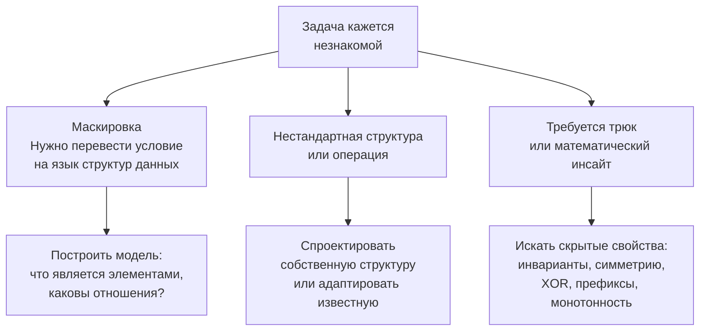

## Когда решение задачи не очевидно

Вы прошли всю подготовку: знаете паттерны, умеете их распознавать ([[4. Как распознавать паттерн в задаче]]), комбинировать ([[12. Как комбинировать алгоритмические паттерны]]) и даже доказывать корректность через инварианты. Но вот звучит условие — и в голове пусто. Ни один паттерн не ложится. Конструкции, знакомые по сотням решённых задач, не собираются в код. Задача выглядит незнакомой, неуютной, неочевидной. Это момент, когда большинство кандидатов ломаются. Senior-разработчик — нет. Он знает, что делать, когда **решение не очевидно**, и превращает ступор в структурированный поиск.

В этой статье мы разберём, почему задачи становятся неочевидными, как методично выходить из тупика, какие ментальные инструменты применять, и как Go-специфика может подсказать нестандартный, но эффективный путь.

### Почему задача не очевидна: три источника скрытности

Неочевидность — это не свойство задачи, а свойство вашего текущего восприятия. Задача кажется незнакомой по одной из трёх причин (или их комбинации):

1. **Маскировка под другой контекст.** Условие сформулировано не в терминах массивов и строк, а как бизнес-задача, физический процесс или головоломка. Например, «поймать дождевую воду» (Trapping Rain Water) — за этим скрывается работа с высотами столбцов. Первый барьер — перевод на язык структур данных.

2. **Нестандартная структура данных или операция.** Задача требует не просто обхода, а, скажем, нахождения медианы в потоке, случайного выбора с весом, или работы с бесконечным потоком. Вы не видите привычного «массива» или «дерева».

3. **Требуется нешаблонное, креативное решение.** Ни один из 15 изученных паттернов не подходит напрямую. Нужен трюк, математический инсайт или взгляд с неожиданной стороны. Например, использование XOR для поиска единственного непарного элемента — это не паттерн «два указателя», а свойство алгебры.



### Общий алгоритм действий при ступоре

Когда паттерн не угадывается за минуту, Senior-разработчик не паникует, а запускает систематический процесс.

**Шаг 1. Вербализуйте непонимание.** Вместо «Я не знаю» скажите: «Я вижу, что задача связана с... Мне пока не ясно, как избежать перебора всех вариантов. Давайте я попробую сформулировать, что именно должно быть оптимизировано.» Это показывает интервьюеру, что вы не сдались, а анализируете.

**Шаг 2. Начните с тривиального решения.** Напишите наивный брутфорс (если позволяет время) или просто проговорите его. Например, «Я могу перебрать все подмассивы и посчитать сумму каждого — O(N²). Но N=10⁵, это слишком медленно». Анализ того, *почему* брутфорс медленный, часто подсвечивает скрытую структуру. Узким местом может быть пересчёт суммы заново — ага, можно использовать префиксные суммы. Или повторное вычисление одной и той же подзадачи — ага, DP. Так неочевидность рассеивается.

**Шаг 3. Решите задачу для маленького примера вручную.** Нарисуйте массив из 5 элементов и пройдитесь руками. Записывайте промежуточные значения. Часто метод «ручного симуляции» открывает закономерность. Например, в Trapping Rain Water вы увидите, что уровень воды над столбцом ограничен максимумами слева и справа.

**Шаг 4. Попробуйте изменить перспективу.** 
- Инвертируйте задачу: вместо «найти максимум» попробуйте «исключить не-максимум».
- Посмотрите с конца: если нужно что-то построить, попробуйте разрушать (и наоборот).
- Разверните ось: вместо обработки слева направо, попробуйте справа налево, или с двух сторон.

**Шаг 5. Ищите скрытый инвариант или свойство.** Задайте себе вопросы:
- Есть ли монотонность?
- Можно ли что-то предподсчитать?
- Есть ли симметрия?
- Можно ли применить XOR, битовые операции?
- Сводится ли задача к известной (например, «это поиск подпоследовательности, похоже на DP на строках»)?

**Шаг 6. Вспомните «универсальные солдаты»** — подходы, которые работают для широкого класса задач, даже если вы не видите конкретного паттерна:
- **Бинарный поиск по ответу:** если функция проверки монотонна, это решает многие задачи на «минимальное/максимальное X такое, что условие выполняется».
- **Сортировка + два указателя:** когда задача парная, а порядок не важен.
- **DP по ограничениям:** если N ≤ 2000, смело пробуйте DP с двумя состояниями, даже если задача выглядит как графы или строки.
- **BFS/DFS:** если задача похожа на поиск в пространстве состояний.

### Go-специфика как источник неочевидных решений

Иногда задача не очевидна именно потому, что вы мыслите в терминах других языков, а Go предлагает элегантный путь через свои особенности.

**Слайс как универсальная структура.** В Go нет встроенной очереди, дека, стека — всё делается через слайсы. Это значит, что для задачи «Sliding Window Maximum» вы можете реализовать монотонную очередь на слайсе с операциями `append` и срезом `deque[1:]`. Это просто и эффективно по памяти. В Java пришлось бы подключать `ArrayDeque`. Осознание, что слайс — это и массив, и список, и стек, и очередь, снимает ограничения.

**Массивы против map.** Задача может требовать частотного анализа, и ваша первая мысль — `map[byte]int`. Но если алфавит ограничен (например, только строчные латинские буквы), замена на `[26]int` не только ускоряет код в 5–10 раз за счёт отсутствия pointer chasing и нагрузки на GC, но и радикально упрощает сравнение окон: два массива можно сравнить через `==`. Это неочевидный для новичка трюк, который становится очевидным для Senior.

```go
// Неочевидное, но эффективное решение для поиска всех анаграмм в строке
func findAnagrams(s string, p string) []int {
    if len(s) < len(p) {
        return nil
    }
    var target, window [26]int
    for i := range p {
        target[p[i]-'a']++
        window[s[i]-'a']++
    }
    var result []int
    if window == target {
        result = append(result, 0)
    }
    for i := len(p); i < len(s); i++ {
        window[s[i]-'a']++
        window[s[i-len(p)]-'a']--
        if window == target {
            result = append(result, i-len(p)+1)
        }
    }
    return result
}
```

Здесь сравнение массивов `==` — неочевидное, но идиоматичное Go-решение, которое на собеседовании выделяет вас из толпы.

**Строки и `[]byte`.** Если задача на манипуляцию со строками, знайте, что строки иммутабельны, и каждая конкатенация создаёт новую строку. Можно перейти в `[]byte` и работать с ним, а в конце вернуть `string(bytes)`. Это может быть неочевидно для тех, кто привык к мутабельным строкам в C++ или StringBuilder в Java.

### Разбор полёта: Trapping Rain Water (LeetCode 42)

Эта задача — классический пример того, как неочевидная на первый взгляд проблема раскладывается в элегантное решение через смену перспективы.

**Условие:** Дан массив высот столбцов. Сколько воды задержится между ними после дождя?

**Почему неочевидна?** На первый взгляд, нужно как-то моделировать заполнение, искать ямы. Паттерны не видны.

**Шаг 1. Брутфорс:** Для каждого столбца найти максимум слева и справа, уровень воды = min(maxLeft, maxRight) - height[i]. O(N²).

**Шаг 2. Узкое место:** повторный поиск максимумов. Как их получить быстро? Предподсчёт!

**Шаг 3. Префиксные максимумы (один проход влево, один вправо):** строим массивы `leftMax` и `rightMax`. O(N) по времени, O(N) по памяти.

**Шаг 4. Ещё более неочевидная оптимизация — два указателя.** Понимаем, что не нужно хранить оба массива. Можно идти с двух концов, поддерживая текущие максимумы слева и справа. Если `leftMax < rightMax`, то уровень воды для левого указателя определяется `leftMax`, и наоборот. O(N) времени, O(1) памяти.

Этот переход от «чувствую, что задача сложная» до «изящного решения с двумя указателями» — результат методичного анализа.

```go
// Два указателя, O(1) памяти
func trap(height []int) int {
    if len(height) == 0 {
        return 0
    }
    left, right := 0, len(height)-1
    leftMax, rightMax := height[left], height[right]
    total := 0
    for left < right {
        if leftMax < rightMax {
            left++
            if height[left] > leftMax {
                leftMax = height[left]
            } else {
                total += leftMax - height[left]
            }
        } else {
            right--
            if height[right] > rightMax {
                rightMax = height[right]
            } else {
                total += rightMax - height[right]
            }
        }
    }
    return total
}
```

> [!tip] Собеседование
> Почему это решение работает? Инвариант: на каждом шаге указатель с меньшим максимумом «видит» воду ограниченной этим максимумом, потому что противоположная сторона гарантированно выше. Объяснение инварианта превращает ваш ответ из «я запомнил решение» в «я его понимаю».

### Типичные ловушки при решении неочевидных задач

1. **Паралич анализа.** Вы пытаетесь найти идеальный паттерн, не пишете ни строчки кода. Интервьюер видит бездействие. Лучше начать с брутфорса и оптимизировать его.

2. **Зацикливание на одном подходе.** Вы решили, что это DP, и бьётесь 20 минут, не проверяя, а не Greedy ли это. Каждые 5 минут спрашивайте себя: «Есть ли другой ракурс?»

3. **Игнорирование подсказок интервьюера.** Если интервьюер говорит: «А вы уверены, что эту часть нельзя посчитать за O(1)?», это прямое указание на предподсчёт или структуру данных.

4. **Страх перед «математическими» задачами.** Задачи на XOR, битовые операции, комбинаторику — многие пасуют. Но они основаны на нескольких простых свойствах. Освежите в памяти [[22. Битовые операции]] и не бойтесь.

### Использование Go-особенностей для нестандартных ходов

Иногда сама экосистема Go подсказывает неочевидные решения.

- **`math/bits`** для битовых трюков: `bits.OnesCount`, `bits.TrailingZeros` — могут упростить задачи на биты.
- **`sort.Search`** — это не просто бинарный поиск, а обобщённый поиск монотонной границы. Часто можно свести задачу к поиску первого `true` в предикате, что не очевидно без практики.
- **Срезы и копии.** Если нужно получить срез без задней мысли об утечке, используйте `copy` явно.
- **Каналы** для потоковых задач: хотя мы говорили, что они редки в DSA, иногда задача имитирует бесконечный поток. Тогда буферизированный канал и горутина-генератор — красивое и идиоматичное решение.

### Заключение

Неочевидная задача — не приговор, а приглашение показать инженерное мышление. Senior-разработчик не обладает волшебным зрением, он владеет процессом: раскручивает задачу от простейшего решения, ищет узкие места, меняет перспективу, применяет мета-паттерны (бинарный поиск по ответу, DP по ограничениям) и использует сильные стороны языка. Способность сохранять ясность ума и методично искать выход, когда решение не лежит на поверхности, — это ровно то, что оценивается на позициях уровня Senior и выше.

В следующей статье мы возьмём конкретную задачу и проведём её через полный цикл: от чтения условия до финального кода с анализом сложности, применяя все техники, которые мы обсуждали в теории. [[14. Разбор задачи от условия до кода]]