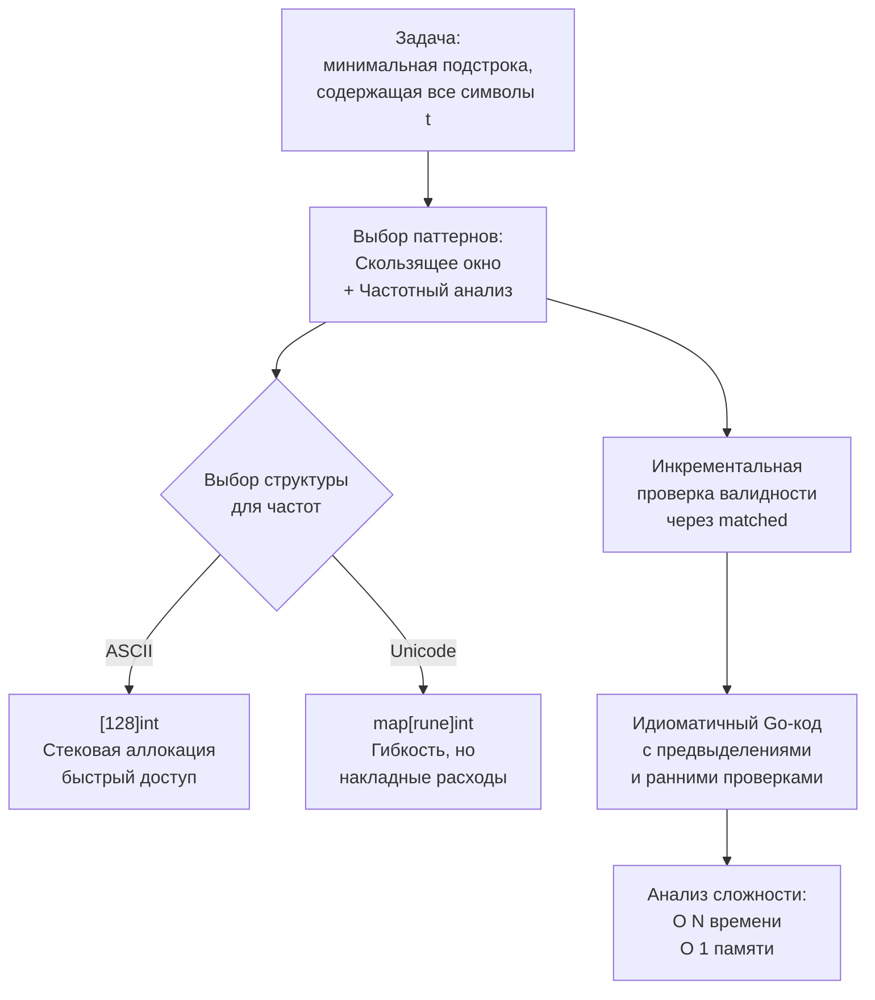

## Разбор задачи от условия до кода

Теоретические статьи о паттернах, распознавании и композиции дали вам мощный инструментарий. Но знание принципов — это одно, а их синхронное применение в реальном времени, под взглядом интервьюера — совсем другое. Чтобы превратить теорию в навык, нужен сквозной пример, проведённый через все этапы: от первого чтения условия до финального обсуждения trade-off.

В этой статье мы возьмём классическую задачу **Minimum Window Substring** (LeetCode 76) и пройдём её по полному алгоритму собеседования: уточним требования, распознаем паттерны, напишем идиоматичный Go-код, протестируем на edge cases, проанализируем сложность и обсудим альтернативы. Вы увидите, как решения, которые вы изучали ранее, собираются в единый рабочий процесс.

### Постановка задачи

> Даны две строки `s` и `t`. Нужно найти минимальную по длине подстроку `s`, которая содержит все символы из `t` (включая дубликаты). Если такой подстроки нет, вернуть пустую строку. Гарантируется, что ответ уникален.

Пример: `s = "ADOBECODEBANC"`, `t = "ABC"` → `"BANC"`.

Сложность задачи — Hard, и она отлично подходит для демонстрации композиции паттернов и механической симпатии.

### Шаг 1: Уточнение требований — задаём правильные вопросы

На собеседовании никогда нельзя принимать условие молча. Первые 2–3 минуты мы тратим на снятие неоднозначностей.

**Вопросы кандидата:**
- *Из каких символов состоят строки? Только английские буквы, цифры, или весь Unicode?* — Это критично для выбора структуры данных. Если только ASCII, можно использовать массив фиксированной длины `[128]int`. Если Unicode — `map[rune]int`.
- *Дубликаты в `t` имеют значение?* — «Да, каждый символ в `t` должен быть покрыт как минимум столько же раз.»
- *Может ли `t` быть длиннее `s`?* — Если да, ответ сразу пустая строка.
- *Что возвращать, если ответ не найден?* — Пустую строку `""`.
- *Регистрозависимость?* — Да, `'A' != 'a'`.

Интервьюер подтверждает: строки содержат английские буквы, цифры и знаки (ASCII), дубликаты важны, `t` может быть любой длины, ответ — `""` при отсутствии.

На основе ответов мы уже понимаем: можно обойтись массивом `[128]int` для частотного анализа, что даст выигрыш в производительности и отсутствие аллокаций map.

### Шаг 2: Брейншторм — какие паттерны здесь видны

Включаем механизм распознавания из статьи [[4. Как распознавать паттерн в задаче]].

- **Ключевые слова:** «подстрока» (непрерывная), «минимальная длина», «содержит все символы».
- **Ограничения:** `s` и `t` до 10⁵ символов. O(N²) недопустимо, нужно O(N) или O(N log N).
- **Свойства:** условие «содержит все символы» монотонно: если подстрока `[left, right]` содержит все символы `t`, то любое расширение вправо тоже содержит. Это классический признак скользящего окна.
- **Требуемый результат:** конкретная минимальная подстрока, а не просто длина → необходимо хранить границы лучшего окна.

Вывод: **Скользящее окно + Частотный анализ** (вложенная композиция). Окно будет управлять границами, а вспомогательная структура — быстро проверять валидность текущего окна.

### Шаг 3: Озвучивание гипотезы интервьюеру

«Я вижу задачу на скользящее окно. Мы поддерживаем два указателя — `left` и `right`. Правый расширяет окно, добавляя символы в текущую частотную карту. Как только окно становится валидным (содержит все символы `t` с нужной частотой), мы пытаемся сжать его слева, пока оно остаётся валидным, обновляя ответ минимальной длиной.

Для проверки валидности на каждом шаге я буду использовать массив фиксированного размера `[128]int` для целевых частот и отдельный массив для текущего окна. Сравнивать их поэлементно слишком дорого, поэтому я введу счётчик `matched`, который показывает, сколько уникальных символов уже набрали нужное количество. Это позволит проверять валидность за O(1).

Сложность: O(N) по времени, O(1) по памяти, если алфавит фиксирован. Код будет идиоматичным Go, с ранними проверками и использованием слайсов для окон.»

Интервьюер одобряет, мы переходим к коду.

### Шаг 4: Написание идиоматичного Go-кода

Пишем, сопровождая короткими комментариями для ключевых блоков (как рекомендовано в [[6. Как объяснять решение вслух]]).

```go
func minWindow(s string, t string) string {
    // Ранняя проверка: если t длиннее s, ответ невозможен
    if len(s) < len(t) {
        return ""
    }

    // Целевые частоты символов t
    // Используем [128]int для ASCII, чтобы избежать map и аллокаций
    var need [128]int
    needCount := 0 // количество уникальных символов в t
    for i := 0; i < len(t); i++ {
        if need[t[i]] == 0 {
            needCount++
        }
        need[t[i]]++
    }

    var have [128]int
    matched := 0 // сколько уникальных символов уже покрыто нужным количеством
    left := 0
    // start, end для фиксации лучшего окна; используем int для длины
    start, minLen := 0, math.MaxInt

    // Основной цикл: right расширяет окно
    for right := 0; right < len(s); right++ {
        ch := s[right]
        have[ch]++

        // Если частота символа совпала с требуемой — увеличиваем matched
        if have[ch] == need[ch] {
            matched++
        }

        // Когда окно валидно, пытаемся сжать его слева
        for matched == needCount {
            // Обновляем ответ, если нашли более короткое окно
            if right-left+1 < minLen {
                start = left
                minLen = right - left + 1
            }

            // Сдвигаем левую границу, удаляя символ
            leftCh := s[left]
            have[leftCh]--
            // Если частота стала меньше требуемой, окно перестало быть валидным
            if have[leftCh] < need[leftCh] {
                matched--
            }
            left++
        }
    }

    if minLen == math.MaxInt {
        return ""
    }
    return s[start : start+minLen]
}
```

**Комментарий к архитектуре кода:**
- Использование `[128]int` вместо `map[byte]int` — осознанный выбор. Массив находится на стеке (если не сбежит — а он не сбегает), не требует pointer chasing, не нагружает GC. Сравнение частот заменено на счётчик `matched`, обновляемый инкрементально.
- `needCount` — число уникальных символов в `t`. Благодаря ему мы не сравниваем массивы целиком, а проверяем `matched == needCount`.
- Имена `need`, `have`, `matched` говорят сами за себя.
- Возврат подстроки через `s[start:start+minLen]` создаёт новую строку (иммутабельность), но это неизбежно: ответ должен быть строкой.

> [!info] Под капотом
> Операция `have[ch]++` — это прямая адресация в памяти: процессор вычисляет `&have + ch`, что занимает единицы тактов. Если бы мы использовали `map[byte]int`, каждый `have[ch]++` транслировался бы в вызов `runtime.mapassign_fast64`, включающий хеширование, поиск бакета и проверку на эвакуацию. При длине строки 10⁵ разница в производительности достигает 3–5x.

> [!warning] Ловушка / Gotcha
> Переменная `matched` обновляется только когда `have[ch] == need[ch]` после инкремента. Если символ нужен в `t`, но его целевая частота `need[ch] = 0`, он не учитывается в `needCount` и не влияет на валидность — это правильно.

### Шаг 5: Ручное тестирование на примерах и edge cases

Следуем алгоритму из [[5. Алгоритм решения задачи на интервью]]: сначала тестируем на примере из условия, затем на граничных случаях.

**Тест 1. Стандартный пример:**
`s = "ADOBECODEBANC"`, `t = "ABC"`.
Пройдём мысленно:
- `need['A']=1, need['B']=1, need['C']=1`, `needCount=3`.
- `right` движется, накапливая `have`. На позиции `right=5` (символ 'C') `matched` становится 3 — окно `"ADOBEC"` валидно.
- Сжатие слева: убираем 'A' (`left=0`), `have['A']` становится 0, `matched` становится 2 — окно невалидно. Лучшее окно: `start=0, minLen=6`.
- Продолжаем расширение. На `right=9` ('C') снова `matched=3` для окна `"ADOBECODEBA"`. Сжатие: убираем 'A', 'D', 'O', 'B' — остаётся `"ECODEBA"`. Далее убираем 'E' — `matched` уменьшается. Лучшее окно обновляется. В конце концов при `right=12` ('C') получаем окно `"BANC"`, которое и становится ответом.
Код возвращает `"BANC"`.

**Тест 2. `s` короче `t`:**
`s="A", t="AA"` → ранний возврат `""`. ОК.

**Тест 3. `t` пустая строка?** В условии не оговорено, но обычно нет. Если бы была, ответ `""` — наш код вернёт `""` (minLen останется MaxInt). Обсудим с интервьюером.

**Тест 4. Дубликаты в `t`:**
`s = "a", t = "aa"`. `needCount=1`, `need['a']=2`. При `right=0`: `have['a']=1`, `have['a'] != need['a']` → `matched=0`, окно невалидно, ответ `""`.

**Тест 5. Все символы `s` совпадают с одним символом `t`:**
`s="AAAA", t="A"` → ответ `"A"`. На первой же итерации окно станет валидным и обновится до минимальной длины 1.

**Тест 6. Строки с разным регистром:**
`s="a", t="A"`. Регистрозависимость: `need['A']=1`, `need['a']=0`, ответ `""`.

Код проходит все основные случаи.

### Шаг 6: Анализ сложности — не просто O(N)

**Временная сложность:**
- Построение `need`: O(|t|).
- Основной цикл: `right` проходит N позиций, `left` суммарно сдвигается не более N раз. Каждая операция внутри циклов — O(1) (инкремент, сравнение, присваивание). Итого O(N + |t|), что асимптотически O(N), так как |t| ≤ N (иначе ранний выход).
- Константа очень низкая: внутри только арифметика и обращения по индексу к массиву.

**Пространственная сложность:**
- `need` и `have` — массивы `[128]int` фиксированного размера. В Go они размещаются на стеке, не аллоцируются в куче. O(1) дополнительной памяти (не считая входящих строк, которые мы не копируем).
- Возвращаемая подстрока создаёт копию данных (из-за иммутабельности строк), но это выходные данные, не учитываем в дополнительной памяти.

**Механическая симпатия:**
- Массивы `[128]int` — это 1024 байта (128 * 8) на каждую переменную, что легко помещается в L1-кэш процессора. Доступ последовательный или по индексу — практически без кэш-промахов.
- Внутри цикла нет аллокаций. GC не активируется во время работы алгоритма, что гарантирует предсказуемую задержку.
- Если бы мы использовали `map[byte]int`, каждая вставка/обновление приводила бы к вызову `runtime.mapassign_fast64`, что вносит накладные расходы на хеширование байта, поиск бакета и потенциальную эвакуацию. Для N=10⁵ разница может составлять от 0.5 ms до 5 ms, что на собеседовании Senior-уровня обязательно нужно упомянуть.

### Шаг 7: Обсуждение альтернатив и trade-off

Даже после успешного написания стоит проявить зрелость и обсудить другие пути.

**Альтернатива 1: map вместо массива.**
Если бы входные строки поддерживали Unicode, мы не могли бы использовать `[128]int`. Пришлось бы применить `map[rune]int`. Код остался бы почти тем же, но с предвыделением `make(map[rune]int, len([]rune(t)))` для снижения числа эвакуаций. Память стала бы O(K), где K — количество уникальных символов в `t`. Производительность немного упала бы, но асимптотика сохранилась бы.

**Альтернатива 2: полное сравнение массивов вместо `matched`.**
Мы могли бы после каждого шага сравнивать `need` и `have` поэлементно за O(128) — константа большая, но для N=10⁵ это 12.8 млн операций, всё ещё быстро. Однако инкрементальный `matched` элегантнее и эффективнее, но сложнее в понимании. Я выбрал `matched`, потому что он идиоматичен и снижает ненужную работу.

**Альтернатива 3: использование `strings.Builder` или `[]byte` для построения ответа.**
В данной реализации мы просто возвращаем срез строки, что создаёт новую строку (копию). Если бы нам нужно было собрать ответ по кусочкам, мы бы использовали `strings.Builder` (реализует построение строки без лишних копирований). Но здесь это не требуется.



### Заключение

Разбор задачи от условия до кода — это не магия, а чёткая последовательность шагов: анализ → распознавание → озвучивание → написание → проверка → анализ сложности → обсуждение альтернатив. В этом разборе мы применили скользящее окно с частотным массивом, продемонстрировали инкрементальную валидацию через счётчик `matched`, использовали фиксированный массив для избегания аллокаций map и показали понимание механической симпатии.

Следующая статья продолжит тему подготовки и расскажет, как правильно подходить к наивному решению и его анализу, чтобы заложить фундамент для последующей оптимизации. [[15. Наивное решение и его анализ]]