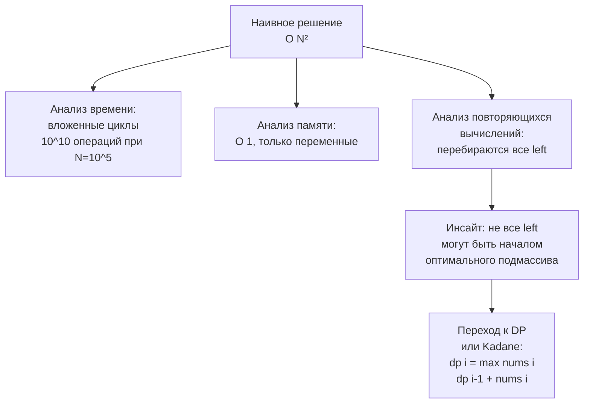

## Наивное решение и его анализ

В предыдущей статье мы прошли полный цикл решения задачи от условия до финального кода, используя распознанные паттерны и Go-идиомы. Но что, если паттерн не угадывается сразу? Или если вы на собеседовании, в стрессе, и в голове пусто? Первое, что должен сделать Senior-кандидат, — **начать с наивного решения** и провести его системный анализ. Это не признак слабости, а профессиональный рефлекс, который показывает интервьюеру вашу способность методично раскручивать проблему от простого к сложному.

В этой статье мы разберём, почему наивное решение — не «грязный черновик», а полноценный этап мышления, как правильно строить и анализировать brute-force на Go, какие инсайты из него извлекать для последующей оптимизации и как демонстрировать этот процесс на собеседовании, чтобы он шёл в зачёт, а не в минус.

### Почему наивное решение — стратегический шаг, а не падение

На платформах вроде LeetCode наивное решение воспринимается как неудача: если оно не проходит по времени, задача не засчитана. На собеседовании всё иначе. Интервьюер оценивает не бинарный «прошёл/не прошёл», а **процесс**. И построение наивного решения с его последующим анализом — это мощная демонстрация инженерного подхода.

**Что видит интервьюер, когда вы начинаете с brute-force:**

1. Вы не бросаетесь в код бездумно, а осознанно фиксируете baseline.
2. Вы понимаете, что оптимизация без понимания узких мест — это гадание.
3. Вы способны объяснить, *почему* решение медленное, и предложить конкретные точки улучшения.
4. У вас есть рабочий код, который можно протестировать на edge cases, даже если он не оптимален.

В отличие от молчания и метаний, наивное решение — это продукт. Его можно написать быстро, протестировать и затем улучшать, имея надёжный fallback.

> [!tip] Собеседование
> На реальном интервью в Google кандидат на позицию Senior получил задачу уровня Hard. Первые 5 минут он молча обдумывал, затем сказал: «Я начну с брутфорса за O(N³), чтобы убедиться в правильности понимания задачи и зафиксировать baseline. Затем я проанализирую, какие вычисления повторяются, и оптимизирую». Интервьюер одобрил. Кандидат написал брутфорс, протестировал, затем за 15 минут довёл до O(N). Оффер был получен.

### Как правильно строить наивное решение на Go

Наивное решение должно быть максимально простым, читаемым и — что критично для Go — корректным по работе с памятью и границами. Оно не обязано проходить лимиты, но обязано компилироваться и давать правильный ответ.

**Принципы построения:**

1. **Перебирайте всё явно.** Если задача про подмассивы — два вложенных цикла `for left` и `for right`. Если про подмножества — backtracking или битовые маски. Не пытайтесь пока вводить хитрые структуры.

2. **Используйте идиоматичный Go даже в брутфорсе.** Имена переменных — осмысленные. Проверки границ. Ранние возвраты. Это формирует привычку и показывает, что вы «Go-разработчик» даже в простом коде.

3. **Не пишите микрооптимизаций.** Наивное решение должно быть эталоном корректности. Если вы попытаетесь одновременно сделать его и быстрым, и простым, вы рискуете запутаться.

4. **Закладывайте возможность проверки.** Брутфорс легко тестировать на небольших примерах. Используйте это для ручного прогона или даже для написания table-driven теста (хотя на собеседовании устно).

**Пример:** задача «найти максимальную сумму подмассива» (известна как Kadane, но мы делаем вид, что не знаем).

Наивное решение — перебор всех возможных подмассивов:

```go
// maxSubarraySumBruteForce возвращает максимальную сумму непрерывного подмассива.
// Сложность: O(N^2) время, O(1) память.
func maxSubarraySumBruteForce(nums []int) int {
    if len(nums) == 0 {
        return 0
    }
    maxSum := math.MinInt
    for left := 0; left < len(nums); left++ {
        currentSum := 0
        for right := left; right < len(nums); right++ {
            currentSum += nums[right]
            if currentSum > maxSum {
                maxSum = currentSum
            }
        }
    }
    return maxSum
}
```

Что мы видим: вложенный цикл, пересчёт суммы инкрементально (без повторного сканирования), код компилируем и корректен. Для N=10⁵ он слишком медленный (O(N²) ≈ 10¹⁰ операций), но для N=1000 отрабатывает мгновенно.

### Анализ наивного решения: ищем узкие места

После написания брутфорса мы не говорим «ну, слишком медленно» и не идём сразу переписывать. Мы проводим **структурированный анализ**, который даст нам ключи к оптимизации.

**Чек-лист анализа:**

1. **Временная сложность.** Подсчитываем явно: внешний цикл N, внутренний — в среднем N/2, итого O(N²). При N=10⁵ это неприемлемо.

2. **Пространственная сложность.** В нашем случае — O(1) (только переменные `maxSum`, `currentSum`). Это отлично, значит, узкое место именно во времени, не в памяти.

3. **Какие вычисления повторяются?** В брутфорсе мы на каждом шаге внутреннего цикла прибавляем следующий элемент и проверяем сумму. Повторного сканирования нет, но количество проверенных подмассивов — O(N²). Можем ли мы сократить перебор?

4. **Монотонность или особые свойства?** В задаче с суммой подмассива есть известное свойство: если текущая сумма становится отрицательной, её сброс ведёт к лучшему результату (алгоритм Kadane). Но из анализа брутфорса мы видим, что мы перебираем все `left`, даже те, которые не могут быть началом оптимального подмассива.

5. **Избыточность состояний.** Для каждого `left` мы начинаем сумму заново. Но сумма для `left+1` может быть выражена через сумму для `left`. Это наводит на префиксные суммы или DP.

6. **Go-специфика.** В брутфорсе нет аллокаций, только локальные переменные на стеке. Утечек памяти нет. Стек горутины не растёт. Это хорошо. Значит, при оптимизации мы можем сосредоточиться на алгоритмической сложности, не меняя модель памяти.



### Как озвучивать анализ на собеседовании

На собеседовании анализ должен быть устным, чётким и вести к следующему шагу. Ваш монолог после написания брутфорса:

> «Я написал перебор за O(N²). Он корректен, но для заявленных N=10⁵ он выполнит порядка 10¹⁰ операций, что не уложится в тайм-аут. Однако я замечаю, что для каждого левого указателя я вычисляю сумму независимо. Это наводит на мысль, что можно переиспользовать вычисления: если сумма подмассива `[left, right-1]` уже известна, то добавление `nums[right]` даёт сумму `[left, right]`. Но глобально это всё ещё O(N²). Мне нужно свойство, которое позволит отбросить некоторые `left`. Смотрю: если сумма становится отрицательной, она только ухудшит любой будущий подмассив, начинающийся с того же `left`. Значит, я могу поддерживать текущую сумму и сбрасывать её, когда она уходит в минус. Это уменьшит перебор до одного прохода — O(N).»

Такой комментарий показывает, что вы не просто вспомнили Kadane, а вывели его из анализа брутфорса. Senior-инженер мыслит именно так.

### Пример с задачей, где наивное решение сложнее оптимизировать: 3Sum

Задача: найти все уникальные тройки чисел, дающие в сумме 0.

**Наивное решение:** три вложенных цикла, каждый перебирает элементы. Уникальность обеспечивается либо проверкой на дубликаты в слайсе результатов, либо предварительной сортировкой и пропуском одинаковых. Сложность O(N³), память O(1) (если не считать выходной массив).

```go
func threeSumBruteForce(nums []int) [][]int {
    n := len(nums)
    sort.Ints(nums) // для детекта дубликатов и упрощения
    var result [][]int
    for i := 0; i < n-2; i++ {
        if i > 0 && nums[i] == nums[i-1] {
            continue
        }
        for j := i + 1; j < n-1; j++ {
            if j > i+1 && nums[j] == nums[j-1] {
                continue
            }
            for k := j + 1; k < n; k++ {
                if k > j+1 && nums[k] == nums[k-1] {
                    continue
                }
                if nums[i]+nums[j]+nums[k] == 0 {
                    result = append(result, []int{nums[i], nums[j], nums[k]})
                }
            }
        }
    }
    return result
}
```

**Анализ:**
- N ≤ 3000 (типичные ограничения для 3Sum), O(N³) = 27×10⁹ — слишком много.
- Узкое место: третий цикл. Для фиксированных `i` и `j` мы ищем `k` такое, что `nums[k] = -(nums[i]+nums[j])`. Поскольку массив отсортирован, `k` можно искать бинарным поиском (O(log N)) или — ещё лучше — использовать два указателя, сведя сложность к O(N²).

Этот анализ напрямую порождает итоговый алгоритм: фиксируем `i`, а для оставшейся части массива применяем два указателя.

### Когда брутфорс применим как финальное решение

Иногда ограничения таковы, что наивного решения достаточно. На собеседовании вы должны это осознать и предложить, а не тратить время на оптимизацию ради оптимизации.

**Признаки того, что брутфорс допустим:**
- N ≤ 100 (O(N²) ~ 10 000 операций — мгновенно).
- N ≤ 20 (O(2^N) ~ 1 000 000 — терпимо).
- Задача требует генерации всех комбинаций, и размер ответа экспоненциален — тогда брутфорс неизбежен.

**Пример:** генерация всех подмножеств (LeetCode 78). N ≤ 10. Брутфорс с битовыми масками или рекурсивным перебором — 2^N вариантов — это и есть ответ. Никакой оптимизации не нужно.

### Механическая симпатия в наивном решении

Даже в брутфорсе можно показать понимание работы Go. Например, при создании слайса для результата мы можем предварительно аллоцировать его capacity, если она известна (в 3Sum это не всегда возможно, но можно обсудить).

В брутфорсе для 3Sum мы использовали `sort.Ints`, что модифицирует исходный слайс in-place — аллокаций нет. Если бы мы хотели сохранить исходный порядок, нам потребовалось бы скопировать слайс, и Senior упомянул бы этот trade-off.

При работе со строками в брутфорсе мы избегаем конвертации `string` -> `[]byte` -> `string` в цикле, чтобы не плодить мусор. Используем `strings.Builder` или работаем с индексами.

> [!warning] Ловушка / Gotcha
> Новичок, пишущий брутфорс, может внутри цикла создавать новые слайсы через `append`, не предполагая ёмкость. Для N=10⁵ это вызовет многократные аллокации и замедлит код ещё сильнее. Senior уже в брутфорсе делает `make([]int, 0, expectedSize)`, если ожидаемый размер известен, или хотя бы комментирует это как точку оптимизации.

### Как тренировать навык построения наивного решения

1. **Решайте задачи, не зная паттерна.** Возьмите новую задачу, напишите только брутфорс, не пытаясь сразу оптимизировать. Проанализируйте, какие именно вычисления повторяются.
2. **Сравнивайте свой анализ с эталонным.** Откройте разбор задачи и посмотрите, какие узкие места выделяют авторы. Совпадает ли с вашим анализом?
3. **Практикуйте устный анализ.** В паре с коллегой или на mock-интервью озвучивайте весь процесс от брутфорса до вывода свойств.
4. **Используйте профилирование (локально).** Напишите бенчмарк для наивного решения, запустите `go test -bench`, посмотрите на `cpuprofile`. Где именно программа проводит время? Это тренирует чутьё на узкие места.

### Заключение

Наивное решение — это не провал, а первый шаг инженерного анализа. Оно даёт baseline корректности, обнажает повторяющиеся вычисления и неэффективные структуры, служит точкой отсчёта для измерения прогресса оптимизации. На собеседовании Senior-уровня демонстрация этого цикла — «написал наивный код, проанализировал, вывел свойства, оптимизировал» — ценится выше, чем мгновенный правильный ответ без объяснения пути.

В следующей статье мы продолжим тему и покажем, как шаг за шагом превращать наивное решение в оптимальное, применяя технику инкрементальных улучшений. [[16. Оптимизация решения шаг за шагом]]