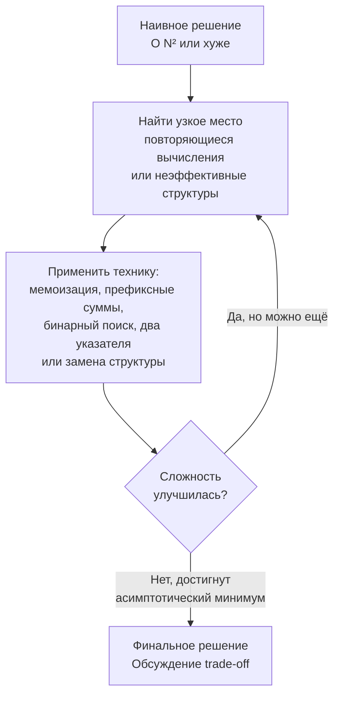

## Оптимизация решения шаг за шагом

В предыдущей статье [[15. Наивное решение и его анализ]] мы договорились, что brute-force — не провал, а отправная точка инженерного анализа. Теперь пора двигаться дальше: превращать медленный, но корректный код в быстрое, production-grade решение. И делать это не одним гигантским прыжком, а последовательностью контролируемых, обоснованных шагов. Именно такая методика incremental optimization на собеседовании убеждает интервьюера, что перед ним Senior-разработчик, а не человек, заучивший решение.

В этой статье мы разберём, как методично, шаг за шагом, искать и устранять узкие места, какие ментальные модели и инструменты использовать на каждом этапе и как Go-специфика диктует направление оптимизации. Мы пройдём через несколько классических задач, показывая цепочку «наивное → промежуточное → оптимальное» и объясняя, *почему* каждый следующий шаг работает.

### Ментальная модель: не прыжок, а подъём по ступеням

Оптимизация — это не магия и не озарение. Это процесс последовательного устранения bottleneck'ов — самых «дорогих» операций в текущей версии кода. Как только вы убираете один bottleneck, верхушка рейтинга затрат переходит к другой операции, и вы принимаетесь за неё. Так продолжается, пока дальнейшее улучшение не перестанет окупаться (обычно когда достигнута асимптотически минимальная сложность).



У этой модели есть важное следствие: вы не обязаны сразу видеть финальное решение. Вы можете начать с брутфорса и честно пройти несколько итераций улучшений на глазах у интервьюера. Это покажет вашу способность анализировать и искать компромиссы, что гораздо ценнее, чем мгновенный правильный ответ без объяснения пути.

### Шаг 1: Убираем повторные вычисления

Самая частая причина медлительности наивного решения — повторное перевычисление одного и того же. Например, в задаче Maximum Subarray Sum брутфорс перебирает все подмассивы и суммирует их заново, хотя сумма `[left, right]` может быть получена из `[left, right-1]` добавлением одного элемента (наша наивная реализация уже это частично делала, но остаётся перебор всех `left`). Более яркий пример — вычисление чисел Фибоначчи через рекурсию без мемоизации: `F(n)` вызывает `F(n-1)` и `F(n-2)`, которые перевычисляют одни и те же значения экспоненциальное количество раз.

**Техника обнаружения:** нарисуйте дерево вызовов или просто спросите: «Какие значения я вычисляю заново?» Ответ почти всегда: «Что-то, что уже вычислял на предыдущем шаге».

**Инструмент:** мемоизация (top-down DP) или табуляция (bottom-up DP). В Go мемоизацию через map можно сделать, но bottom-up с предвыделенным слайсом `[]int` почти всегда эффективнее (нет pointer chasing, предсказуемый доступ, меньше нагрузки на GC).

---

### Шаг 2: Заменяем неэффективные структуры данных

Когда повторные вычисления убрали, верхушку bottleneck'а часто занимает поиск, вставка или доступ к коллекции. Наивное решение могло использовать линейный поиск по слайсу (`O(n)`) там, где нужна константа, или map там, где достаточно массива фиксированного размера, или рекурсию без мемоизации там, где нужна таблица DP.

**Примеры замен:**

- Линейный поиск в слайсе → бинарный поиск (если слайс отсортирован).
- Слайс → `map` для константного доступа по ключу.
- `map` → массив фиксированного размера (`[26]int`, `[128]int`), если ключи — символы ограниченного алфавита.
- Стек/очередь на основе `container/list` → слайс (`[]T`), потому что слайс не аллоцирует элементы по отдельности и дружественен кэшу.
- Рекурсивный DFS с переполнением стека → итеративный DFS со стеком на слайсе.

> [!info] Под капотом
> Замена `map[byte]int` на `[128]int` в задаче со строками ASCII не просто меняет асимптотику с O(1) на O(1). Она радикально меняет производительность за счёт того, что массив `[128]int` размером 1024 байта помещается в L1-кэш, доступ по индексу — прямая адресация (одна инструкция LEA/ADD), а map требует хеширования, поиска бакета, пробега по цепи. Подробнее это разобрано в разделе [[07. Глубокий Go (Внутреннее устройство)]].

---

### Шаг 3: Меняем перспективу — сортировка, два указателя, инвертирование задачи

Иногда bottleneck — не конкретная операция, а сама структура перебора. Брутфорс может перебирать всё в лоб, а правильный взгляд на задачу позволяет отбросить огромные куски пространства поиска.

**Типовые техники смены перспективы:**

- **Сортировка + два указателя:** классика для задач на поиск пар, троек (2Sum, 3Sum), удаление дубликатов, слияние интервалов. Сортировка `O(N log N)` + линейный проход `O(N)`.
- **Скользящее окно:** для непрерывных подмассивов с монотонным условием — вместо перебора всех `left`/`right` поддерживаем два указателя и инкрементально обновляем состояние.
- **Бинарный поиск по ответу:** если трудно найти ответ прямо, но легко проверить, подходит ли кандидат X, и проверка монотонна — делаем бинарный поиск по X.
- **Инвертирование задачи:** вместо «найти максимум» искать «исключить всё, что не максимум». В Trapping Rain Water мы перешли от перебора ям к предподсчёту максимумов слева/справа.

**Пример вывода:** «Сейчас у меня O(N²) из-за двух вложенных циклов. Но я замечаю, что если я отсортирую массив, то для каждого первого элемента я могу найти пару двумя указателями за O(N). Итого O(N log N), и ограничения N=10⁴ это пропускают.»

---

### Шаг 4: Go-специфичные микрооптимизации (после асимптотики)

Когда асимптотическая сложность доведена до оптимальной, можно обсудить улучшения константы. На собеседовании Senior-уровня это жирный плюс, если подано к месту.

- **Предвыделение capacity:** `make([]int, 0, expectedSize)` вместо `var res []int` + `append` внутри цикла. Убирает многократные переаллокации и копирования.
- **Массивы на стеке:** `var arr [100]int` вместо `make([]int, 100)` для небольших фиксированных размеров — избегает аллокации в куче.
- **Работа со строками через `[]byte` или `strings.Builder`:** избегает создания промежуточных строк при конкатенации.
- **Копирование вместо слайсинга для больших массивов:** чтобы не держать в памяти большой массив из-за маленького подслайса (предотвращение утечки).
- **`for i, v := range` vs `for i := 0; i < len; i++`:** range копирует значение, что может быть дорого для больших структур; используйте индексный доступ или `for i := range` с прямым доступом.

> [!warning] Ловушка / Gotcha
> Микрооптимизации не должны ухудшать читаемость без веской причины. Если вы меняете ясный `for _, v := range` на `for i := 0; i < len; i++` ради избежания копирования, будьте готовы объяснить: «Здесь `v` — это копия большой структуры, которая создаётся на каждой итерации. Я перехожу на индекс, чтобы избежать этих аллокаций, хотя обычно range предпочтительнее». Без комментария такой код выглядит как стилистический откат.

---

### Сквозной пример: 3Sum (LeetCode 15)

Проведём задачу через все шаги, начиная с брутфорса, изученного в предыдущей статье.

**Шаг 0. Наивное решение.** Три вложенных цикла, проверка суммы, сортировка для пропуска дубликатов. Сложность O(N³). При N=3000 (типичные ограничения) — слишком медленно.

**Анализ:** узкое место — третий цикл. Для фиксированных `i` и `j` мы ищем `k`, такое что `nums[k] = -(nums[i]+nums[j])`. Поскольку после сортировки массив упорядочен, мы можем искать `k` бинарным поиском или, что эффективнее, использовать **два указателя**: `j` и `k` сходятся навстречу. Это снижает сложность до O(N²).

**Шаг 1. Сортировка + два указателя.** Сортируем, затем фиксируем `i`, а для `j` (начинается с `i+1`) и `k` (начинается с конца) ищем пару. Уникальность гарантируется пропуском одинаковых значений. Код:

```go
func threeSum(nums []int) [][]int {
    n := len(nums)
    if n < 3 {
        return nil
    }
    sort.Ints(nums) // O(N log N), in-place
    var res [][]int
    for i := 0; i < n-2; i++ {
        if i > 0 && nums[i] == nums[i-1] {
            continue
        }
        j, k := i+1, n-1
        target := -nums[i]
        for j < k {
            sum := nums[j] + nums[k]
            switch {
            case sum == target:
                res = append(res, []int{nums[i], nums[j], nums[k]})
                // пропускаем дубликаты j
                for j < k && nums[j] == nums[j+1] {
                    j++
                }
                // пропускаем дубликаты k
                for j < k && nums[k] == nums[k-1] {
                    k--
                }
                j++
                k--
            case sum < target:
                j++
            default:
                k--
            }
        }
    }
    return res
}
```

**Обсуждение сложности:** время O(N²), память O(1) (без учёта результата). Сортировка in-place, два указателя используют только локальные переменные.

**Шаг 2. Микрооптимизации Go.**
- Можно предвыделить `res` с некоторой ёмкостью (`make([][]int, 0, 256)`), но точное количество троек неизвестно, так что оставим.
- Используем индексы, а не range, так как работаем с тремя указателями.
- Внутренние циклы для пропуска дубликатов выполняют сугубо линейные сдвиги, указатели не убегают за границы.
- Код читаем и идиоматичен.

**Что показали на интервью:** от O(N³) брутфорса через анализ избыточных проверок пришли к сортировке и двум указателям, получили O(N²), что приемлемо при N=3000. Объяснили, почему не O(N log N) — потому что перебор `i` даёт N итераций, и внутри линейный проход.

---

### Сквозной пример: Longest Substring Without Repeating Characters (LeetCode 3)

Покажем другую цепочку: от наивного O(N³) к O(N).

**Шаг 0. Наивное решение.** Для каждого `left` и каждого `right > left` проверять, уникальны ли символы в `s[left:right+1]`. Проверка уникальности — O(длина окна). Итого O(N³) или O(N²), если перебирать окно с поддержанием частотной карты. Код (пусть будет O(N²) вариант):

```go
func lengthOfLongestSubstringNaive(s string) int {
    n := len(s)
    maxLen := 0
    for left := 0; left < n; left++ {
        seen := make(map[byte]bool)
        for right := left; right < n; right++ {
            if seen[s[right]] {
                break
            }
            seen[s[right]] = true
            if right-left+1 > maxLen {
                maxLen = right - left + 1
            }
        }
    }
    return maxLen
}
```

**Сложность:** O(N²) время, O(N) память из-за карты на каждом левом указателе.

**Анализ:** bottleneck — перебор всех `left`. Если для `left` мы остановились на `right`, где встретился повтор, при сдвиге `left` на 1 нам не нужно начинать `right` заново — можно продолжать расширять. Это свойство монотонности: окно не сжимается при расширении `left` (на самом деле окно обычно «сдвигается» как sliding window). Также map пересоздаётся для каждого left — это аллокации.

**Шаг 1. Скользящее окно с map/массивом.** Используем два указателя и одну хеш-таблицу (или массив `[128]int` для ASCII), чтобы хранить последние позиции символов.

```go
func lengthOfLongestSubstring(s string) int {
    var lastPos [128]int // предполагаем ASCII
    for i := range lastPos {
        lastPos[i] = -1
    }
    left, maxLen := 0, 0
    for right := 0; right < len(s); right++ {
        ch := s[right]
        if prev := lastPos[ch]; prev >= left {
            left = prev + 1
        }
        lastPos[ch] = right
        if curLen := right - left + 1; curLen > maxLen {
            maxLen = curLen
        }
    }
    return maxLen
}
```

**Сложность:** O(N) время, O(1) память (фиксированный массив 128 int'ов на стеке). Это оптимально.

**Go-специфика:** массив `[128]int` избегает map и аллокаций, сравнение позиций за O(1). Комментарий на собеседовании: «Я заменил map на массив, потому что алфавит ASCII, и это исключает эвакуации бакетов и pointer chasing».

---

### Как презентовать пошаговую оптимизацию на собеседовании

Структура диалога может быть такой:

1. «Давайте я начну с простого рабочего решения, чтобы убедиться в правильности понимания задачи.» (Пишете наивный код.)
2. «Теперь проанализирую: сложность O(N²), bottleneck — перебор вот этого. Я вижу, что можно переиспользовать вычисления.»
3. «Перехожу к оптимизации: применяю два указателя / префиксные суммы / DP. Объясняю, почему это корректно.»
4. «Проверяю на edge cases, анализирую новую сложность.»
5. «Можно ещё улучшить константу, заменив map на массив, потому что...»

Такой проход занимает 20–25 минут и полностью покрывает ожидания от Senior-раунда.

### Заключение

Пошаговая оптимизация — это не поиск волшебной таблетки, а системный процесс устранения узких мест через замену структур данных, переиспользование вычислений и смену перспективы. Каждый шаг должен быть обоснован анализом сложности и, где уместно, механической симпатией к Go. На собеседовании этот процесс демонстрирует зрелость, способность к декомпозиции и умение принимать trade-off — ключевые компетенции Senior/Lead-разработчика.

Следующая статья расскажет, как научиться *находить* эти узкие места с первого взгляда — техники профилирования мышлением, анализ ограничений и паттерны «красных флагов» в коде. [[17. Как находить узкие места]]