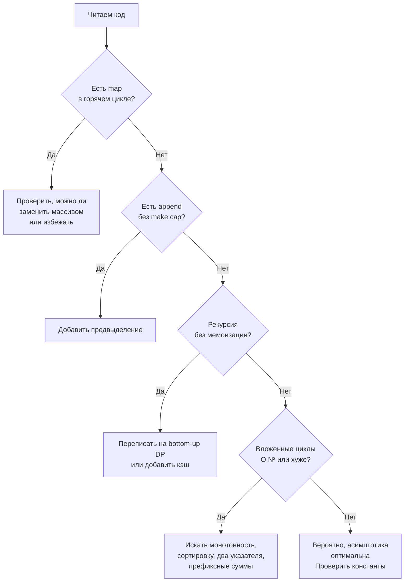

## Как находить узкие места

В предыдущей статье [[16. Оптимизация решения шаг за шагом]] мы превращали наивный код в оптимальный, последовательно устраняя самые дорогие операции. Но как узнать, *какая* именно операция самая дорогая? Как отличить настоящее узкое место от безобидной детали? И как делать это быстро, без профайлера и бенчмарков, прямо в уме — на собеседовании или при code review?

Умение мгновенно идентифицировать bottleneck — один из главных признаков Senior-разработчика. Новичок гадает и оптимизирует наугад; Senior видит структуру кода, как рентген, и указывает пальцем: «Вот здесь мы теряем время и память». Эта статья — о том, как развить такое зрение, какие законы физики и свойства рантайма Go за этим стоят, и как применять этот навык на алгоритмических собеседованиях.

### Что такое узкое место: не только асимптотика

**Узкое место (bottleneck)** — это компонент системы, который ограничивает её общую производительность. В контексте одной функции это операция или набор операций, на которые приходится непропорционально большая доля времени выполнения или аллокаций.

Распространённое заблуждение: «Bottleneck — это всегда то, что даёт самую высокую степень в O-нотации». Это правда лишь отчасти. Асимптотика показывает, как растёт время с ростом N. Но при конкретных ограничениях N=10⁵ O(N) с огромной константой может работать медленнее, чем O(N²) с микроскопической. И в Go константа часто определяется не алгоритмом, а взаимодействием с памятью: аллокациями в куче, pointer chasing в map, ростом слайсов, остановками GC.

**Пример:** У вас есть O(N) алгоритм, но внутри цикла вы делаете `m[key]++` для map с миллионом ключей. Каждая операция — это хеширование, поиск бакета, возможная эвакуация. Второй алгоритм — O(N log N) с сортировкой слайса и бинарным поиском, но зато все данные лежат непрерывно, кэш-промахов нет, GC не напрягается. На практике второй может обогнать первый на порядок для определённых N.

Вывод: **bottleneck может быть асимптотическим (Big O), аллокационным (куча/GC), кэш-промаховым (cache miss) или их комбинацией.** Senior видит все три слоя.

### Ментальная модель: «куда уходит время»

На собеседовании у вас нет pprof и трассировщика. Но у вас есть мысленная модель исполнения Go-кода, построенная на знании [[07. Глубокий Go (Внутреннее устройство)]] и [[01. Архитектура компьютера]]. Вы смотрите на код и на каждой строке мысленно «считаете такты».

**Базовые цифры для ориентира (современный x86-64, грубо):**
- Обращение к локальной переменной (регистр или L1-кэш): 1–4 такта.
- Доступ к элементу слайса по индексу (L1-L2): 4–12 тактов.
- Доступ к элементу map (хеш + поиск в бакете + pointer chasing): 50–200 тактов (и это при хорошем раскладе).
- Аллокация в куче (вызов `runtime.mallocgc`): сотни-тысячи тактов, не считая работы GC.
- Системный вызов (например, запись в файл): десятки тысяч тактов — но в DSA-задачах не встречается.

С такой таблицей в голове вы мгновенно видите: «здесь map в цикле — дорого», «здесь append без capacity — скрытые аллокации», «здесь рекурсия без мемоизации — экспоненциальный взрыв».



### Систематический подход: чек-лист «красных флагов»

Вот 7 маркеров, которые я мысленно проверяю в любом неоптимальном коде на Go. Пройдитесь по ним, и bottleneck проявится.

#### 1. Вложенные циклы с перебором всех пар

Самый очевидный красный флаг: двойной `for` по массиву длиной N. Почти всегда означает O(N²). Спросите: «Можно ли внешний цикл заменить на скользящее окно, два указателя или бинарный поиск?»

**Исключение:** если N мало (≤ 100) и O(N²) приемлемо — это не bottleneck.

#### 2. Повторное вычисление одного и того же

Если в коде для разных `left` заново считается сумма `[left, right]` с нуля, или рекурсивная функция вызывается с одинаковыми аргументами — это повторные вычисления. Лечится префиксными суммами, мемоизацией, DP.

#### 3. Линейный поиск в слайсе внутри цикла

Если внутри `for` по N элементам вы делаете `for _, v := range slice` для поиска, итоговая сложность O(N²). Решение: map для O(1) поиска, бинарный поиск для O(log N) (если массив отсортирован), или сортировка + два указателя.

#### 4. Map в горячем цикле без предвыделения и с нецелочисленными ключами

Map — мощный, но дорогой инструмент. В цикле на 10⁶ итераций каждая вставка/обновление вызывает хеширование и поиск бакета. Если ключи — небольшой диапазон целых или ASCII-символов, замена на `[N]int`/`[128]int` даёт 5–10x ускорение и убирает нагрузку на GC.

#### 5. Рост слайса через append без предвыделенной capacity

Когда вы `append`-ите в слайс, и capacity заканчивается, Go выделяет новый массив (обычно x2) и копирует данные. Для N=10⁵ это может случиться ~17 раз и скопировать суммарно ~200 тыс. элементов. Это скрытая O(N) операция, умноженная на константу копирования. Лечится `make([]T, 0, expectedSize)`.

> [!warning] Ловушка / Gotcha
> Если `expectedSize` неизвестен точно, оценка сверху (например, `make([]int, 0, len(s))`) лучше, чем ничего. Лишняя память на несколько килобайт — ничто по сравнению с 17 аллокациями и копированиями.

#### 6. Строковые операции в цикле

Строки в Go иммутабельны. Каждая конкатенация `s += "x"` создаёт новую строку и копирует все байты. В цикле это O(N²) по памяти и времени. Решение: `strings.Builder` (внутри использует `[]byte` и растёт без лишних копирований) или работа с `[]byte` напрямую.

#### 7. Рекурсия без гарантии глубины

Go имеет расширяемый стек горутины, но частые расширения (stack copying) не бесплатны. Глубокая рекурсия (10⁵ вызовов) может замедлить выполнение. Если глубина не ограничена, замените рекурсию на итерацию с явным стеком (слайсом) или bottom-up DP.

### Go-специфичные узкие места: куда смотрит Senior, но не смотрит Middle

Этот раздел — о тонких местах, которые не видны в асимптотике, но проявляются под нагрузкой.

#### Escape analysis и непреднамеренные аллокации в куче

Компилятор Go решает, где выделить память: на стеке или в куче. Если переменная «убегает» (возвращается из функции, сохраняется в глобальную переменную, передаётся в `interface{}`), она идёт в кучу. Каждая аллокация в куче — это будущая работа для GC.

В DSA-задачах на собеседовании вы не будете смотреть вывод `go build -gcflags="-m"`, но Senior-разработчик мысленно отслеживает:
- Возврат `*Node` из функции — сам `Node` в куче.
- Срез рун `[]rune(s)` — аллокация.
- Передача значения в `interface{}` (редко в DSA) — boxing и аллокация.
- Использование замыканий с захватом переменных — иногда аллокация.

Знание этого позволяет выбрать: «Я возвращаю слайс индексов, а не указателей на узлы, потому что слайс индексов — это один непрерывный кусок памяти, а узлы — по отдельности».

#### Скрытые копирования в range

`for _, v := range largeStructSlice` копирует `v` на каждой итерации. Если структура большая (например, 128 байт), это создаёт O(N) лишних копирований. В DSA-задачах структуры обычно малы, но если вы оперируете срезами структур, используйте `for i := range largeStructSlice` и обращайтесь `largeStructSlice[i]`.

#### Сравнение map vs массив и cache locality

Когда вы ищете частоту символов в строке, map даёт десятки тактов на доступ и pointer chasing. Массив `[128]int` даёт доступ за единицы тактов, и prefetcher легко предсказывает паттерн. Для N=10⁵ это разница между 3 мс и 0.3 мс. На собеседовании Senior может сказать: «Я выбираю массив, чтобы избежать pointer chasing и использовать cache locality CPU», и это будет правильно понято.

### Как искать узкие места во время интервью: пошаговая методика

1. **Напишите или проговорите наивное решение.** Не пропускайте этот шаг.
2. **Найдите самый глубокий уровень вложенности.** Обычно это двойной/тройной цикл или рекурсия. Это главный подозреваемый.
3. **Оцените сложность:** сколько итераций для крайних значений N? Не в Big O, а прямо в числах.
4. **Посмотрите, что находится внутри самого глубокого цикла.** Именно это умножается на максимальное количество итераций.
5. **Проверьте каждую операцию внутри по чек-листу «красных флагов»:** map без предвыделения, append без capacity, линейный поиск, строковые конкатенации, рекурсия.
6. **Задайте вопрос:** «Можно ли то же самое посчитать за O(1) или O(log N) вместо O(N)?» Если да — это точка оптимизации.
7. **Проверьте память:** есть ли структуры, которые можно заменить на более лёгкие или перенести на стек?

### Пример анализа: Maximum Subarray (Kadane)

Предположим, вы видите такой код (наивное решение):

```go
func maxSubArray(nums []int) int {
    maxSum := math.MinInt
    for left := 0; left < len(nums); left++ {
        for right := left; right < len(nums); right++ {
            sum := 0
            for k := left; k <= right; k++ {
                sum += nums[k]
            }
            if sum > maxSum {
                maxSum = sum
            }
        }
    }
    return maxSum
}
```

**Шаг 1.** Тройной вложенный цикл. Внешний — N, средний — N/2 в среднем, внутренний — N/2. Итого O(N³).

**Шаг 2.** Самый внутренний цикл перевычисляет сумму `[left, right]` с нуля. Узкое место №1.

**Шаг 3.** Убираем внутренний цикл, инкрементально добавляя `nums[right]` к текущей сумме. Сложность падает до O(N²). Код из [[15. Наивное решение и его анализ]].

**Шаг 4.** Теперь узкое место — перебор всех `left`. Можно ли не перебирать все `left`? Если текущая сумма стала отрицательной, она никогда не улучшит будущие суммы. Поэтому можно сбрасывать её на 0 и двигать `left` неявно. Это алгоритм Kadane — O(N).

На каждом шагу мы идентифицировали конкретную операцию, которая съедает время, и адресовали её.

### Пример с памятью: Group Anagrams

Задача: сгруппировать слова по анаграммам. Наивное — для каждого слова сортировать буквы и сравнивать с ключами map.

**Узкое место:** сортировка каждого слова. Если слов N, а длина слова K, общая сложность O(N * K log K). Можно ли избежать сортировки? Да, заменить на подсчёт частот (массив `[26]int`) и использовать его как ключ map (переведя в строку). Это O(N * K), и ключ генерируется без полной сортировки.

**Go-специфика:** Ключом map не может быть массив `[26]int` (массивы сравнимы, но map не принимает в качестве ключа всё, что содержит `==`? На самом деле массивы с сравнимыми элементами — допустимые ключи map! `map[[26]int][]string` работает, если элементы массива comparable. Это идиоматичный и очень быстрый подход, потому что ключ — фиксированный массив. Или можно использовать строку, полученную из массива через `strings.Builder`.)

Это пример того, как анализ bottleneck'а (сортировка) ведёт к замене структуры и использованию неочевидной фичи Go.

### Заключение

Умение находить узкие места — это не талант, а тренируемый навык систематического анализа кода, основанный на понимании алгоритмической сложности и модели исполнения Go. Senior-разработчик просматривает код по чек-листу: вложенность, повторные вычисления, выбор структуры данных, аллокации, cache locality — и за секунды определяет, где код теряет производительность. На собеседовании этот навык позволяет уверенно превращать брутфорс в оптимальное решение с обоснованием каждого шага.

В следующей статье мы поговорим о том, как время и память оцениваются на практике: что означают ограничения по времени на LeetCode, как переводить Big O в реальные миллисекунды и мегабайты, и как не попасть в TLE на собеседовании. [[18. Время и память на практике]]