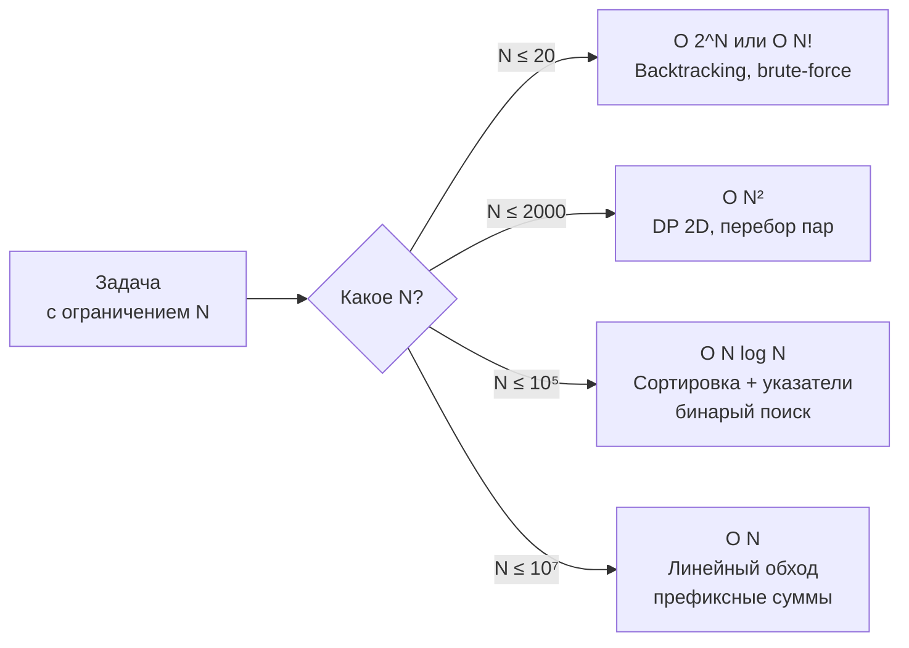

## Время и память на практике

В предыдущих статьях мы научились писать наивные решения ([[15. Наивное решение и его анализ]]), оптимизировать их шаг за шагом ([[16. Оптимизация решения шаг за шагом]]) и находить узкие места ([[17. Как находить узкие места]]). Но вся эта работа остаётся академической, пока вы не зададите себе главный вопрос: **уложится ли мой код в ограничения по времени и памяти?**

На платформе LeetCode это формулируется жёстко: есть лимит в 1–2 секунды и чёткий memory budget (обычно 256 МБ или 512 МБ). На собеседовании ограничения сообщает интервьюер, и от вас ожидают, что вы без профайлера и бенчмарков, прямо в уме, оцените, пройдёт ли предложенный алгоритм. Senior-разработчик делает это за секунды, опираясь на простые эмпирические правила и понимание того, во что «компилируется» Big O на реальном железе, да ещё и с учётом специфики Go.

В этой статье мы превратим интуитивные оценки в стройную систему. Вы узнаете, как переводить О-нотацию в миллисекунды и мегабайты, как Go-рантайм влияет на эти расчёты, и как научиться мгновенно определять, грозит ли вашему коду TLE (Time Limit Exceeded) или MLE (Memory Limit Exceeded).

### Главный закон собеседования: ограничения диктуют сложность

Ограничения на размер входных данных — это не просто цифры. Это ваш компас, который ещё до написания кода указывает допустимую временную сложность. Связь между N и максимально допустимой сложностью устоялась эмпирически и редко подводит.

**Таблица «N → допустимая сложность» для Go на LeetCode (1–2 секунды CPU):**

| N (размер входа) | Максимально допустимая сложность | Типичные паттерны |
|---|---|---|
| ≤ 10–12 | O(N!), O(2^N * N) | Полный перебор, Backtracking |
| ≤ 20–24 | O(2^N) | Backtracking, битовые маски |
| ≤ 100–300 | O(N³) | DP с тройным вложением, флойд-уоршалл |
| ≤ 2000 | O(N²) | DP 2D, наивные сравнения всех пар |
| ≤ 10⁵ | O(N log N) | Сортировка + два указателя, бинарный поиск, куча |
| ≤ 10⁶–10⁷ | O(N) | Линейный обход, скользящее окно, префиксные суммы, Kadane |
| > 10⁷ | O(log N), O(1) | Бинарный поиск, математическая формула |

Эти цифры работают для Go — языка с быстрой компиляцией в машинный код, но с накладными расходами на GC. Go примерно в 3–5 раз быстрее Python, но в 1.5–2 раза медленнее хорошо написанного C++ (из-за escape analysis и runtime). Поэтому таблицу можно применять смело, но с одним уточнением: **O(N log N) в Go при N=10⁵ абсолютно безопасно, а при N=10⁶ — уже требует внимания к константам**.

### От Big O к тактам: что скрывается за константой

Big O скрывает константу, и именно она решает судьбу вашего решения на границе допустимого. В Go константа складывается из трёх слоёв:

1. **Количество реальных операций.** Например, O(N log N) при N=10⁵ — это около 1.7 миллиона итераций (log₂ 100000 ≈ 17). Алгоритм с O(N²) при тех же N — 10 миллиардов итераций. Вот где пролегает пропасть.

2. **Стоимость одной итерации.** Именно здесь в игру вступает механическая симпатия. Итерация, состоящая из пары арифметических операций и доступа к слайсу по индексу, стоит десятки тактов. Итерация, включающая вставку в map, — сотни тактов из-за хеширования и pointer chasing. А если внутри цикла ещё и растёт слайс без предвыделенной capacity, то добавляются дорогие вызовы `runtime.mallocgc`.

3. **Влияние GC.** Ваш код может работать быстро, но если он выделяет много мусора в куче, GC будет периодически останавливать горутины, съедая драгоценное время. В алгоритмических задачах это особенно критично, потому что лимит по времени общий на всё выполнение, включая паузы GC.

> [!info] Под капотом
> Когда вы делаете `append` в слайс, и capacity не хватает, Go выделяет новый массив (обычно удваивая размер) и копирует все элементы. Это не amortized O(1) во времени выполнения? Формально да, но для процессора это выглядит как внезапный всплеск аллокаций и копирования памяти, который может занять тысячи тактов. Если вы в цикле на 10⁵ итераций 17 раз переаллоцируете массив, это эквивалентно дополнительным нескольким миллисекундам. Предвыделение через `make([]int, 0, n)` устраняет эту проблему полностью.

### Практический расчёт времени: формула «итерации × стоимость»

Senior-разработчик на собеседовании не считает такты процессора. Он использует приблизительную, но очень надёжную эвристику:

**Современный CPU выполняет около 10⁸–10⁹ элементарных операций в секунду (на одном ядре).**

Что это значит для нас?

- Если алгоритм делает ~10⁷ операций (например, линейный обход с простыми действиями), он отработает за **0.01–0.1 секунды** — уверенный «Accepted».
- Если ~10⁸ операций — около **1 секунды**, это близко к границе.
- Если ~10⁹ операций — **10 секунд**, почти наверняка TLE.

Теперь применим это к Go-специфике. Под «элементарной операцией» мы понимаем простые арифметические действия и доступ к массиву. Если итерация содержит обращение к map, умножьте ожидаемое время на 2–5. Если внутри цикла идёт много аллокаций — ещё на 1.5–2.

**Пример расчёта для задачи 3Sum (N=3000):**
- Мы выбрали O(N²) решение: внешний цикл N, внутренний цикл N/2 в среднем, итого ~4.5 миллиона итераций.
- Внутри — пара сравнений целых чисел и инкремент указателей.
- Даже с учётом накладных расходов Go, 4.5 × 10⁶ операций — это **менее 0.05 секунды**. Уверенный Accepted.
- Если бы мы попытались решить за O(N³), итераций было бы ~27 миллиардов — гарантированный TLE.

**Пример для N=10⁶ с O(N log N):**
- 10⁶ × 20 = 20 миллионов итераций.
- Если итерация — простые сравнения и обмены при сортировке, время будет порядка 0.2–0.5 секунды.
- Но если мы используем `sort.Slice` с замыканием, каждый вызов less-функции может быть не встроен компилятором и добавит overhead. `sort.Ints` всегда быстрее. Senior это знает и выбирает правильный инструмент.

### Оценка памяти: от структур данных к байтам

Ограничение по памяти на LeetCode обычно 256 МБ, чего с запасом хватает для большинства задач. Но в задачах с большими DP-таблицами или хранением графов можно превысить лимит. Умение оценить память в байтах — ещё один навык Senior-инженера.

**Считаем память для Go-структур (64-битная архитектура):**

| Тип данных | Размер в памяти |
|---|---|
| `int`, `int64` | 8 байт |
| `int32` | 4 байта |
| `byte`, `bool` | 1 байт |
| `string` (заголовок) | 16 байт (указатель 8 + длина 8) + сами данные |
| `[]T` (срез) | 24 байта (указатель, длина, вместимость) + len * sizeof(T) для нижележащего массива |
| `map[K]V` | ~8 байт на указатель `hmap` + бакеты (~8 записей на бакет, каждый бакет ~8*(sizeof(K)+sizeof(V)) плюс overhead на метаданные) |
| Указатель `*T` | 8 байт |

> [!warning] Ловушка / Gotcha
> Пустой `struct{}` имеет размер **0 байт**. Поэтому `map[T]struct{}` — канонический способ реализации множества в Go, не тратящий память на значения. `map[T]bool` занимает 1 байт на значение, что при миллионах записей выливается в лишние мегабайты. На собеседовании использование `struct{}` для значений map — маркер опытного Go-разработчика.

**Пример расчёта памяти для DP-задачи:**
Допустим, задача требует таблицы `dp[N][M]`, где N=M=2000. Каждая ячейка — `int` (8 байт). Общий объём: 2000 × 2000 × 8 = 32 миллиона байт = **32 МБ**. Это далеко от лимита 256 МБ, решение допустимо.

Но если мы выделяем ту же таблицу как `[][]int`, то дополнительно выделяется 2000 слайсов-заголовков (2000 × 24 ≈ 48 КБ) — мелочь. Однако если каждый слайс создаётся через `make` в цикле, это 2000 аллокаций, что уже влияет на время (не на память). Мы можем оптимизировать, выделив один плоский массив `[]int` длиной N*M и эмулируя двумерный доступ через индексацию.

**Ещё пример — map vs массив:**
Задача: сохранить частоту символов строки длиной 10⁵.
- `map[byte]int`: примерно 10⁵ записей. Каждая запись — это бакет, оценка грубо: 10⁵ × (8 + 8 + overhead) ≈ 2–3 МБ. Плюс сам hmap — ещё несколько десятков байт.
- `[128]int`: 128 × 8 = 1024 байта (1 КБ) — на стеке или в куче, но без pointer chasing и нагрузки на GC.

Вывод: если алфавит ограничен, массив всегда выигрывает по памяти и скорости.

### Как на собеседовании быстро принять решение «пройдёт / не пройдёт»

Интервьюер не ждёт от вас точных расчётов до миллисекунды. Ему нужна уверенная аргументация:

1. **Узнайте N** (или диапазон N).
2. **Сопоставьте N с допустимой сложностью по таблице.**
3. **Оцените количество операций вашего алгоритма** (хотя бы порядок).
4. **Проверьте память** (особенно если создаёте большие структуры).
5. **Если на границе — обсудите константы:** «Моё решение делает N log N операций, но внутри цикла используется map. При N=10⁶ это может быть близко к TLE. Я бы предложил оптимизировать map до массива, если алфавит ограничен, либо рассмотреть другой алгоритм».

Пример диалога:
> **Интервьюер:** «Массив до 10⁵ элементов, нужно найти максимальную сумму подмассива.»
> **Вы:** «Kadane, O(N), один проход, без дополнительной памяти, кроме переменных. При N=10⁵ будет ~10⁵ итераций, каждая — сложение и сравнение. Время менее 0.01 секунды, память O(1). Проходит с огромным запасом.»

> [!tip] Собеседование
> Если вы сомневаетесь, пройдёт ли O(N log N) при N=10⁶, произнесите: «Сортировка 10⁶ элементов в Go занимает примерно 0.2–0.3 секунды. С последующим линейным проходом весь алгоритм уложится в 0.5 секунды, что в пределах стандартного лимита». Это показывает, что вы не только знаете теорию, но и понимаете реальную производительность стандартной библиотеки.

### Особенности LeetCode: что скрывается за цифрами

- **Лимит времени** обычно 1–2 секунды, но для Go иногда может быть чуть строже из-за медленного старта? Нет, старт Go быстрый. Однако LeetCode измеряет общее время выполнения функции, включая аллокации и GC. Плохо написанный Go-код с миллионами аллокаций может упасть в TLE, даже если асимптотика верная.
- **Лимит памяти** — 256 МБ или 512 МБ. В Go важно помнить, что GC не освобождает память мгновенно. Даже если ваш алгоритм больше не использует какие-то данные, они могут оставаться в куче до следующего цикла GC. Для задач это редко проблема, но с очень большими структурами (например, граф из 10⁷ узлов) можно не вписаться.
- **Подсчёт памяти в LeetCode** обычно измеряет максимальное количество памяти, выделенное процессом. Срезы, которые вы не освободили явно (но они уже «мусор»), всё ещё учитываются. Поэтому в задачах с жёсткими memory limit'ами может потребоваться `runtime.GC()` (в production так делать не стоит, но на платформе допустимо) или оптимизация с переиспользованием слайсов.

> [!info] Под капотом
> `runtime.GC()` принудительно запускает сборку мусора. В алгоритмических задачах вызов этой функции после каждого тестового случая может помочь уложиться в memory limit, но на собеседовании лучше показать, что вы оптимизировали код, чтобы не полагаться на ручной GC. Упоминание «я могу вызвать `runtime.GC()` для гарантии, но предпочту переиспользовать слайс» — хороший тон.

### Заключение

Практическая оценка времени и памяти — это не магия, а простые арифметические прикидки, помноженные на понимание архитектуры Go. Запомните таблицу N → допустимая сложность, считайте итерации десятками миллионов в секунду и байты — миллионами на мегабайт. И всегда проверяйте свой выбор структур данных через призму аллокаций и cache locality. Тогда TLE и MLE станут предсказуемыми, а не внезапными, а на собеседовании вы будете аргументированно защищать эффективность вашего кода.

Теперь, когда мы освоили оценку производительности, пора перейти к тому, что может сломать даже идеальный алгоритм — краевые и угловые случаи. В следующей статье мы детально разберём, как систематически выявлять edge cases и corner cases, которые так любят на собеседованиях. [[19. Edge cases и corner cases]]