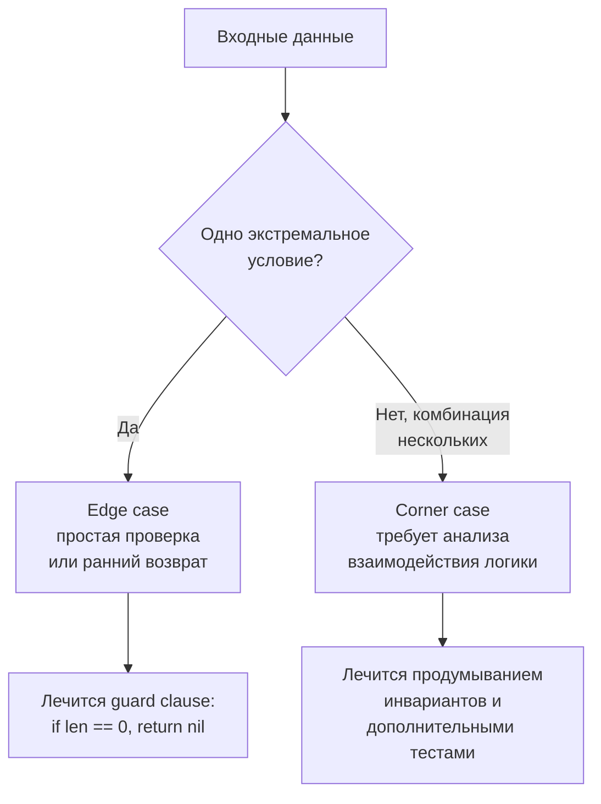

## Edge cases и corner cases

Вы написали код. Он проходит пример из условия. Вы уже мысленно нарисовали зелёную галочку и перешли к анализу сложности. Но интервьюер не спешит соглашаться. Он задаёт вопрос: «А что, если на вход подан пустой массив? А если элементы отрицательные? А если дерево вырождено в цепочку из миллиона узлов?» И тут выясняется, что ваш алгоритм паникует с `index out of range`, уходит в бесконечный цикл или возвращает неверный результат.

Умение предвидеть и обрабатывать краевые случаи — один из главных водоразделов между Middle- и Senior-разработчиком. В этой статье мы разберём, что такое edge cases и corner cases, чем они отличаются, как системно выявлять их до того, как на них укажет интервьюер, и как Go-специфика порождает собственный класс ловушек, знакомых каждому опытному Go-инженеру.

### Определения: edge case vs corner case

Термины часто путают, но разница есть — и она важна, потому что стратегия защиты для каждого типа своя.

- **Edge case (краевой случай)** — это ситуация, в которой входные данные находятся на границе допустимых значений, определённых условием задачи. Чаще всего это одна переменная, принимающая экстремальное значение. Примеры: пустая строка или слайс, `nil`-указатель на корень дерева, один элемент в массиве, значение равное `math.MaxInt`, строка из одного символа.

- **Corner case (угловой случай)** — это комбинация двух или более краевых условий одновременно. Такие случаи гораздо сложнее заметить и часто выявляют скрытые дефекты логики. Примеры: пустая строка *и* целевой паттерн тоже пуст; граф из одной вершины *и* без рёбер; массив, где все элементы одинаковы *и* равны нулю; бинарное дерево, вырожденное в связный список *и* содержащее только левых потомков.



> [!tip] Собеседование
> На интервью ожидается, что кандидат уровня Senior найдёт edge cases самостоятельно, а corner cases — с минимальными подсказками. Если интервьюеру приходится спрашивать «а что насчёт дубликатов?», это минус. Если он спрашивает «а что будет, если все элементы равны и k=0?» — это уже проверка глубины, и спокойный разбор corner case принесёт плюс.

### Как системно выявлять краевые случаи на собеседовании

Сразу после написания наивного (или целевого) кода, но до того, как объявить его готовым, выполните мысленный проход по контрольному списку. Это займёт минуту, но спасёт от десятка неприятных вопросов.

**Универсальный чек-лист edge cases:**

1. **Пустые входы:** пустая строка `""`, `nil` или пустой слайс `[]int{}`, `0` в числовых задачах, `nil`-указатель на структуру.
2. **Минимальный непустой вход:** один элемент, одна вершина графа, строка из одного символа.
3. **Максимальные значения:** числа близкие к `math.MaxInt`, `math.MinInt` (переполнение при суммировании, вычитании), очень длинные строки (10⁵+), глубокая рекурсия.
4. **Дубликаты:** все элементы одинаковы, повторяющиеся ключи, цикл в связном списке.
5. **Отрицательные значения:** если в условии не оговорено, что числа неотрицательны, обязательно проверьте поведение. Скользящее окно, например, для отрицательных чисел может не работать.
6. **Связные структуры:** неполный граф, дерево с одной веткой, цикл в списке, граф без рёбер.
7. **Порядок:** вход отсортирован или строго в обратном порядке? Это может сломать логику, завязанную на монотонность.

**Специфический Go-ориентированный чек-лист (о нём ниже).**

Применив этот список, вы находите большинство проблем до того, как они станут сюрпризом. На собеседовании проговаривайте: «Проверю пустой слайс — сработает ранний возврат nil. Проверю массив из одного элемента — цикл выполнится один раз, корректно. Проверю дубликаты — условие `==` обработает их правильно».

### Типовые edge cases для разных структур данных

Чтобы не держать в голове аморфный список, привяжите проверки к конкретному типу данных, фигурирующему в задаче.

| Структура данных | Характерные edge cases |
|---|---|
| **Массив/слайс** | пустой, один элемент, все элементы одинаковые, все элементы уже отсортированы / обратно отсортированы, очень большой N (проверка на TLE/MLE), дубликаты целевого значения |
| **Строка** | пустая `""`, строка из пробелов, Unicode-символы (суммы байт vs рун), регистрозависимость, палиндром с чётной/нечётной длиной, очень длинная строка |
| **Связный список** | `nil`-голова, один узел, цикл (для задач с детектом), два узла, k больше длины списка |
| **Дерево** | `nil`-корень, один узел, вырожденное в цепочку (left-only или right-only), несбалансированное, все значения одинаковые |
| **Граф** | одна вершина без рёбер, две вершины без ребра, полный граф, граф с циклами (если ожидался DAG), вершины без исходящих рёбер |
| **Числа** | `0`, `1`, отрицательные, переполнение операций (сложение, умножение), `MaxInt`, `MinInt`, `float64` с бесконечностями/NaN |

Каждый раз, получая задачу, пробегайтесь по соответствующей строке таблицы и мысленно применяйте сценарий.

### Go-специфичные ловушки: здесь прокалываются даже опытные

Go добавляет свой набор краевых случаев, о которых кандидаты, пришедшие с PHP/Java/Python, часто забывают. Senior Go-разработчик видит их мгновенно.

#### 1. nil-слайс vs пустой слайс

В Go `var s []int` (nil-слайс) и `s := []int{}` (пустой нениловый слайс) оба имеют `len(s) == 0`, но их поведение в сериализации и при сравнении с nil различается. В алгоритмических задачах обычно достаточно проверки `len(s) == 0`, которая покрывает оба случая. Но если вы возвращаете `nil` как признак отсутствия ответа, а интервьюер ожидает `[]int{}`, могут возникнуть вопросы. Уточняйте на старте: «Вернуть nil или пустой слайс?»

#### 2. Индексация строк: байты vs руны

`len(s)` возвращает количество байтов, а не символов. Если задача допускает Unicode, обращение `s[i]` даёт байт, что ломает логику для мультибайтовых символов. Решение: работать со срезом рун (`[]rune(s)`) или использовать `for _, r := range s`. Всегда оговаривайте с интервьюером ограничения алфавита.

```go
s := "Привет"
fmt.Println(len(s))          // 12 (байты)
fmt.Println(len([]rune(s)))  // 6  (символы)
```

#### 3. Рост слайса и неожиданное разделение памяти

Если вы создаёте подслайс и затем делаете `append` к нему, может произойти либо изменение исходного массива, либо выделение нового, в зависимости от capacity. Это классический corner case.

```go
original := []int{1, 2, 3, 4, 5}
sub := original[:3] // [1,2,3], cap=5
sub = append(sub, 6) // sub=[1,2,3,6], original стал [1,2,3,6,5]!
```

Если после этого к `sub` добавить ещё элементы, превысив cap, произойдёт аллокация нового массива, и `original` больше не изменится. Предвидеть такое поведение нужно на этапе написания кода, особенно в задачах с in-place модификациями. Senior всегда помнит о разделяемом нижележащем массиве.

#### 4. Переполнение int

В Go `int` имеет разный размер в зависимости от архитектуры (32 или 64 бита). На LeetCode обычно 64-битная среда, но в задачах, где числа могут достигать 10^9, промежуточное умножение может дать 10^18, что влезает в int64, но при сложении двух таких чисел может переполниться. Лечится явным использованием `int64` или проверкой на переполнение (что в DSA-задачах избыточно, но упомянуть можно).

> [!warning] Ловушка / Gotcha
> В задаче «Binary Search» вычисление `mid := (left + right) / 2` может переполниться, если `left` и `right` близки к MaxInt. Идиоматичная Go-запись: `mid := left + (right - left) / 2`. Это предотвращает переполнение и является стандартом.

#### 5. Итерация по map и детерминизм

Порядок итерации по `map` в Go не определён. Если ваше решение зависит от порядка ключей (например, нужно вернуть первый неповторяющийся символ с использованием map), вы получите недетерминированный результат. Решение: либо использовать слайс для сохранения порядка, либо массив фиксированного размера с явным индексом.

#### 6. Нулевые значения и паника при обращении к nil-map

```go
var m map[string]int
m["key"]++ // panic: assignment to entry in nil map
```
Всегда инициализируйте map перед использованием: `m := make(map[string]int)`. В задачах, где map — возвращаемое значение, проверяйте, не равен ли он nil при попытке итерации (итерация по nil-map не паникует, но это может сбить с толку).

#### 7. Копирование слайсов и `copy` в перекрывающихся регионах

`copy` работает корректно даже при перекрытии, но если вы вручную в цикле копируете элементы, не учтя направление, можете затереть данные. Предпочитайте встроенный `copy`.

#### 8. Escape analysis и неожиданные аллокации

В DSA-задачах редко критично, но Senior может упомянуть: возврат ссылки на локальную переменную через указатель заставляет переменную уходить в кучу. Если функция часто вызывается, это создаёт мусор. Иногда лучше вернуть значение.

### Как демонстрировать поиск edge cases на интервью

Мало просто знать о них — нужно показать процесс. После написания кода возьмите паузу в 30 секунд и проговорите:

> «Теперь я проверю краевые случаи. Начну с пустого массива: условие `if len(nums) == 0` обработает и вернёт 0 — корректно. Один элемент: цикл выполнится один раз, инвариант сохранится. Отрицательные числа: моя логика использует `sum += nums[right]`, что работает и для отрицательных. Дубликаты: условие `==` их корректно обрабатывает. Переполнение: N ≤ 10⁵, сумма ≤ 10¹⁰, что влезает в int64. Вроде всё чисто.»

Если вы находите баг — не пугайтесь, а спокойно исправьте: «Ага, для случая с дубликатами я не учёл, что нужно пропустить повторяющиеся тройки. Добавляю цикл пропуска.»

Это покажет интервьюеру, что вы не просто написали код, а провели его валидацию, как это делается в production.

### Связь с тестированием: от мысленного к реальному

На собеседовании у вас нет `go test`, но вы можете упомянуть, как бы вы организовали тесты. Например: «В реальном проекте я бы написал table-driven тест, покрывающий все перечисленные edge cases: пустой вход, один элемент, максимальные значения, дубликаты. Go-фреймворк `testing` и testify позволяют сделать это декларативно.» Это бросит мостик к вашим знаниям о [[15. Тестирование в Go (QA & Testing)]].

Пример мысленного table-driven теста для задачи Two Sum:

```go
func TestTwoSum(t *testing.T) {
    tests := []struct {
        name   string
        nums   []int
        target int
        want   []int
    }{
        {"normal case", []int{2,7,11,15}, 9, []int{0,1}},
        {"empty input", []int{}, 5, nil},
        {"no solution", []int{1,2}, 10, nil},
        {"negative numbers", []int{-3,4,3,90}, 0, []int{0,2}},
        {"duplicates", []int{3,3}, 6, []int{0,1}},
    }
    for _, tt := range tests {
        t.Run(tt.name, func(t *testing.T) {
            got := twoSum(tt.nums, tt.target)
            if !reflect.DeepEqual(got, tt.want) {
                t.Errorf("got %v, want %v", got, tt.want)
            }
        })
    }
}
```

Сам факт того, что вы можете мгновенно набросать каркас теста, впечатляет интервьюера.

### Corner case уровня Senior: пример с LRU Cache

Задача: реализовать LRU Cache (LeetCode 146). Краевые случаи:
- Вместимость `capacity = 0` (по условию обычно ≥ 1, но уточнить).
- Операция `Get` по несуществующему ключу.
- `Put` при заполненном кэше (вытеснение).
- `Put` существующего ключа (обновление значения, перемещение в голову).
- Последовательность операций, в которой вытесняется только что добавленный элемент.
- Высокая нагрузка (все операции Get/Put на 10⁵ вызовов) — нужно O(1) и отсутствие утечек памяти.

Go-специфический corner: если реализовывать через `container/list`, то `list.Element.Value` имеет тип `interface{}`, и при извлечении нужно делать type assertion. Это не только добавляет накладные расходы, но и потенциальный panic, если кто-то положил значение другого типа. Поэтому Senior реализует собственный двусвязный список на `*Node` со строгой типизацией, избегая `interface{}` и связанных с ним edge cases.

### Заключение

Edge cases и corner cases — это не досадные помехи, а полноценная часть проектирования алгоритма. Системный подход к их выявлению: универсальный чек-лист, привязанный к структуре данных, плюс знание специфических ловушек Go, — позволяет находить 90% проблем до того, как на них укажет интервьюер. А оставшиеся 10% вы спокойно разберёте, показав инженерное мышление.

В следующей статье мы перейдём от поиска проблем к их исправлению и разберём техники отладки алгоритмов в уме и на практике — **debugging алгоритмов** без IDE и println. [[20. Debugging алгоритмов]]