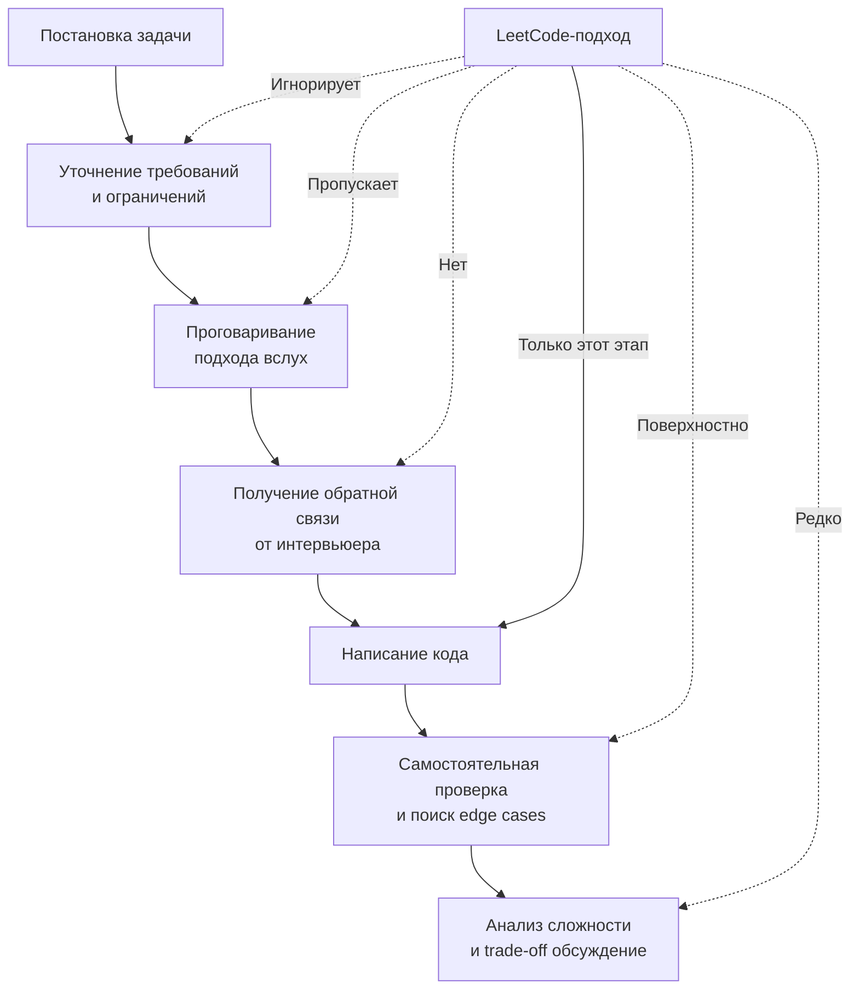

## Почему решение задач не равно успеху на интервью

Парадокс, знакомый многим: вы решили 400 задач на LeetCode, держите в голове реализации кучи, обхода графа и динамического программирования, но на реальном собеседовании получаете отказ после первого же раунда. При этом задачу вы решили — код прошёл тест-кейсы, интервьюер кивал. В чём дело?

Ответ прост и неприятен: **техническое интервью — это не автоматическая проверка кода на платформе**. LeetCode оценивает единственный артефакт — работающий код, укладывающийся в лимиты по времени и памяти. Интервьюер оценивает **вас как будущего коллегу**, и работающий код — лишь один из десятка сигналов.

> [!tip] Собеседование
> На позицию Senior Go Engineer в FAANG-компании типичные ожидания от раунда DSA:
> - Решить две задачи уровня Medium/Hard за 45 минут.
> - Продемонстрировать процесс мышления, а не молча писать.
> - Обосновать выбор структур данных с учётом специфики Go.
> - Написать код, который можно отревьюить, а не просто «работает».
> - Найти и закрыть edge cases без подсказок.
> - Обсудить альтернативные решения и trade-off.

### Что на самом деле оценивают на алгоритмическом интервью



Рассмотрим каждый этап подробнее и поймём, почему автоматизированная платформа не готовит к ним.

#### 1. Уточнение требований: задача ≠ описание задачи

На LeetCode вы получаете готовое описание, ограничения (constraints) и примеры. На собеседовании интервьюер часто **намеренно** даёт размытую формулировку. Он ждёт, что вы начнёте задавать вопросы:

- Входные данные: могут ли быть отрицательные числа? Пустая строка? Nil-указатель на корень дерева?
- Дубликаты: допускаются ли повторяющиеся элементы? Если да, какой порядок важен?
- Ожидаемый результат: что возвращать при отсутствии ответа — `nil`, `-1`, пустой срез?
- Ограничения: размер данных в памяти (влезает ли в RAM?) или потоковая природа (данные не помещаются в память целиком)?
- Многозадачность: функция вызывается конкурентно? (Для Go это критично: если да, нужна потокобезопасность.)

Интервьюер проверяет вашу способность анализировать задачу, а не бросаться писать код. Отсутствие уточняющих вопросов — один из главных сигналов «junior mindset», даже если вы решите задачу.

> [!warning] Ловушка / Gotcha
> Кандидат написал блестящее решение для поиска медианы из потока данных (LeetCode 295), но получил отказ. Почему? Он не спросил, может ли вызываться `AddNum` из нескольких горутин одновременно. В Go это критичное уточнение, потому что стандартный `container/heap` не потокобезопасен. Интервьюер сделал вывод: «Кандидат не думает о конкурентности, не готов к production-коду».

#### 2. Коммуникация: думать вслух, а не молча писать

На платформе вы наедине с редактором. На собеседовании вы обязаны проговаривать свой мыслительный процесс. Это самая сложная часть для интровертов-разработчиков, привыкших думать «в голове».

Что должен слышать интервьюер:

- «Я вижу, что задача сводится к поиску подмассива с условием. Первое, что приходит в голову — брутфорс за O(N²). Но ограничения N ≤ 10⁵, это не пройдёт.»
- «Раз условие монотонно, можно применить скользящее окно. Правый указатель расширяет окно, левый сжимает при нарушении инварианта.»
- «Мне потребуется хеш-карта для O(1) доступа. В Go это `map[byte]int`. Но если ключи — руны, нужно быть аккуратным с юникодом.»

Если вы молчите, интервьюер не знает, зашли ли вы в тупик, обдумываете решение или просто не поняли задачу. Подробнее эта тема раскрыта в статье [[6. Как объяснять решение вслух]], и мы будем возвращаться к ней на протяжении всего раздела.

#### 3. Код: читаемость и идиоматичность имеют значение

На LeetCode никто не будет ревьюить ваш код. Вы можете назвать переменные `i`, `j`, `x`, `tmp`, использовать редкостные трюки и однобуквенные аббревиатуры. Главное — скорость написания.

На собеседовании ваш код будут **читать**. Ожидается, что он будет production-ready в миниатюре:

- **Осмысленные имена:** `left`, `right`, `windowSum`, `charFrequency`, а не `l`, `r`, `s`, `m`.
- **Идиоматичный Go:** `for _, v := range slice` вместо `for i := 0; i < len(slice); i++` там, где индекс не нужен. Использование `if err != nil` с явной обработкой, а не `_`. `defer` для очистки ресурсов.
- **Плоская структура:** избегайте глубокой вложенности if/for. Выносите проверки в ранние `return` (guard clauses).
- **Отсутствие магии:** никаких `unsafe` без явного обоснования. Если используете `unsafe.Pointer` для ускорения конвертации строки в байты, будьте готовы объяснить, почему это безопасно в данном контексте и как работает escape analysis.

Пример: задача «найти все анаграммы в строке» (LeetCode 438). Неидиоматичный код на Go, типичный для «платформенного» решения:

```go
func findAnagrams(s string, p string) []int {
    res := []int{}
    if len(s) < len(p) {
        return res
    }
    m1 := make([]int, 26)
    for i := 0; i < len(p); i++ {
        m1[p[i]-'a']++
    }
    m2 := make([]int, 26)
    for i := 0; i < len(p); i++ {
        m2[s[i]-'a']++
    }
    if eq(m1, m2) {
        res = append(res, 0)
    }
    for i := len(p); i < len(s); i++ {
        m2[s[i]-'a']++
        m2[s[i-len(p)]-'a']--
        if eq(m1, m2) {
            res = append(res, i-len(p)+1)
        }
    }
    return res
}
```

Код работает, но на интервью он вызовет вопросы:

- Зачем слайс `res` инициализирован литералом, а не через `make` с нулевой длиной? (Это допустимо, но `var res []int` или `res := make([]int, 0)` — более идиоматично, сразу показывает намерение.)
- Почему явные циклы с индексами вместо `range`? Логика сдвига окна через `i-len(p)` читается тяжело.
- Магические числа `'a'` и `26` зашиты в нескольких местах. Что, если алфавит расширится?

Идиоматичный вариант для собеседования:

```go
func findAnagrams(s string, p string) []int {
    if len(s) < len(p) {
        return nil
    }

    var (
        target [26]int
        window [26]int
        result []int
    )

    for i := range p {
        target[p[i]-'a']++
        window[s[i]-'a']++
    }

    if window == target {
        result = append(result, 0)
    }

    for i := len(p); i < len(s); i++ {
        window[s[i]-'a']++
        window[s[i-len(p)]-'a']--
        if window == target {
            result = append(result, i-len(p)+1)
        }
    }

    return result
}
```

Здесь использованы:

- Массивы фиксированного размера вместо слайсов — никаких аллокаций в куче, массивы на стеке, сравнение `==` за O(1) по факту (всего 26 элементов).
- Сдвиг окна инкапсулирован в одном месте.
- Имена `target` и `window` говорят сами за себя.

#### 4. Edge cases: ваш код должен работать всегда, а не только на счастливом пути

На LeetCode вы получаете набор тестов. Прошли — зелёная галочка. Не прошли — можете запустить снова, посмотреть failed test case и поправить. На собеседовании второй попытки нет. Вы обязаны сами найти и обработать крайние случаи:

- Пустые входные данные: `""`, `nil`, пустой срез, `0`.
- Отрицательные числа, переполнение (особенно в Go — `int` 64-битный на 64-битных системах, но 32-битный на 32-битных. Уточняйте разрядность!).
- Дубликаты: что, если все элементы одинаковые?
- Рекурсия с глубокой вложенностью: не приведёт ли к переполнению стека горутины? (Лимит стека горутины растёт, но глубокая рекурсия всё равно опасна. Лучше итеративный подход.)
- Unicode: `len(s)` возвращает байты, а `len([]rune(s))` — количество рун. Для строк с не-ASCII символами это критично.

Эта тема настолько важна, что ей посвящена отдельная статья [[19. Edge cases и corner cases]].

#### 5. Анализ сложности и trade-off: выбирайте осознанно

На платформе достаточно помнить, что хеш-карта — O(1) в среднем, а сбалансированное дерево — O(log N). На собеседовании от вас ждут более глубокого понимания:

- **Конкретные цифры:** O(N) — это хорошо, но сколько реально операций на N = 10⁶? Уложимся ли в 1 секунду, если каждая итерация содержит пять обращений в map?
- **Скрытые константы:** `map` в Go — это не простое хеширование. Это структура `hmap` с бакетами, эвакуацией и проверками на коллизии. Каждое обращение — десятки наносекунд, а не единицы. В критичных по производительности участках массив фиксированного размера (`[256]int`) может быть быстрее map в 5–10 раз за счёт отсутствия указателей (pointer chasing) и cache-friendly доступа.
- **Память и GC:** каждый элемент в `map[int]*Node` — это аллокация в куче, нагружающая GC. Плоский слайс `[]Node` лежит непрерывным блоком, дружествен кэш-линиям CPU и не создаёт лишней работы для сборщика.
- **Trade-off:** иногда O(N²) решение с маленькой константой на реальных данных (N ≤ 30) предпочтительнее O(N log N) с большой константой и сложной реализацией. Умение аргументировать такой выбор показывает зрелость.

> [!info] Под капотом
> Когда вы пишете `m := make(map[int]bool)`, компилятор Go выделяет структуру `runtime.hmap` в куче. Поле `B` определяет количество бакетов: `len(buckets) = 2^B`. При заполнении бакетов более чем на 6.5 элементов в среднем происходит эвакуация данных в новые бакеты увеличенного размера. Это дорогая операция, которая может случиться в середине вашего алгоритма. Поэтому для критически важных по времени задач (например, в высокочастотном трейдинге) мы можем предпочесть слайс с бинарным поиском или `open addressing` на массивах, избегая недетерминированных задержек GC и роста map.

#### 6. Обсуждение альтернатив: покажите широту мышления

Хороший тон на Senior-интервью — после написания основного решения сказать: «Мы решили через хеш-карту за O(N) по времени и O(N) по памяти. Если бы память была критична, можно было бы отсортировать слайс за O(N log N) и использовать два указателя, сократив память до O(1).»

Это показывает, что вы не зациклены на единственном решении, а владеете несколькими инструментами и понимаете, когда какой применить. Подробнее — [[4. Как распознавать паттерн в задаче]] и [[3. Паттерны вместо запоминания решений]].

### Вредные привычки, которые формирует LeetCode

Платформа приучает к стратегиям, прямо противоположным успешному прохождению интервью:

1. **Прыгать в код немедленно.** Прочитали условие — и сразу `func solution(...)`. На собеседовании это верный путь к провалу: вы упустите требования, не учтёте edge cases и начнёте переписывать код на середине.
2. **Писать нечитаемый код.** `i`, `j`, `tmp`, `x` — на платформе это допустимо, на собеседовании интервьюер тратит когнитивные ресурсы на расшифровку ваших однобуквенных переменных.
3. **Полагаться на удачу.** «Засабмичу — увижу, какие тесты не прошли». На собеседовании нет кнопки Submit. Вы должны протестировать код мысленно, пройтись по своим примерам и найти ошибки до того, как скажете «Готово».
4. **Игнорирование стандартной библиотеки.** Многие решают задачи на Go, используя структуры данных, написанные с нуля, даже когда стандартная библиотека предоставляет всё необходимое. Например, пишут свою сортировку вместо `sort.Slice`, или связный список заново вместо `container/list` (хотя `container/list` редко применяется в production, но для задач годится). Это показывает незнание экосистемы.
5. **Отсутствие тестирования.** Код без тестов = код с багами. Даже если вы не пишете полноценный тест (хотя в некоторых раундах просят), вы обязаны показать, как бы вы его организовали. Table-driven tests — золотой стандарт Go. Упоминание `go test -race` для детектирования гонок данных на собеседовании будет жирным плюсом.

### Что делать вместо бездумного нарешивания

Перестройте свою подготовку так, чтобы каждый подход к задаче имитировал реальное интервью:

- **Вслух.** Проговаривайте решение, даже когда сидите в одиночестве. Записывайте себя на диктофон — это жестоко, но эффективно.
- **Без IDE.** Используйте простой текстовый редактор или Go Playground без автодополнения. На собеседовании у вас не будет подсказок компилятора.
- **С таймером.** 20–25 минут на Medium, 35–40 на Hard. Учитесь укладываться.
- **С полным циклом:** уточнение требований → подход → код → edge cases → сложность → альтернативы. Даже если задача вам знакома, не пропускайте этапы — формируйте привычку.
- **С код-ревью.** Пересматривайте свой код через день. Вы удивитесь, сколько неидиоматичных моментов найдёте.

> [!info] Механическая симпатия
> На Senior-интервью могут спросить: «Как повлияет на производительность замена `[][]int` на `[]int` с индексной арифметикой в задаче на матрицы?»
> Ответ должен затрагивать: cache lines (L1/L2/L3 на CPU), аллокации в куче (срез заголовков `[]int` — это копия структуры `SliceHeader` на стеке, а нижележащий массив — в куче), дружественность к prefetcher-у процессора. Плоский массив обеспечивает sequential memory access, что на порядки быстрее случайного доступа через двойную косвенность. Этот уровень понимания описан в разделе [[01. Архитектура компьютера]].

### Итог

Решение задач на LeetCode — необходимый, но недостаточный компонент подготовки. Платформа тренирует мышечную память алгоритмов, но не учит коммуникации, анализу требований, защите решения и написанию идиоматичного кода. Именно эти навыки определяют, получаете ли вы оффер.

В следующей статье мы рассмотрим фундаментальную альтернативу зубрёжке — систему алгоритмических паттернов, которая позволяет решать незнакомые задачи, опираясь на каркас знакомых подходов. [[3. Паттерны вместо запоминания решений]]