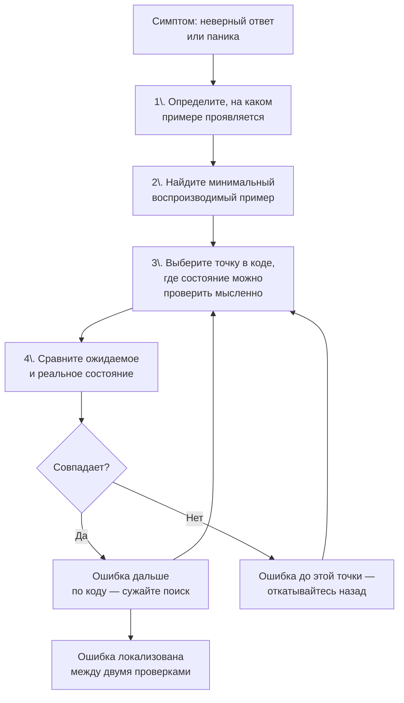

## Debugging алгоритмов

Вы написали код. Он компилируется. Вы прошли ручную трассировку на одном-двух примерах — ответы совпадают. Но где-то глубоко внутри, в извилинах циклов и рекурсий, затаилась ошибка, которая проявится только на специфическом edge case или при N = 10⁵. На собеседовании нет кнопки «Submit», нет консоли с `fmt.Println`, нет времени на запуск бенчмарков. Ваш главный отладчик — **собственное мышление**.

Умение отлаживать алгоритмы в уме, без IDE и логов, — это навык, который отличает Senior-инженера от человека, способного лишь воспроизводить заученный код. В этой статье мы разберём системный подход к debugging'у на собеседовании: как локализовать баг по симптомам, как использовать инварианты для сужения поиска, какие Go-специфичные ловушки чаще всего маскируются под «алгоритмическую ошибку», и как демонстрировать процесс отладки интервьюеру так, чтобы это шло в плюс.

### Ментальная модель отладки: бинарный поиск по коду

Когда вы подозреваете ошибку, не пытайтесь перечитывать весь код «в надежде увидеть». Это неэффективно. Вместо этого примените **метод бинарного поиска**: разделите выполнение на этапы и проверьте, на каком этапе состояние программы расходится с ожидаемым.



На собеседовании это выглядит как размышление вслух: «Давайте возьмём пример, на котором ответ неверный. После первой итерации цикла я ожидаю, что `left=1`, `sum=5`. Мысленно подставляю: действительно, `left=1`, `sum=5` — ок. После второй итерации `left` должен стать 2, но у меня он остаётся 1 — значит, ошибка в условии сдвига левого указателя.»

### Шаг 1: Найдите минимальный воспроизводимый пример

Получив неверный ответ на большом входе, немедленно упростите его до минимального примера, на котором ошибка сохраняется. Это главный навык debugging'а.

**Правила минимизации:**
- Убирайте элементы с конца, пока ошибка не исчезнет. Верните последний убранный — он был важен.
- Убирайте дубликаты, упрощайте числа (делайте их 1, 2, 3).
- Если задача про строки, пробуйте строки из 2–3 символов.

**Пример:** Задача «найти минимальную подстроку, содержащую все символы `t`». Код падает с паникой на большом тесте. После минимизации выясняется: `s = "a"`, `t = "aa"`. На таком примере легко увидеть, что счётчик `matched` никогда не достигает `needCount`, окно не становится валидным, и код возвращает пустую строку без паники — паника была в другом месте. Продолжаем поиск.

### Шаг 2: Используйте инварианты как «точки останова»

Инвариант — это утверждение о состоянии программы, которое истинно до и после каждой итерации. В момент отладки вы мысленно проверяете инвариант в конкретной точке. Если инвариант нарушен — ошибка рядом.

**Как сформулировать инвариант для отладки:**
- Для скользящего окна: «Окно `[left, right)` всегда содержит элементы, удовлетворяющие условию X, и `left <= right`.»
- Для двух указателей: «Элементы левее `left` уже обработаны и не могут быть частью ответа; элементы правее `right` тоже.»
- Для DFS/BFS: «Все вершины в множестве `visited` действительно посещены, и ни одна не посещена дважды.»
- Для DP: «`dp[i]` содержит правильное значение для всех индексов ≤ i.»

Вставляйте в код мысленные `assert` и проверяйте их на мини-примере:

```go
for right < len(s) {
    // assert: left <= right
    // assert: window содержит символы s[left:right]
    ...
}
```

На собеседовании произнесите: «Я проверю инвариант: на этом шаге окно должно быть `[0,2)`, символы 'A','D' — верно, `matched=1` — верно. Инвариант выполняется, идём дальше.»

### Шаг 3: Техника «отслеживания переменной» (Variable Tracing)

Для маленького примера выпишите (мысленно или шёпотом) строки таблицы значений ключевых переменных на каждой итерации. Это самый надёжный способ найти ошибку в логике цикла.

**Пример для скользящего окна:**

| Итерация | right | left | windowSum | maxLen |
|---|---|---|---|---|
| init | 0 | 0 | 0 | 0 |
| 1 | 1 | 0 | 2 | 1 |
| 2 | 2 | 0 | 5 | 2 |
| 3 (sum>target) | 2 | 1 | 3 | 2 |
| ... | ... | ... | ... | ... |

Заполняя таблицу, вы часто видите: «Стоп, на итерации 3 я ожидал `left=1` и `sum=3`, а в коде `left` не инкрементируется — нашёл баг.»

### Типовые классы ошибок и их симптомы

Зная «фоторобот» распространённых багов, вы быстрее сужаете круг подозреваемых.

#### 1. Off-by-one (ошибка на единицу)

Самый частый баг. Симптомы: ответ отличается от правильного на 1, либо выход за границы слайса (`index out of range`).

**Где искать:**
- Условия циклов: `for i < n` vs `for i <= n`.
- Возврат длины/индекса: `return right - left` vs `return right - left + 1`.
- Срезы: `s[start:end]` — правая граница исключительная.
- В бинарном поиске: `mid := left + (right-left)/2` и условия `left = mid` или `left = mid+1`.

**Способ проверки:** подставьте минимальный вход (длину 0, 1, 2) и посмотрите, сколько раз выполняется тело цикла.

#### 2. Нарушение инварианта

Симптом: код работает на одних примерах, но даёт неверный ответ на других, особенно с дубликатами или крайними значениями.

**Где искать:** операции, которые изменяют состояние (сдвиг указателя, изменение суммы, добавление в map), но не обновляют связанные переменные. Классика: сдвинули `left`, но забыли вычесть `nums[left]` из `windowSum`.

#### 3. Ошибка в логике обновления ответа

Симптом: ответ правильный по длине/сумме, но неверный по содержанию (например, подстрока не та).

**Где искать:** условие, при котором обновляется `result`. Часто обновление ответа ставят до завершения внутреннего цикла, или наоборот — после, когда окно уже испорчено.

#### 4. Неверная обработка дубликатов

Симптом: ответ содержит лишние элементы или не содержит нужных.

**Где искать:** отсутствие пропуска одинаковых значений при сдвиге указателей (особенно в 3Sum, 4Sum), неправильное сравнение (`==` вместо `>=` или наоборот).

#### 5. Выход за границы (panic: index out of range)

**Где искать:** операции среза, доступ по индексу без проверки длины, обращение к `deque[0]` при пустом слайсе, `str[i]` для пустой строки.

**Go-совет:** всегда добавляйте guard clause в начале функции: `if len(arr) == 0 { return ... }`. Это предотвращает 90% паник.

#### 6. Бесконечный цикл

Симптом: «зависание» (мысленное) — указатели не сходятся, цикл не завершается.

**Где искать:** условие сдвига указателя не изменяет его (например, `left++` отсутствует), или условие `left < right` всегда истинно.

### Go-специфичные «маски»: когда баг не в алгоритме, а в языке

Иногда код алгоритмически верен, но поведение Go создаёт иллюзию ошибки.

#### 1. nil-map паника

```go
var m map[int]int
m[0]++ // panic
```
Симптом: внезапная паника на тесте, где map используется без инициализации. Всегда `make(map[...])`.

#### 2. Переиспользование слайса и неожиданные изменения

```go
a := []int{1,2,3}
b := a[:2]
b = append(b, 4)
// a теперь [1,2,4]
```
Симптом: исходный слайс «портится». Решение: явное копирование, если нужна независимость.

#### 3. Строки и байты

Обращение `s[i]` к строке с мультибайтовым символом даёт байт, не руну. Симптом: странное поведение на не-ASCII символах.

#### 4. `range` и копирование

`for _, node := range nodes` создаёт копию. Если вы изменяете `node.Value`, это не влияет на слайс. Нужно `for i := range nodes` и `nodes[i].Value = ...`.

#### 5. `append` и ёмкость

Если не предвыделить capacity, `append` создаёт новый массив, и указатели на старые элементы становятся невалидными. Симптом: «пропадают» элементы из map после `append`.

### Как демонстрировать отладку на собеседовании

Обнаружив ошибку, не молчите и не стирайте код в панике. Превратите отладку в шоу:

1. **Объявите, что нашли проблему.** «Так, на этом примере ответ не сходится. Давайте я отлажу».
2. **Локализуйте симптом.** «Ожидал 5, получил 4. Похоже на off-by-one в возвращаемом значении».
3. **Пройдите по коду с мини-примером.** «Возьму массив из двух элементов. Правая граница... ок, левая... ок. А, вот здесь я возвращаю `right-left`, а должен `right-left+1`, потому что `right` указывает на следующий за окном элемент».
4. **Исправьте и перезапустите мысленный тест.** «Теперь ответ 5, корректно».
5. **Сделайте вывод.** «Хорошо, что проверили — это классический off-by-one для скользящего окна».

> [!tip] Собеседование
> Если вы не можете найти ошибку за 2–3 минуты, скажите: «Я подозреваю, что проблема в логике обновления состояния при сдвиге левого указателя. Давайте я заново проговорю инвариант этого цикла». Это показывает, что вы не топчетесь на месте, а применяете методику. Интервьюер может дать подсказку, и это не будет минусом.

### Профилактика: как писать код, который легче отлаживать

1. **Комментируйте инварианты прямо в коде (или мысленно).** Одна строка `// окно [left, right) содержит ...` сэкономит 10 минут отладки.
2. **Используйте guard clauses.** Проверка на пустой вход в начале функции изолирует пустой случай от основной логики.
3. **Пишите маленькие вспомогательные функции.** `isValid(window map[byte]int, need map[byte]int) bool` легче проверить в уме, чем сложное условие внутри цикла.
4. **Предпочитайте иммутабельность там, где это не вредит производительности.** Возврат нового слайса вместо модификации «in-place» уменьшает сайд-эффекты. Но в Go старайтесь избегать лишних аллокаций, указывая capacity.
5. **Держите под рукой мысленный чек-лист Go-ловушек:** nil-map, range-копии, срезы с общей памятью, конвертация строк.

### Что делать, если ошибка не находится

На собеседовании время ограничено. Если вы застряли:

1. **Перечитайте условие задачи.** Может, вы неверно поняли, что требуется (например, индексы 0-базированные или 1-базированные).
2. **Проверьте, что функция действительно возвращает то, что вы думаете.** Может, вы забыли `return` и возвращается zero-value.
3. **Попробуйте другой алгоритм.** Скажите интервьюеру: «Я вижу, что текущий подход упирается в крайний случай, который я пока не могу обойти. Возможно, здесь надёжнее применить другой паттерн — например, вместо скользящего окна использовать префиксные суммы с map.» Это демонстрирует гибкость.
4. **Попросите минуту подумать молча.** Лучше взять паузу, чем паниковать вслух.

### Заключение

Отладка без инструментов — это дисциплина мышления: бинарный поиск по коду, проверка инвариантов, трассировка на минимальном примере. В Go к этому добавляется слой знания внутреннего устройства языка, который превращает загадочные паники и неверные ответы в понятные симптомы. Освоив этот подход, вы перестанете бояться ошибок на собеседовании и начнёте воспринимать их как возможность показать инженерную зрелость.

В следующей статье мы перейдём к не менее критичному аспекту — управлению временем на интервью: как уложиться в отведённые минуты, не жертвуя качеством кода и обсуждением. [[21. Тайминг решения задач]]