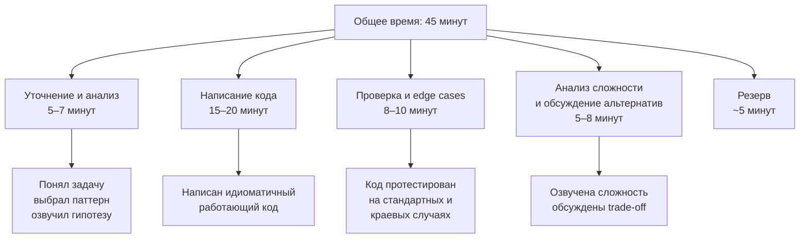

## Тайминг решения задач

Вы отлично знаете паттерны, умеете распознавать их в условии ([[4. Как распознавать паттерн в задаче]]), писать идиоматичный код ([[5. Алгоритм решения задачи на интервью]]) и даже отлаживать его в уме ([[20. Debugging алгоритмов]]). Но всё это может пойти прахом, если вы не уложитесь в отведённые 45 минут. Тайминг на алгоритмическом собеседовании — это невидимый интервьюер, который жёстче любого live-кодера. Вы можете решить задачу идеально, но если вы потратили 40 минут на первую и оставили 5 на вторую — отказ почти гарантирован.

Управление временем — это не просто «думай быстрее». Это стратегический навык: когда углубляться в анализ, а когда форсировать переход к коду; когда признать, что текущий подход не работает, и сменить его; как использовать время интервьюера и как сигнализировать о своих намерениях. В этой статье мы разберём тайминг как инженерную дисциплину, адаптированную под реалии Go-собеседований.

### Почему тайминг критичен именно для Senior-кандидата

Junior может позволить себе застрять и получить подсказку — от него не ждут полной самостоятельности. От Senior ждут умения автономно довести задачу до конца, продемонстрировав и анализ, и код, и проверку, и обсуждение альтернатив — и всё это в чётко ограниченное время. Срыв тайминга интерпретируется не как «не успел», а как «не умеет планировать» или «не владеет предметом настолько, чтобы делать это быстро».

Кроме того, Senior-разработчик, который не умеет оценивать трудозатраты, опасен в production: он будет обещать фичу за спринт, а делать её два месяца. Алгоритмическое интервью — идеальная миниатюра этой проблемы.

### Стандартный тайминг раунда и его вариации

Типовой алгоритмический раунд длится **45 минут** (иногда 60). Обычно он включает одну-две задачи:

- **Одна задача Medium/Hard:** самый частый формат для Senior. 45 минут достаточно для полного цикла: уточнение, анализ, код, проверка, обсуждение.
- **Две задачи, Easy + Medium:** интервьюер хочет увидеть скорость на простом и глубину на среднем. Тут тайминг критичен: на Easy — не более 10–12 минут, чтобы оставить 30+ минут на Medium.
- **Одна задача с усложнением:** вам дают базовую версию, после решения её усложняют (follow-up). Фактически это полторы задачи.

Эти цифры — ориентир, а не жёсткая догма. Если задача оказалась проще, фазы сжимаются, оставляя больше времени на обсуждение. Если сложнее — можно чуть сместить баланс, но никогда не отказывайтесь от фазы проверки и анализа сложности. Пропуск этих этапов — верный способ провалить интервью, даже если код написан.

### Детальный разбор каждой фазы и тайминг-тактики

#### Фаза 1: Уточнение и анализ (5–7 минут)

**Цель:** понять задачу, выявить ограничения, выбрать алгоритмический паттерн и структуры данных, озвучить гипотезу интервьюеру.

**Что делать:**
- Задайте минимум 3–4 уточняющих вопроса (пустой ввод, отрицательные числа, дубликаты, Unicode, nil).
- Оцените N и определите допустимую сложность (таблица из [[18. Время и память на практике]]).
- Сформулируйте 1–2 гипотезы о паттернах, выберите одну и озвучьте интервьюеру.

**Тайминг-маркер:** если через 7 минут вы всё ещё не понимаете, какой паттерн применить, — **форсируйте переход к брутфорсу**. Скажите: «Я напишу наивное решение за O(N²), а затем оптимизирую его». Это лучше, чем молча висеть.

**Go-специфика:** уже на этом этапе думайте, какие структуры данных возьмёте. «Для частотного анализа я выберу `[26]int`, потому что алфавит — английские буквы. Это избежит pointer chasing map'а». Такие замечания экономят время на фазе кодирования, потому что вы уже знаете, что писать.

> [!warning] Ловушка / Gotcha
> Не пытайтесь на этом этапе продумать весь код до мелочей. Это «аналитический паралич». Как только инвариант понят, а паттерн одобрен интервьюером — переходите к коду. Детали прояснятся в процессе.

#### Фаза 2: Написание кода (15–20 минут)

**Цель:** написать компилируемый, идиоматичный Go-код, следуя озвученному подходу.

**Тактика для ускорения:**
- Начните с сигнатуры функции и ранних проверок. Это занимает 30 секунд и даёт ощущение прогресса.
- Пишите основной цикл, проговаривая блоки (не строки). «Теперь инициализирую два указателя... прохожу правым... обновляю ответ».
- Не отвлекайтесь на микрооптимизации (предвыделение capacity, замена map на массив) на первом проходе. Сначала — корректность. Оптимизацию можно добавить на втором проходе, если время останется, или упомянуть устно.
- Если вам нужна куча (`container/heap`), напишите минимальную реализацию интерфейса. Не пытайтесь сделать её идеальной — 15 строк хватит.

**Тайминг-маркер:** если через 10 минут кодирования вы написали меньше половины основной логики, возможно, выбранный подход слишком сложен. Спросите себя: «Нет ли более простого решения?» Может, вы пытаетесь реализовать сложную структуру, когда задача решается простым обходом.

**Go-специфика:**
- Не пишите дженерики без необходимости. Слайсы, map'ы и функции от конкретных типов работают быстро и понятно.
- Используйте `make` с capacity, если размер известен. Это одна строка и предотвращает скрытые аллокации.
- Для стеков/очередей — слайсы. Не используйте `container/list` (медленно, `interface{}`).
- Избегайте рекурсии с неизвестной глубиной. Итеративное решение на слайсах часто пишется так же быстро и безопаснее.

#### Фаза 3: Проверка и edge cases (8–10 минут)

**Цель:** убедиться, что код корректен, пройти стандартные и краевые случаи, исправить найденные ошибки.

**Тактика:**
- Возьмите пример из условия и пройдите по коду, записывая значения переменных.
- Возьмите один-два своих примера (пустой ввод, один элемент, дубликаты).
- Если нашли баг — исправьте. Если бага нет — отлично.

**Не задерживайтесь:** если код работает на примерах, переходите к анализу сложности. Глубокая проверка всех мыслимых edge cases — задача для тестового раунда, а не для алгоритмического.

> [!tip] Собеседование
> Упомяните: «В реальном проекте я бы написал table-driven тест, покрывающий 10–15 случаев, но здесь ограничусь ручной проверкой ключевых». Это демонстрирует ваше знание Go-культуры тестирования ([[15. Тестирование в Go (QA & Testing)]]) и объясняет, почему вы не пишете тесты прямо сейчас.

#### Фаза 4: Анализ сложности и обсуждение альтернатив (5–8 минут)

**Цель:** озвучить временну́ю и пространственную сложность, предложить альтернативное решение и обсудить trade-off.

**Обязательно скажите:**
- Время: O(N), потому что каждый элемент обрабатывается константное число раз.
- Память: O(N) из-за хранения map, O(1) если используется массив.
- Константы: упомяните, если они критичны (например, «хотя оба решения O(N), массив даст выигрыш в 5–10 раз из-за cache locality»).

**Альтернативы:** «Мы решили через хеш-карту за O(N). Если бы память была критична, можно было бы отсортировать за O(N log N) и пройтись двумя указателями, сократив память до O(1).» Это занимает минуту, но даёт огромный плюс к оценке.

#### Резерв (5 минут)

Резервное время — ваш страховой полис. Если вы чуть задержались на кодировании, резерв компенсирует. Если вы идёте по плану, используйте резерв для более детального обсуждения альтернатив, Go-специфики, или просто ответьте на дополнительные вопросы интервьюера.

### Как понять, что вы застряли, и что делать

**Симптомы застревания:**
- Вы смотрите на код и не знаете, что писать дальше.
- Вы переписываете один и тот же блок третий раз.
- Прошло 10 минут кодирования, а прогресса нет.

**Стратегия выхода:**

1. **Озвучьте проблему.** «Я застрял на логике обновления ответа при сдвиге левого указателя. Давайте я ещё раз проговорю инвариант».
2. **Вернитесь к брутфорсу.** «Я временно упрощу логику, написав линейный поиск внутри окна, и покажу общую структуру. Затем оптимизирую». Это спасёт вас от тишины и покажет, что вы владеете итеративным подходом.
3. **Спросите интервьюера.** «Как вы считаете, я в правильном направлении? Или стоит рассмотреть другой подход?» Это не слабость, а умение использовать ресурсы команды.
4. **Смените подход.** Если скользящее окно не идёт, предложите префиксные суммы. Главное — не молчите.

### Стратегия для двух задач за раунд

Если интервьюер говорит: «У нас сегодня две задачи», — сразу включайте режим жёсткого тайминга.

- **Задача 1 (Easy):** 10 минут. Уточнение — 1 минута, код — 6 минут, проверка — 2 минуты, сложность — 1 минута. Не задерживайтесь на обсуждении альтернатив для Easy, это не нужно.
- **Задача 2 (Medium):** используйте оставшиеся 30–35 минут по полному циклу.

**Сигнал интервьюеру:** после завершения первой задачи скажите: «Готово. Если это решение устраивает, я готов перейти ко второй задаче». Это покажет, что вы управляете временем.

> [!warning] Ловушка / Gotcha
> Если на первой задаче вы потратили 20 минут, не пытайтесь «наверстать» ускорением. Спокойно переходите ко второй, но будьте готовы, что интервьюер может сократить её или попросить решить упрощённую версию. Лучше качественно решить одну задачу, чем скомкать две.

### Go-специфика: как язык помогает и мешает таймингу

**Преимущества Go, ускоряющие написание кода:**
- Минималистичный синтаксис: нет классов, иерархий, исключений. Код плоский и линейный.
- Встроенные слайсы и map'ы покрывают 90% потребностей в структурах данных.
- Быстрая компиляция в голове: Go-код легко ментально «выполнять», проверяя корректность.
- Стандартная библиотека: `sort`, `strings`, `container/heap` — всё под рукой, не нужно импортировать фреймворки.

**Подводные камни Go, которые съедают время:**
- Отсутствие встроенной Priority Queue/Deque. Реализация `heap.Interface` для `container/heap` занимает 10–15 строк. Заранее выучите шаблон, чтобы писать его на автомате.
- Обработка ошибок: в DSA редко используется, но если вы вызываете `strconv.Atoi`, не игнорируйте ошибку — это займёт время.
- Строки: необходимость помнить о разнице `len(s)` (байты) и `[]rune(s)`. Если задача гарантирует ASCII, явно скажите об этом и работайте с байтами — это сэкономит время.
- Дженерики: используйте только если это реально упрощает код и вы уверены. В большинстве DSA-задач они не нужны.

### Как общаться с интервьюером о времени

Проактивная коммуникация о тайминге — маркер Senior-кандидата. Фразы, которые стоит использовать:

- «Я потрачу ещё минуту на обдумывание структуры данных, затем начну писать код.» — вы держите интервьюера в курсе и устанавливаете ожидания.
- «Я написал наивное решение, но оно O(N²). При N=10⁵ не пройдёт. Давайте я оптимизирую его до O(N), это займёт около 10 минут.» — вы показываете, что осознаёте ограничения и планируете время.
- «У меня осталось около 10 минут. Я бы хотел проверить edge cases и обсудить сложность. Успеваю.» — вы показываете контроль над ситуацией.

Не говорите: «Я не успеваю», «Времени мало», «Давайте быстрее». Это создаёт нервозность. Вместо этого спокойно констатируйте: «Осталось 10 минут, я перехожу к анализу сложности».

### Типичные ошибки тайм-менеджмента

1. **Старт без уточнений.** Кандидат бросается писать код через 30 секунд, тратит 20 минут, затем выясняется, что он не учёл дубликаты или отрицательные числа. Переписывание съедает всё время.
2. **Зацикливание на одной задаче.** 40 минут на Medium, 5 минут на вторую. Лучше оставить 30 на вторую и качественно её начать, чем выжать первую до капли и провалить вторую.
3. **Пропуск проверки.** Кандидат пишет код и говорит «Готово». Интервьюер находит баг за 10 секунд. Минус к надёжности.
4. **Попытка написать сразу оптимальное решение.** Если оно не выходит, время уходит впустую. Начните с простого — оптимизируйте итеративно.
5. **Молчание при застревании.** Тишина съедает минуты без прогресса. Всегда озвучивайте, где вы и что планируете делать.

### Заключение

Тайминг на собеседовании — это такой же навык, как решение задач. Он тренируется: берите таймер, решайте задачи с ограничением по времени, привыкайте к ритму «5 минут анализ — 15 минут код — 10 минут проверка». В Go этот ритм особенно важен, потому что язык вознаграждает за прямой и простой код, но наказывает за попытки переусложнить. Управляя временем, вы показываете не просто знание алгоритмов, а зрелость инженера, который способен довести задачу до результата в условиях реальных ограничений.

В следующей статье мы перейдём от теории и одиночной подготовки к практике, максимально приближенной к реальному интервью: как проводить mock-интервью, какие ошибки чаще всего вскрываются на пробных собеседованиях и как их исправить до настоящего раунда. [[22. Mock интервью]]