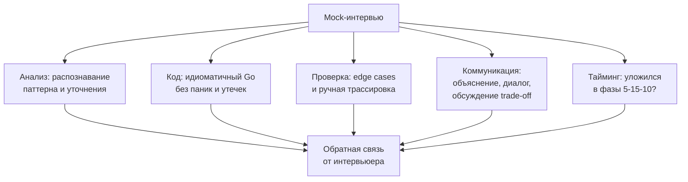

# Mock интервью

Вы освоили теорию паттернов, научились распознавать их в условии ([[4. Как распознавать паттерн в задаче]]), управлять временем ([[21. Тайминг решения задач]]) и даже отлаживать код в уме ([[20. Debugging алгоритмов]]). Но между «я знаю, как решать задачи» и «я получаю оффер» лежит пропасть, имя которой — **стресс реального собеседования**. Единственный надёжный мост через эту пропасть — mock-интервью.

В этой статье мы разберём, как правильно организовать и провести пробное собеседование, чтобы оно не стало пустой тратой времени, а принесло максимальную пользу. Вы узнаете, как воссоздать давление реального раунда, какие критерии оценки важны, как анализировать результаты и почему без этого этапа даже 500 решённых задач LeetCode не гарантируют оффер позиции Senior Go-разработчика.

### Почему mock-интервью — не опция, а обязательная часть подготовки

Разница между решением задач на платформе и живым собеседованием колоссальна. На LeetCode вы одни, никто не смотрит на ваш код, не задаёт вопросы, не ждёт объяснений. Вы можете засабмитить десять неверных решений, прочитать разбор и выдать Accepted — и ваш профиль засчитает это как успех. Но интервьюер видит и судит не только конечный код, а весь процесс: как вы думаете, как реагируете на затруднения, как пишете, как проверяете, как общаетесь.

Mock-интервью — это единственный способ получить **внешнюю обратную связь** по этим аспектам. Вы не услышите от LeetCode: «Ты отлично выбрал паттерн, но твой код был неидиоматичен, а инвариант ты не проверил на дубликатах». А от напарника по mock-интервью — услышите.

Кроме того, mock-интервью тренирует стрессоустойчивость. Когда на вас смотрят, а таймер тикает, мозг работает иначе. Без привычки к этому давлению вы будете забывать даже простые вещи. После 5–10 mock-сессий стресс перестаёт быть парализующим и становится просто фоном.

### Цели mock-интервью: что мы проверяем

Mock-интервью — это не «ещё одно решение задачи». Это диагностика ваших навыков по пяти измерениям:

1. **Аналитическое мышление:** способность услышать размытое условие, задать правильные уточняющие вопросы, выбрать и обосновать подход.
2. **Кодирование:** скорость и качество написания идиоматичного Go-кода. Отсутствие паник, правильная работа со слайсами и map'ами, обработка ошибок, читаемые имена.
3. **Проверка и edge cases:** умение протестировать свой код на стандартных, краевых и угловых случаях без запуска компилятора.
4. **Коммуникация:** способность объяснять решение вслух, поддерживать диалог, реагировать на подсказки, обсуждать trade-off.
5. **Управление временем:** укладываетесь ли вы в 45-минутный цикл, не застреваете ли на фазе анализа или кодирования.

### Как организовать mock-интервью: форматы и роли

Лучший вариант — **парное mock-интервью** с коллегой или знакомым Go-разработчиком, который сам прошёл через собеседования. Если такого нет — подойдёт любой сильный бэкенд-разработчик (Python/Java/C++), способный понять алгоритмическую часть, но он может пропустить Go-специфичные ошибки.

**Роли:**
- **Кандидат:** решает задачу, пишет код, объясняет.
- **Интервьюер:** предварительно выбирает задачу (желательно уровня Medium/Hard, которую он сам знает хорошо), оглашает условие, отвечает на уточнения, следит за временем и поведением, фиксирует наблюдения. После завершения даёт развёрнутую обратную связь.

**Альтернативные форматы:**
- **Сольный mock с записью:** вы садитесь перед камерой или диктофоном, ставите таймер и решаете задачу, объясняя всё вслух. Затем пересматриваете запись и оцениваете себя по чек-листу (см. ниже). Это хуже, чем парное, потому что нет второго взгляда, но отлично тренирует коммуникацию.
- **Платформы для mock-интервью:** Pramp, interviewing.io (бесплатные пиры), formation (платные). Там Go встречается реже, но для тренировки общего процесса полезно.

**Инструментарий:**
- Обязательно используйте тот же инструмент, что и на реальном собеседовании: Google Docs, CodePen, простой текстовый редактор без автодополнения, или онлайн-песочницу Go без подсветки ошибок.
- Включите таймер. Можно использовать отдельный смартфон или вкладку браузера, чтобы кандидат не отвлекался на часы.

### Структура mock-сессии: до, во время, после

**До собеседования (5 минут):**
- Интервьюер выбирает задачу (можно из нашего списка в разделе [[02. Задачи]]), готовит её сам — знает оптимальное решение и альтернативы.
- Договариваются о сигналах: «Я даю подсказку, если ты застрял на 3 минуты», «Я могу попросить объяснить инвариант».

**Во время (45 минут):**
Фазы те же, что и в реальном интервью ([[5. Алгоритм решения задачи на интервью]]):
1. Кандидат уточняет условия (3–5 минут).
2. Кандидат озвучивает подход (2–3 минуты).
3. Кандидат пишет код (15–20 минут).
4. Кандидат проверяет edge cases и обсуждает сложность (10–15 минут).

Интервьюер молча наблюдает, записывает заметки, вмешивается только для подсказок (если критично) или для follow-up вопросов после завершения.

**После (15–20 минут):**
Самая важная часть. Интервьюер даёт структурированную обратную связь:
- Что получилось хорошо (укрепляет уверенность).
- Что нужно улучшить (конкретно, с примерами из кода или диалога).
- Какие были альтернативные решения (расширяет кругозор кандидата).
- Оценка по чек-листу.

### Чек-лист для интервьюера: на что смотреть

Интервьюер должен оценивать не только «решена ли задача», но и качество процесса. Вот чек-лист, который можно использовать:

**Анализ и подход:**
- [ ] Задал ли кандидат уточняющие вопросы? (пустой ввод, отрицательные, дубликаты, Unicode)
- [ ] Чётко ли озвучил выбранный паттерн?
- [ ] Обосновал ли выбор структур данных?
- [ ] Оценил ли допустимую сложность до написания кода?

**Код (Go-специфика):**
- [ ] Имена переменных осмысленные? (`left`, `right`, `windowSum`, а не `i`, `j`, `x`)
- [ ] Использует `range` там, где это уместно?
- [ ] Корректно обрабатывает `nil` и пустые слайсы?
- [ ] Предвыделяет capacity (`make([]int, 0, n)`)?
- [ ] Избегает `container/list` в пользу слайсов?
- [ ] Не использует map без необходимости (когда алфавит мал)?
- [ ] Не делает лишних аллокаций (конвертация `string` ↔ `[]byte` в цикле)?
- [ ] Обрабатывает ошибки (если есть `strconv`, `os`)?
- [ ] Проверяет границы слайсов (нет `index out of range`)?

**Проверка и edge cases:**
- [ ] Прошёл по коду на примере из условия?
- [ ] Проверил пустой ввод, один элемент, дубликаты, отрицательные?
- [ ] Нашёл ли ошибку сам, если она была?
- [ ] Обсудил ли, как бы написал тесты (table-driven)?

**Коммуникация:**
- [ ] Говорил ли достаточно громко и чётко?
- [ ] Комментировал ли ключевые блоки кода, а не каждую строку?
- [ ] Реагировал ли на подсказки (если были)?
- [ ] Обсудил ли trade-off и альтернативы после кода?

**Тайминг:**
- [ ] Уложился в фазы (анализ 7 мин, код 20 мин, проверка 10 мин)?
- [ ] Если застрял, как действовал? (сказал вслух, предложил брутфорс, сменил подход)

После каждого пункта интервьюер может дать короткий комментарий: «отлично», «нужно улучшить», «не проявилось». Обязательно отметьте сильные стороны — это мотивирует и показывает, что кандидат на правильном пути.

### Типичные проблемы, вскрываемые на mock-интервью, и как их исправлять

За годы тренировок я вижу одни и те же повторяющиеся уязвимости. Вот они и рецепты лечения.

**1. «Молчаливый кодер».** Кандидат пишет код, не произнося ни слова. Лечение: принудительно комментировать каждый логический блок, записывать себя на диктофон, тренироваться с другом, который задаёт вопрос «О чём ты сейчас думаешь?» каждые 30 секунд молчания.

**2. Паника при ошибке.** Кандидат находит баг в своём коде, начинает нервно стирать, извиняться. Лечение: отрабатывать фразу «Так, я вижу ошибку, давайте исправлю. Проблема в off-by-one, потому что...». Ошибка, найденная и спокойно исправленная, — плюс, а не минус.

**3. Go-неидиоматичность.** Использование `for i := 0; i < len(arr); i++` вместо `range`, игнорирование `make` с capacity, `panic` для потока управления. Лечение: перечитывать [[5. Учебник по Go (Основы и синтаксис)]] и сознательно практиковать идиомы на задачах LeetCode, даже если это Medium, а не Easy.

**4. Выбор неоптимальной структуры данных.** Использование map там, где достаточно массива `[26]int` или `[128]int`. Или реализация кучи «на коленке» через сортировку, когда нужен `container/heap`. Лечение: после каждого решения задавать себе вопрос «Можно ли заменить map на массив? Изменится ли сложность?». Читать [[07. Глубокий Go (Внутреннее устройство)]].

**5. Пропуск edge cases.** Кандидат тестирует на одном примере и говорит «Готово». Лечение: встроить в процесс обязательный ритуал — после написания кода взять 30-секундную паузу и проговорить минимум 4 edge cases (пусто, один элемент, дубликаты, отрицательные/максимальные значения).

**6. Застревание без объявления.** Кандидат молча смотрит в код 5 минут. Интервьюер не знает: он думает или завис. Лечение: научиться озвучивать «Я думаю, как оптимизировать этот цикл. Пока вижу два варианта: префиксные суммы или скользящее окно. Оцениваю, какой подойдёт». И если через 2 минуты нет прогресса — сказать «Я перехожу к брутфорсу, а потом оптимизирую».

### Go-специфичные моменты, которые mock-интервью выявляет лучше всего

Партнёр по mock-интервью, знакомый с Go, заметит то, что вы сами никогда не увидите.

- **Работа со срезами:** делает ли кандидат `copy` вместо ручного копирования? Помнит ли, что срез от большого массива удерживает весь массив? Знает ли про `append` и разделение памяти?
- **Конкурентность в DSA:** не пытается ли кандидат вставить горутины и каналы туда, где они не нужны (BFS, DFS)? Умеет ли объяснить, почему? Senior-уровень предполагает умение сказать «здесь конкурентность не нужна, потому что алгоритм строго последовательный».
- **Интерфейсы и дженерики:** использует ли их разумно? Или пытается написать дженерик-сортировку для задачи, где проще `sort.Slice`?
- **Комментарии о GC и памяти:** упоминает ли, что массив на стеке не давит на GC? Что `make` с capacity уменьшает аллокации? Это маркеры Senior.

> [!tip] Собеседование
> Если ваш партнёр по mock не знает Go, попросите его обращать внимание на «странные конструкции» и задавать вопросы: «Почему ты использовал `map[byte]int`, а не что-то другое?». Это заставит вас вербализовать знание, что полезно.

### Самостоятельный mock: методика «Запись и ревью»

Если партнёра нет, делайте так:

1. Выберите задачу, которую вы **не решали** (это важно).
2. Включите запись экрана + голоса.
3. Поставьте таймер на 45 минут.
4. Решайте, проговаривая всё вслух, как на реальном интервью.
5. Когда время выйдет, остановитесь (даже если не закончили).
6. Отдохните 30 минут, затем просмотрите запись.
7. Оцените себя по чек-листу выше. Выпишите минимум 3 конкретных пункта на улучшение.
8. Повторите задачу, исправляя эти пункты.

Это жёсткий, но невероятно эффективный метод. Через 5–10 таких сессий качество вашей коммуникации и самоконтроля вырастет радикально.

### Как анализировать обратную связь и строить план улучшений

После каждого mock-интервью составляйте мини-план на следующую неделю:

- **Если проблема в анализе:** посвятите 2–3 дня только распознаванию паттернов (тренировка по статье [[4. Как распознавать паттерн в задаче]]).
- **Если в коде:** выделите 3–4 задачи на отработку конкретной идиомы (например, скользящее окно с `[26]int`).
- **Если в коммуникации:** 3 дня подряд записывайте себя на диктофон при решении любой задачи.
- **Если в тайминге:** устройте серию из 5 задач с жёстким лимитом в 25 минут (вместо 45), чтобы научиться форсировать переходы.

### Заключение

Mock-интервью — это катализатор, превращающий теоретические знания в практический навык прохождения собеседований. Без него вы рискуете узнать о своих слабых местах прямо на реальном раунде, когда ценой будет оффер. С ним же вы приходите на собеседование уже обкатанным, спокойным и уверенным, потому что вы уже десятки раз проходили этот путь — просто в тренировочном режиме.

В следующей статье мы разберём специфику классического whiteboard-интервью и live coding на платформах типа CoderPad, включая то, как писать код без IDE и автодополнения, оставаясь идиоматичным Go-разработчиком. [[23. Белая доска и live coding]]