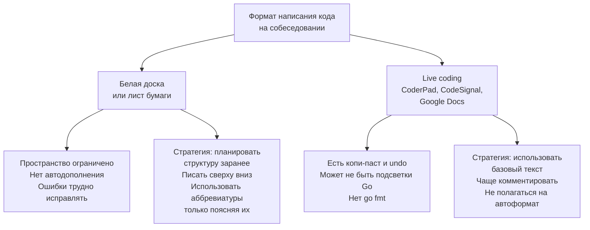

## Белая доска и live coding

До сих пор наш разговор о собеседованиях предполагал наличие комфортной среды: вы сидите за своим ноутбуком, у вас есть любимый редактор с подсветкой синтаксиса, автодополнением и мгновенной проверкой на ошибки компиляции. Но реальность Senior-собеседований часто жёстче: вас могут попросить писать код на **белой доске**, в **Google Docs** без моноширинного шрифта или в онлайн-песочнице вроде CoderPad, где Go-плагин может отсутствовать или быть урезанным. И ваш код должен остаться идиоматичным, корректным и понятным.

Это совершенно отдельный навык, который не тренируется решением задач в GoLand или VS Code. На белой доске нет `go fmt`, нет быстрого запуска тестов, нет даже клавиши Backspace в привычном смысле — только маркер и ваша голова. В live coding-средах text-based окружение может быть лишено привычных вам возможностей. Senior-разработчик обязан уметь писать код в любых условиях, потому что в реальной работе архитектурные обсуждения часто происходят именно у доски. Эта статья научит вас адаптировать свою Go-экспертизу к этим непростым форматам.

### Два мира: физическая доска и онлайн-редактор

Хотя оба формата объединяет отсутствие полноценной IDE, между ними есть принципиальная разница, которая влияет на стратегию поведения.



**Белая доска** — это физический артефакт. Вы ограничены её размерами, вы не можете быстро вставить строчку между двумя написанными, ваши отступы могут «плыть». Здесь главный враг — хаотичное размещение кода, при котором сигнатура функции в левом верхнем углу, а закрывающая скобка через полметра справа, и никто не понимает, где что.

**Live coding** даёт больше гибкости: можно редактировать, копировать, вставлять. Но отсутствие `go fmt` означает, что отступы и стиль целиком на вашей совести. Плюс часто нет проверки синтаксиса, и опечатка в `strconv.Atoi` может остаться незамеченной до мысленного прогона.

### Стратегия whiteboard-интервью: структура и пространство

Физическая доска требует дисциплины, сходной с рисованием архитектурных диаграмм.

**1. Зонирование доски.** Перед тем как писать код, мысленно разделите доску на три части:
- Левая треть: сигнатура функции, краткое описание алгоритма (1–2 строки текста), структуры данных.
- Центральная и правая часть: непосредственно код, идущий сверху вниз, с нормальными отступами.
- Нижняя полоса или отдельный участок: для ручной трассировки (таблица значений переменных на каждой итерации).

**2. Пишите сигнатуру сразу правильно.** На доске сложно исправлять. Не пишите `func solve(arr []int) int` только для того, чтобы через 10 минут понять, что возвращать нужно слайс индексов. Поэтому **фаза уточнений и выбора подхода ([[5. Алгоритм решения задачи на интервью]]) здесь критична**: сначала утвердите с интервьюером сигнатуру и логику, потом переносите на доску.

**3. Идиоматичный Go без `go fmt`.**
- Используйте табуляцию (4 пробела) для каждого уровня вложенности. На доске это просто два-три сантиметра отступа.
- Не экономьте место: лучше перейти на новую строку, чем писать `if x > 0 { y++ }` в одну строку. Читаемость на доске важнее компактности.
- Имена переменных — полные: `left, right, windowSum`. Но если пишете от руки и слово длинное, можно сократить, **обязательно подписав** рядом: `ws := windowSum`. На доске это допустимо, если вы явно сказали: «`ws` — это `windowSum`, я буду использовать сокращение для скорости».
- Не пишите на доске `:=` с риском, что двоеточие сольётся с равно. Лучше `var sum int` и `sum = ...` — это чуть длиннее, но разборчивее.
- Стрелки `->` не нужны. Go — не C с указателями в арифметике. Структуры и слайсы описывайте словами.

**4. Исправление ошибок.** Не стирайте до дыр. Аккуратно зачеркните неверную строку и напишите рядом правильную. Или скажите: «Я вижу, что здесь должен быть `<=`, а не `<`. Разрешите исправить?» и перепишите. Не оставляйте на доске «кашу» из стёртых символов.

**5. Ручная трассировка на доске.** Когда код написан, используйте нижнюю часть доски для таблицы трассировки. Для скользящего окна это может быть:

```
Iter | left | right | sum | maxLen
0    | 0    | 0     | 0   | 0
1    | 0    | 1     | 2   | 2
...
```

Это заменит вам консольный вывод и покажет интервьюеру, что вы действительно умеете проверять свой код.

> [!warning] Ловушка / Gotcha
> На белой доске очень легко перепутать `=` и `:=`, забыть `var` и написать `m := map[string]int`, хотя это не присваивание, а объявление с инициализацией. Go-компилятор такое не пропустит, но на доске эта ошибка пройдёт незамеченной, пока вы не начнёте мысленный прогон. Поэтому всегда держите в голове: **объявление новой переменной через `:=`, изменение существующей — через `=`**.

### Стратегия live coding: выживание в текстовом редакторе

В CoderPad, CodeSignal, HackerRank или просто Google Docs ситуация иная: вы не ограничены физически, но лишены интеллектуальной помощи IDE.

**1. Игнорируйте отсутствие подсветки.** Если среда не поддерживает Go, пишите так же, как в обычном редакторе. Отступы соблюдайте пробелами (лучше 1 tab = 4 пробела в таких средах). Не ждите, что система отформатирует за вас. Мысленно запускайте `go fmt` в голове.

**2. Не проверяйте компиляцию в уме на каждом символе.** Это отвлекает. Пишите логику, а после завершения функции пройдитесь глазами и проверьте:
- Все ли переменные объявлены?
- Нет ли `nil`-map без инициализации?
- Правильно ли расставлены скобки? (простая проверка — подсчёт открывающих и закрывающих)

**3. Используйте возможности редактора.** В отличие от доски, здесь можно вставить закомментированный псевдокод перед реальным кодом:

```go
// Алгоритм: два указателя, сходимся к центру
// left = 0, right = len(arr)-1
// while left < right:
//   ...
```

Это помогает и вам, и интервьюеру, и легко удаляется или остаётся как комментарий.

**4. Осторожно с copy-paste.** Повторяющийся код выносите в отдельные функции или циклы. Если вы копируете блок и меняете в нём пару строк, на live coding это допустимо, но обязательно скажите: «Я скопирую этот блок и подправлю для правой границы». Не заставляйте интервьюера гадать, заметили ли вы, что код дублируется.

**5. Тестирование в live coding.** Напишите пару вызовов функции с ожидаемыми результатами ниже, закомментировав их:

```go
// Тесты:
// fmt.Println(twoSum([]int{2,7,11,15}, 9)) // [0,1]
// fmt.Println(twoSum([]int{}, 5)) // nil
```

И пройдитесь по ним вслух. Это заменит вам `go test`.

### Go-специфика на доске и в live coding: что нужно помнить

Когда вы пишете Go-код без IDE, легко забыть детали, которые обычно подсвечивает среда. Вот чек-лист того, что Senior должен воспроизводить автоматически.

#### 1. Инициализация map и слайсов

Без IDE легко написать:
```go
var m map[string]int
m["key"] = 1 // panic: nil map
```
Всегда помните: `make`. Если map — поле структуры, инициализируйте его в конструкторе. На собеседовании проговаривайте: «Я создаю map через `make`, чтобы избежать nil-panic».

Для слайсов:
```go
var res []int // nil, append работает
res := make([]int, 0, expectedSize) // предвыделение capacity
```
Писать `make` с capacity на доске — отличный способ показать, что вы думаете о производительности.

#### 2. Срезы и строки

На доске особенно легко забыть, что срез `s[start:end]` берёт `end-start` элементов, `end` исключительно. И что `len(s)` — байты, а не руны. Если задача на Unicode, явно пишите `[]rune(s)` и комментируйте.

#### 3. Сигнатуры функций и возврат ошибок

В DSA-задачах редко возвращают ошибки, но если вы используете `strconv.Atoi`, обязательно покажите, что обрабатываете ошибку, даже в упрощённом виде:
```go
val, err := strconv.Atoi(s)
if err != nil {
    return -1
}
```
Интервьюер должен видеть, что вы не игнорируете ошибки.

#### 4. Отсутствие циклов while

В Go есть только `for`. На доске у новичков часто проскальзывает `while left < right { ... }`. Это сразу выдаёт непривычку к языку. Senior такого не допустит.

#### 5. Видимость переменных

Без подсветки легко потерять область видимости. Например, объявить `i` снаружи цикла, а внутри вложенного цикла снова использовать `i := ...`. Это теневое копирование, которое может привести к багу. На доске старайтесь использовать разные имена для переменных разных уровней вложенности (`i`, `j`) или явно обнуляйте.

#### 6. Defer

На доске `defer` писать можно, но только с обоснованием. В DSA-задачах ресурсов обычно нет, так что `defer` не нужен. Но если вы пишете вспомогательную функцию для работы с файлами (что редкость), покажите, что вы знаете про `defer f.Close()`.

> [!info] Под капотом
> Когда вы на собеседовании говорите: «Я выберу `[26]int` вместо `map[byte]int`, потому что массив разместится на стеке и не создаст нагрузки на GC», вы показываете понимание escape analysis и управления памятью. На whiteboard этот комментарий бесценен, потому что интервьюер не увидит вывод `go build -gcflags="-m"`, но услышит вашу экспертизу.

### Тренировка Whiteboard/Live Coding навыка

Просто знать теорию недостаточно. Нужно тренироваться в условиях, приближенных к реальным.

**Упражнения:**
1. **Бумага и ручка.** Решайте задачи на листе А4, не пользуясь компьютером. Жёстко ставьте таймер на 25 минут. Потом переносите код в редактор и смотрите, компилируется ли, проходят ли тесты. Штрафуйте себя за каждую опечатку или синтаксическую ошибку повторением упражнения.
2. **Google Docs.** Откройте пустой документ без подсветки синтаксиса, выключите проверку орфографии и решите задачу. Это лучшая симуляция CoderPad без Go-плагина. Затем скопируйте в Go Playground и проверьте.
3. **Парное whiteboard.** Если есть коллега, имитируйте реальное интервью: один пишет на доске, другой интервьюирует. Меняйтесь ролями. Записывайте на видео — потом увидите свои ошибки в движениях и почерке.
4. **Проговаривание Go-специфики.** Во время тренировки на доске обязательно проговаривайте: «Здесь я делаю `make` с capacity, чтобы избежать переаллокаций», «Проверяю, что map не nil», «Использую `range`, потому что это идиоматичнее». Это формирует рефлекс.

### Коммуникация на whiteboard: держите интервьюера в курсе

Писать на доске и одновременно говорить сложнее, чем в IDE. Но молчание здесь ещё опаснее (см. [[6. Как объяснять решение вслух]]). Советы:

- Перед тем как начать писать блок кода, скажите: «Я реализую цикл с двумя указателями. Левый начнётся с 0, правый с конца».
- Когда пишете длинную строку, не молчите. Говорите: «Пишу условие: если сумма меньше target, сдвигаю левый указатель».
- Если нужно подумать над строчкой, отойдите на полшага от доски и скажите: «Дайте секунду, я проверю, не нарушится ли инвариант при этом сдвиге». Затем вернитесь и пишите.
- Не закрывайте написанное спиной. Стойте чуть сбоку, чтобы интервьюер видел код.

> [!tip] Собеседование
> Если на whiteboard-интервью вас просят написать тесты, не пишите полноценный `func Test...`. Достаточно таблицы входных и ожидаемых данных и фразы: «В реальном проекте я бы написал table-driven тест с этими кейсами, используя `testing` и `testify`». Это показывает знание культуры Go-тестирования без траты времени на синтаксис.

### Психологический аспект: доска как зона комфорта

Многие кандидаты боятся доски больше, чем live coding. Но на самом деле доска даёт вам преимущество: вы контролируете темп, вы можете рисовать диаграммы, вы не зависите от багов платформы. Превратите доску в инструмент усиления вашей презентации:

- Нарисуйте массив и два указателя.
- Нарисуйте дерево и обход.
- Покажите ручную трассировку.

Когда интервьюер видит, что вы свободно владеете пространством доски, он проникается доверием: перед ним человек, который привык объяснять сложные вещи команде.

### Заключение

Белая доска и live coding — это не препятствие, а проверка вашей инженерной зрелости. Настоящий Senior способен написать идиоматичный Go-код в любых условиях, потому что понимает язык на уровне мысленной модели, а не на уровне подсказок IDE. Тренируйтесь без компьютера, проговаривайте решения, рисуйте структуры данных — и вы будете одинаково убедительно выглядеть и в Google Docs, и у маркерной доски.

В следующей статье мы углубимся в конкретные техники написания кода без IDE: как развить «компилятор в голове», как запоминать сигнатуры стандартной библиотеки и как избегать типовых ошибок, которые не ловит глаз, но ловит Go-рантайм. [[24. Как писать код без IDE]]