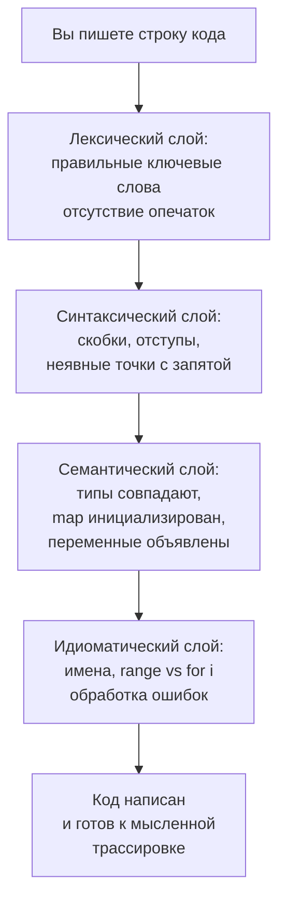

## Как писать код без IDE

В предыдущей статье [[23. Белая доска и live coding]] мы разобрали форматы собеседований, в которых у вас нет привычной среды разработки. Теперь мы погрузимся глубже в саму механику письма без IDE: как заставить мозг работать компилятором, откуда брать сигнатуры функций, как избегать досадных синтаксических и семантических ошибок, и — что важнее всего для Senior Go-разработчика — как сохранить идиоматичность и механическую симпатию, когда под рукой ни `go fmt`, ни `go vet`, ни даже подсветки синтаксиса.

Писать код без IDE — это не навык «терпеть неудобства». Это навык **мышления на языке**, когда вы не зависите от внешних подсказок, а держите модель языка в голове. Именно этот навык проверяется на whiteboard-интервью и в live-кодинге, где единственный компилятор — вы сами. И именно он отличает инженера, понимающего Go на глубинном уровне, от того, кто научился проходить тесты в GoLand.

### Ментальная модель: ваш мозг как Go-компилятор

Когда вы пишете в IDE, цепочка обратной связи мгновенна: красная волнистая линия под опечаткой, автодополнение после точки, предложение импорта. Без IDE вам нужно воспроизводить эту цепочку мысленно. Это значит, что вы должны держать в голове несколько слоёв языка:

1. **Лексический и синтаксический:** правильное написание ключевых слов, расстановка скобок, точек с запятой (неявных), запятых в объявлении переменных.
2. **Семантический:** соответствие типов, область видимости переменных, отсутствие `nil`-обращений, корректность `make` / `new`.
3. **Идиоматический:** стиль именования, выбор между `range` и индексным циклом, использование `defer`, обработка ошибок.



Senior-разработчик проходит эти слои автоматически, потому что он не помнит синтаксис как набор правил, а **чувствует** его. Это чувство нарабатывается тысячами строк кода, написанных в разных условиях, включая доску и текстовый редактор.

### Основные категории ошибок при написании без IDE

Понимание того, где вы можете ошибиться, — половина успеха. Ошибки без IDE делятся на четыре категории, и каждая требует своей стратегии предотвращения.

#### 1. Синтаксические ошибки: забытая скобка, точка с запятой, регистр

В Go нет точек с запятой в конце строк в исходном коде, но лексер вставляет их неявно по определённым правилам. Например, открывающая скобка `{` должна быть на той же строке, что и `if`, `for`, `func`. Написав на доске:

```go
if x > 0
{
    ...
}
```

вы получите синтаксическую ошибку, потому что лексер вставит `;` после `if x > 0`. Без IDE легко забыть это правило и написать скобку на новой строке. Senior помнит: **открывающая фигурная скобка всегда на строке с управляющей конструкцией**.

Другие частые синтаксические ловушки:
- Пропуск `:` в `:=` или написание `:=` там, где нужна `=`.
- `else` на новой строке без предыдущей закрывающей скобки (правильно: `} else {`).
- Написание `else if` как `elseif`.

**Стратегия:** после написания функции мысленно проходите по строкам и проверяйте, не нарушены ли правила неявных точек с запятой.

#### 2. Семантические ошибки: типы, nil, make

Без подсказок компилятора легко написать:

```go
var m map[string]int
m["key"]++ // panic
```

или

```go
var s []int
s[0] = 5 // panic
```

или использовать `:=` для повторного объявления переменной в той же области видимости, не осознав этого.

Особенно коварна теневая переменная: внутри блока `if` или `for` вы можете случайно создать новую переменную с тем же именем:

```go
var result int
...
if x := compute(); x > 0 {
    result := x // новая переменная, внешняя result не меняется!
}
```

Без IDE, где теневое объявление подсвечивается, эта ошибка остаётся незамеченной до ручной трассировки.

**Стратегия:** всегда проверяйте, не обращаетесь ли вы к nil-map/nil-slice. Для map — обязательно `make`. Для слайсов — либо `make` с длиной, либо `append`. Избегайте повторного использования коротких имён во вложенных блоках.

#### 3. Ошибки импорта и стандартной библиотеки

Без автодополнения вы должны помнить сигнатуры ключевых функций:
- `strconv.Atoi(s string) (int, error)`
- `strings.Contains(s, substr string) bool`
- `sort.Ints(a []int)`
- `math.MaxInt` и `math.MinInt` — это константы.

Путаница в именах пакетов (`strings` vs `string`), функций (`sort.Slice` с замыканием), аргументов — частая проблема. Например, написать `sort.Sort` вместо `sort.Ints` или забыть, что `heap.Push` принимает `Interface`, а не конкретный тип.

**Стратегия:** держите в голове минимальный API стандартной библиотеки. Для собеседования достаточно 10–15 функций, остальное можно уточнить у интервьюера: «Я могу использовать `sort.Search` для бинарного поиска? Если да, я применю его».

#### 4. Идиоматические ошибки

Они не ломают компиляцию, но ломают впечатление о вас как о Go-разработчике. Без IDE новичок скатывается к паттернам из других языков:
- `for i := 0; i < len(arr); i++` вместо `for i, v := range arr`.
- Использование `panic` для потока управления.
- Игнорирование ошибок (`_ = err`).
- Имена переменных `i`, `j`, `tmp` вместо осмысленных.

**Стратегия:** сознательно контролируйте стиль. Представьте, что после интервью ваш код прогонят через `golangci-lint`. Пишите так, чтобы он проходил линтер.

### Техника «мысленного go fmt»: как писать идиоматичный код без автоформата

В Go стиль кода строго задан `gofmt`. Senior автоматически воспроизводит этот стиль даже на доске.

**Правила, которые нужно соблюдать:**
- Отступы табуляцией (на доске — примерно 2–3 см).
- Открывающая скобка на той же строке.
- Пробелы вокруг операторов (`a + b`, а не `a+b`).
- После запятых пробелы (`map[string]int`).
- Имена пакетов короткие, без подчёркиваний.
- Экспортируемые имена с большой буквы.
- Порядок объявлений: `type`, `const`, `var`, функции.
- Вспомогательные функции после основной, если это не меняет логику.

**Как проверить стиль в уме:** после написания функции пробегитесь глазами и спросите: «Пропустил бы это `go fmt` без изменений?» Если сомневаетесь — перепишите строку проще.

### Навык «компилятор в голове»: пошаговая проверка перед тем, как сказать «Готово»

Когда код дописан, но кнопки «Run» нет, вы должны провести собственный «compile pass». Это системный обход кода, занимающий 2–3 минуты.

**Шаг 1. Проверьте объявления.** Каждая переменная объявлена до использования? Нет ли `:=` там, где переменная уже объявлена в этой области видимости (присваивание вместо объявления)? Все ли map'ы созданы через `make`?

**Шаг 2. Проверьте сигнатуры.** Функция возвращает ровно то, что заявлено? Если в сигнатуре `([]int, error)`, а в коде `return result`, это ошибка.

**Шаг 3. Проверьте типы.** Не складываете ли `int` и `int64` без приведения? Не передаёте ли `[]int` в функцию, ожидающую `[]string`? (В DSA-задачах редко, но бывает).

**Шаг 4. Проверьте границы.** Нет ли обращения к индексу за пределами слайса? Все ли срезы с корректными `[low:high]`? (High ≤ cap).

**Шаг 5. Проверьте nil-безопасность.** Возвращаете ли вы `nil` из функции, где ожидается слайс? (Это нормально, но осознанно). Обращаетесь ли к `deque[0]` при пустом слайсе? (Должна быть проверка `len(deque) > 0`).

**Шаг 6. Мысленная трассировка на минимальном примере.** Возьмите `len=0`, `len=1`, `len=2`. Пройдите по коду и убедитесь, что он не паникует.

Эти шаги дисциплинируют мышление и спасают от 90% ошибок, которые в IDE вы исправляете мгновенно, а на собеседовании они стоят очков.

### Как запомнить сигнатуры ключевых функций стандартной библиотеки

В DSA-задачах вы ограничены несколькими пакетами. Запомните их сигнатуры наизусть — это сэкономит время и избавит от неуверенности.

**Базовый набор Senior Go-разработчика для алгоритмического интервью:**

| Пакет | Функция / Тип | Сигнатура / Использование |
|---|---|---|
| `sort` | `Ints`, `Float64s`, `Strings` | `sort.Ints(a []int)` |
| `sort` | `Slice` | `sort.Slice(s, func(i, j int) bool { ... })` |
| `sort` | `Search` | `sort.Search(n int, fn func(int) bool) int` |
| `container/heap` | `Interface` | `Len, Less, Swap, Push, Pop` |
| `math` | `MaxInt`, `MinInt` | `math.MaxInt` (int), `math.MinInt` |
| `strconv` | `Atoi` | `strconv.Atoi(s string) (int, error)` |
| `strconv` | `Itoa` | `strconv.Itoa(i int) string` |
| `strings` | `Builder` | `var b strings.Builder; b.WriteString(s); b.String()` |
| `strings` | `ToLower` | `strings.ToLower(s string) string` |
| `bytes` | `Buffer` | аналог `strings.Builder` для `[]byte` |

Остальное можно спросить у интервьюера: «Я могу использовать `sort.Search` для бинарного поиска? Напомните, сигнатуру». Это допустимо, но базовый набор должен быть в мышечной памяти.

### Тренировка письма без IDE: от бумаги к Google Docs

Навык не приходит за день. Его нужно систематически развивать.

**Упражнение 1. Бумага и ручка.**
Выберите задачу, которую вы ещё не решали. На листе A4 напишите решение от руки. Не пользуйтесь никакими подсказками. Установите таймер на 25 минут. Закончив, перепечатайте код в Go Playground и запустите. Считайте количество ошибок компиляции и логических ошибок. Повторяйте ежедневно, стремясь к нулю.

**Упражнение 2. Google Docs без подсветки.**
Откройте пустой Google Doc, отключите проверку орфографии и автозамену. Решите задачу. Затем скопируйте в редактор и проверьте. Это симуляция CoderPad без Go-плагина.

**Упражнение 3. Диктант (парное).**
Попросите коллегу диктовать вам код небольшими фрагментами, а вы записывайте на доске или в блокноте. Это тренирует слуховое восприятие и быстрый перевод в синтаксис.

**Упражнение 4. Обратная компиляция.**
Возьмите готовый Go-код (решение задачи) и мысленно удалите подсветку, затем перепишите его в простом текстовом редакторе без автодополнения, стараясь не смотреть на оригинал. Сравните.

### Go-специфика: что нельзя забывать без IDE

Некоторые Go-особенности особенно легко забыть, когда нет подсказок.

#### 1. `make` vs `new`

`new(T)` возвращает `*T` с нулевым значением, но не инициализирует внутренние структуры (map, слайс). `make` используется только для слайсов, map'ов и каналов. На доске часто пишут `var m = new(map[string]int)` — это ошибка, потому что получится `*map[string]int`, а сам map ещё nil. Правильно: `m := make(map[string]int)`.

#### 2. Теневое объявление переменных

Самая тихая ошибка. Внутри блока `if` или `for` с `:=` вы создаёте новую переменную, даже если имя совпадает с внешней. Компилятор Go это разрешает. Без подсветки вы можете не заметить, что внешняя переменная не изменилась.

```go
var sum int
for _, v := range nums {
    sum := v // новая sum
    // ...
}
// здесь sum всё ещё 0
```

Избегайте `:=` для переменных, которые должны пережить блок. Используйте `=` и объявляйте переменную до блока.

#### 3. Неправильное использование `range`

- `for i, v := range slice` — `v` это копия элемента. Изменение `v` не меняет слайс. Нужно `slice[i]` для изменения.
- `for i := range slice` — только индекс, без значения, но `i` — это индекс, а не элемент.
- Для строк: `for i, c := range s` — `c` это `rune`, а `i` — индекс байта. Путаница между байтами и рунами — классическая ловушка без IDE.

#### 4. Импорты и их отсутствие

Если вы пишете `strconv.Atoi` без импорта, компилятор не ругнётся, пока вы не запустите код. В live coding это может остаться незамеченным, но интервьюер заметит. На доске принято писать `import "strconv"` в начале (обычно опускают, но лучше обозначить, что вы помните о необходимости импорта). Идиома: группировать стандартные пакеты.

```go
import (
    "sort"
    "strconv"
)
```

#### 5. Обработка ошибок

Без IDE легко забыть проверить ошибку. Если вы вызываете `Atoi`, обязательно пишите `if err != nil` рядом, даже если кажется, что ошибка невозможна. Это показывает Go-дисциплину.

### Как использовать интервьюера как «живой IDE» (аккуратно)

На собеседовании можно задавать уточняющие вопросы о сигнатурах. Это не запрещено. Но превращать интервьюера в справочник — плохо. Допустимые вопросы:
- «Я могу предположить, что `sort.Search` принимает длину и функцию?»
- «Точное имя метода для кучи — `heap.Push`? Я реализую интерфейс.»

Недопустимые:
- «А как объявляется map?»
- «Как добавить элемент в слайс?» (это базовый синтаксис, его нужно знать).

Senior балансирует: он помнит ключевое, а детали уточняет коротко и по делу.

### Заключение

Писать код без IDE — это навык, базирующийся на глубоком понимании синтаксиса, семантики и идиоматики Go, а также на дисциплине мысленной проверки. Он тренируется через регулярные упражнения с лишением себя привычных инструментов и позволяет на собеседовании выглядеть уверенно и компетентно в любой среде. А когда вы вернётесь в IDE, вы заметите, что стали писать чище и осознаннее, потому что перестали полагаться на автоматические подсказки.

В следующей статье мы детально разберём, что такое чистый код на Go в контексте интервью: как выбрать имена, как структурировать функцию, как писать комментарии и как применять принципы чистого кода, не перегружая решение избыточной абстракцией. [[25. Чистый код на Go на интервью]]