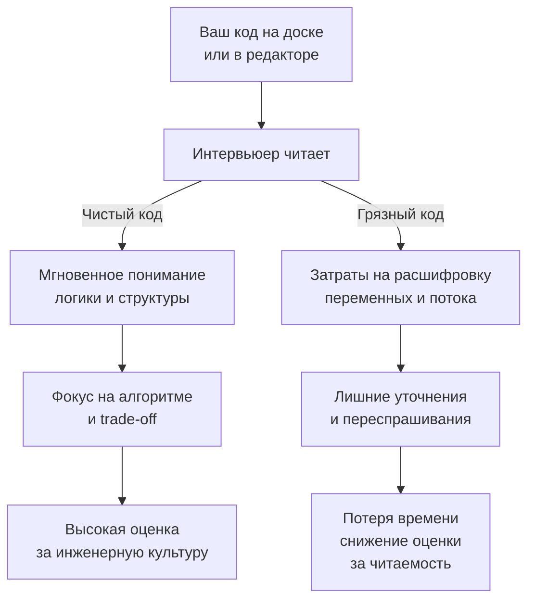

## Чистый код на Go на интервью

В предыдущих статьях мы научились распознавать паттерны ([[4. Как распознавать паттерн в задаче]]), управлять временем ([[21. Тайминг решения задач]]) и писать без IDE ([[24. Как писать код без IDE]]). Но есть ещё один фактор, который часто остаётся в тени, хотя влияет на исход собеседования не меньше, чем алгоритмическая сложность. Это **чистота кода**.

Под чистотой на алгоритмическом интервью понимают не архитектурные паттерны вроде Clean Architecture, а нечто гораздо более осязаемое: способен ли интервьюер, глядя на ваш код, мгновенно понять его логику? Может ли он представить, что этот код будет легко читаться, тестироваться и поддерживаться в production-окружении? Или ему приходится продираться сквозь однобуквенные переменные, тройную вложенность и магические числа?

На позицию Senior/Lead ожидается, что вы пишете не просто «правильный» код, а код, который коллеги захотят взять в проект. Эта статья — о конкретных техниках и принципах написания такого кода на Go в стрессовых условиях интервью, с учётом ограничений времени и отсутствия IDE.

### Почему собеседование наказывает за грязный код

Интервьюер тратит когнитивные ресурсы на расшифровку вашего решения. Если код трудно читать, он будет вынужден задавать уточняющие вопросы, переспрашивать логику и, что хуже, может просто не заметить алгоритмическую изюминку, потому что увязнет в синтаксическом шуме.

Чистый код, напротив, позволяет интервьюеру сконцентрироваться на сути: корректности алгоритма, обработке edge cases и анализе сложности. Когда ваш код прозрачен, споры о trade-off становятся продуктивными, а ошибки — заметными и легко исправимыми.

Кроме того, чистый код — это прямой сигнал о вашей инженерной культуре. На code review Senior-разработчика никто не будет расшифровывать `tmp1`, `tmp2` и `x = append(x[:i], x[i+1:]...)` без комментариев. Интервью — это миниатюра code review.



### 1. Имена — самый дешёвый способ сделать код понятным

Имена переменных, функций и параметров — это 80% читаемости. На интервью у вас нет документации, поэтому имена должны нести смысловую нагрузку.

**Антипаттерны:**
- `i`, `j`, `k` — допустимы только как индексы в коротких циклах (и то, лучше `idx` или `left`, если это семантически богаче).
- `tmp`, `temp`, `res` — слишком размыты. `result` уже лучше, но ещё лучше `uniqueIndices` или `mergedIntervals`.
- `m`, `m1`, `m2` — бессмысленно. `need` и `have` (как в Minimum Window Substring) или `charFreq` гораздо понятнее.
- Сокращения без пояснений: `ws` вместо `windowSum`, `pr` вместо `prefixRemainder`. Если сокращаете, объявите переменную с полным именем и рядом короткий алиас (на интервью — просто используйте полное имя).

**Идиоматичный подход:**
- Индексы двух указателей: `left, right`.
- Сумма в окне: `windowSum`.
- Длина/максимум: `maxLen`, `minDiff`.
- Слайс результатов: `result` или `output`.
- Временная переменная: только если она действительно временная и несёт понятную роль (`nextSum`, `candidate`).

```go
// Плохо
func f(a []int, t int) []int {
    r := []int{}
    l, h := 0, len(a)-1
    for l < h {
        s := a[l] + a[h]
        if s == t {
            r = append(r, l, h)
            break
        } else if s < t {
            l++
        } else {
            h--
        }
    }
    return r
}

// Хорошо
func twoSumSorted(nums []int, target int) []int {
    left, right := 0, len(nums)-1
    for left < right {
        sum := nums[left] + nums[right]
        switch {
        case sum == target:
            return []int{left, right}
        case sum < target:
            left++
        default:
            right--
        }
    }
    return nil
}
```

### 2. Структура кода: плоскость побеждает вложенность

Go поощряет линейный, плоский код. Глубокая вложенность `if`/`for` — враг читаемости. Используйте ранние возвраты (guard clauses), чтобы отсекать крайние случаи в начале функции, а основную логику оставляйте на верхнем уровне.

**Правило:** если у вас три уровня вложенности, вы, вероятно, что-то делаете не так. Выносите вложенные блоки в отдельные функции или перестраивайте логику.

```go
// Плохо: глубокая вложенность
func process(data []int) int {
    if len(data) > 0 {
        sum := 0
        for _, v := range data {
            if v > 0 {
                sum += v
                if sum > 100 {
                    // ...
                }
            }
        }
        return sum
    }
    return 0
}

// Хорошо: ранний возврат
func process(data []int) int {
    if len(data) == 0 {
        return 0
    }
    sum := 0
    for _, v := range data {
        if v <= 0 {
            continue
        }
        sum += v
        if sum > 100 {
            // ...
        }
    }
    return sum
}
```

**Идиоматичный приём:** `switch` без выражения (switch statement) для цепочки условий.

```go
switch {
case sum == target:
    return []int{left, right}
case sum < target:
    left++
default:
    right--
}
```

Это гораздо чище, чем `else if`, и показывает владение языком.

### 3. Функции: маленькие и с одной ответственностью

В алгоритмических задачах не нужно разбивать код на десяток микро-функций, но выделение вспомогательной логики в отдельную функцию оправдано, если:
- Она инкапсулирует нетривиальную проверку (`isValid`, `isPalindrome`).
- Она реализует стандартный интерфейс (например, методы для `container/heap`).
- Она упрощает основную логику, скрывая детали (например, `swap` для слайса, хотя `a[i], a[j] = a[j], a[i]` и так читаемо).

На собеседовании ключевая битва — не перегрузить основную функцию мелочами, сохранив её как «оглавление» вашего алгоритма, а детали спрятать ниже.

```go
// Чистый подход: основная функция читается как план
func findAnagrams(s string, p string) []int {
    if len(s) < len(p) {
        return nil
    }
    target := charFreq(p)
    window := charFreq(s[:len(p)])
    var result []int

    if window == target {
        result = append(result, 0)
    }

    for i := len(p); i < len(s); i++ {
        window[s[i]-'a']++
        window[s[i-len(p)]-'a']--
        if window == target {
            result = append(result, i-len(p)+1)
        }
    }
    return result
}

// Вспомогательная функция изолирует деталь
func charFreq(s string) [26]int {
    var freq [26]int
    for i := 0; i < len(s); i++ {
        freq[s[i]-'a']++
    }
    return freq
}
```

### 4. Комментарии: минимум, но по делу

Хороший код самодокументирован, но есть моменты, когда комментарий необходим:
- Объяснение выбора неочевидной структуры данных (например, почему `[128]int` вместо map).
- Описание инварианта цикла, если он не очевиден из кода.
- Пояснение к сложному регулярному выражению или битовой манипуляции.
- Предупреждение о потенциальной ловушке (например, переполнение).

**Плохой комментарий:**
```go
// прибавляем к сумме
sum += v
```

**Хороший комментарий:**
```go
// используем [26]int вместо map, чтобы избежать pointer chasing в цикле
var target [26]int
```

На собеседовании устное сопровождение ([[6. Как объяснять решение вслух]]) частично заменяет комментарии. Но если вы пишете код в Google Docs или на доске, краткий комментарий к ключевому блоку очень помогает интервьюеру.

### 5. Инициализация и работа с памятью: чистота и производительность

Чистый код в Go тесно связан с управлением памятью. Senior видит аллокации даже там, где их не видит компилятор.

**Предвыделение capacity.** Если вы знаете или можете оценить размер результирующего слайса, всегда используйте `make([]int, 0, expectedSize)`. Это убирает скрытые переаллокации, делает производительность предсказуемой и показывает механическую симпатию.

**Массивы на стеке.** Если алфавит ограничен, `var need [26]int` — это стековая аллокация, которая не давит на GC. Это одновременно и чистота (никаких коллизий map), и производительность.

**Nil-слайс против пустого слайса.** Возврат `nil` из функции, которая возвращает слайс, — идиоматично и говорит «ответа нет». Но если по условию нужен JSON `[]`, верните пустой слайс. Всегда осознанно выбирайте.

```go
// Идиоматичный возврат nil при отсутствии ответа
if noSolution {
    return nil
}
```

**Избегание утечек через срезы.** Если вы возвращаете подслайс большого массива и он должен жить долго, скопируйте его явно. На собеседовании это можно не писать, но упомянуть: «В production я бы сделал копию, чтобы не удерживать большой массив в памяти».

### Сквозной пример: от «работает» к «читается»

Возьмём реальную задачу «найти первый неповторяющийся символ» (LeetCode 387) и покажем трансформацию.

**Версия 1: «грязный», но работающий код (стиль LeetCode-спешки)**
```go
func f(s string) int {
    m := map[byte]int{}
    for i := 0; i < len(s); i++ {
        m[s[i]]++
    }
    for i := 0; i < len(s); i++ {
        if m[s[i]] == 1 {
            return i
        }
    }
    return -1
}
```

Проблемы:
- Имя `f` — бессмысленное.
- `m` — слишком обще.
- Циклы с `for i := 0; i < len(s); i++` — не идиоматично (хотя и допустимо).
- Не обрабатывается пустая строка (хотя возврат `-1` корректен).

**Версия 2: Clean Go на интервью**
```go
func firstUniqChar(s string) int {
    if len(s) == 0 {
        return -1
    }

    // Предполагаем ASCII, поэтому [128]int на стеке
    var freq [128]int
    for i := 0; i < len(s); i++ {
        freq[s[i]]++
    }

    for i := 0; i < len(s); i++ {
        if freq[s[i]] == 1 {
            return i
        }
    }
    return -1
}
```

Улучшения:
- Говорящее имя функции.
- Ранняя проверка на пустую строку (хоть она и не обязательна, но демонстрирует внимание).
- Массив фиксированного размера вместо map — обосновано в комментарии.
- Код стал короче, понятнее и производительнее.

**Версия 3: если Unicode возможен**
```go
func firstUniqChar(s string) int {
    freq := make(map[rune]int, len(s))
    for _, r := range s {
        freq[r]++
    }
    for i, r := range s {
        if freq[r] == 1 {
            return i
        }
    }
    return -1
}
```

Здесь `range` по строке даёт руны, что корректно для Unicode. Map аллоцируется с примерной вместимостью, чтобы избежать эвакуаций. Имена ясны.

> [!info] Под капотом
> Выбор между массивом и map — это классический пример механической симпатии. Массив `[128]int` даёт гарантированное время доступа и нулевые аллокации, но ограничен ASCII. Map работает с любым алфавитом, но нагружает GC бакетами `hmap`. Senior-разработчик в комментарии к коду или устно объясняет этот выбор, и это оценивается выше, чем просто работающий код.

### Баланс между скоростью и чистотой на собеседовании

На собеседовании у вас всего 45 минут. Иногда рефакторинг до идеальной чистоты съедает драгоценное время, которое лучше потратить на вторую задачу или анализ сложности. Как найти баланс?

**Принцип тайм-менеджмента:**
- На этапе первого написания кода (15–20 минут) **сразу пишите чисто**. Не надейтесь переписать позже. Используйте осмысленные имена с первой попытки, ранние возвраты и базовые идиомы. Это не замедляет вас, а дисциплинирует.
- После того как код написан и проверен, если есть минута, можно пройтись и улучшить особо неуклюжие места (например, переименовать старую переменную, если в процессе логики её роль изменилась).
- Не жертвуйте именами ради скорости. Написание `left` требует на полсекунды больше, чем `l`, но окупается при проверке и обсуждении.

**Что можно временно упростить:**
- Вспомогательные функции: если функция тривиальна (например, `max(a, b int) int`), можно написать её в одну строку без объявления отдельной функции прямо в месте использования (но в Go нет встроенной `max` для целых до 1.21, так что `if a > b { return a }`). Однако вынос в отдельную функцию придаёт аккуратности.
- Комментарии: если вы всё объяснили устно, письменный комментарий может быть опущен, кроме критических блоков.
- Обработка ошибок: в DSA-задачах обычно нет `error`, но если вы вызываете `strconv.Atoi`, проверка ошибки обязательна. Игнорирование (`_`) — красный флаг.

> [!tip] Собеседование
> Если интервьюер говорит «Можно не обрабатывать ошибки для краткости», это не значит, что нужно игнорировать их. Лучше сказать: «Я привык проверять, но если позволите, для экономии времени опущу проверку в этом вызове». Это показывает, что вы осознаёте стандарт, но способны адаптироваться.

### Специфика Go: что делает код «Go-чистым», а не просто «чистым»

Go-сообщество выработало уникальные критерии чистоты, отличные от Java или C++:

**Отсутствие абстракций ради абстракций.** Вам не нужно создавать интерфейс на каждый чих. В DSA-задачах интерфейсы нужны только для `heap.Interface`. Всё остальное — конкретные типы.

**Плоская структура.** Никаких классов с наследованием, только функции и структуры. Это упрощает код и снижает вложенность.

**Явная обработка ошибок.** Возврат ошибок, а не исключений. Даже в DSA-задачах, где ошибок почти нет, привычка проверять `err` выделяет вас.

**Использование comma-ok.** Для map’ов: `if val, ok := m[key]; ok { ... }` — это идиоматичный способ проверить наличие ключа. Он чище, чем `if m[key] != 0`, потому что работает с нулевыми значениями.

```go
// Идиоматичная проверка наличия в map
if prev, ok := window[ch]; ok && prev >= left {
    left = prev + 1
}
```

**Zero values.** Используйте тот факт, что `int` равен 0, `bool` равен false, слайс — nil. Не пишите `var count int = 0`, просто `var count int`. Это чистота через доверие к языку.

### Заключение

Чистый код на Go в контексте интервью — это не прихоть перфекциониста, а прагматичный инструмент. Он снижает когнитивную нагрузку на интервьюера, помогает вам самим быстрее находить ошибки и демонстрирует зрелость инженера. Привычка писать чисто с первой попытки — это дисциплина, которая не замедляет, а структурирует ваше мышление. И когда вы выйдете за пределы интервью, именно этот навык сделает ваш production-код поддерживаемым и приятным для коллег.

В следующей статье мы разберём противоположную сторону медали — антипаттерны, которые гарантированно проваливают алгоритмические интервью, даже если вы решили задачу правильно. [[26. Антипаттерны. Как проваливают алгоритмические интервью]]