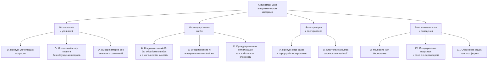

## Антипаттерны. Как проваливают алгоритмические интервью

Вы выучили паттерны, отточили код на сотнях задач, научились объяснять решение вслух и даже проходить mock-интервью. Но иногда этого недостаточно. Бывает, кандидат технически силён, код проходит примеры, а оффер не приходит. Или приходит отказ после раунда, который «вроде бы прошёл нормально». Часто причина — **алгоритмические антипаттерны**: устойчивые поведенческие и технические шаблоны, которые интервьюеры распознают мгновенно и интерпретируют как красные флаги. Они не всегда связаны с незнанием алгоритмов. Скорее — с незрелостью инженерного мышления, неумением работать в условиях неопределённости или игнорированием Go-культуры разработки.

Эта статья — энциклопедия того, как не надо делать на собеседовании. Мы собрали самые разрушительные антипаттерны, разбили их по категориям, показали, как они выглядят со стороны интервьюера и, главное, как их избегать, опираясь на конкретные техники из предыдущих статей. Запомните: часто отказ — это не приговор вашим знаниям, а реакция на антипаттерн, который вы даже не заметили.

### Карта антипаттернов: где и что ломается

Антипаттерны распределены по всем фазам решения задачи — от первого контакта с условием до финального «Готово». Они могут быть техническими и поведенческими, но все они ведут к одному: снижению оценки, потере времени, разрушению доверия.



Рассмотрим каждый антипаттерн в деталях с примерами на Go и конкретными рецептами лечения.

### Антипаттерны фазы анализа: как убить интервью за 5 минут

#### 1. Пропуск уточняющих вопросов — «мне всё ясно»

Кандидат слышит условие, видит знакомые слова «массив», «сумма», «подстрока» и тут же объявляет решение. Он не спрашивает про отрицательные числа, дубликаты, размер входа, ожидаемый возврат при отсутствии ответа. Через 20 минут выясняется, что решение не работает с отрицательными числами или паникует на пустом слайсе.

**Почему это антипаттерн:** интервьюер специально формулирует условие с пробелами. Senior обязан эти пробелы найти. Пропуск уточнений говорит: «Я не анализирую требования, я сразу кодирую». Это поведение Junior, которое в production приводит к неверно понятым задачам от бизнеса.

**Как избежать:** всегда задавать минимум 4 вопроса: о границах значений, о дубликатах, о пустом входе, о формате ответа. Использовать чек-лист из [[5. Алгоритм решения задачи на интервью]]. В Go-контексте обязательно уточнить: «Вернуть nil-слайс или пустой слайс?», «Строки ASCII или Unicode?».

#### 2. Мгновенный старт кодинга без обсуждения подхода

Кандидат сразу начинает писать `func solve(...) {`, не проговорив ни слова о выбранном алгоритме. Интервьюер видит код, но не понимает, куда движется мысль. Через 10 минут кандидат понимает, что подход неверен, стирает код и начинает заново. Время потеряно.

**Почему это антипаттерн:** это демонстрирует отсутствие планирования. Senior сначала проектирует, потом реализует. Отсутствие гипотезы, озвученной интервьюеру, лишает вас возможности получить раннюю обратную связь: «Да, скользящее окно подойдёт» или «Подумайте, сработает ли окно для отрицательных». Без этого вы рискуете потратить время на тупиковый путь.

**Как избежать:** после уточнений взять паузу в 1–2 минуты, проговорить: «Я вижу здесь паттерн скользящего окна, потому что... Ограничения позволяют O(N). Я выберу `[26]int` для учёта частот, так как алфавит английский. Подходит?» — и только после кивка интервьюера начинать код.

#### 3. Выбор паттерна без анализа ограничений

Кандидат видит слово «подмассив» и сразу пишет скользящее окно, не проверив, что числа могут быть отрицательными. Или N = 10⁵, а он предлагает O(N²) DP. Или наоборот, для N = 10 пытается построить сложную структуру, хотя хватило бы брутфорса.

**Почему это антипаттерн:** это показывает, что кандидат действует по шаблону, а не анализирует. Senior всегда сверяет сложность с ограничениями (см. [[18. Время и память на практике]]). Ошибка здесь — это не просто незнание, а нежелание думать.

**Как избежать:** на фазе анализа всегда спрашивать: «Какие ограничения по N?». И сразу прикидывать: если N ≤ 20, можно O(2^N); если N ≤ 2000, O(N²); если N ≤ 10⁵, O(N log N) или O(N). Затем фильтровать паттерны по допустимой сложности.

### Антипаттерны фазы кодирования: когда Go-код кричит «я новичок»

#### 4. Неидиоматичный Go и игнорирование стандартной библиотеки

Код выглядит как перевод с Java или Python: переменные `i`, `j`, `tmp`, циклы `for i := 0; i < len(arr); i++` вместо `range`, отсутствие обработки ошибок, использование `panic` для управления потоком, изобретение собственной сортировки вместо `sort.Ints`.

**Пример антипаттерна:**
```go
func f(s string) bool {
    arr := []byte(s)
    for i := 0; i < len(arr); i++ {
        for j := i + 1; j < len(arr); j++ {
            if arr[i] > arr[j] {
                tmp := arr[i]
                arr[i] = arr[j]
                arr[j] = tmp
            }
        }
    }
    // ...
}
```

**Почему это антипаттерн:** интервьюер, пишущий на Go, мгновенно видит чужака. Код не пройдёт code review в Go-команде. Неидиоматичность интерпретируется как отсутствие реального опыта работы с языком.

**Как избежать:** использовать `for i, v := range`, `sort.Slice`, `switch`, `if err != nil`, `defer`. Изучить идиомы из [[5. Учебник по Go (Основы и синтаксис)]] и сознательно применять их в каждой задаче. Представьте, что ваш код будет проверять `golangci-lint`.

#### 5. Игнорирование nil, путаница с make/new и теневые переменные

Это чисто Go-специфичные ловушки, которые проявляются без IDE особенно часто.

- **nil-map паника:**
```go
var m map[byte]int
m['a']++ // panic: assignment to entry in nil map
```
Кандидат забыл `make(map[byte]int)`. Для интервьюера это сигнал: «Не знает zero-value map».

- **Путаница с `new` и `make`:**
```go
var m = new(map[byte]int) // *map[byte]int, а сам map всё ещё nil
```
Кандидат пытается использовать `new` для map, что почти никогда не нужно.

- **Теневая переменная:**
```go
var sum int
for _, v := range nums {
    sum := v // новая sum, внешняя не меняется
    // ...
}
return sum // всегда 0
```
Без подсветки IDE кандидат не замечает, что `:=` создал новую переменную, и результат некорректен.

**Почему это антипаттерн:** Senior-разработчик должен знать эти тонкости на уровне рефлекса. Ошибки с nil и make показывают, что кандидат не понимает устройство типов в Go.

**Как избежать:** всегда инициализировать map через `make` или литерал `map[string]int{}`. Для слайсов — `make([]int, 0, cap)` или `var s []int` (nil безопасен для append, но не для индексации). Избегать `:=` для переменных, которые должны жить за пределами блока. В уме проводить проверку на nil и затенение.

#### 6. Преждевременная оптимизация и избыточная сложность

Кандидат для задачи «найти дубликат в массиве» начинает реализовывать `sync.Map` или кастомный бинарный поиск на указателях, хотя достаточно `map[int]bool`. Или пытается уместить всё в одну функцию без вспомогательных, превращая код в нечитаемую кашу.

**Почему это антипаттерн:** Senior ценит простоту. Преждевременная оптимизация — враг читаемости и надёжности. На собеседовании это трактуется как неумение оценивать реальную потребность в производительности и склонность к overengineering.

**Как избежать:** сначала написать простое, идиоматичное решение с хорошей асимптотикой. Затем, если время есть, обсудить возможные микрооптимизации и обосновать их бенчмарками. Следовать принципу: «Make it work, make it right, make it fast» — именно в этом порядке.

### Антипаттерны фазы проверки: «работает на одном примере — работает всегда»

#### 7. Пропуск edge cases и happy-path тестирование

Кандидат дописывает код, прогоняет его на примере из условия (часто одном) и говорит: «Готово, работает». Он не проверяет пустой ввод, один элемент, дубликаты, отрицательные числа, переполнение. Интервьюер находит баг за 10 секунд.

**Почему это антипаттерн:** это демонстрирует отсутствие культуры тестирования. Senior-разработчик, сдавая код в production, обязан проверить граничные условия. Пропуск edge cases — одна из главных причин падений в бою.

**Как избежать:** после написания кода взять 30-секундную паузу и проговорить минимум 4 edge cases (пусто, один элемент, дубликаты, отрицательные/максимальные значения). Использовать список из [[19. Edge cases и corner cases]]. Для каждого кейса мысленно трассировать код.

#### 8. Отсутствие анализа сложности и trade-off

Кандидат написал код, возможно, оптимальный, но не говорит о времени и памяти. Или говорит формально: «O(N)». Интервьюер ждёт обсуждения: почему O(N), а не O(N log N), какова память, есть ли альтернативы. Без этого раунд считается незавершённым.

**Почему это антипаттерн:** Senior-инженер способен оценить свой код, сравнить с альтернативами и выбрать лучший вариант. Молчание о сложности сигнализирует: «Я не думаю о производительности системно».

**Как избежать:** всегда завершать решение словами: «Давайте проанализируем сложность: время O(N), потому что каждый элемент обрабатывается дважды (один раз правым, один раз левым указателем). Память O(1), так как используется только `[26]int`. Альтернативно можно было бы использовать map для Unicode, но это добавило бы O(K) памяти и pointer chasing». Это занимает минуту, но закрывает ожидания.

### Поведенческие антипаттерны: как уничтожить впечатление о себе

#### 9. Молчание или бормотание

Кандидат пишет код молча, не комментирует свои действия. Или, наоборот, бормочет неразборчиво: «Так, тут это... ну типа... сюда... ага...». Интервьюер не понимает, что происходит, и начинает сомневаться в способности кандидата вести технические дискуссии.

**Почему это антипаттерн:** коммуникация — ключевой навык Senior. Вы не просто решаете задачу, вы показываете, как работаете в команде. Подробно эта тема раскрыта в [[6. Как объяснять решение вслух]].

**Как избежать:** тренироваться объяснять решение во время решения задач дома. Записывать себя на диктофон. Использовать структуру: «Сейчас я делаю X, потому что Y», «Проверю инвариант: окно содержит...», «Вижу, что условие нарушено, сжимаю окно».

#### 10. Игнорирование подсказок интервьюера и спор

Интервьюер говорит: «Подумайте, что будет, если все элементы отрицательные?». Кандидат отвечает: «Да, всё нормально, я проверял». Или начинает спорить: «Нет, мой алгоритм корректен». Через 5 минут выясняется, что алгоритм действительно даёт сбой. Или интервьюер предлагает альтернативу, а кандидат агрессивно её отвергает, не анализируя.

**Почему это антипаттерн:** Senior открыт к обратной связи. Игнорирование подсказок или защита своей позиции без анализа говорит о неспособности работать в команде и принимать критику. На code review это приведёт к конфликтам.

**Как избежать:** услышав вопрос, сделать паузу и честно проверить. «Хороший вопрос. Давайте проверим на отрицательном примере... Вы правы, здесь мой инвариант нарушается. Нужно пересмотреть подход». Если интервьюер предлагает идею — поблагодарите, проанализируйте, и даже если не согласны, аргументируйте: «Я вижу, что это может дать O(N log N), но я предпочту O(N) с map, потому что по памяти ограничения позволяют».

#### 11. Обвинение задачи, платформы или «я это учил, но забыл»

Фразы «Задача странная», «У меня на LeetCode такая не попадалась», «Я знаю решение, но не могу вспомнить» — это не оправдания, а сигналы паники и отсутствия глубины. Интервьюер делает вывод: «Кандидат заучивает, а не понимает».

**Почему это антипаттерн:** Senior не винит внешние факторы. Он берёт ответственность и пытается решить проблему имеющимися средствами. Оправдания — это поведение Junior.

**Как избежать:** если задача кажется незнакомой, не паниковать. Сказать: «Я не вижу немедленного оптимального решения. Давайте я начну с наивного подхода, а затем оптимизирую». Это показывает конструктивный настрой. Никогда не говорить «Я забыл решение».

### Go-специфичные «тихие убийцы»: антипаттерны, специфичные для языка

В дополнение к универсальным, есть несколько антипаттернов, характерных именно для Go-разработчиков на собеседовании.

- **Использование `container/list`** для очередей и стеков. Это почти всегда антипаттерн: медленно, `interface{}`, аллокации на каждый элемент. Замена на слайс делает код быстрее и чище.
- **Создание горутин и каналов в алгоритмической задаче.** Если только задача не про конкурентность (что редко), добавление горутин в BFS или DFS — это не «круто», а ошибка проектирования. Алгоритм становится недетерминированным и медленным из-за накладных расходов на синхронизацию.
- **Использование `reflect` или `unsafe` без крайней необходимости.** В DSA это смотрится как попытка пустить пыль в глаза и вызывает вопросы о безопасности и поддержке.
- **Возврат `error` из сигнатуры DSA-функции без причины.** Если задача требует вернуть -1 при отсутствии ответа, не усложняйте сигнатуру. Ошибки хороши, но не там, где условие просит конкретное значение.
- **Игнорирование `defer` для очистки ресурсов.** В DSA редко, но если вы открыли файл (редчайший случай) или создали что-то, что нужно закрыть, неиспользование `defer` покажет незнание идиом.

### Как пройти собеседование без антипаттернов: чек-лист

Перед каждым mock-интервью или реальным раундом мысленно сверяйтесь с этим списком:

- [ ] Задал ли я уточняющие вопросы? (пусто, отрицательные, дубликаты, Unicode, nil/empty slice)
- [ ] Озвучил ли я подход до начала кодинга?
- [ ] Выбрал ли я структуры данных с учётом Go-производительности? (массив вместо map, если алфавит ограничен)
- [ ] Использовал ли я `make` для map и слайсов, где нужно?
- [ ] Проверил ли я nil-безопасность?
- [ ] Назвал ли переменные осмысленно?
- [ ] Избежал ли я `container/list` в пользу слайсов?
- [ ] Не добавил ли я горутины без необходимости?
- [ ] Проверил ли edge cases после написания кода?
- [ ] Озвучил ли сложность и альтернативы?
- [ ] Говорил ли я достаточно, но не перебивал интервьюера?

Если на все ответы «да» — вы минимизировали риск антипаттернов.

> [!tip] Собеседование
> Если во время интервью вы поймали себя на одном из антипаттернов, не паникуйте. Скажите: «Стоп, я сейчас делаю X, что обычно не лучшая практика. Давайте я исправлю/объясню». Самоосознание и готовность скорректировать поведение — это Senior-черта.

### Заключение

Антипаттерны — это не мистические проклятия, а вполне конкретные, изученные ошибки мышления и поведения. Они процветают там, где кандидат полагается только на заученные решения и не адаптируется к живому диалогу. Истребив их в своей подготовке, вы превратите алгоритмическое интервью из лотереи в управляемый процесс, где вы контролируете не только код, но и впечатление, которое производите. Ваш код станет чище, объяснения — яснее, а реакции на трудности — увереннее.

В следующей статье мы разберём особый навык — умение думать вслух и корректно «тянуть время», когда решение не приходит мгновенно, не теряя при этом баллы. [[27. Как думать вслух и тянуть время на интервью]]