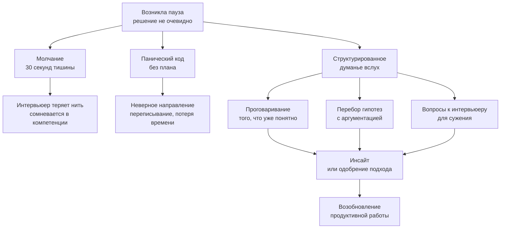

## Как думать вслух и тянуть время на интервью

В предыдущих статьях мы разобрали, как объяснять готовое решение ([[6. Как объяснять решение вслух]]), как избегать типичных ошибок ([[7. Типичные ошибки кандидатов]]) и как не скатиться в антипаттерны ([[26. Антипаттерны. Как проваливают алгоритмические интервью]]). Но есть момент, который не покрывается этими инструкциями: что делать, когда решение **не приходит**? Когда вы прочитали условие, задали уточняющие вопросы, а паттерн не угадывается, план не выстраивается, и внутри нарастает паника?

В этот момент большинство кандидатов либо замолкают, либо начинают судорожно писать код наугад. Senior-кандидат поступает иначе: он начинает **думать вслух** особым, структурированным образом, который одновременно двигает его к решению, демонстрирует интервьюеру инженерный процесс и **безопасно заполняет время**. Это не обман, а навык зрелого профессионала, который умеет проводить расследование проблемы в прямом эфире, не теряя лица.

### Почему «тянуть время» — это легитимная стратегия

На собеседовании время — ваш самый ценный ресурс. Если вы не знаете немедленного ответа, тишина в течение 30 секунд — это 30 секунд потерянного прогресса и упущенной возможности показать ход мыслей. Ещё хуже — начать писать код, который вы сами не до конца продумали: он почти наверняка окажется неверным, и время будет потрачено на борьбу с последствиями.

«Тянуть время» в позитивном смысле означает: **купить себе секунды для обдумывания, продолжая при этом демонстрировать экспертизу**. Вместо пустоты вы заполняете эфир полезным содержимым: переформулируете задачу, анализируете ограничения, проговариваете гипотезы, отбрасываете заведомо неверные варианты. Интервьюер слушает и видит: «Кандидат не завис, он планомерно сужает пространство поиска. Сейчас дойдёт до решения». И часто, проговаривая, вы сами приходите к инсайту.

### Что можно говорить, когда нечего сказать: резервуар фраз

В вашем распоряжении всегда есть набор тем, которые можно безопасно развернуть, пока подсознание ищет решение. Я называю это «резервуаром слов». Вы не придумываете ничего нового — вы черпаете из уже имеющихся у вас знаний о задаче и языке.

#### 1. Переформулирование задачи своими словами

Даже если интервьюер только что прочитал условие, повторите его с другой стороны. Это даёт 30–60 секунд и часто вскрывает скрытые детали.

> «Итак, нам нужно найти в массиве подмассив минимальной длины, сумма которого не меньше target. Это означает, что мы ищем непрерывный участок, и все числа, судя по условию, положительные — значит, при расширении окна сумма монотонно растёт. Мы можем использовать скользящее окно с двумя указателями. Но давайте сначала проверим крайние случаи...»

Здесь вы не заявили «я знаю решение», а просто перевели условие на язык инженерных терминов, одновременно включив предварительный анализ. Это совершенно легитимно и даёт время подумать.

#### 2. Анализ ограничений и ожидаемой сложности

Пока вы не знаете алгоритм, вы точно знаете числа. Комментируйте их:

> «N до 10⁵, это значит, что O(N²) не пройдёт. Нам нужно либо O(N log N), либо O(N). O(N log N) может дать сортировка с двумя указателями, но задача требует непрерывный подмассив, а сортировка разрушит порядок. Значит, скорее всего, нужно линейное решение. Возможно, скользящее окно или префиксные суммы с хеш-картой. Давайте подумаем, какое условие подходит...»

Вы ещё не решили, но уже показали, что умеете фильтровать варианты по ограничениям, как Senior. И пока вы говорите, вы сами структурируете мысль.

#### 3. Проговаривание «почему не подходит» очевидных наивных решений

Отбрасывание неверных путей — это тоже прогресс. Оно показывает, что вы не просто перебираете наугад, а осознанно сужаете круг.

> «Наивно можно было бы перебрать все подмассивы двойным циклом, это O(N²) — слишком медленно. Можно было бы для каждого левого индекса бинарным поиском искать правую границу, если бы суммы были монотонны — но здесь нет отрицательных, это сработает, но префиксные суммы плюс бинарный поиск дадут O(N log N), что допустимо. Но возможно, есть и линейный метод — давайте проверим, нельзя ли обойтись скользящим окном...»

Вы заняли минуту, но уже показали и наивный подход, и его сложность, и альтернативу. Интервьюер видит, что вы не стоите на месте.

#### 4. Обсуждение выбора структуры данных с Go-спецификой

Даже если алгоритм пока туманен, вы можете порассуждать о том, какие структуры данных вы бы использовали. Это покажет механическую симпатию и даст время на обдумывание алгоритма.

> «Если мы всё-таки пойдём через скользящее окно, нам нужно быстро проверять, удовлетворяет ли окно условию. Для этого нужна какая-то структура для хранения частот или суммы. Сумма — это просто переменная, обновляемая за O(1). Но если бы условие было сложнее, например, все уникальные символы, я бы выбрал `[26]int` для английского алфавита вместо map, потому что это стековая аллокация, отсутствие pointer chasing и мгновенное сравнение через `==`. Но здесь, к счастью, просто сумма, так что структура данных — просто `int`».

Вы ещё ничего не реализовали, но уже блеснули знанием внутренностей `hmap` и кэш-локальности. Это Senior-уровень, и это полностью легитимный способ занять 60 секунд.

#### 5. Проверка инварианта или маленького примера

Даже если алгоритм ещё не написан, вы можете взять маленький пример и пройтись руками, как если бы у вас был гипотетический код.

> «Давайте возьмём массив `[2,3,1,2,4,3]` с target=7. Вручную: окно `[2]` сумма 2, мало; расширяем до `[2,3]` — 5; до `[2,3,1]` — 6; до `[2,3,1,2]` — 8, ок, длина 4. Теперь сжимаем: убираем 2, получаем `[3,1,2]` — 6, снова мало. И так далее. Я вижу, что левый указатель сдвигается, только когда сумма >=7, и это напоминает классическое скользящее окно».

Это отличный способ «потянуть время» и заодно проверить идею до написания кода.

### Как просить время на размышление, не теряя баллы

Иногда вам действительно нужно 10–20 секунд полной тишины, чтобы прокрутить в голове сложный момент. Просто замолчать — плохо. Вместо этого явно запросите паузу, но оберните это в профессиональную фразу:

- «Дайте мне буквально 15 секунд, я хочу мысленно проверить один момент на edge case».
- «Позвольте я минуту подумаю над структурой цикла, прежде чем писать — хочу убедиться, что инвариант будет соблюдён».
- «Я возьму короткую паузу, чтобы оценить, какой вариант — префиксные суммы с map или скользящее окно — будет здесь чище».

Такая пауза показывает контроль и уважение к процессу, а не растерянность.

### Демонстрация глубины во время пауз: Go-специфика

Когда вы тянете время, говорите не просто общие слова, а демонстрируйте понимание Go. Это превращает паузы из «я не знаю» в «я знаю, о чём говорю».

**Пример.** Если задача связана со строками и вы не уверены, использовать map или массив, разверните рассуждение:

> «Если алфавит ASCII, я выберу `[128]int` для хранения последних позиций символов. Это даст прямой доступ по байту без хеширования, никаких бакетов, никакой эвакуации, и компилятор, возможно, оставит его на стеке через escape analysis. В ASCII это точно безопасно. Если же строки могут содержать Unicode, я возьму `map[rune]int`, но тогда добавлю `make(map[rune]int, len(s))` для предвыделения, чтобы минимизировать эвакуации бакетов в `hmap`. Давайте уточним у интервьюера: алфавит — только английские буквы?»

Такая тирада занимает минуту, но интервьюер уже видит в вас Senior, а не просто «человека, решающего задачки».

### Чего нельзя говорить: стоп-слова и антипаттерны «думанья вслух»

Некоторые фразы, произнесённые в паузе, разрушают впечатление мгновенно:

- «Я не знаю, как это решать».
- «У меня нет идей».
- «Обычно я решаю такие задачи, но сейчас забыл».
- «Это неправильная задача, она не похожа на LeetCode».

Эти фразы — сигнал капитуляции. Senior так не говорит. Даже если вы действительно не знаете, оберните это в конструктив: «Мне пока не очевидно, какой паттерн применить. Давайте я начну с наивного подхода, и мы вместе его оптимизируем».

Ещё одна ошибка — **бессвязное бормотание**. Когда кандидат произносит обрывки слов: «Тут типа... это... ну, массив... там сумма...». Это хуже молчания, потому что показывает панику. Говорите полными предложениями, даже если медленно. Лучше медленно и осмысленно, чем быстро и бессвязно.

### Тренировка навыка «думать вслух под давлением»

Навык не приходит сам. Его нужно ставить, как технику речи.

**Упражнение 1. Соло с диктофоном и таймером.**
Возьмите незнакомую задачу уровня Medium. Установите таймер на 25 минут. Начните запись и решайте, комментируя каждую мысль. Если застреваете, не замолкайте — говорите: «Я застрял, думаю, можно ли здесь применить BFS. Условие не похоже на граф, но если представить...» После решите задачу и прослушайте запись. Отметьте: где были провалы тишины, где было бормотание, где было ясно. Повторите через день.

**Упражнение 2. Парное проговаривание.**
Попросите коллегу дать вам задачу, которую вы точно не решали. Ваша цель — продержаться 5 минут, говоря о задаче, не написав ни строчки кода. Вы можете переформулировать, перебирать подходы, оценивать сложность, спрашивать уточнения. Это тренирует «резервуар слов».

**Упражнение 3. «Перевод» чужого решения в монолог.**
Найдите разбор задачи на LeetCode. Прочитайте его и попробуйте воспроизвести вслух, как если бы вы сами к нему пришли, с размышлениями и тупиками. Это помогает строить связные рассуждения.

### Как понять, что пора остановиться и начать писать

Думание вслух не должно переходить в бесконечный анализ. Senior чувствует грань, когда дальнейшие разговоры не приносят новой информации, и пора переходить к коду. Сигнал: вы уже дважды повторили одну и ту же мысль разными словами, но новых гипотез нет. В этот момент скажите:

> «Хорошо, я вижу два пути: скользящее окно с монотонной очередью или префиксные суммы с map. Первый предпочтительнее по памяти. Я начну с него, а если упрусь — переключусь. Пишу сигнатуру функции.»

Это показывает решительность, сохраняя лицо, даже если окончательное решение не найдено. Начав писать, вы можете обнаружить, что в процессе кодирования логика проясняется.

> [!tip] Собеседование
> Если интервьюер видит, что вы взяли паузу и структурированно её заполняете, он с большей вероятностью даст вам дополнительную минуту или даже подсказку. Фраза «Я сейчас обдумываю, можно ли свести эту задачу к поиску в ширину, потому что она напоминает обход по уровням...» может спровоцировать интервьюера на реплику «Подумайте, а что является узлами в этом графе?» — и это направит вас к решению.

### Заключение

Умение думать вслух и заполнять паузы продуктивным содержанием — это не трюк для обмана интервьюера, а проявление инженерной зрелости. Оно показывает, что вы способны рассуждать о проблеме структурированно, опираться на фундаментальные принципы и Go-специфику, даже когда готового ответа нет. В реальной работе это происходит постоянно: вы обсуждаете архитектуру, оцениваете подходы, отбрасываете неверные пути. Интервью — та же миниатюра.

Освоив этот навык, вы перестаёте бояться «незнакомых» задач, потому что знаете: даже если решение не приходит мгновенно, у вас есть процесс, который приведёт к нему и продемонстрирует вашу квалификацию. В следующей, завершающей статье этого теоретического блока, мы соберём всё вместе и сформируем итоговый **Interview Mindset** — целостное психологическое и профессиональное состояние, с которым вы пойдёте на собеседование. [[28. Итоги. Interview mindset]]