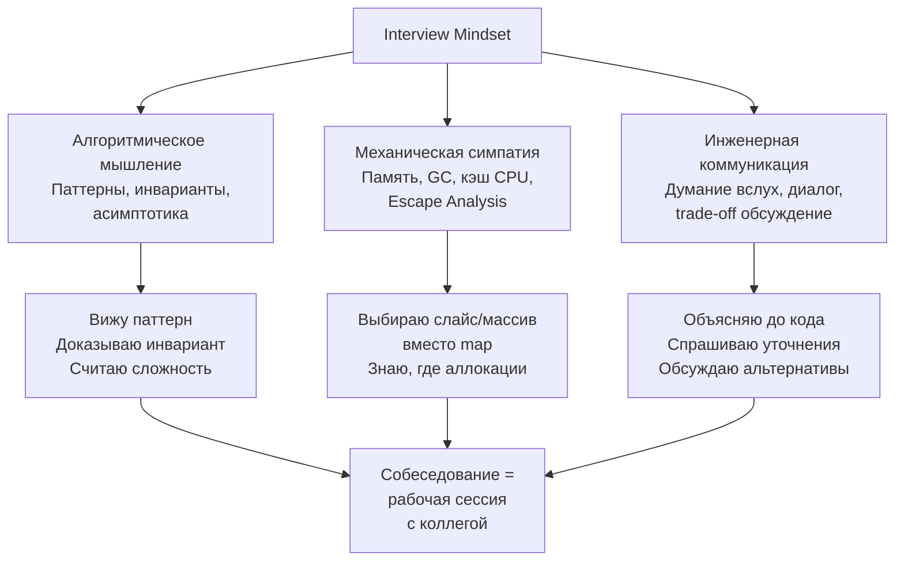

## Итоги. Interview Mindset

Позади двадцать семь статей теоретического блока. Вы разобрались, почему паттерны важнее заученных решений ([[3. Паттерны вместо запоминания решений]]), научились распознавать их в условии ([[4. Как распознавать паттерн в задаче]]), комбинировать ([[12. Как комбинировать алгоритмические паттерны]]) и оптимизировать шаг за шагом ([[16. Оптимизация решения шаг за шагом]]). Вы освоили коммуникацию ([[6. Как объяснять решение вслух]]), тайминг ([[21. Тайминг решения задач]]), отладку без IDE ([[20. Debugging алгоритмов]]) и даже искусство думать вслух, когда решение не приходит мгновенно ([[27. Как думать вслух и тянуть время на интервью]]).

Теперь всё это нужно собрать в единое целое. Потому что на собеседовании вы не применяете знания по очереди, как пункты чек-листа — вы действуете из целостного состояния. Это состояние и есть **Interview Mindset**. Его невозможно скачать или выучить за вечер, но можно сознательно воспитать. Эта статья — о том, из каких компонентов оно состоит, как его тренировать и как удерживать в день X.

### Что такое Interview Mindset

**Interview Mindset** — это устойчивая ментальная модель, в которой вы воспринимаете собеседование не как экзамен с приговором, а как инженерную рабочую сессию с незнакомым коллегой. Ваша цель — не «пройти», а **показать, как вы решаете задачи**. Это смещение фокуса кардинально меняет поведение: уходит страх ошибки, появляется естественная коммуникация, включается аналитическое мышление.

### Три столпа Interview Mindset

#### 1. Алгоритмическое мышление: не коллекция решений, а система

Первый столп — это способность смотреть на задачу и видеть не «знакомую картинку», а **структуру**: какие здесь входные данные, какие операции над ними нужны, какая сложность допустима, какой паттерн на это ложится. Вы не вспоминаете, вы **выводите**.

Это мышление базируется на:
- Знании паттернов и их инвариантов ([[8. Что такое алгоритмический паттерн]], [[9. Как устроены алгоритмические паттерны]]).
- Умении быстро отсекать неподходящее по ограничениям ([[18. Время и память на практике]]).
- Навыке строить мост от наивного решения к оптимальному ([[15. Наивное решение и его анализ]], [[16. Оптимизация решения шаг за шагом]]).

На собеседовании это проявляется в том, что вы не произносите «я где-то это видел», а говорите: «Задача имеет монотонное свойство — при расширении окна сумма только растёт, поэтому применимо скользящее окно с инвариантом...».

#### 2. Механическая симпатия: Go не просто язык, а среда исполнения

Второй столп — это постоянное осознание того, что ваш код будет исполняться реальным процессором с кэш-линиями, реальным аллокатором и реальным сборщиком мусора. Вы не пишете «абстрактный алгоритм», вы пишете **инструкцию для железа**, которая пройдёт через компилятор Go, escape analysis и рантайм.

Senior-мышление автоматически задаёт вопросы:
- «Могу ли я заменить `map[byte]int` на `[128]int` и избежать pointer chasing?»
- «Выделяю ли я `make([]int, 0, expectedSize)`, чтобы не плодить копии при росте слайса?»
- «Влияет ли этот возвращаемый подслайс на удержание большого массива в памяти?»
- «Дружественен ли мой обход prefetcher-у процессора, или я прыгаю по указателям?»

Это не микрооптимизация, а образ мысли. Подробно эти темы раскрыты в [[07. Глубокий Go (Внутреннее устройство)]] и [[01. Архитектура компьютера]]. На собеседовании даже короткое упоминание такого анализа — мощный сигнал Senior-уровня.

#### 3. Инженерная коммуникация: думать вслух и строить диалог

Третий столп — умение превращать свой мыслительный процесс в понятный интервьюеру нарратив. Вы не просто решаете задачу, вы **ведёте интервьюера по своему решению**. Он должен в каждый момент понимать, где вы находитесь, что собираетесь делать и почему.

Это включает:
- Уточнение требований до начала кодинга ([[5. Алгоритм решения задачи на интервью]]).
- Проговаривание гипотезы и запрос обратной связи.
- Комментирование ключевых блоков кода, а не каждой строки ([[6. Как объяснять решение вслух]]).
- Спокойное признание ошибки и её исправление ([[20. Debugging алгоритмов]]).
- Обсуждение альтернатив и trade-off после решения.
- Умение заполнить паузу продуктивным содержанием, если решение задерживается ([[27. Как думать вслух и тянуть время на интервью]]).

Коммуникация — это то, что превращает вас из «человека, который решил задачу» в «человека, с которым хотят работать».

### Как это выглядит на собеседовании: сценарий Senior-кандидата

Представьте, что вы получили задачу уровня Medium/Hard. Как будет действовать инженер с правильным Interview Mindset?

1. **Условие произнесено.** Вы не бросаетесь писать код. Вы киваете, делаете короткую паузу и задаёте 3–4 вопроса: про размер входа, про наличие отрицательных чисел, про пустой ввод, про ожидаемый формат ответа в Go (`nil` или пустой слайс).

2. **Анализ.** Вы проговариваете: «N до 10⁵, значит O(N log N) или O(N). Задача про непрерывный подмассив — похоже на скользящее окно или префиксные суммы. Смотрю на условие: сумма должна быть не меньше target, все числа неотрицательные — условие монотонно, окно подойдёт. Буду использовать два указателя. Для хранения суммы — одна переменная. Инвариант: окно [left, right) содержит сумму меньше target, а при её превышении мы сжимаем слева. Память O(1), время O(N). Подходит?»

3. **Кодирование.** Вы пишете сигнатуру с осмысленными именами `minSubArrayLen(target int, nums []int) int`. Начинаете с guard clause: `if len(nums) == 0 { return 0 }`. Пишете цикл с `for right < len(nums)`, поддерживаете `windowSum`, внутренний цикл `for windowSum >= target`. Имена `left`, `right`, `minLen`. Никаких `i`, `j`, `tmp`. Комментируете блоки: «Теперь сжимаем окно, обновляя минимум».

4. **Проверка.** Вы не говорите «Готово» сразу. Вы берёте пример из условия и проходите по коду. Затем говорите: «Проверю пустой массив — сработает guard clause. Один элемент — цикл выполнится один раз. Все числа одинаковые — условие корректно. Отрицательных нет по условию. Переполнение: target ≤ 10⁹, длина до 10⁵, сумма в int влезет».

5. **Завершение.** «Сложность O(N) по времени, O(1) по памяти. Альтернативно можно было бы префиксными суммами с бинарным поиском за O(N log N) и O(N) памяти, если бы числа были отрицательными. Но здесь окно оптимально». Всё. Интервью пройден.

Этот сценарий — не фантазия, а натренированный рефлекс, который вы выработали, прочитав все 27 статей до этой.

### Ритуалы для дня X: как не растерять Mindset за минуту до интервью

Стресс сужает мышление. Даже идеально подготовленный кандидат может «поплыть» в первые минуты. Senior-инженер знает это и применяет простые ритуалы, чтобы вернуть контроль.

**За 15 минут до начала:**
- Закройте все задачи, слайды, конспекты. Не пытайтесь «доповторить» в последний момент — это только усилит тревогу.
- Откройте пустой редактор или Go Playground, напишите простейшую программу: `func main() { println("ready") }`. Это калибрует мозг на Go-синтаксис.
- Проговорите вслух (можно тихо) три фразы: «Я готов. Я инженер, который решает задачи. Это рабочая сессия». Это звучит как мантра, но работает как якорь.

**В первые минуты интервью:**
- Улыбнитесь (даже если голосовой звонок — это слышно в голосе).
- Если предложили представиться, скажите коротко, без самовосхваления: «Я Senior Go-разработчик, последние N лет занимаюсь бэкендом высоконагруженных систем. Готов к задачам».
- Когда интервьюер даёт условие, не перебивайте. Запишите ключевые слова. Затем задайте уточняющие вопросы — это переключит мозг из режима «страх» в режим «анализ».

**Если случился ступор:**
- Сделайте вдох. Скажите: «Дайте мне минуту, я структурирую мысли». Затем начните проговаривать то, что уже понятно (ограничения, требуемая сложность, наивный подход). Как описано в [[27. Как думать вслух и тянуть время на интервью]], это выведет вас из ступора.

> [!info] Под капотом
> С точки зрения физиологии, проговаривание вслух активирует зоны Брока́ и Вернике, отвечающие за речь, и снижает активность амигдалы — центра страха. Буквально: когда вы говорите, вы меньше боитесь. Используйте это.

### После интервью: петля обратной связи

Interview Mindset включает не только само собеседование, но и правильное отношение к его результату.

- **Если получили оффер:** отлично. Но не останавливайтесь — проанализируйте, какие моменты были слабее, и добейте их до начала работы.
- **Если получили отказ:** это не приговор. Это данные. Сразу после собеседования (пока память свежа) запишите: какую задачу дали, где вы застряли, что сказал интервьюер, какие вопросы задавал. Эта «ретроспектива» — топливо для роста.
- **Никогда не принимайте отказ как личную оценку.** Компания могла искать конкретный набор навыков, который частично не совпал. Или интервьюер был уставшим. Или на позицию было 200 кандидатов. Ваша задача — не обижаться, а стать сильнее к следующему раунду.

Используйте mock-интервью ([[22. Mock интервью]]) и разбор ошибок ([[7. Типичные ошибки кандидатов]], [[26. Антипаттерны. Как проваливают алгоритмические интервью]]) для точечной доработки слабых мест.

### Go-мышление как часть вашей инженерной идентичности

Вы прошли длинный путь от «решаю задачки» до «мыслю как Senior Go-инженер». Теперь выбор слайса вместо map для ограниченного алфавита, предвыделение capacity, уточнение про nil-slice и обсуждение escape analysis — это не просто «правильные ответы» на собеседовании, а ваша естественная инженерная оптика.

Когда вы на собеседовании произносите: «Я выберу `[26]int` вместо `map`, потому что это стековая аллокация, отсутствие pointer chasing и сравнение массивов через `==`», вы не хвастаетесь знаниями. Вы просто делаете свою работу. И интервьюер это чувствует.

### Заключение

Interview Mindset — это не магическое состояние просветления, а кульминация системной подготовки. Алгоритмическое мышление даёт каркас, механическая симпатия — глубину, коммуникация — прозрачность. Собранные вместе, они создают образ инженера, которому доверяют сложные системы и ответственные решения.

Теоретический блок завершён. Вы получили инструменты, методики, чек-листы и ментальные модели. Теперь осталось последнее — перевести теорию в практический навык. Дальше начинается **02. Задачи** — 28 тематических кластеров, от массивов и строк до сложных составных задач. Каждый кластер откроет свои секреты, а каждый разбор задачи будет маленькой моделью собеседования. Начнём с фундамента: как работать с массивами и строками в Go, какие есть типовые приёмы и как уверенно проходить задачи, которые проверяют на каждом Junior/Middle-интервью. [[1. Теория. Массивы и строки]]