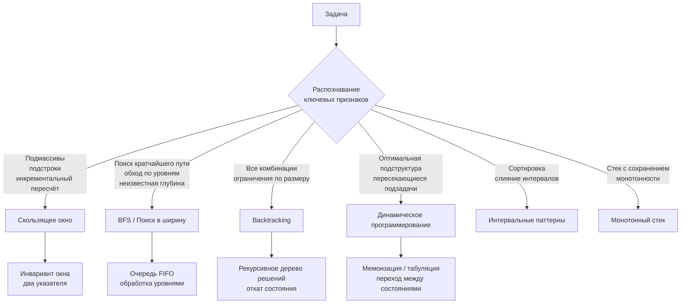

## Паттерны вместо запоминания решений

В предыдущей статье мы разобрали, почему умение проходить тесты на LeetCode не равно умению проходить собеседования. Ключевой причиной было отсутствие навыка *мыслить алгоритмически под наблюдением*. Теперь мы копнём глубже и рассмотрим главный инструмент, который превращает хаотичное нарешивание в управляемый процесс: **алгоритмические паттерны**.

Многие кандидаты относятся к подготовке как к механическому накоплению решённых задач. «Я решил 300 задач — значит, я готов». Это опасное заблуждение. Без системы, которая объединяет задачи в группы, ваш опыт — это просто коллекция разрозненных фактов. На интервью, столкнувшись с *новой* задачей, вы будете судорожно перебирать в памяти эти 300 решений, а не спокойно разбирать проблему по косточкам. Паттерны — это система, которая превращает «я где-то это уже видел» в «я знаю, как к этому подойти».

### Что такое алгоритмический паттерн

**Алгоритмический паттерн** — это не кусок кода, который можно скопипастить. Это обобщённый подход к решению целого класса задач, каркас мышления. Он включает в себя:

- **Сценарий применения:** по каким ключевым признакам мы понимаем, что этот паттерн применим.
- **Общую структуру решения:** последовательность шагов, как правило, не зависящую от конкретных чисел и условий.
- **Инварианты:** что остаётся неизменным на каждом шаге алгоритма и почему это гарантирует корректность.
- **Типичные точки оптимизации и опасные места** с учётом Go-специфики.

Если проводить параллель с паттернами проектирования (GoF) или паттернами конкурентности (pipeline, fan-out/fan-in), то алгоритмические паттерны — это ровно то же самое, только для вычислительных задач. И так же, как вы не пишете «Абстрактную фабрику» абсолютно одинаково в PHP, Java и Go, алгоритмический паттерн может иметь разную идиоматическую обёртку в зависимости от языка.

**Пример.** Паттерн «Скользящее окно» применяется, когда задача требует найти подмассив или подстроку, удовлетворяющую условию, и это условие можно пересчитать за O(1) при сдвиге границы. Сам паттерн не говорит вам «вот так выглядит код». Он говорит: «поддерживай два указателя, правый расширяет окно, левый сжимает, пересчитывай метрику инкрементально». А как именно вы это реализуете — с `map[byte]int` или с `[26]int`, через цикл `for` или `range`, — зависит от языка, контекста и соображений производительности.

> [!info] Философия Go
> Идиоматический Go следует принципу «Паттерны видны в коде, но не управляют им». Вы не будете строить иерархии классов с Template Method, как в Java. Вместо этого вы пишете плоскую функцию с чётко выраженной логикой сдвига окна, оставляя комментарий «// sliding window: [left, right)». Это сохраняет читаемость без переусложнения.

### Почему паттерны эффективнее заучивания решений

**1. Обработка незнакомых задач**

На платформе вы видите задачу, которую уже решали, и воспроизводите решение по памяти. Если память подвела, вы застреваете. На собеседовании задача почти всегда будет *вариацией* известной. Если вы знаете не задачу «Longest Substring Without Repeating Characters», а паттерн «Скользящее окно», вы решите и её, и «Minimum Window Substring», и «Find All Anagrams in a String», и любую другую с незнакомыми условиями, просто адаптируя каркас.

**2. Снижение когнитивной нагрузки**

Под стрессом оперативная память человека сжимается. Держать в голове 400 уникальных сниппетов невозможно. Держать 15–20 паттернов и правила их применения — абсолютно реально. Вы тратите мыслительные ресурсы не на вспоминание, а на анализ конкретной задачи и её edge cases.

**3. Гибкость и вариативность**

Заученное решение — застывший код. Паттерн — живая идея. Вы можете применить скользящее окно с `map` для строк с большим алфавитом, а для `[a-z]` заменить на `[26]int`, увидев возможность оптимизации. Вы можете осознанно выбрать между рекурсивным DFS (код проще, но риск переполнения стека горутины) и итеративным с явным стеком на слайсе. Это уровень Senior.

**4. Коммуникация с интервьюером**

Когда вы произносите: «Я вижу здесь паттерн скользящего окна, потому что условие требует найти минимальный подмассив, удовлетворяющий монотонному предикату», — интервьюер мгновенно понимает, что вы не наугад перебираете варианты, а владеете системным подходом. Это формирует доверие.

### Как устроено пространство алгоритмических паттернов

Не все паттерны одинаково «весомы». Одни — это высокоуровневые стратегии обхода пространства состояний (BFS, DFS, backtracking). Другие — более конкретные техники работы со структурами данных (два указателя, монотонный стек).



Каждый паттерн базируется на одной или нескольких структурах данных. Владение паттерном означает не только знание его идеи, но и умение мгновенно выбрать правильную структуру:

- Скользящее окно → `map` или массив фиксированной длины.
- BFS → `[]Node` как очередь (никаких `container/list`, это антипаттерн для BFS в Go из-за аллокаций на каждый элемент).
- Backtracking → рекурсия и `[]int` для текущего состояния с `append`/`[:len-1]` для отката.
- DP → матрица `[][]int` или, если важна память, одномерный слайс с переиспользованием.

### Pattern Matching: как распознать паттерн в задаче

Этот процесс мы детально разберём в следующей статье [[4. Как распознавать паттерн в задаче]], но уже сейчас важно понять: вы не угадываете, вы анализируете. Есть несколько чётких триггеров:

1. **Ключевые слова в условии:**
   - *«подмассив», «подстрока»* → скользящее окно, два указателя, префиксные суммы.
   - *«все комбинации», «все подмножества», «N x N»* → backtracking.
   - *«кратчайший путь», «минимальное количество шагов», «уровень за уровнем»* → BFS.
   - *«максимальная стоимость», «количество способов», «оптимальный выбор»* → DP или greedy (если есть жадный выбор).

2. **Ограничения на входные данные:**
   - N ≤ 20 → можно O(2^N) — backtracking.
   - N ≤ 10⁵, O(N log N) или O(N) → скользящее окно, префиксные суммы.
   - N ≤ 10⁹ → нужно O(log N) — бинарный поиск.

3. **Структура ответа:**
   - Минимум/максимум → DP, greedy, бинарный поиск по ответу.
   - Количество способов → DP, комбинаторика.
   - Сама последовательность (не только длина) → BFS с восстановлением пути.

### Паттерны в Go: механическая симпатия

Паттерн не существует в вакууме. Его реализация на Go должна учитывать, как код взаимодействует с памятью и GC. Это отделяет уверенных кандидатов от действительно сильных.

**Пример 1: Скользящее окно с `map` против массива**

Задача: «Самая длинная подстрока без повторяющихся символов». Если алфавит — весь ASCII/Unicode, `map[byte]int` неизбежен. Но если условие явно говорит «только строчные латинские буквы», использование `map` будет перебором.

```go
// Паттерн скользящего окна, оптимизированный для a-z
func lengthOfLongestSubstring(s string) int {
    var lastPos [128]int // ASCII, избегаем map для демонстрации
    for i := range lastPos {
        lastPos[i] = -1
    }
    left, maxLen := 0, 0
    for right := 0; right < len(s); right++ {
        if prev := lastPos[s[right]]; prev >= left {
            left = prev + 1
        }
        lastPos[s[right]] = right
        if curLen := right - left + 1; curLen > maxLen {
            maxLen = curLen
        }
    }
    return maxLen
}
```

Почему это лучше? Массив `[128]int` размещается на стеке, если не убегает в кучу (escape analysis видит, что ссылка наружу не уходит). Нет pointer chasing, нет нагрузки на GC. На собеседовании вы можете сказать: «Я выбрал массив вместо map, потому что это исключает аллокации в куче и даёт гарантированное O(1) без коллизий, так как ключи — последовательные байты».

**Пример 2: BFS на слайсе, а не на каналах**

Начинающие Go-разработчики, увидев конкурентность, иногда пытаются писать BFS с горутинами и каналами. Это ошибка. BFS — строго последовательный алгоритм обхода графа. Использование горутин добавит накладные расходы на синхронизацию и сделает решение недетерминированным.

Идиоматичный BFS в Go всегда использует слайс как FIFO-очередь:

```go
// Идиоматичный BFS: очередь на слайсе
func bfs(root *Node) [][]int {
    if root == nil {
        return nil
    }
    var result [][]int
    queue := []*Node{root}
    for len(queue) > 0 {
        levelSize := len(queue)
        var level []int
        for i := 0; i < levelSize; i++ {
            node := queue[0]
            queue = queue[1:]
            level = append(level, node.Val)
            if node.Left != nil {
                queue = append(queue, node.Left)
            }
            if node.Right != nil {
                queue = append(queue, node.Right)
            }
        }
        result = append(result, level)
    }
    return result
}
```

Здесь `queue = queue[1:]` — это операция переназначения заголовка слайса, а не копирования массива. Память под нижележащий массив остаётся, и мы постепенно сдвигаем начало. Это эффективно, если мы не храним ссылку на начало исходного слайса после выхода из цикла (потенциальная утечка памяти, если бы мы её сохраняли). Но в данном контексте это безопасно.

> [!warning] Ловушка / Gotcha
> В очереди на слайсе через `queue = queue[1:]` есть скрытая проблема: нижележащий массив никогда не освобождается, пока очередь активна. Если вы обрабатываете миллион узлов, память под начальные элементы не будет собрана GC, потому что слайс всё ещё ссылается на массив (хотя начальные элементы уже не в слайсе). В production-коде для длительно живущей очереди мы бы использовали кольцевой буфер или связный список с пулом узлов. На интервью вы можете упомянуть это как нюанс, демонстрируя понимание управления памятью в Go.

**Пример 3: Backtracking и аллокации**

При backtracking мы часто передаём `[]int` для состояния. Если мы будем создавать новый слайс на каждом шагу рекурсии, количество аллокаций взорвётся. Вместо этого используют единый слайс с `append` перед рекурсивным вызовом и срезом `state = state[:len(state)-1]` после. Это zero-allocation паттерн для стека вызовов.

### Как тренировать распознавание паттернов

Наш раздел построен так, чтобы вы тренировали именно паттерны, а не «коллекционировали» задачи. Каждый кластер в блоке «02. Задачи» сфокусирован на одном паттерне.

**Методика тренировки:**

1. **Изучите статью `1. Теория` в кластере.** Поймите, какие ключевые признаки указывают на этот паттерн, какие структуры данных нужны, какие есть вариации.
2. **Решите задачу `3` или `4` из кластера**, пытаясь применить паттерн в «чистом» виде.
3. **Затем решите задачу сложнее**, где паттерн комбинируется с другим (например, скользящее окно + хеш-таблица). Это формирует гибкость.
4. **После решения всегда задавайте себе три вопроса:**
   - *Почему сработал именно этот паттерн?*
   - *Какие 1-2 фразы в условии стали триггером?*
   - *Можно ли было решить иначе и как?*

> [!tip] Собеседование
> Если на интервью вы точно не уверены, какой паттерн применить, скажите об этом честно: «Я вижу два возможных направления — скользящее окно и динамическое программирование. Давайте я проверю, есть ли оптимальная подструктура. Если она есть, DP, если нет — вероятно, окно». Такой анализ вслух оценивается выше, чем молчаливое топтание или тыканье наугад.

### Заключение

Заучивание решений — это тупиковый путь. Оно создаёт иллюзию готовности, но разрушается при первом несовпадении с заученным шаблоном. Алгоритмические паттерны — это ваш инструмент декомпозиции любой незнакомой задачи на знакомые составляющие. Они дают не только решения, но и язык для обсуждения этих решений с интервьюером.

В следующей статье мы погрузимся в самый важный навык, который превращает знание паттернов в успешное интервью: **как именно по формулировке задачи и ограничениям мгновенно распознать, какой паттерн применить**. [[4. Как распознавать паттерн в задаче]]