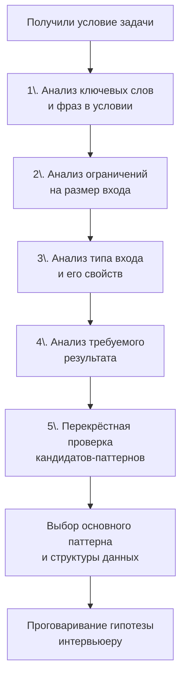

## Как распознавать паттерн в задаче

В предыдущей статье [[3. Паттерны вместо запоминания решений]] мы договорились, что алгоритмический паттерн — это не заученный код, а каркас мышления, применимый к целому классу задач. Но вот загвоздка: даже зная все паттерны, на реальном интервью вы получаете задачу, в которой нигде не написано «решай скользящим окном». **Распознавание паттерна — это первый и главный шаг, который определяет, пойдёте ли вы по правильному пути или увязнете в брутфорсе**. И этот шаг нужно сделать не интуитивно, а осознанно и методично.

Именно этому посвящена данная статья. Мы разберём не просто список паттернов, а **процесс их извлечения из условия**: на какие сигналы смотреть, в каком порядке анализировать, как не спутать один паттерн с другим и как тренировать этот навык до автоматизма.

### Почему интуиция подводит даже опытных

Наш мозг любит узнавать знакомое. Увидели слово «подмассив» — сразу Two Pointers. Увидели «минимальное количество» — DP. Это работает в 70% случаев и создаёт ложное чувство уверенности. Но в оставшихся 30% неверный выбор паттерна приводит к провалу: вы тратите 20 минут на попытку построить DP, а задача решается жадным алгоритмом за O(N), или вы пытаетесь применить BFS там, где нужен простой обход графа в глубину с мемоизацией.

Интервьюеры знают об этих шаблонных ассоциациях и специально формулируют задачи так, чтобы сбить вас с толку. Поэтому нужен не один триггер, а **перекрёстная проверка нескольких признаков**.

### Систематический подход к распознаванию

Подойдите к анализу задачи как детектив: соберите все улики и сопоставьте их с профилями подозреваемых — паттернов. Порядок важен, потому что одни сигналы сильнее других.

Пройдёмся по каждому шагу детально.

### Шаг 1: Ключевые слова и фразы

Это самый явный, но недостаточный сигнал. Определённые формулировки с высокой вероятностью указывают на конкретный паттерн. Однако помните, что задачи-обманки используют эти же слова в другом контексте.

**Сводка ключевых фраз и ассоциированных паттернов:**

| Ключевые фразы | Вероятные паттерны |
|---|---|
| «подмассив», «подстрока», «непрерывный» | Скользящее окно, Префиксные суммы, Два указателя |
| «все подмножества», «все комбинации», «все возможные варианты» | Backtracking |
| «кратчайший путь», «минимальное количество шагов/операций», «уровень за уровнем» | BFS |
| «самый длинный/короткий», «максимальная/минимальная сумма/стоимость» | DP, Greedy (если есть жадный выбор), Бинарный поиск по ответу |
| «количество способов» | DP, Комбинаторика |
| «отсортированный массив», «log N» | Бинарный поиск |
| «найти любой / проверить существование пути» | DFS, BFS |
| «интервалы», «пересечения», «слияние» | Интервальные паттерны |
| «K наибольших/частых» | Кучи и Top K |
| «объединить/связать компоненты» | Union Find, DFS на графе |
| «следующий больший/меньший элемент» | Монотонный стек |
| «палиндром» | Два указателя, DP на строках |

Но одних слов мало. Если в задаче «Подсчитать количество подмассивов с суммой равной K», слово «подмассив» толкает к скользящему окну, однако сумма не обязана быть монотонной, и окно может не сработать. Здесь нужен следующий шаг.

### Шаг 2: Ограничения на размер входа

Ограничения — это самый надёжный компас. Они определяют допустимую временную сложность, а от неё танцуем к паттерну.

- **N ≤ 20**: допустимо O(2^N) или O(N!) — это Backtracking, полный перебор.
- **N ≤ 200–500**: O(N³) может пройти — DP с матрицей (редакционное расстояние, задачи на подпоследовательности).
- **N ≤ 2000**: O(N²) — DP 1D/2D с перебором пар.
- **N ≤ 10⁵**: O(N log N) или O(N) — Сортировка + два указателя, скользящее окно, префиксные суммы с хеш-картой, жадные алгоритмы, бинарный поиск.
- **N ≤ 10⁹ или больше**: O(log N) — бинарный поиск, O(1) формулы.

> [!warning] Ловушка / Gotcha
> Новички часто игнорируют ограничения, сосредотачиваясь только на словах. Если вы начали строить DP с таблицей N×M, а N = 10⁵, то памяти понадобится гигантский объём, и решение упадёт. Всегда сверяйте сложность вашего предполагаемого решения с ограничениями до написания кода.

**Пример:** Задача «Koko Eating Bananas». Условие: массив `piles`, нужно найти минимальную скорость поедания бананов, чтобы успеть за `h` часов.  
Слово «минимальная» может намекать на DP, но ограничение `piles.length <= 10^4`, а `piles[i] <= 10^9`. Перебор скоростей от 1 до 10^9 невозможен, DP не строится. Здесь паттерн — **Бинарный поиск по ответу**: ищем скорость от 1 до max(piles) за O(N log max), что идеально вписывается в ограничения.

### Шаг 3: Свойства входных данных

Структура входа часто диктует, какие операции дёшевы, а какие — нет.

- **Вход отсортирован?** Это снижает сложность: можно применять два указателя, бинарный поиск. Если не отсортирован, сортировка за O(N log N) может быть допустимым предварительным шагом.
- **Дубликаты разрешены?** Влияет на выбор между хеш-сетом (невозможен при необходимости учёта дубликатов) и другими структурами.
- **Связный список / дерево / граф?** Очевидно, нужны обходы. Для дерева уточните: BST или нет? Свойство BST (левый < корень < правый) позволяет делать эффективный поиск без полного обхода.
- **Алфавит / диапазон значений ограничен?** Если только 'a'–'z' (26 символов) или цифры 0–9, можно заменить `map` на массив фиксированного размера, что дружественно кэшу и GC.
- **Данные потоковые?** (поступают последовательно, нельзя хранить все) — тогда нужны потоковые алгоритмы, скользящее окно, куча для медианы потока.

> [!info] Go-специфика
> Для задач на строки в Go всегда уточняйте: работаем ли мы с ASCII или Unicode? `len(s)` даёт количество байт, а не символов. Если нужны руны, используйте `[]rune(s)` или `for _, r := range s`, но помните, что это создаёт аллокацию копии рун. Иногда можно оставаться в байтах, если условие гарантирует ASCII. Упоминание этого нюанса на собеседовании — жирный плюс.

### Шаг 4: Требуемый результат

Что именно просят вернуть — сильно сужает круг паттернов:

- **Минимум/максимум чего-то** (длина, сумма, стоимость) → DP (оптимизация целевой функции), Greedy (если выбор без последствий), Бинарный поиск по ответу.
- **Количество способов** → DP (количество путей, комбинаций) или комбинаторные формулы.
- **True/False** (существует ли?) → DFS (поиск пути), BFS (кратчайший путь = существование), DP (возможно ли разбиение).
- **Конкретная последовательность/индексы** → BFS с восстановлением пути, Backtracking (генерация), Скользящее окно (границы подмассива).
- **Любой вариант** → часто можно упростить (жадный).

Пример: «Вернуть длину самой длинной подстроки без повторяющихся символов» — максимум длины → скользящее окно. «Вернуть саму подстроку» — то же окно, но надо сохранять границы. «Вернуть все такие подстроки» → добавится сохранение всех вариантов, возможно, с backtracking.

### Шаг 5: Перекрёстная проверка кандидатов

После сбора всех сигналов у вас обычно 1–3 кандидата. Теперь проверьте их на совместимость с ограничениями и свойствами данных.

**Алгоритм проверки:**

1. Для каждого кандидата прикиньте приблизительный код в голове: какие структуры данных нужны, какова временная и пространственная сложность в худшем случае.
2. Сопоставьте сложность с ограничениями. Например, O(N²) при N=10⁵ — отбрасываем.
3. Проверьте, нет ли логического противоречия: паттерн требует монотонности, а входные данные не монотонны.
4. Если осталось несколько — выберите самый простой в реализации, озвучьте интервьюеру и уточните, приемлем ли он. Это демонстрирует зрелый подход.

### Таблица быстрых триггеров «Условие → Паттерн»

Используйте её как чек-лист на начальном этапе анализа:

| Условие / признак | Наиболее вероятный паттерн |
|---|---|
| Непрерывный подмассив с условием на сумму/длину | Скользящее окно, Префиксные суммы + map |
| Два отсортированных массива или поиск пары | Два указателя |
| Поиск непересекающихся интервалов / слияние | Интервалы (сортировка + анализ) |
| «Следующий больший/меньший» | Монотонный стек |
| K наибольших / K частых | Куча (container/heap) или Bucket Sort |
| Количество вариантов разбивки / комбинации | DP (обычно 1D/2D) |
| Все возможные комбинации / расстановки | Backtracking |
| Кратчайшее расстояние в несвязанном графе | BFS |
| Обход всех комнат / островов | DFS / Union Find |
| Проверка на цикл / дерево | DFS (поиск цикла) / Union Find |
| Отсортированный ввод + поиск, O(log N) | Бинарный поиск |
| Задачи «найти минимальное/максимальное X, такое что условие выполняется» | Бинарный поиск по ответу |

### Живой пример распознавания: LeetCode 560. Subarray Sum Equals K

Пройдём по шагам.

1. **Ключевые слова:** «подмассив», «сумма равна K». Подмассив — непрерывный, это скользящее окно или префиксные суммы.
2. **Ограничения:** N ≤ 20 000, числа могут быть отрицательными.
3. **Свойства данных:** массив целых чисел, отрицательные возможны.
4. **Результат:** количество подмассивов.
5. **Проверка:** Скользящее окно работает для неотрицательных чисел (монотонность), но здесь отрицательные — окно не подходит. Префиксные суммы + хеш-карта работают для любых чисел: `prefixSum[i] - prefixSum[j] = K`. Сложность O(N) по времени и O(N) по памяти. N=20k — допустимо.

**Вывод:** Префиксные суммы с хеш-картой.

### Ещё пример: LeetCode 46. Permutations

1. **Ключевые слова:** «все возможные перестановки».
2. **Ограничения:** N ≤ 6 (уникальные числа).
3. **Свойства:** массив уникальных целых.
4. **Результат:** список всех перестановок.
5. **Паттерн:** Backtracking. Ограничение N ≤ 6 даёт O(N!) = 720 вариантов, что более чем приемлемо. Здесь можно обсудить аллокации: использовать слайс для текущей перестановки, избегая лишних копирований.

### Распространённые ошибки распознавания

1. **Привязка к единственному слову.** Увидели «subarray» — сразу окно, а там отрицательные числа или неподходящее условие. Всегда проверяйте ограничения.
2. **Игнорирование O-нотации.** Кандидат пишет O(N²) решение, когда N=10⁵, просто потому что оно проще в реализации. Интервьюер ждёт, что вы осознаете это и предложите оптимизацию.
3. **Смешивание DP и Greedy.** Задача на максимальную сумму подмассива (Kadane) решается DP, но внешне похожа на окно. Спрашивайте себя: «Можно ли локально оптимальный выбор глобально испортить?» Если да — DP.
4. **BFS вместо DFS в графах.** BFS нужен именно для кратчайшего пути по количеству рёбер. Если просто нужен обход, DFS проще и использует меньше памяти (стек рекурсии против хранения всей очереди).

### Go-специфичные соображения при выборе паттерна

Распознав паттерн, вы должны сразу подумать, как он ляжет на Go-инструменты. На собеседовании эта связка демонстрирует вашу инженерную зрелость.

- **Скользящее окно с символами:** `[26]int` или `[128]int` вместо `map[byte]int`, если алфавит ограничен — экономия аллокаций, cache-friendly, сравнение массивов оператором `==` (но осторожно: сравнение массивов — поэлементное O(26), но это ничтожно).
- **BFS/DFS:** для дерева — рекурсивный DFS выглядит идиоматично, но стек горутины имеет запас до ~1 ГБ, но глубокая рекурсия может быть медленной. Для графов лучше итеративный DFS с собственным стеком на слайсе.
- **Куча:** `container/heap` требует реализации интерфейса. В условиях ограниченного времени можно использовать сортировку после каждой операции, если N маленькое, но для больших N вы обязаны написать корректную обёртку над `heap.Interface`.
- **Union Find:** простая структура с `parent []int` и `rank []int` — никаких дженериков не нужно, пишем под конкретную задачу.

> [!tip] Собеседование
> После выбора паттерна скажите: «Я планирую использовать скользящее окно с хеш-картой для хранения последних позиций символов, чтобы достичь O(N). Если входные строки гарантированно ASCII, я могу заменить map на [128]int, что исключит pointer chasing и ускорит выполнение. Как вы считаете, это уместно?» — такое уточнение поднимает уровень беседы до Senior.

### Как тренировать распознавание: от теории к автоматизму

Чтение этой статьи не сделает вас экспертом. Нужна практика, но не бездумная. Предлагаю методику:

1. **Берите задачу, НЕ читая её решение.** Читайте только условие и ограничения.
2. **Запишите на листок свои гипотезы:** какие паттерны подходят, почему, какой вы выбрали бы в первую очередь.
3. **Затем сверьте с решением.** Если совпало — отлично. Если нет — разберите, какой сигнал вы упустили или переоценили. Сохраните это наблюдение в заметки (например, «Слово подмассив + отрицательные числа ≠ скользящее окно, а префиксные суммы»).
4. **Повторяйте на следующих задачах целевого кластера.** В нашем разделе «02. Задачи» задачи сгруппированы по паттернам, но вы не должны знать заранее, из какого кластера задача, когда тренируете распознавание. Поэтому периодически берите задачи вперемешку, имитируя условия интервью.

### Заключение

Распознавание паттерна — это не магия, а аналитический процесс перебора признаков условия, ограничений и свойств данных. Освоив его, вы перестаёте бояться «незнакомых» задач, потому что любая задача — это комбинация знакомых кирпичиков. В следующей статье мы превратим этот навык в чёткий алгоритм поведения на собеседовании: от получения задачи до финального анализа сложности. [[5. Алгоритм решения задачи на интервью]]