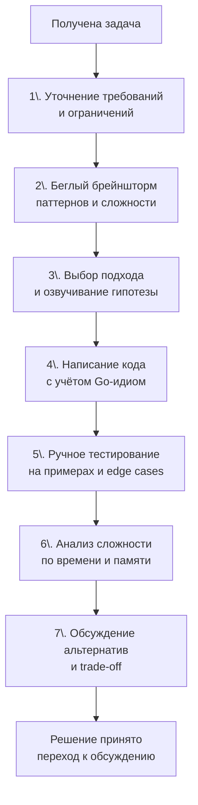

## Алгоритм решения задачи на интервью

В предыдущих статьях мы разобрали, почему паттерны важнее заученных решений и как распознавать их в условии. Теперь соберём всё в единый **рабочий алгоритм**, которому вы будете следовать от момента получения задачи до финального слова «Готово». Без такого алгоритма даже сильный кандидат рискует превратить 45-минутный раунд в хаотичное метание: сначала код, потом осознание, что не учтены важные ограничения, потом переписывание, потом нехватка времени на анализ сложности.

Этот алгоритм — не жёсткая догма, а многократно проверенная последовательность шагов, которая позволяет держать интервью под контролем, демонстрировать инженерный подход и оставлять время на обсуждение альтернатив. Каждый шаг описан с учётом Go-специфики, чтобы вы не просто «решали задачу», а делали это так, как ожидают от Senior/Lead бэкенд-инженера.

### Общий каркас алгоритма



Каждый из этих этапов занимает определённое время. Ориентировочный тайминг для 45-минутного раунда с одной основной задачей:

- Уточнение + брейншторм: 5–7 минут.
- Написание кода: 15–20 минут.
- Тестирование + анализ сложности + альтернативы: 10–15 минут.
- Буфер на неожиданные вопросы: 5 минут.

### Шаг 1: Уточнение требований — не пропускайте никогда

Вы получили условие. Рука тянется открыть редактор и начать писать `func solve(...)`. Остановитесь. Первое, что оценивает интервьюер — **умеете ли вы анализировать задачу перед выполнением**. Пропуск этого шага — самый частый провал сильных технически кандидатов.

Задайте вопросы, даже если ответ кажется очевидным. Хороший список для старта:

- **Тип и диапазон входных данных:** Целые числа? Могут ли быть отрицательными? Строки — ASCII или Unicode? Дерево — BST или обычное?
- **Размер входа:** Какие N ожидаются? Это критично для выбора сложности.
- **Дубликаты:** Допустимы ли повторяющиеся элементы? Если да, нужно ли сохранять порядок?
- **Граничные значения:** Может ли вход быть пустым? `nil` слайс? Корень дерева — `nil`?
- **Ожидаемый результат в краевых случаях:** Что возвращать, если ответа нет — `nil`, `-1`, пустой слайс, `false`?

> [!info] Go-нюанс
> В Go пустой слайс (`[]int{}`) и nil-слайс (`var s []int`) — это разные вещи с точки зрения сериализации (JSON) и некоторых проверок, хотя `len` и `cap` у обоих 0, и оба равны `nil` в одних контекстах и нет в других. На интервью уточните: «Если ответа нет, я должен вернуть `nil` или пустой слайс?». Это покажет, что вы понимаете тонкости языка.

Для задач, связанных с конкурентностью (редко в DSA, но возможно), спросите: «Функция будет вызываться из нескольких горутин? Нужна ли потокобезопасность?» В 99% алгоритмических задач — нет, но вопрос демонстрирует мышление production-разработчика.

### Шаг 2: Быстрый брейншторм — какие паттерны видны

Теперь, имея полную картину ограничений, прикиньте, какие паттерны могут быть применимы. Не надо сразу выбирать один. Набросайте 2–3 варианта и тут же проверьте их на соответствие ограничениям.

Используйте метод из статьи [[4. Как распознавать паттерн в задаче]]: ключевые слова → ограничения → свойства входа → требуемый результат.

**Пример для задачи «Merge Intervals»:**

- Ключевые слова: «интервалы», «слияние».
- Ограничения: N ≤ 10⁴.
- Свойства: интервалы могут быть неотсортированы.
- Результат: список объединённых интервалов.

Брейншторм: «Похоже на интервальный паттерн. Нужна сортировка + слияние за O(N log N), укладывается в ограничения. Можно ли без сортировки? Нет, потому что тогда придётся сравнивать каждый с каждым — O(N²), слишком медленно. Остановимся на сортировке.»

### Шаг 3: Выбор подхода и озвучивание гипотезы

Вы не обязаны сразу предлагать оптимальное решение. Более того, иногда хороший тон — сказать: «Я вижу наивное решение за O(N²) с таким-то подходом. Оно простое в реализации, но для N=10⁵ не подходит. Давайте я подумаю об оптимизации». Затем предложите основное решение.

Озвучьте интервьюеру:

1. Какой паттерн или алгоритм вы выбрали.
2. Почему он применим.
3. Какие структуры данных будете использовать.
4. Предполагаемую сложность по времени и памяти.

Фраза может звучать так:

> «Я планирую использовать паттерн скользящего окна с двумя указателями. Мы ищем минимальный подмассив, и условие позволяет пересчитывать сумму за O(1) при сдвиге окна, потому что все числа неотрицательные и расширение окна увеличивает сумму. Для окна я буду использовать два индекса `left` и `right`. Сложность будет O(N) по времени и O(1) по памяти, так как кроме нескольких переменных ничего не храним. Подходит?»

Интервьюер либо одобрит, либо направит, если вы пошли не туда. Это экономит 20 минут кодирования неверного решения.

### Шаг 4: Написание кода — идиоматичный Go с первого набора

Когда гипотеза одобрена, приступайте к коду. На этом этапе важно не просто написать работающую программу, а показать, как вы пишете production-код в миниатюре.

**Правила написания кода на интервью (Go edition):**

1. **Сигнатура и имена.** Функция должна быть названа ясно. Аргументы — осмысленные. Не `func f(a []int, k int) int`, а `func minSubArrayLen(target int, nums []int) int`.

2. **Структура.** Плоский код с ранними возвратами:
   ```go
   if len(nums) == 0 {
       return 0
   }
   ```
   Избегайте глубокой вложенности if/for.

3. **Локальные переменные.** Объявляйте их ближе к месту использования, используйте `:=`. Для накопителей — `var sum int`.

4. **Циклы.** `for right := 0; right < len(nums); right++` — идиоматично. Если нужен только индекс — `for i := range nums`. Если значение и индекс — `for i, v := range nums`. Не используйте `for i := 0; i < len(nums); i++` без необходимости.

5. **Слайсы.** Знайте, что `append` может переаллоцировать нижележащий массив. Если результирующий размер известен, используйте `res := make([]int, 0, expectedLen)`, чтобы избежать лишних копирований. Это демонстрация внимания к производительности.

6. **Строки.** Если задача гарантирует ASCII, работайте с байтами. Если Unicode — `for _, r := range s`, но помните, что это копирует руны.

7. **Комментарии.** Короткий комментарий к неочевидному блоку: `// сдвигаем левую границу окна`, `// ищем первое вхождение бинарным поиском`.

8. **Обработка краёв.** Проверьте `nil`, пустой слайс, выход за границы.

> [!warning] Ловушка / Gotcha
> **Использование `_` для игнорирования ошибок.** В DSA-задачах редко встречаются функции, возвращающие ошибки, но если вы пишете вспомогательную функцию (например, `strconv.Atoi`), не игнорируйте ошибку. Либо объясните, почему она невозможна в данном контексте, либо обработайте:
> ```go
> val, err := strconv.Atoi(s)
> if err != nil {
>     return 0 // или panic("unexpected"), но лучше вернуть zero-value и пояснить
> }
> ```

**Пример идиоматичного Go-кода для паттерна двух указателей (Two Sum II):**

```go
// twoSumSorted возвращает индексы двух чисел, дающих в сумме target.
// Входной массив numbers отсортирован по возрастанию.
// Индексы возвращаются 1-базированными, как того требует условие задачи.
func twoSumSorted(numbers []int, target int) []int {
    if len(numbers) < 2 {
        return nil
    }
    left, right := 0, len(numbers)-1
    for left < right {
        sum := numbers[left] + numbers[right]
        switch {
        case sum == target:
            return []int{left + 1, right + 1}
        case sum < target:
            left++
        default: // sum > target
            right--
        }
    }
    return nil
}
```

Что здесь хорошо: ранняя проверка длины, осмысленные `left`/`right`, `switch` для трёх случаев без вложенных if, явный комментарий, nil в случае неудачи.

### Шаг 5: Ручное тестирование — идите по коду пальцем

Не говорите «Готово» сразу после набора последней строки. Сделайте паузу и проведите ручную трассировку.

1. **Возьмите стандартный пример из условия.** Пройдите по коду, записывая значения переменных на каждом шагу.
2. **Возьмите второй пример.** Проверьте.
3. **Придумайте edge case:** пустой вход, массив из одного элемента, все элементы одинаковые, очень большие числа (переполнение?), максимальные и минимальные ограничения.
4. **Для Go-задач отдельно проверьте:** не выходите ли за границу слайса, не делите ли на ноль, корректно ли обрабатываете `nil`-входы.

Озвучивайте процесс: «Тестирую на пустом массиве: сработает ранний return nil — корректно. Теперь массив из одного элемента: len<2, тоже nil — правильно.» Это показывает ваше внимание к качеству, а также даёт время заметить баг до того, как на него укажет интервьюер.

> [!tip] Собеседование
> Упоминание table-driven тестов при ручной проверке — сильный сигнал. «В реальном проекте я бы написал table-driven тест с несколькими кейсами: нормальный случай, пустой вход, дубликаты, отрицательные числа. Здесь я проверю их мысленно.» Это доказывает, что вы владеете Go-культурой тестирования ([[15. Тестирование в Go (QA & Testing)]]).

### Шаг 6: Анализ сложности — не просто цифры

После проверки кода вы должны сами, без напоминания, сказать: «Давайте проанализируем сложность».

**По времени:**

- Укажите O-нотацию и обоснуйте: «Внешний цикл пробегает N итераций, внутренний `for` двигает левый указатель, который суммарно проходит не более N шагов. Итого O(N).»
- Упомяните константные факторы, если они значимы: «Хотя O(N), внутри цикла мы обращаемся к `map` трижды — это скрытые накладные расходы на хеширование и проверку коллизий.»

**По памяти:**

- «Мы храним хеш-карту размера до N в худшем случае — O(N). В Go каждая запись в `map[int]bool` — это аллокация структуры в бакете, что добавляет overhead памяти.»
- Если используете массив фиксированного размера: «`[26]int` на стеке, поэтому дополнительной памяти в куче не выделяем — O(1) с низкой константой.»

**Mechanical Sympathy:** Если уместно, свяжите с GC и кэш-линиями. «Поскольку слайс `[]Node` лежит непрерывным куском, итерация по нему дружественна кэшу, prefetcher процессора работает эффективно. Если бы мы использовали связный список на указателях, каждый доступ прыгал бы по памяти, вызывая cache miss.» Это уже уровень Senior/Lead.

### Шаг 7: Обсуждение альтернатив и trade-off

Завершите решением, показав широту мышления. Даже если интервьюер не спрашивает, инициируйте:

«Мы решили за O(N) с хеш-картой. Альтернативно можно было отсортировать за O(N log N) и использовать два указателя, сократив память до O(1). Это было бы предпочтительнее, если бы память была жёстко ограничена, а данные не требовали сохранения исходного порядка. Для нашей задачи приоритет — скорость, поэтому выбран первый вариант.»

Или для Go:

«Я использовал `container/heap` для Priority Queue. Альтернативно можно было поддерживать отсортированный слайс и вставлять элементы через бинарный поиск, но это дало бы O(N²) в худшем случае. Куча даёт гарантированное O(N log K). В production-коде я бы ещё обсудил, насколько критичен overhead на аллокации: куча создаёт объекты в куче, но у нас K небольшой, так что приемлемо.»

Обсуждение альтернатив показывает, что вы не просто знаете одно решение, а понимаете спектр подходов и умеете выбирать.

### Типовые ошибки при выполнении алгоритма

1. **Пропуск уточнений.** Решили не ту задачу, потому что не спросили про отрицательные числа или Unicode.
2. **Молчание во время написания кода.** Интервьюер не знает, о чём вы думаете. Ведите монолог. Подробнее в [[6. Как объяснять решение вслух]].
3. **Неидиоматичный код.** Называете переменные `i`, `j`, `tmp`; игнорируете `range`; не проверяете границы слайса.
4. **Преждевременная оптимизация.** Бросаетесь писать микрооптимизированный код, не убедившись в правильности логики. Сначала — корректность и читаемость, потом — оптимизация (если уместно).
5. **Паника вместо обработки.** Не проверяете деление на ноль, не обрабатываете `nil`-указатели. В Go рантайм-паника в коде интервью — очень плохой сигнал.
6. **Забывают анализ сложности.** Интервьюеру приходится самому спрашивать. Инициатива — плюс.

### Заключение

Алгоритм «уточни → подумай → озвучь → напиши → протестируй → проанализируй → обсуди» — это ваш каркас для любого интервью. Он превращает стрессовую ситуацию в контролируемый процесс. Когда вы следуете ему, вы не просто «решаете задачку», а ведёте интервью, демонстрируя зрелость, инженерное мышление и глубокое знание Go. В следующей статье мы детально разберём самый трудный для многих компонент — как объяснять решение вслух, чтобы интервьюер оставался вовлечён и не терял нить ваших мыслей. [[6. Как объяснять решение вслух]]