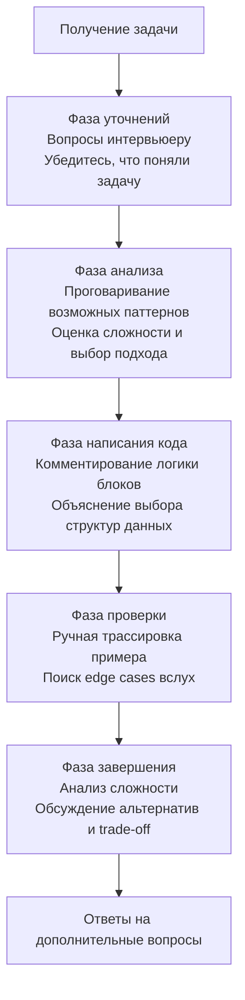

## Как объяснять решение вслух

Один из самых горьких отказов на алгоритмическом собеседовании — когда вы **решили задачу, но провалили коммуникацию**. Код написан, тесты пройдены, но интервьюер не понимал, о чём вы думали последние 20 минут, и решил, что работать с вами будет трудно. На позиции Senior/Lead коммуникация важнее чистого кода: вы будете защищать архитектурные решения, проводить code review, наставлять младших коллег. Алгоритмический раунд — первая проба этого навыка.

**Объяснение вслух — это не трансляция внутреннего монолога. Это осознанная техника, которой можно и нужно учиться.** В этой статье мы разберём, что, когда и как говорить, чтобы интервьюер оставался вовлечён, понимал вашу логику и видел в вас будущего коллегу.

### Почему молчание убивает результат

Интервьюер не читает ваши мысли. Если вы молча пишете код, он интерпретирует тишину одним из трёх способов:

1. **«Кандидат тупит, не понимает, что делать дальше.»**
2. **«Кандидат вспоминает заученное решение, не думая.»**
3. **«Кандидат не умеет артикулировать техническую мысль.»**

Любая из этих интерпретаций снижает ваш рейтинг. Даже если вы идеально знаете решение, молчание лишает вас шанса показать ход мышления, намекнуть на знание Go-специфики и вовремя получить подсказку, если вы пошли не туда.

> [!tip] Собеседование
> На реальном интервью в Stripe кандидату после успешного решения сказали: «Код правильный, но мы не поняли, почему вы выбрали именно эту структуру данных и как вы думали над edge cases. Расскажите сейчас?» Он ответил блестяще и получил оффер, но сам факт напоминания — сигнал, что нужно говорить сразу, а не ждать вопроса.

### Структура объяснения: когда и что говорить

Процесс решения задачи на интервью (см. [[5. Алгоритм решения задачи на интервью]]) состоит из фаз, и для каждой есть свой жанр речи. Невозможно и не нужно говорить непрерывно — в одни моменты вы рассуждаете, в другие комментируете код, в третьи резюмируете.

#### Фаза 1: Уточнения — заставьте интервьюера работать на вас

Получив условие, не молчите. Задайте минимум 3–4 вопроса. Это показывает, что вы не бросаетесь писать код, а анализируете задачу как инженер.

**Шаблоны фраз:**

- «Я вижу, что входные данные — массив целых чисел. Могут ли они быть отрицательными? Это повлияет на возможность применения скользящего окна.»
- «Вы говорите о подмассиве — он обязательно непрерывный? Или подпоследовательность? В Go при работе со слайсами мы естественно работаем с непрерывными, но хочу уточнить.»
- «Каков ожидаемый размер N? Это определит, можно ли использовать O(N²) решение или нужно O(N log N) и быстрее.»
- «Если ответа нет, какой возврат ожидается: -1, nil, пустой слайс? В Go nil и пустой слайс различаются в JSON, хочу быть точным.»

Обратите внимание: вопросы не просто «уточняют», они уже **показывают ваше понимание связи условий с алгоритмическими подходами и особенностями Go**. Это задаёт высокую планку с первой минуты.

#### Фаза 2: Анализ — покажите, как вы думаете

После уточнений наступает самый важный момент. Вы должны озвучить **гипотезу о решении** и проверить её с интервьюером.

**Алгоритм «Думай вслух»:**

1. **Перечислите признаки, которые вы заметили.** «Похоже на задачу о поиске максимального подмассива. Слово "непрерывный" указывает на скользящее окно или префиксные суммы. Но числа могут быть отрицательными, так что окно не подойдёт — префиксные суммы с хеш-картой.»
2. **Предложите наивное решение (опционально).** «Наивно можно перебрать все подмассивы за O(N²), но N до 10⁵, это слишком медленно.»
3. **Сформулируйте выбранный подход и структуры данных.** «Я использую хеш-карту для хранения префиксных сумм и их первых индексов. Это даст O(N) по времени и O(N) по памяти. В Go я возьму `map[int]int`, но если ключи ограничены по диапазону, можно массив, чтобы избежать pointer chasing.»
4. **Спросите подтверждение.** «Такой подход выглядит разумным? Или я упускаю более простой вариант?»

Этот монолог на 1–2 минуты решает три задачи: интервьюер видит системность, вы страхуетесь от неверного направления, вы выигрываете время на обдумывание.

> [!info] Go-нюанс
> Когда вы упоминаете `map[int]int`, вы можете добавить: «В Go каждая запись в map — это аллокация в куче, но при N=10⁵ это приемлемо. Если бы данные были потоковыми и миллиардными, я бы подумал о других структурах.» Это показывает механическую симпатию без premature optimization.

#### Фаза 3: Написание кода — комментируйте блоки, а не строки

Когда вы начинаете писать код, не надо комментировать каждую строку в стиле «Теперь я создаю переменную left и присваиваю ей ноль». Это раздражает. Вместо этого объясняйте **логические блоки** и **неочевидные моменты**.

**Что стоит проговаривать:**

- **Заголовок функции:** «Функция принимает слайс и цель, возвращает индексы. В Go принято возвращать nil, если пара не найдена.»
- **Ранние проверки:** «Проверяю, что длина не меньше двух, иначе сразу возвращаю nil. Это отсечёт крайние случаи и упростит основной цикл.»
- **Выбор структуры:** «Здесь я использую `make(map[int]int, len(nums))` — предварительное выделение вместимости снизит количество эвакуаций бакетов при заполнении мапы. В production-коде это стандартная практика.»
- **Ключевой цикл:** «Теперь идём правым указателем по слайсу, поддерживая левый указатель так, чтобы окно удовлетворяло инварианту. Инвариант: сумма в окне не превышает target.»
- **Неочевидная оптимизация:** «Вместо `fmt.Println` для отладки я бы использовал `log.Printf`, но здесь достаточно мысленной трассировки.»

**Антипример (как не надо):**
> «Так... Пишем `for`. `i` равно нулю. `i < len(arr)`. `i++`. Внутри берём `arr[i]`...»

Это не даёт интервьюеру никакой полезной информации и выдаёт неуверенность.

**Хороший пример:**
> «Теперь прохожу по всем элементам правым указателем. На каждом шаге расширяю сумму на `nums[right]`. Если сумма превысила target, запускаю внутренний цикл сдвига левого указателя, пока сумма снова не станет <= target. Это классический паттерн скользящего окна для неотрицательных чисел. В Go я использую `for` без индексации, потому что мне нужны значения.»

#### Фаза 4: Проверка — покажите, что вы умеете искать ошибки

Никогда не говорите «Готово» и не ждите вердикта интервьюера. Возьмите инициативу и протестируйте код на его глазах.

**Сценарий проверки вслух:**

1. **Возьмите простейший пример из условия.** «Давайте проверим на примере: массив `[2,7,11,15]`, target=9. `left`=0, `right`=3. Сумма 2+15=17 > 9, двигаю right. Сумма 2+11=13 > 9, двигаю right. Сумма 2+7=9 == target, возвращаю [1,2]. Работает.»
2. **Возьмите edge case.** «Теперь пустой массив: сработает проверка длины, вернётся nil. ОК.»
3. **Проверьте границы.** «Массив из одного элемента: len < 2, nil.»
4. **Если нашли баг, спокойно исправьте.** «Ага, я вижу, что здесь при сдвиге left я не обновил windowSum. Хорошо, что проверили. Добавляю `windowSum -= nums[left]` перед инкрементом.»

Это демонстрирует культуру тестирования, которая в Go возведена в абсолют (table-driven tests, `go test -race`). Вы можете упомянуть: «В реальном проекте я бы написал на этот случай table-driven тест с testify, но здесь достаточно ручной проверки.» Это сильный сигнал.

### Как говорить о Go-специфике, не скатываясь в лекцию

Ваша цель — не прочитать интервьюеру курс по рантайму Go, а показать, что вы понимаете, как ваш код будет выполняться. Пара коротких, но точных замечаний ценнее десятиминутного монолога.

**Триггеры для Go-комментариев:**

- **При создании слайса:** «Выделяю `make([]int, 0, expectedSize)`, чтобы избежать лишних аллокаций при `append`. Компилятор Go может перенести массив в кучу через escape analysis, но предварительное выделение минимизирует перекопирование.»
- **При выборе между map и массивом:** «Алфавит всего 26 символов, так что я беру `[26]int` вместо `map[byte]int`. Это стековая аллокация, никаких указателей, никакой нагрузки на GC, и сравнение двух массивов через `==` мгновенное.»
- **При работе со строками:** «Я использую индексацию по байтам, потому что задача гарантирует ASCII. Если бы был Unicode, пришлось бы конвертировать в `[]rune`, что создаст аллокацию, или использовать `range`.»
- **При рекурсии:** «Рекурсивный DFS удобен для деревьев. Стек горутины в Go стартует с 2 КБ и растёт динамически, так что глубокая рекурсия в разумных пределах безопасна. Но для графа с миллионом узлов я бы переписал на итеративный DFS со стеком на слайсе.»
- **При использовании кучи:** «`container/heap` — не дженерик, нужно реализовать интерфейс. Я сделаю тип `MaxHeap []int` с методами `Less`, `Swap`, `Push`, `Pop`. Это стандартный подход, хотя и чуть многословный.»

### Как тянуть время правильно: заполнение пауз

Иногда вы зависаете, обдумывая следующий шаг. Пауза в 5 секунд — нормально. Пауза в 30 секунд в тишине — плохо. Заполняйте её «техническим шумом», который поддерживает ощущение прогресса.

**Разрешённые приёмы:**

- **Резюмирование:** «Итак, где мы находимся. Мы прошли три четверти массива, нашли два валидных подмассива, сейчас ищем третий.»
- **Переформулирование:** «Наша цель — найти минимальную длину. Это значит, что когда окно удовлетворяет условию, мы пытаемся его сжать.»
- **Проговаривание проверки:** «Проверю-ка я ещё раз, не выхожу ли я за границы слайса в этом условии. `right+1` здесь всегда корректен, потому что цикл ограничен `len(s)-1`.»
- **Честное мини-признание:** «Дайте секунду, я проверю, не нарушится ли инвариант при одновременном сдвиге обоих указателей.» — Это показывает, что вы осознанно ищете потенциальный баг.

**Запрещённые приёмы:**

- Молчание с каменным лицом.
- Паническое бормотание и стирание кода.
- Фразы вроде «Блин, я забыл, как это решается» — это сигнал заученности, а не мышления.

### Взаимодействие с интервьюером: как получать подсказки, не теряя баллы

Интервьюер — не экзаменатор, а ваш временный коллега. Если вы зашли в тупик, правильно попросите подсказку.

**Плохо:**
> «Я не знаю, что делать. Помогите.»

**Хорошо:**
> «Я вижу, что здесь есть перекрывающиеся подзадачи, но не могу точно сформулировать состояние для DP. Я пробовал одномерный dp[i], но кажется, что нужно ещё измерение для учёта предыдущего выбора. Вы можете подтвердить, что я в правильном направлении?»

Это показывает, что вы уже проделали работу, сформулировали гипотезу и ищете подтверждение, а не готовый ответ.

**Ещё лучше — показать trade-off:**
> «Я могу решить эту часть через map с двойным вложением, но чувствую, что есть способ за линию. Я ищу монотонное свойство, которое позволило бы применить стек или два указателя. Есть ли в условии неявная монотонность, которую я упустил?»

### Типичные ошибки в объяснении и как их избежать

1. **Слишком тихо и неуверенно.** Вас плохо слышно, интервьюер переспрашивает, вы теряетесь. Решение: записывайте себя на диктофон в процессе подготовки — вы услышите проблему и исправите.
2. **Избыток технического жаргона без пояснений.** «Здесь я использую sentinel value в fenwick tree для range sum query.» Если интервьюер не знаком с конкретным термином, он потеряет нить. Лучше: «Я построю дерево Фенвика — структуру, которая позволяет за O(log N) обновлять элементы и запрашивать сумму на префиксе.»
3. **Прыжки мыслей.** Вы начали объяснять скользящее окно, потом перескочили на деталь реализации map, потом вернулись к окну. Интервьюер сбит с толку. Держитесь линейной структуры: идея → структуры данных → алгоритм → проход по примеру.
4. **Оправдания.** «Этот код, наверное, не очень идиоматичный...» или «Извините, я волнуюсь...». Не извиняйтесь за код, который ещё не написан. Просто напишите хороший код.
5. **Игнорирование сигналов интервьюера.** Если интервьюер говорит: «А вы уверены, что это сработает для отрицательных чисел?» — это не просто вопрос, это скорее всего подсказка, что ваше решение неверно. Остановитесь и перепроверьте.
6. **Объяснение на чистом «лееткодовском» языке.** «Делаем sliding window, два указателя l и r, while r < n...» — это звучит бездумно. Добавьте инженерного контекста: «Мы поддерживаем окно с левым и правым указателями. Инвариант — сумма внутри окна не превышает target. Правый расширяет, левый сжимает.»

### Практические упражнения для наработки навыка

Навык «думать вслух» не появляется за день. Его нужно тренировать осознанно, желательно с товарищем или с диктофоном.

1. **Сольная тренировка с диктофоном.** Возьмите задачу уровня Medium, решите её с нуля и запишите весь процесс на аудио/видео. Затем прослушайте. Отметьте: где были длинные паузы? Где вы перескакивали? Где был «словесный мусор»? Повторите ту же задачу через день, стараясь убрать недочёты.
2. **Парная тренировка (mock interview).** Один человек — интервьюер, второй — кандидат. Интервьюер должен давать минимум подсказок, но следить за качеством объяснения. После 25 минут — разбор: что было понятно, что нет, в какие моменты хотелось перебить.
3. **«Перевод» LeetCode-решений на человеческий язык.** Возьмите готовый код с платформы и попробуйте объяснить его вслух, как если бы вы сами его написали. Это тренирует навык даже на знакомых задачах.
4. **Проговаривание Go-специфики.** Составьте список из 10 Go-особенностей (escape analysis, рост слайса, map vs array, nil vs empty slice, defer, горутины и каналы в неконкурентных задачах) и тренируйтесь вставлять уместные замечания в объяснения разных задач.

### Заключение

Объяснение вслух — это такой же навык, как написание кода. Он требует тренировки, структуры и осознанности. Освоив его, вы перестаёте быть «человеком, который молча решает задачки», и становитесь «инженером, который ведёт диалог о решении сложной проблемы». Именно такого человека хотят видеть на позиции Senior/Lead.

В следующей статье мы разберём антипод правильного поведения — типичные ошибки кандидатов, от неверного распределения времени до незнания собственных слабых мест в Go, и как их избежать. [[7. Типичные ошибки кандидатов]]