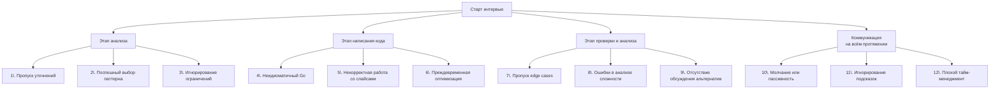

## Типичные ошибки кандидатов

В предыдущей статье [[6. Как объяснять решение вслух]] мы разобрали, как правильно выстраивать коммуникацию на собеседовании. Но даже блестящее умение говорить не спасёт, если вы систематически допускаете ошибки, которые интервьюеры распознают мгновенно и трактуют как красные флаги. За годы проведения собеседований и подготовки кандидатов я выделил устойчивые паттерны провалов — от банального незнания Go-идиом до глубинного непонимания работы рантайма. В этой статье мы препарируем их все.

Ошибки сгруппированы по этапам интервью, от получения задачи до финального анализа. Для каждой ошибки я покажу, как она выглядит со стороны интервьюера, почему она опасна для кандидата уровня Senior/Lead и как её избежать, используя знания Go «под капотом» и правильные инженерные привычки.



### Ошибки этапа анализа: фундамент рушится до написания кода

#### 1. Пропуск уточнений — «Я всё понял, пишу»

Кандидат слышит условие, видит знакомые слова и через 10 секунд уже объявляет решение. Чаще всего он решает не ту задачу, которую задумал интервьюер.

**Пример.** Задача: «Найти подмассив с максимальной суммой». Кандидат заявляет: «Это скользящее окно», — и пишет код для неотрицательных чисел. Но в условии не сказано, что числа неотрицательные, и классический Kadane (DP) оказывается правильным решением. Пять минут потеряно.

**Почему это фатально для Senior:** Senior обязан выявить неоднозначности на старте. Это проекция реальной работы: вы получаете размытое требование от продакт-менеджера и должны задать 10 вопросов, прежде чем писать архитектурный документ.

**Как избежать:** Используйте чек-лист из статьи [[5. Алгоритм решения задачи на интервью]]. Обязательно спросите про отрицательные числа, пустой ввод, дубликаты, Unicode. В Go-контексте уточните: «Я должен вернуть nil-слайс или пустой слайс?» — это покажет знание различий между `nil` и `[]int{}`.

#### 2. Поспешный выбор паттерна без перекрёстной проверки

Увидев ключевое слово, кандидат фиксируется на одном паттерне и пытается «натянуть» задачу на него. Это следствие нарешивания по тегам: в LeetCode вы уже знаете, что задача про BFS, и просто воспроизводите код. На собеседовании тега нет.

**Пример.** Задача: «Даны интервалы, нужно найти минимальное количество стрел, чтобы поразить все интервалы». Похоже на стандартную задачу с интервалами — сортировка + жадный. Кандидат начинает кодить сортировку по началу интервала. Но правильный подход — сортировка по концу и подсчёт пересечений. Ошибка выявляется через 15 минут.

**Как избежать:** Примените метод из статьи [[4. Как распознавать паттерн в задаче]]: соберите 3–4 сигнала, а не один. Озвучьте гипотезу интервьюеру до написания кода: «Похоже на интервальную задачу с жадным выбором. Я планирую отсортировать по концу и идти одним проходом. Это корректно?»

#### 3. Игнорирование ограничений на размер и память

Кандидат пишет O(N²) решение с матрицей `dp[N][N]`, когда N=10⁵. В памяти такое не поместится, по времени не пройдёт. Или использует рекурсивный DFS на графе с глубиной 10⁶ — в Go стек горутины может вырасти до 1 ГБ, но это не повод так делать: рантайм будет расширять стек много раз, производительность упадёт.

**Почему это важно:** Архитектор, не умеющий оценивать вычислительную сложность и память, не спроектирует высоконагруженный сервис. На собеседовании ограничения — ваш главный фильтр выбора алгоритма.

**Как избежать:** На начальном этапе всегда спрашивайте «Какие ограничения по N?». Если интервьюер не назвал, предложите свои оценки: «Для N до 10⁵ я выберу линейный алгоритм». И уже после этого выбирайте паттерн.

### Ошибки этапа написания кода: Go-специфика

#### 4. Неидиоматичный Go: код будто переведён с Java или Python

Эта ошибка — верный способ показать, что вы не «настоящий» Go-разработчик. Интервьюеры, которые сами пишут на Go, считывают неидиоматичность мгновенно.

**Симптомы:**
- Имена переменных `i`, `j`, `tmp`, `res` вместо осмысленных `left`, `right`, `windowSum`.
- Циклы `for i := 0; i < len(arr); i++` вместо `for i, v := range arr`.
- Игнорирование `if err != nil` (например, при вызове `strconv.Atoi`).
- Использование `panic` для потока управления.

**Пример неидиоматичного кода:**
```go
func f(s string, p string) []int {
    res := []int{}
    m1 := make(map[byte]int)
    for i := 0; i < len(p); i++ {
        m1[p[i]]++
    }
    // ...
}
```

**Идиоматичный вариант:**
```go
func findAnagramIndices(s string, p string) []int {
    if len(s) < len(p) {
        return nil
    }
    var result []int
    target := make(map[byte]int, len(p))
    for i := range p {
        target[p[i]]++
    }
    // ...
}
```

Разница: осмысленное имя функции, nil вместо пустого слайса при досрочном выходе, предварительное выделение вместимости map, использование `range`.

> [!warning] Ловушка / Gotcha
> `var result []int` создаёт nil-слайс. `result := []int{}` создаёт пустой нениловый слайс. В контексте JSON они сериализуются по-разному: `nil` → `null`, `[]int{}` → `[]`. На собеседовании уточните, что ожидается. Явный выбор демонстрирует понимание.

#### 5. Некорректная работа со слайсами: утечки, копии, границы

Слайс в Go — это заголовок `SliceHeader{Data unsafe.Pointer, Len int, Cap int}`. Кандидаты часто забывают, что присваивание слайса копирует заголовок, но не данные. Это приводит к ошибкам, которые Senior должен предвидеть.

**Ошибка 5а: Срез от большого массива удерживает память.**
```go
func firstNBytes(data []byte, n int) []byte {
    return data[:n] // data продолжает висеть в памяти
}
```
На собеседовании вас могут спросить: «Что с GC?» Правильный ответ: нижележащий массив не будет собран, пока возвращённый слайс жив. Исправление — явное копирование:
```go
func firstNBytes(data []byte, n int) []byte {
    result := make([]byte, n)
    copy(result, data[:n])
    return result
}
```

**Ошибка 5б: Изменение элементов подслайса меняет исходный.**
```go
sub := original[2:5]
sub[0] = 999 // original[2] теперь тоже 999
```
Это допустимо, если так задумано, но часто кандидаты не осознают эффекта. Senior должен явно сказать: «Мы работаем с тем же нижележащим массивом, это позволяет избежать копирования, но нужно быть осторожным с модификациями.»

**Ошибка 5в: Выход за границы из-за путаницы с len/cap.**
```go
s := make([]int, 0, 5)
s[0] = 1 // panic: index out of range, len=0, cap=5
```
Senior сразу скажет: «Я выделил слайс с длиной 0 и вместимостью 5, поэтому для добавления нужно использовать `append`, а не прямое присваивание.»

#### 6. Преждевременная оптимизация в ущерб читаемости

Кандидат решает задачу на Medium и начинает писать unsafe-трюки, пулы объектов и ручное управление памятью. Код становится неподдерживаемым, а выигрыш в производительности на N=1000 не имеет значения.

**Пример:** замена `strings.Builder` на ручной слайс байтов с побитовыми сдвигами для задачи «конвертировать число в римские цифры». Проблема: интервьюер хочет увидеть читаемую логику, а не микрооптимизацию.

**Правило:** Сначала напишите чистый идиоматичный код с корректной сложностью. Только если интервьюер явно просит оптимизировать, углубляйтесь. И даже тогда сначала предложите алгоритмическую оптимизацию, а не микрохаки.

### Ошибки этапа проверки и анализа: когда код уже написан

#### 7. Пропуск edge cases — «Мой код работает для happy path»

Кандидат дописывает код, тестирует на одном примере из условия и говорит: «Готово». Но интервьюер видит, что код не обрабатывает пустой ввод, nil-указатель, граничные значения индексов или переполнение int.

**Стандартные edge cases, обязательные к проверке:**
- Пустой слайс / map / строка.
- Nil-указатель на дерево/граф.
- Отрицательные числа, если не оговорено.
- Максимальные значения (близкие к `math.MaxInt`), провоцирующие переполнение при суммировании.
- Дубликаты всех видов.
- Строки Unicode с много-байтовыми рунами.

> [!tip] Собеседование
> В Go `int` имеет разный размер на 32- и 64-битных платформах. Если задача подразумевает возможное переполнение, упомяните: «В production-коде я бы использовал `int64` для гарантированного диапазона или библиотеку `math/big`. Здесь, учитывая ограничения N ≤ 10⁴, переполнение маловероятно, но давайте проверим.» Это Senior-подход.

#### 8. Ошибки в анализе сложности: забытые константы и скрытые затраты

Кандидат говорит: «Моё решение O(N)». Но внутри цикла он делает `append` в слайс без предварительного выделения capacity, что вызывает многократные аллокации и копирования — фактически O(N²) скрытых операций. Или говорит «O(N log N) из-за сортировки», но забывает, что доступ к map внутри цикла — это O(1) в среднем, но с хешированием и возможными эвакуациями, которые дают непредсказуемые всплески.

**Правильный анализ включает:**
- Временную сложность (Big O) с пояснением, откуда она берётся.
- Пространственную сложность с учётом структур: «map[int]int — каждый элемент это аллокация в бакете hmap, что добавляет overhead. Но в Big O мы говорим O(N).»
- Константные факторы: «Хотя O(N), внутри цикла три обращения к map — это около 30 наносекунд каждое на текущем железе. Для 10⁶ элементов это ~30 мс, вполне приемлемо.»

Явное упоминание внутреннего устройства map (`hmap`, бакеты, эвакуация) отделяет Senior от Middle.

#### 9. Отсутствие обсуждения альтернатив — «Решение только одно»

Кандидат решил задачу и остановился. Интервьюер ждёт, что он скажет: «Я использовал хеш-карту за O(N) по времени и O(N) по памяти. Если бы память была критична, можно было бы отсортировать слайс за O(N log N) и пройтись двумя указателями, сократив память до O(1).» Это демонстрирует широту мышления и готовность к trade-off, обязательную для Lead-инженера.

### Ошибки коммуникации и поведения

#### 10. Молчание или пассивная позиция

Подробно эта тема раскрыта в [[6. Как объяснять решение вслух]], но повторим: молчащий кандидат — провальный кандидат. Даже если вы пишете идеальный код, интервьюер не знает, как вы к нему пришли. Это вызывает сомнения в вашей способности проводить code review и архитектурные обсуждения.

#### 11. Игнорирование подсказок интервьюера

Интервьюер говорит: «Вы уверены, что это работает для случая с отрицательными числами?» — это не вопрос для проверки, а явная подсказка. Кандидат отвечает: «Да, конечно», — и продолжает писать неверное решение. Результат — отказ. Senior должен уметь слушать и интегрировать обратную связь мгновенно.

**Правильная реакция:** «Хороший вопрос. Давайте проверим. Если число отрицательное, то моё условие скользящего окна нарушится, потому что расширение окна может уменьшить сумму. Значит, текущий подход неверен. Спасибо, что указали. Мне нужно пересмотреть алгоритм — вероятно, здесь нужны префиксные суммы.»

#### 12. Плохой тайм-менеджмент

Кандидат тратит 30 минут на первую задачу, не оставляя времени на вторую. Или 20 минут висит в раздумьях без попытки заговорить. Или пишет идеальный код 40 минут, а потом не успевает проанализировать сложность.

**Как избежать:** Мысленно держите тайминг из статьи [[5. Алгоритм решения задачи на интервью]]: 5-7 минут анализ, 15-20 кодирование, 10-15 проверка и обсуждение. Если застряли на 10 минут без прогресса — скажите: «Я вижу, что топчусь. Можно я попробую другой подход?» Это спасёт время.

### Ошибки, связанные с зубрёжкой и отсутствием глубины

#### 13. Воспроизведение решения без понимания

Кандидат бодро пишет Union-Find с path compression и rank heuristic, но на вопрос «Почему ранк, а не размер?» или «Как эта структура ведёт себя при конкурентном доступе?» зависает. Вывод интервьюера: заучено, не осмыслено.

**Как избежать:** В нашем разделе мы разбираем не просто код, а устройство и обоснование каждого паттерна. Используйте статьи из кластеров ([[1. Теория. Массивы и строки]], [[1. Теория. Графы]]) для понимания, а не для заучивания.

#### 14. Использование структур данных из других языков «в лоб»

Кандидат, пришедший с Java, пытается написать `PriorityQueue<T>` через дженерики или городит иерархию интерфейсов. Или пишет итератор, как в C++. Это не нужно. В Go есть `container/heap` с интерфейсом. Куча объёмом 15 строк — идиоматична и понятна.

#### 15. Незнание стандартной библиотеки

Изобретение собственной сортировки, вместо `sort.Slice`, написание своего бинарного поиска вместо `sort.Search`, ручная реализация Min стек без использования двойного стека на слайсах. Интервьюер делает вывод: кандидат не знает стандартную библиотеку Go.

> [!info] Под капотом
> Когда вы пишете в задаче «Найти в отсортированном слайсе» свой бинарный поиск, вы должны понимать, что `sort.Search` в Go использует точно такой же бинарный поиск, но оптимизирован компилятором. Однако на собеседовании в DSA-раунде часто ожидают, что вы напишете бинарный поиск руками, показав понимание границ и mid. Поэтому знайте оба варианта и уточните: «Я напишу бинарный поиск вручную, чтобы показать логику, но в production я бы использовал `sort.Search`.» Это компромисс.

### Пример комплексной ошибки: разбор сцены

Кандидат получает задачу «Проверить, является ли строка палиндромом, игнорируя не-буквенные символы». Он пишет:

```go
func isPalindrome(s string) bool {
    s = strings.ToLower(s)
    i, j := 0, len(s)-1
    for i < j {
        if !isLetter(s[i]) {
            i++
            continue
        }
        if !isLetter(s[j]) {
            j--
            continue
        }
        if s[i] != s[j] {
            return false
        }
        i++
        j--
    }
    return true
}
```

Какие ошибки видит Senior-интервьюер?

1. **Создание новой строки**: `strings.ToLower` аллоцирует новую строку в куче. Если строка большая и почти палиндром, это лишняя работа. Можно обрабатывать на лету, приводя каждый символ к нижнему регистру без аллокации.
2. **Байтовая индексация**: `s[i]` — это байт, а не символ. Если в строке есть Unicode, логика сломается. Нужно явно заявить: «Поскольку задача предполагает ASCII, я работаю с байтами».
3. **Отсутствие обработки nil/пустой строки** (пустая строка считается палиндромом — работает, но не оговорено).
4. **Неидиоматичные имена `i`, `j`** — лучше `left`, `right`.
5. **Не выделен вспомогательный метод `isLetter`** надлежащим образом (может быть, стоит использовать `unicode.IsLetter`).
6. **Молчание** при написании — интервьюер не услышал, почему выбран такой подход.

Идиоматичный Go-ответ:

```go
func isPalindrome(s string) bool {
    runes := []rune(s) // осознанная аллокация для Unicode
    left, right := 0, len(runes)-1
    for left < right {
        l, r := unicode.ToLower(runes[left]), unicode.ToLower(runes[right])
        if !unicode.IsLetter(l) && !unicode.IsDigit(l) {
            left++
            continue
        }
        if !unicode.IsLetter(r) && !unicode.IsDigit(r) {
            right--
            continue
        }
        if l != r {
            return false
        }
        left++
        right--
    }
    return true
}
```

И обязательно устное сопровождение: «Я конвертирую строку в срез рун, потому что `s[i]` — это байт, а для Unicode нужно оперировать кодовыми точками. Это даёт O(N) дополнительной памяти. Если бы память была критична, я бы использовал `for _, r := range s` с построением двух указателей через индексы, но это сложнее. Для собеседования я выбрал читаемость.»

### Заключение

Типичные ошибки на алгоритмическом собеседовании — это не случайные оплошности, а системные пробелы в подготовке: незнание Go-идиом, пренебрежение механической симпатией, слабая коммуникация и отсутствие алгоритмической дисциплины. Каждая из них — красный флаг для позиции Senior/Lead, где ожидается умение писать production-код, обсуждать trade-off и наставлять коллег.

Осознав эти ошибки, вы уже делаете первый шаг к их устранению. Вторая часть — методичная тренировка каждого аспекта: от работы со слайсами до объяснения сложности. Следующая статья откроет цикл погружения в саму природу алгоритмических паттернов — мы разберём, что такое алгоритмический паттерн на фундаментальном уровне и как они устроены. [[8. Что такое алгоритмический паттерн]]