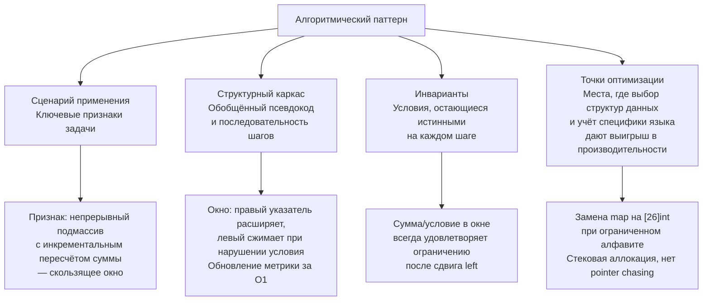

## Что такое алгоритмический паттерн

В предыдущих статьях мы неоднократно употребляли термин «алгоритмический паттерн» как нечто само собой разумеющееся. Говорили, что паттерны важнее заученных решений ([[3. Паттерны вместо запоминания решений]]), что их нужно уметь распознавать ([[4. Как распознавать паттерн в задаче]]) и что они — основа успешного интервью. Но мы ещё не дали строгого определения. Что именно мы называем алгоритмическим паттерном? Чем он отличается от просто «алгоритма»? Как он связан с паттернами проектирования, которые вам отлично знакомы по PHP, Java или C#? И почему Senior Go-разработчик должен мыслить именно паттернами, а не коллекционировать решения?

В этой статье мы заложим фундамент: дадим формальное определение, разберём анатомию алгоритмического паттерна, покажем его место в инженерном мышлении и — что критически важно — проследим, как один и тот же паттерн материализуется в идиоматичном Go-коде, взаимодействуя с рантаймом, памятью и сборщиком мусора.

### Определение: не алгоритм, а каркас

**Алгоритмический паттерн** — это повторно используемый способ организации вычислений, задающий общую структуру решения для класса задач, объединённых общими математическими или структурными свойствами, но не фиксирующий конкретные операции над данными.

Ключевое слово здесь — «каркас». Алгоритм — это жёсткая последовательность шагов. Паттерн — это скелет, на который вы наращиваете мышцы и кожу конкретной задачи.

Рассмотрим различие на примере.

**Алгоритм** «бинарный поиск в отсортированном массиве»:
```
функция binarySearch(arr, target):
    low = 0, high = len(arr) - 1
    пока low <= high:
        mid = (low + high) / 2
        если arr[mid] == target: вернуть mid
        иначе если arr[mid] < target: low = mid + 1
        иначе: high = mid - 1
    вернуть -1
```
Это жёсткий рецепт, привязанный к конкретной структуре данных.

**Алгоритмический паттерн** «Бинарный поиск по ответу»:
```
Мы ищем минимальное X, такое что predicate(X) = true.
Если predicate монотонен (ложь -> истина при росте X), то:
1. Задаём начальный диапазон [low, high].
2. Пока low < high:
     mid = low + (high - low) / 2
     если predicate(mid) истинно: high = mid
     иначе: low = mid + 1
3. Ответ — low.
```
Этот каркас решает не одну задачу, а десятки: Koko Eating Bananas, Capacity To Ship Packages, Split Array Largest Sum, и даже задачи, не связанные с массивами напрямую, но обладающие свойством монотонности.

Таким образом, алгоритмический паттерн обобщает алгоритм до уровня **мета-алгоритма**.

> [!info] Параллель с паттернами проектирования
> Когда вы, работая с Java или C#, реализуете «Стратегию» (Strategy), вы не копируете один и тот же код во все проекты. Вы применяете каркас: интерфейс стратегии, контекст, делегирование. В разных задачах стратегия будет разной, но структура взаимодействия одна. Алгоритмический паттерн — это то же самое, только для вычислительных задач.

### Анатомия алгоритмического паттерна

Каждый полноценный алгоритмический паттерн можно разложить на четыре составляющие. Не все они явно выражены в каждом паттерне, но Senior-разработчик, применяя паттерн, держит их в уме.



#### Сценарий применения

Это набор ключевых признаков задачи, по которым мы опознаём паттерн. Подробно техника распознавания изложена в [[4. Как распознавать паттерн в задаче]]. Здесь зафиксируем: сценарий — это не жёсткое условие «если A, то B», а скорее «если задача пахнет A и B, вероятно, это C».

Для скользящего окна сценарий: «Ищем непрерывный подмассив/подстроку, условие позволяет инкрементально пересчитывать метрику при сдвиге границы (обычно требует монотонности или свойства, что расширение не нарушает условие)».

#### Структурный каркас

Это обобщённый псевдокод, который можно воспроизвести на любом языке. Например, каркас BFS:

```
очередь = [стартовый узел]
посещённые = set(стартовый узел)
пока очередь не пуста:
    уровень = длина очереди
    повторить уровень раз:
        узел = очередь.pop_front()
        для каждого соседа узла:
            если сосед не в посещённых:
                добавить в посещённые
                очередь.push_back(сосед)
```

Этот каркас не говорит, как именно реализовать очередь и множество. В Go очередь — это слайс с индексами или `container/list`, множество — `map[T]struct{}` или `map[T]bool`. Именно здесь начинается Go-специфика.

#### Инварианты

Инвариант — условие, которое остаётся истинным до и после каждой итерации основного цикла. Понимание инварианта критически важно, потому что потеря инварианта означает баг.

В скользящем окне инвариант: «Окно [left, right) всегда содержит элементы, сумма которых меньше целевой, либо окно минимально для текущего right». Этот инвариант позволяет вам рассуждать о корректности алгоритма.

На собеседовании умение сформулировать инвариант — один из сильнейших сигналов уровня Senior. Это показывает, что вы не просто написали код, а можете доказать его правильность.

#### Точки оптимизации и механическая симпатия

Любой паттерн имеет «горячие точки» — места, где выбор конкретной структуры данных особенно сильно влияет на константу времени выполнения и на работу GC. Осознание этих точек — водораздел между Middle и Senior.

Для паттерна «Два указателя» на отсортированном массиве — это сам массив. Если он лежит непрерывно в памяти (слайс), итерация по нему дружественна кэшу. Если бы это был связный список (из C++ `std::list`), каждый шаг указателя вызывал бы cache miss.

Для паттерна «Куча / Top K» — структура кучи. В Go `container/heap` работает поверх слайса, что означает непрерывность памяти и хорошую локальность данных, в отличие от наивной реализации на указателях.

### Отличие от паттернов проектирования и архитектурных паттернов

Многие разработчики, приходящие в алгоритмику из enterprise-разработки, пытаются найти здесь те же самые «паттерны GoF». Это ошибка категоризации. Нужно чётко различать три слоя абстракции:

| Тип паттерна | Область действия | Примеры |
|---|---|---|
| **Алгоритмические паттерны** | Вычислительная задача, одна функция, цикл | Скользящее окно, DP, BFS, два указателя |
| **Паттерны проектирования** | Организация кода, модули, классы/структуры | Strategy, Observer, Factory, Singleton |
| **Архитектурные паттерны** | Организация системы, сервисы, базы данных | Microservices, Event Sourcing, CQRS |

Алгоритмический паттерн живёт внутри одной функции и отвечает на вопрос **«как вычислить»**. Паттерн проектирования отвечает на вопрос **«как организовать»**. Архитектурный — **«как разложить на компоненты»**.

В Go это разделение особенно заметно, потому что язык минималистичен и не поощряет фреймворки, навязывающие организацию кода. Алгоритмический паттерн в Go — это просто функция или блок кода с определённой структурой. Никаких абстрактных классов, никакого наследования шаблонного метода — только композиция и идиоматичный код.

### Классификация алгоритмических паттернов

Для навигации в пространстве паттернов полезно иметь их иерархию. Она не строгая, но помогает структурировать знания.

**По парадигме вычислений:**

- **Полный перебор (Exhaustive Search):** Backtracking, генерация всех подмножеств, перестановок.
- **Декомпозиция на подзадачи:** Divide and Conquer, Dynamic Programming.
- **Жадные (Greedy):** Интервальные задачи, Huffman coding, задача о рюкзаке с делимыми предметами.
- **Обход пространства состояний:** BFS, DFS, A*.
- **Поддержание инварианта при перемещении границ:** Скользящее окно, два указателя.
- **Монотонные структуры:** Монотонный стек, монотонная очередь.
- **Структуры для динамического упорядочивания:** Кучи (Top K), сбалансированные деревья (в Go обычно эмулируются через слайс + бинарный поиск).
- **Префиксные и накопительные суммы:** Префиксные суммы, разностные массивы, Fenwick Tree.

**По отношению к данным:**

- **Паттерны на массивах и строках:** Скользящее окно, два указателя, префиксные суммы.
- **Паттерны на графах:** BFS, DFS, Union Find, Topological Sort, Dijkstra.
- **Паттерны на интервалах:** Merge Intervals, Meeting Rooms, Interval Scheduling.
- **Паттерны на деревьях:** обходы дерева, DP на деревьях.

Эта классификация не жёсткая. Одна и та же задача «Number of Islands» может решаться и DFS (обход пространства), и Union Find (объединение компонент). Senior видит оба варианта и выбирает, исходя из дополнительных требований (например, матрица динамическая? нужно ли отвечать на множество запросов после модификаций?).

### Как паттерны формируются и почему они работают

Алгоритмический паттерн — не выдумка авторов курсов. Он возникает естественно, когда множество конкретных задач демонстрируют общую структурную основу.

Процесс примерно таков:

1. **Есть класс задач с общей структурой.** Например, задачи «найти подмассив с суммой ≤ K», «длина самого длинного подмассива с суммой ≤ K», «минимальная длина подмассива с суммой ≥ K». Все они про непрерывные подмассивы и монотонное условие.
2. **Обнаруживается общий способ решения.** Все они решаются поддержанием двух указателей и пересчётом суммы при их движении.
3. **Формулируется инвариант, гарантирующий корректность.** Правый указатель добавляет элементы, левый удаляет, и после каждого сдвига левого условие восстанавливается.
4. **Выделяются вариации.** Если условие не монотонно (отрицательные числа), паттерн модифицируется: вместо скользящего окна используются префиксные суммы с хеш-картой. Так рождается родственный паттерн.
5. **Фиксируются оптимальные структуры данных под язык.** В Go — слайсы, массивы, map — с учётом аллокаций и GC.

Паттерн работает не потому, что ему следуют, а потому что его структура **доказуемо сохраняет инвариант**, ведущий к решению. Senior-разработчик, в отличие от Junior, не просто применяет паттерн, а **понимает доказательство его корректности** и может объяснить его, если интервьюер попросит.

### Алгоритмические паттерны и Go: зачем нужна механическая симпатия

Вы можете реализовать любой паттерн на любом языке. Но от того, **как именно** вы его реализуете, зависит, будет ли ваш код работать миллисекунды или секунды, сжирать мегабайты или гигабайты, забивать GC или оставаться лёгким.

Рассмотрим паттерн «Скользящее окно для строки».

**Абстрактный каркас:**
```
окно = пустое
для каждого символа c в строке:
    добавить c в окно
    пока окно нарушает условие:
        убрать самый левый символ из окна
    обновить ответ
```

**Реализация на Go с `map[byte]int`:**
```go
func lengthOfLongestSubstring(s string) int {
    window := make(map[byte]int)
    left, maxLen := 0, 0
    for right := 0; right < len(s); right++ {
        if prev, ok := window[s[right]]; ok && prev >= left {
            left = prev + 1
        }
        window[s[right]] = right
        if curLen := right - left + 1; curLen > maxLen {
            maxLen = curLen
        }
    }
    return maxLen
}
```
Каждое обращение к `map` — это:
- вычисление хеша байта,
- поиск бакета в `runtime.hmap`,
- пробег по цепи (при коллизиях),
- потенциальная эвакуация бакета при росте map (в середине цикла!).

Это сотни наносекунд на операцию, которые не видны в O-нотации.

**Та же задача, но с `[128]int` (ASCII):**
```go
func lengthOfLongestSubstringAscii(s string) int {
    var lastPos [128]int
    for i := range lastPos {
        lastPos[i] = -1
    }
    left, maxLen := 0, 0
    for right := 0; right < len(s); right++ {
        if prev := lastPos[s[right]]; prev >= left {
            left = prev + 1
        }
        lastPos[s[right]] = right
        if curLen := right - left + 1; curLen > maxLen {
            maxLen = curLen
        }
    }
    return maxLen
}
```
Здесь:
- Массив `[128]int` размещается на стеке (escape analysis видит, что он не покидает функцию).
- Доступ по индексу — прямая адресация в памяти, без хеширования и цепочек.
- Нет нагрузки на GC.

Обе реализации — это один и тот же паттерн «Скользящее окно». Но вторая, благодаря механической симпатии, может быть в 5–10 раз быстрее на реальных данных и не даёт всплесков GC. Именно это обсуждают на собеседованиях Senior-уровня.

> [!warning] Ловушка / Gotcha
> Не увлекайтесь заменой map на массив бездумно. Если алфавит не ограничен (Unicode), массив не подойдёт. И если интервьюер спросит: «Почему вы выбрали `[128]int`, а не map?», ответ должен быть: «Потому что задача гарантирует ASCII, что позволяет использовать прямую адресацию, избегая хеширования и эвакуаций map. Это улучшает константу, но не меняет асимптотику.» Если вы не можете обосновать — не делайте.

### Пример детального разбора: паттерн «Два указателя»

Разберём ещё один паттерн целиком, чтобы закрепить анатомию.

**Название:** Два указателя (Two Pointers).

**Сценарий применения:** Отсортированный массив или связный список. Нужно найти пару или обработать элементы с двух концов, двигаясь навстречу друг другу (или в одном направлении с разной скоростью).

**Структурный каркас (для пары с суммой target):**
```
левый = 0, правый = len(arr) - 1
пока левый < правый:
    сумма = arr[левый] + arr[правый]
    если сумма == target: вернуть (левый, правый)
    если сумма < target: левый++
    иначе: правый--
```

**Инвариант:** Для текущих `left` и `right` все элементы левее `left` уже рассмотрены как потенциальные левые члены пары, а все элементы правее `right` — как потенциальные правые, и пары не найдено.

**Точки оптимизации в Go:**
- Слайс должен быть отсортирован. `sort.Ints(s)` работает in-place, без аллокаций.
- Если нужен исходный порядок, задача модифицируется (Two Sum II — индексы 1-базированные). Можно хранить пары `(индекс, значение)` и сортировать слайс структур. Это добавляет аллокации, но сохраняет O(N log N).
- Для связных списков (Linked List Cycle) два указателя движутся с разной скоростью. Идиоматичный Go: метод на структуре, возврат `*Node`, проверка на nil.

**Почему это паттерн, а не алгоритм:**
Потому что идея «два указателя» применима к десятку разных задач, требующих разных структур и разного кода:
- Поиск пары в отсортированном массиве.
- Проверка на палиндром.
- Сортировка цветов (Dutch national flag).
- Удаление дубликатов из отсортированного массива.
- Слияние двух отсортированных массивов in-place.

Все они разные, но ядро мышления одно: «мы поддерживаем два указателя, которые сходятся или движутся совместно, и используем монотонное свойство».

### Как изучать паттерны правильно (и как не надо)

Метод «прочитать список паттернов и запомнить названия» не работает. Нужно нарабатывать **нейронную связь** между структурой задачи и каркасом решения. Это достигается через три фазы на каждый паттерн:

1. **Изолированное изучение.** Прочитайте теорию паттерна (статьи `1. Теория. <Имя>` в соответствующем кластере). Напишите каркас руками на Go, без задачи — просто структуру цикла, очередь, рекурсивный вызов. Убедитесь, что код компилируется.
2. **Применение в чистом виде.** Решите 2–3 задачи, где паттерн применяется «в лоб» — без комбинации с другими, без подвохов. Цель: закрепить каркас до автоматизма.
3. **Смешанные задачи.** Решите задачи, где паттерн комбинируется (например, скользящее окно + куча для Sliding Window Maximum). Здесь вы тренируете не «выбрать паттерн из списка», а «собрать решение из нескольких кирпичиков».

Именно так и построен наш практический блок «02. Задачи»: каждая тема включает разминочные задачи, затем более сложные, где паттерны переплетаются.

### Заключение

Алгоритмический паттерн — это не мнемоническое правило и не шаблон кода. Это абстрактный вычислительный каркас, который связывает класс задач с классом решений через инварианты, ограничения и структуры данных. Для Go-разработчика уровня Senior паттерн — это не только способ пройти собеседование, но и инструмент проектирования производительных вычислений, в котором выбор слайса против связного списка, map против массива, синхронного кода против горутин осознан и обоснован с точки зрения рантайма.

В следующей статье мы пойдём ещё глубже и разберём, как алгоритмические паттерны устроены изнутри — как они декомпозируются на элементарные операции, как из простых паттернов строятся сложные и почему понимание этой внутренней механики позволяет решать задачи, которые вы никогда раньше не видели. [[9. Как устроены алгоритмические паттерны]]