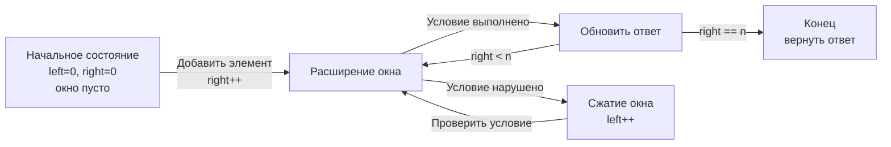

## Как устроены алгоритмические паттерны

В предыдущей статье [[8. Что такое алгоритмический паттерн]] мы определили паттерн как повторно используемый каркас решения класса задач. Теперь настало время заглянуть внутрь этого каркаса и понять, **как именно он работает**. Из каких элементарных механических деталей он собран? Почему он корректен? Как из нескольких простых паттернов собрать один сложный? И как всё это взаимодействует с рантаймом Go — аллокациями, GC, escape analysis?

Senior-разработчик не просто применяет паттерн. Он понимает его как инженерный узел, способный выдержать нагрузку продакшена. На собеседовании такое понимание проявляется в способности доказывать корректность кода, обсуждать инварианты и предсказывать поведение под экстремальными данными. Эта статья — о внутреннем устройстве алгоритмических паттернов и о том, как соединить математическую строгость с механической симпатией Go.

### Паттерн как вычислительная машина состояний

Большинство итеративных алгоритмических паттернов можно представить как **машину, которая шаг за шагом переводит систему из начального состояния в целевое, поддерживая инвариант**.

Рассмотрим паттерн «Скользящее окно»:

- **Состояние:** границы окна `[left, right)`, текущая метрика окна (сумма, частота символов), текущий лучший ответ.
- **Начальное состояние:** `left = 0`, `right = 0`, окно пусто, ответ — некоторое начальное значение (например, `0` или `math.MaxInt`).
- **Целевое состояние:** `right == n` (все элементы обработаны), ответ содержит оптимальное значение.
- **Переходы:** расширение окна вправо (добавление `s[right]`, `right++`) и, при нарушении условия, сжатие слева (`left++` с обновлением метрики).



Эта же модель применима к BFS (состояние — очередь и множество посещённых), к backtracking (состояние — текущая комбинация и позиция), к динамическому программированию (состояние — заполненная часть таблицы dp). Понимание паттерна как конечного автомата даёт вам не только интуицию, но и инструмент для формального доказательства.

### Декомпозиция паттерна на элементарные операции

Любой паттерн можно разложить на атомарные шаги. Взяв за пример скользящее окно, мы получим:

1. **Инициализация.** Создание переменных состояния: `left`, `right`, `windowSum`, `result`. В Go — с учётом zero-value: `var sum int` уже 0, `var result []int` уже nil-слайс.
2. **Основной цикл.** Обычно `for right < n` — продвижение правой границы.
3. **Расширение.** Добавление элемента на правой границе: `sum += nums[right]`. Здесь же — обновление вспомогательных структур (map, массив).
4. **Проверка и сжатие.** Внутренний цикл `for условие_нарушено` сдвигает левую границу: `sum -= nums[left]; left++`.
5. **Обновление ответа.** Происходит в точке, где условие выполнено. В некоторых паттернах — при каждом шаге, в других — только при определённых условиях.
6. **Завершение.** Возврат результата, обработка случая «ответ не найден» (nil против пустого слайса).

В паттерне «Два указателя» структура иная — нет сжатия окна, вместо этого два указателя сходятся навстречу. Но декомпозиция на инициализацию, цикл, проверку условия и обновление ответа всё равно работает.

> [!info] Под капотом
> Когда вы пишете `sum += nums[right]`, на уровне процессора это одна инструкция ADD, работающая с регистрами. `nums[right]` попадает в кэш L1, если массив только что итерирован (prefetcher подгрузил следующие cache lines). Но если вы используете map внутри цикла, процессор упирается в pointer chasing: каждое обращение к `map[byte]int` промахивается мимо кэша и ждёт память. Senior-инженер всегда держит это в голове, выбирая между O(1) с большой константой и O(log N) с дружественным доступом.

### Инварианты: математическая гарантия корректности

**Инвариант** — утверждение о состоянии системы, которое истинно до начала выполнения алгоритма, остаётся истинным после каждой итерации основного цикла и из которого в конце следует корректность результата.

На собеседовании умение сформулировать инвариант — маркер уровня Senior. Это показывает, что вы не «набросали код и оно заработало», а можете доказать, что оно работает всегда.

**Пример: Remove Duplicates from Sorted Array (LeetCode 26)**

Задача: дан отсортированный слайс `nums`, нужно удалить дубликаты in-place и вернуть новую длину.

Идиоматичный Go-код:
```go
func removeDuplicates(nums []int) int {
    if len(nums) == 0 {
        return 0
    }
    i := 0 // последний записанный уникальный элемент
    for j := 1; j < len(nums); j++ {
        if nums[j] != nums[i] {
            i++
            nums[i] = nums[j]
        }
    }
    return i + 1
}
```

**Инвариант цикла:** После каждой итерации внешнего `for` подмассив `nums[0..i]` содержит все встреченные уникальные элементы в исходном порядке, и `i` указывает на последний записанный.

**Доказательство:**
- *База:* до цикла `i=0`, подмассив `nums[0..0]` — только первый элемент, инвариант выполнен.
- *Шаг:* если `nums[j] != nums[i]`, мы нашли новый уникальный элемент. Инкрементируем `i`, копируем его — подмассив `nums[0..i]` всё ещё уникален и отсортирован. Если `nums[j] == nums[i]`, ничего не делаем — инвариант сохраняется.
- *Завершение:* когда `j` достигает конца, `i+1` — количество уникальных элементов.

Если бы кандидат на собеседовании произнёс это вслух, он мгновенно получил бы высший балл за корректность.

> [!tip] Собеседование
> Вопрос: «Докажите, что ваше решение для задачи Container With Most Water не пропустит оптимальную пару.»
> Ответ: «Инвариант двух указателей: для текущих left и right все вертикали левее left и правее right уже рассмотрены, и максимальная площадь среди них не превышает текущего максимума. Когда указатели встретятся, все пары будут рассмотрены. Мы сдвигаем тот указатель, который ограничивает площадь, потому что любой другой выбор дал бы не большую высоту и меньшую ширину.»
> Это — Senior-ответ.

### Композиция: как из простых паттернов рождаются сложные

Многие задачи категории Hard на LeetCode не решаются одним «чистым» паттерном. Они требуют комбинации. И Senior-разработчик должен уметь собирать решение из нескольких кирпичиков, как из конструктора.

**Пример: Sliding Window Maximum (LeetCode 239)**

Задача: для массива `nums` и размера окна `k` вернуть максимум для каждого положения скользящего окна.

Какие паттерны видны? «Скользящее окно» — очевидно. Но просто поддерживать окно и каждый раз искать максимум за O(k) даст O(N*k), что при k ~ N превращается в O(N²) — недопустимо. Нужен способ быстро получать максимум в окне. Это паттерн «Монотонная очередь» (разновидность монотонного стека, адаптированная под FIFO).

**Композиция:** скользящее окно управляет границами, монотонная очередь — поддерживает максимум.

```go
func maxSlidingWindow(nums []int, k int) []int {
    if len(nums) == 0 {
        return nil
    }
    result := make([]int, 0, len(nums)-k+1)
    deque := make([]int, 0, k) // хранит индексы элементов, значения убывают

    for i, v := range nums {
        // Удаляем индексы, вышедшие за левую границу окна
        if len(deque) > 0 && deque[0] < i-k+1 {
            deque = deque[1:]
        }
        // Удаляем с конца индексы элементов, меньших или равных текущему
        for len(deque) > 0 && nums[deque[len(deque)-1]] <= v {
            deque = deque[:len(deque)-1]
        }
        deque = append(deque, i)

        // Как только окно достигло размера k, записываем максимум
        if i >= k-1 {
            result = append(result, nums[deque[0]])
        }
    }
    return result
}
```

Что здесь произошло:
- **Скользящее окно:** `i` — правая граница, условие `deque[0] < i-k+1` выкидывает устаревшие элементы.
- **Монотонная очередь:** `deque` хранит индексы так, что соответствующие `nums` значения строго убывают. Это гарантирует, что максимум всегда в голове очереди.

**Механическая симпатия:**
- `deque` реализован на слайсе `[]int`. Операции `deque[1:]` и `deque[:len(deque)-1]` — это сдвиг заголовка слайса, а не копирование данных. Нижележащий массив переиспользуется.
- Выделив `make([]int, 0, k)`, мы гарантируем, что вместимость достаточна и append не вызывает аллокаций.
- Все индексы лежат в непрерывном блоке памяти, CPU-дружественный доступ.

> [!warning] Ловушка / Gotcha
> Если не указать capacity (`make([]int, 0)`), то при append слайс будет расти, переаллоцируя массив в цикле, что может добавить O(N) лишних аллокаций. Для больших N это не смертельно, но на собеседовании упоминание предвыделения вместимости — жирный плюс.

**Декомпозиция композиции:**
1. Паттерн «Скользящее окно» задаёт ритм: вставляем элемент, удаляем устаревший.
2. Паттерн «Монотонная очередь» вложен в этот ритм и поддерживает инвариант очереди.
3. Два инварианта работают согласованно: окно гарантирует, что элементы в deque не старше `i-k+1`; очередь гарантирует, что максимум окна — в `deque[0]`.

### Механическая симпатия: как Go-структуры данных влияют на паттерны

Один и тот же паттерн может быть реализован с разными структурами данных, и выбор сильно влияет на производительность. Приведу таблицу выбора для нескольких паттернов.

| Паттерн | Частая операция | Рекомендуемая структура в Go | Почему |
|---|---|---|---|
| Скользящее окно (ASCII) | Доступ по символу к последнему индексу | `[128]int` или `[26]int` | Массив на стеке, прямая адресация, нет pointer chasing, нет GC-нагрузки |
| Скользящее окно (Unicode) | То же | `map[rune]int` | Неизбежен для большого алфавита, но каждая операция — хеширование и поиск в бакетах `runtime.hmap` |
| BFS очередь | Извлечение из головы, вставка в хвост | `[]*Node` с `queue[0]` и `queue = queue[1:]` | Слайс даёт непрерывность памяти, быстрый доступ. `container/list` хуже из-за аллокации на каждый элемент |
| Куча / Priority Queue | Вставка и извлечение минимума | `container/heap` поверх слайса | Слайс под капотом: операции sift-up/sift-down работают на массиве, дружественном кэшу |
| Множество (Set) | Проверка наличия | `map[T]struct{}` | Пустая структура не занимает память (в значении). `map[T]bool` занимает 1 байт на элемент |
| Union Find | Поиск родителя, объединение | `[]int` для parent и rank | Плоские массивы, эффективный доступ по индексу, низкие накладные расходы |

> [!info] Под капотом
> `container/heap` в Go не имеет встроенного типа «куча». Он предоставляет интерфейс `heap.Interface` и свободные функции `heap.Push`, `heap.Pop`. Реализация кучи работает на слайсе: левый потомок узла `i` — `2*i+1`, правый — `2*i+2`. Слайс обеспечивает O(1) доступ к любому индексу, что критично для просеивания. Замена слайса на связный список уничтожила бы производительность кучи.

На собеседовании, выбирая структуру, скажите: «Я выбираю `[26]int`, потому что это позволяет обойтись без аллокаций в куче и даёт сравнение массивов через `==` за O(1) в данном контексте.» Или: «Здесь алфавит не ограничен, поэтому вынужден использовать `map[rune]int`. При N = 10⁵ это добавит около 20–30 наносекунд на операцию из-за хеширования, что в сумме не критично, но я помню об этом.»

### Паттерны и конкурентность: синхронный мир алгоритмических интервью

Подавляющее большинство алгоритмических паттернов строго синхронны. BFS, DFS, DP, скользящее окно — всё это однопоточные вычисления. Попытка добавить горутины и каналы туда, где они не нужны, ухудшит производительность и усложнит код.

Но существуют вычислительные задачи, где параллелизм осмыслен:
- **Параллельный BFS/DFS** на огромных графах — обход из нескольких стартовых точек независимо.
- **MapReduce-подход** к обработке больших данных: разбить массив на части, обработать в горутинах, смержить результат.
- **Параллельные запросы** к внешним API в задачах на системный дизайн.

На алгоритмическом раунде вам, скорее всего, не предложат задачу, требующую конкурентности. Но если вы Senior, вы можете упомянуть: «Здесь используется синхронный BFS. Если бы граф был огромным и обход можно было распараллелить, я бы разбил стартовые вершины на N горутин и синхронизировал множество посещённых через `sync.Map` или канал, но это добавило бы недетерминизм и накладные расходы на синхронизацию.» Это показывает, что вы выходите за рамки задачи.

### Тренировка понимания внутреннего устройства

Читать о том, как устроены паттерны, полезно, но мало. Навык вырабатывается практикой. Предлагаю методику, которую мы используем в теоретических статьях этого раздела:

1. **Рисуйте состояния.** Для каждого паттерна нарисуйте диаграмму переходов, как в начале этой статьи. Определите, что является состоянием, каковы переходы, каков инвариант.
2. **Доказывайте инвариант.** Возьмите 3–4 задачи из одного кластера и для каждой сформулируйте инвариант основного цикла. Пробегитесь мысленно по первым трём итерациям, проверяя его сохранение.
3. **Разбирайте композиции.** Для каждой сложной задачи (кластер «29. Сложные задачи») пытайтесь найти, из каких простых паттернов она собрана. Записывайте: «окно + монотонная очередь», «префиксные суммы + хеш-карта», «DFS + мемоизация».
4. **Меняйте структуры данных.** Напишите решение с `map`, затем перепишите с массивом. Замерьте время на больших данных (локально) и сравните. Обсудите мысленно: почему одна версия быстрее?
5. **Читайте исходники Go.** Загляните в `runtime/hmap.go`, `runtime/slice.go`. Понимание внутренностей делает выбор структур данных не ритуальным, а аргументированным. Это описано в разделе [[07. Глубокий Go (Внутреннее устройство)]].

### Итог

Внутреннее устройство алгоритмического паттерна — это связка из четырёх элементов: **состояния, переходов, инварианта и структур данных**. Освоив этот язык, вы перестаёте быть пользователем готовых рецептов и становитесь инженером, который собирает алгоритмы под задачу, понимает их границы и предвидит поведение под нагрузкой. Именно это ожидают от Senior/Lead Go-разработчика на собеседовании и в реальной работе.

Следующая статья открывает серию конкретных методических разборов: как связаны структуры данных и алгоритмические паттерны, почему выбор правильной структуры часто предопределяет решение, и как Go-специфика диктует этот выбор. [[10. Связь структур данных и алгоритмов]]