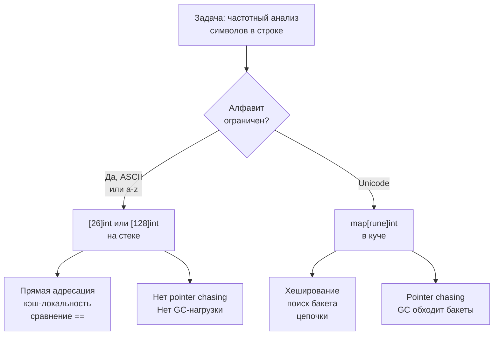

Массивы и строки — это zero-cost абстракции, с которых начинается любое алгоритмическое собеседование. В Go они устроены иначе, чем в C++ или Python: массивы являются типами-значениями фиксированного размера, строки иммутабельны и состоят из байтов, а основным рабочим инструментом служит слайс — динамическое «окно» в нижележащий массив. Понимание этих различий на уровне рантайма и памяти — обязательный фундамент для Senior-разработчика. Ошибка, допущенная в базовых операциях со слайсами или строками, может превратить O(N) решение в O(N²) по памяти, вызвать «утечку» через подслайс или панику на пустом месте.

В этой статье мы систематизируем всё, что нужно знать о массивах и строках в Go перед решением задач нашего первого практического кластера: Two Sum, Three Sum, Maximum Subarray, Product of Array Except Self и других. Мы разберём внутреннее устройство, типовые приёмы (два указателя, скользящее окно, префиксные суммы — в обзоре) и, главное, механическую симпатию: как выбор структуры данных влияет на кэш-линии, escape analysis и сборщик мусора.

### Массивы в Go: фиксированный контракт

Массив в Go — это последовательность элементов фиксированной длины, являющаяся **типом-значением**. Это ключевое отличие от C, где массив — это указатель на первый элемент. В Go при присваивании или передаче массива в функцию происходит **копирование всех элементов**.

```go
var a [5]int
b := a     // полная копия 5 × 8 = 40 байт
b[0] = 1  // a[0] остался 0
```

Размер массива — часть его типа: `[5]int` и `[6]int` — разные типы, несовместимые по присваиванию. Это делает массивы неудобными для функций общего назначения, поэтому в повседневном коде (и в DSA-задачах) мы почти всегда оперируем слайсами. Однако у массивов есть две ниши, критически важные для алгоритмических собеседований:

1. **Фиксированный алфавит.** Если задача гарантирует ASCII (128 символов) или английские строчные буквы (26 символов), массив `[26]int` или `[128]int` — это идеальная структура для частотного словаря. Он размещается на стеке, доступ по индексу — прямая адресация, нет pointer chasing, нет нагрузки на GC, и два массива можно сравнить оператором `==` за O(размер), что для 26 элементов — константа, близкая к мгновенной.

2. **Разменные монеты в DP.** Иногда в задачах на динамическое программирование номиналы монет — это небольшой фиксированный набор. Здесь массив также предпочтительнее слайса, потому что его размер известен компилятору, и он гарантированно не убегает в кучу.

> [!info] Под капотом
> Escape analysis — алгоритм компилятора Go, решающий, выделять переменную в куче или на стеке. Массив фиксированного размера, который не покидает функцию и не передаётся по указателю наружу, будет размещён на стеке. Стек — это LIFO-область памяти, операции с которой сводятся к сдвигу указателя стека (stack pointer) на несколько тактов CPU. Никакого `malloc`, никакой фрагментации, никакого GC. Поэтому `var freq [26]int` внутри горячего цикла — это «бесплатно», тогда как `make(map[byte]int)` — это аллокация `runtime.hmap` в куче и будущая работа для GC.

### Слайсы: динамическое «окно» в память

Слайс — это трёхсловный заголовок: указатель на нижележащий массив, длина (`len`) и вместимость (`cap`). Сам слайс — value-type (копируется заголовок), но данные, на которые он указывает, разделяются.

```go
type slice struct {
    Data unsafe.Pointer
    Len  int
    Cap  int
}
```

Из этого устройства следуют все нюансы, которые Senior обязан знать.

**1. Срезы и утечки памяти.**
Если вы делаете срез от большого слайса, новый заголовок указывает на тот же нижележащий массив. И пока этот срез жив, весь исходный массив не может быть собран GC.

```go
func firstN(data []byte, n int) []byte {
    return data[:n] // держит весь data в памяти
}
```

На собеседовании это может всплыть в вопросе: «Как ваша функция взаимодействует с GC?» Senior-ответ: «Я сделаю явное копирование через `make` + `copy`, если `data` большой, а `n` маленький, чтобы избежать утечки».

**2. Рост слайса.**
Когда `append` исчерпывает `cap`, Go выделяет новый массив (обычно удвоенного размера) и копирует элементы. В цикле на 10⁵ итераций это может произойти ~17 раз с суммарным копированием ~200 тыс. элементов. Решение: `make([]int, 0, expectedSize)`.

> [!warning] Ловушка / Gotcha
> `make([]int, 5)` создаёт слайс длиной 5 (все элементы нули), а `make([]int, 0, 5)` — пустой слайс с вместимостью 5. Методы `append` во втором случае добавляют элементы, не перезаписывая существующие. Путаница между этими двумя формами — частая причина off-by-one ошибок и паник.

**3. Слайс как стек и очередь.**
Идиоматичный Go не использует `container/list` для алгоритмических задач. Вместо него — слайсы:
- **Стек:** `s = append(s, v)` и `s = s[:len(s)-1]`. Амортизированное O(1), никаких дополнительных аллокаций, кроме роста.
- **Очередь:** `q = append(q, v)` и `q = q[1:]`. Здесь есть нюанс: `q[1:]` сдвигает начало слайса, но нижележащий массив не освобождается. При длительной работе с очередью это может привести к накоплению неиспользуемой памяти (в production-коде используют кольцевой буфер, но для собеседования слайс-очередь допустима с комментарием).

**4. In-place модификации.**
Многие задачи требуют модификации слайса без дополнительной памяти. Идиоматичный приём — «два указателя» на одном слайсе: один читает, другой пишет.

```go
// Удаление дубликатов in-place (паттерн двух указателей)
func removeDuplicates(nums []int) int {
    if len(nums) == 0 {
        return 0
    }
    write := 0
    for read := 1; read < len(nums); read++ {
        if nums[read] != nums[write] {
            write++
            nums[write] = nums[read]
        }
    }
    return write + 1
}
```

Этот код не выделяет память, работает за O(N) и является эталоном идиоматичного Go.

### Строки в Go: иммутабельные последовательности байтов

Строка в Go — это иммутабельный слайс байтов с дополнительными гарантиями. Структура `string` аналогична слайсу, но без поля `Cap`:

```go
type stringStruct struct {
    str unsafe.Pointer
    len int
}
```

Из этого следуют важнейшие для собеседований свойства:

**1. `len(s)` возвращает количество байтов, а не символов.**
Если строка содержит Unicode (например, кириллицу), `len("Привет")` — это 12 (каждая кириллическая буква — 2 байта в UTF-8), а не 6. Задачи на палиндромы, анаграммы, поиск подстроки ОБЯЗАНЫ уточнять алфавит. Если алфавит — только ASCII, мы работаем с байтами в индексации. Если Unicode — используем `for _, r := range s`, который декодирует руны.

**2. Иммутабельность.**
`s[0] = 'x'` — ошибка компиляции. Любая «модификация» строки создаёт новую строку. Конкатенация в цикле `s += "a"` — это O(N²) по времени и памяти. Идиоматичное решение — `strings.Builder`, который внутри использует слайс байтов и растёт амортизированно.

**3. Преобразование `string` ↔ `[]byte` копирует данные.**
Каждое такое преобразование — это аллокация и копирование. В задачах, где строка большая, а вам нужно часто модифицировать символы, выгоднее сразу работать с `[]byte` и в конце конвертировать обратно.

**4. Срезы строк.**
`s[start:end]` не копирует данные, а создаёт новую строку-заголовок, указывающую на тот же нижележащий массив. Это O(1) операция. Но поскольку строка иммутабельна, утечек памяти, как со слайсами, здесь не возникает.

> [!tip] Собеседование
> Вопрос: «Как проверить палиндром, если строка может содержать Unicode?»
> Ответ: «Я конвертирую строку в `[]rune`, чтобы оперировать кодовыми точками, а не байтами. Это даёт O(N) дополнительной памяти. Если память критична, можно использовать `for _, r := range s` с двухпроходным алгоритмом или нормализацию NFC/NFD, но это выходит за рамки DSA. В рамках собеседования я выберу `[]rune` для читаемости.»

### Типовые операции и приёмы в массивах и строках

Внутри кластера «Массивы и строки» мы будем решать задачи, опирающиеся на несколько фундаментальных приёмов. Перечислим их кратко, чтобы при встрече с задачей вы могли мгновенно узнать знакомый каркас.

**1. Два указателя (Two Pointers).**
Один из самых частых паттернов для отсортированных массивов и строк. Два индекса движутся навстречу друг другу (или в одном направлении с разной скоростью), уменьшая пространство поиска на каждом шаге. Применяется в Two Sum II, 3Sum, Valid Palindrome, Container With Most Water.

**2. Скользящее окно (Sliding Window).**
Для задач на непрерывные подмассивы/подстроки. Поддерживаем окно `[left, right)` и инкрементально обновляем его метрику (сумму, частоты). Правый указатель расширяет окно, левый — сжимает, когда условие нарушено. Требует монотонности условия (обычно не работает с отрицательными числами).

**3. Префиксные суммы (Prefix Sums).**
Если нужно быстро отвечать на запросы о сумме подмассива или разбивать массив по условию. Строим массив `prefix[i+1] = prefix[i] + nums[i]`, тогда сумма `[L, R]` = `prefix[R+1] - prefix[L]` за O(1). Работает с отрицательными числами.

**4. Хеш-таблица (или массив) для хранения индексов/частот.**
Задачи вида «найти пару с суммой», «группировка анаграмм», «найти первый уникальный символ» — все они строятся вокруг словаря. В Go выбор между `map` и массивом `[26]int`/`[128]int` — это осознанный trade-off между универсальностью и производительностью.

**5. Разворот (Reversal).**
Иногда задача на ротацию или перестановку элементов решается через трёхкратный разворот подмассивов. В Go разворот слайса in-place идиоматичен: `for i, j := 0, len(s)-1; i < j; i, j = i+1, j-1 { s[i], s[j] = s[j], s[i] }`.

**6. Алгоритм Кадане (Kadane's Algorithm).**
Для Maximum Subarray — классика динамического программирования за O(N) с O(1) памяти. `maxEndingHere = max(nums[i], maxEndingHere + nums[i])`.

**7. Сортировка как предобработка.**
Многие задачи (3Sum, Merge Intervals) решаются через предварительную сортировку. В Go `sort.Ints` работает in-place и использует pdqsort (pattern-defeating quicksort) — очень быстрая, O(N log N) в среднем и худшем случае.

### Mechanical Sympathy: как массивы и строки взаимодействуют с железом

Почему Senior-разработчик выберет `[26]int` вместо `map[byte]int` для задачи на анаграммы, даже если обе структуры дают O(1) доступ? Ответ лежит не в Big O, а в архитектуре компьютера.

**Cache lines.** Процессор загружает данные из RAM в кэш не побайтово, а блоками по 64 байта (cache line). Массив `[26]int` занимает 208 байтов и помещается в несколько кэш-линий L1. Когда вы итерируете по нему, prefetcher загружает следующие линии заранее. Map же — это pointer chasing: каждый бакет может находиться в произвольном месте памяти, вызывая cache miss на каждом обращении.

**Pointer chasing.** Каждое обращение к map требует: взять указатель на `hmap`, вычислить хеш, найти бакет, пройти по цепочке переполнения. Это минимум 3–4 разыменования указателей, каждое из которых может промахнуться мимо кэша. Массив: `&freq[ch]` — одна инструкция LEA.

**GC pressure.** Map порождает объекты в куче (бакеты), которые GC должен обходить и освобождать. Массив на стеке невидим для GC.



На собеседовании Senior-уровня вы не просто пишете код — вы объясняете этот выбор, когда он релевантен.

### Связь с другими разделами

Кластер «Массивы и строки» — это входная точка. Освоив его, вы естественно перейдёте к более специализированным паттернам:
- **Два указателя** — выделены в отдельный кластер ([[1. Теория. Два указателя]]) из-за обилия вариаций.
- **Скользящее окно** — следующий по сложности кластер ([[1. Теория. Скользящее окно]]), где мы углубимся в динамическое изменение окна.
- **Префиксные суммы** — кластер ([[1. Теория. Префиксные суммы]]), где мы научимся решать задачи с произвольными запросами на диапазоны.
- **Сортировка и бинарный поиск** — кластер [[1. Теория. Бинарный поиск]], где мы разберём `sort.Search` и поиск по ответу.

Все эти темы — ветви одного древа, корень которого — грамотная работа со слайсами и строками.

### Заключение

Массивы и строки в Go — это не примитивы, а высокоуровневые абстракции с глубокими последствиями для производительности и корректности. Слайс — это власть над памятью, которая может обернуться утечкой. Строка — это иммутабельный байтовый срез, который нельзя индексировать по рунам без конвертации. Массив — это стековая аллокация и сравнение за O(1), которое не заменит ни один map. Всё это Senior-разработчик держит в голове, когда за 45 минут пишет решение, которое должно быть не просто «Accepted», а production-grade в миниатюре.

Теперь, вооружённые теорией, переходим к практике. Следующая статья откроет нам конкретные типовые операции и приёмы, которые мы будем использовать в каждой задаче кластера. [[2. Типовые операции и приёмы]]